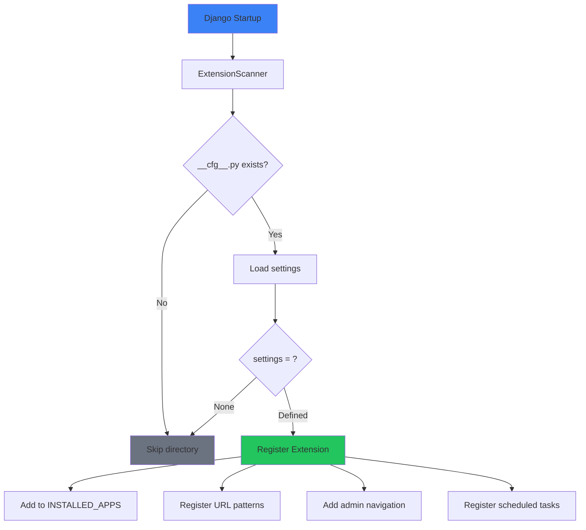

# Bundled Extensions

<Callout type="info">
**What are Bundled Extensions?**
These are [Extensions](/docs/extensions) that come **pre-installed** in the Django-CFG solution template. They're fully functional, customizable Django apps ready to use out of the box.
</Callout>

Django-CFG solution template includes production-ready extensions that use the modern [Extensions System](/docs/extensions) with auto-discovery and type-safe [Pydantic configuration](/docs/core/type-safety).

## How Extensions Work

Unlike traditional Django apps that require manual `INSTALLED_APPS` configuration, extensions use **auto-discovery**:

```
your_project/
└── extensions/
    └── apps/
        ├── accounts/        # User authentication & management
        │   ├── __cfg__.py   # ← Configuration enables extension
        │   ├── models.py
        │   ├── admin.py
        │   └── urls.py
        └── totp/            # Two-factor authentication
            ├── __cfg__.py
            └── ...
```

### Enable/Disable Extensions

Each extension has a `__cfg__.py` file. The `settings = ...` line enables it:

```python
# extensions/apps/accounts/__cfg__.py
from django_cfg.extensions.configs.apps.base import BaseExtensionSettings

class AccountsSettings(BaseExtensionSettings):
    name: str = "accounts"
    oauth_providers: list[str] = ["google", "github"]

settings = AccountsSettings()  # ← This line ENABLES the extension
```

**To disable**: Comment out or remove `settings = ...`:

```python
# settings = AccountsSettings()  # Extension disabled
```

[Learn more about Extensions System →](/docs/extensions)

---

## Built-in Extensions

### User Management

Complete user lifecycle management - authentication, profiles, and security.

| Extension | Description | Location |
|-----------|-------------|----------|
| **Accounts** | User authentication, profiles, JWT, OTP, OAuth | `extensions/apps/accounts/` |
| **TOTP** | Two-factor authentication | `extensions/apps/totp/` |

**Use Cases:** SaaS registration, user authentication, two-factor security.

[**Explore User Management →**](./user-management/overview)

---

## Quick Start

### 1. Configure Extensions

Each extension in `extensions/apps/` has a `__cfg__.py` file:

```python
# extensions/apps/accounts/__cfg__.py
from django_cfg.extensions.configs.apps.base import BaseExtensionSettings

class AccountsSettings(BaseExtensionSettings):
    name: str = "accounts"
    oauth_providers: list[str] = ["google", "github"]

settings = AccountsSettings()
```

### 2. Run Migrations

```bash
python manage.py migrate_all
```

### 3. Access Admin Interface

```bash
# Navigate to Django admin
http://localhost:8000/admin/

# Extensions are grouped in admin sidebar:
# - User Management (Accounts, TOTP)
```

---

## Extension Architecture

### Auto-Discovery Flow



### What Extensions Provide

Each extension can include:

- **Models** - Database tables with migrations
- **Admin** - Admin interface with navigation
- **URLs** - API endpoints at `/cfg/{extension}/`
- **Views** - REST API viewsets
- **Tasks** - Background jobs (Django-RQ)
- **Constance** - Runtime settings in admin

### URL Convention

Extensions follow automatic URL routing:

| File | URL Pattern |
|------|-------------|
| `urls.py` | `/cfg/{prefix}/` |
| `urls_admin.py` | `/cfg/{prefix}/admin/` |
| `urls_system.py` | `/cfg/{prefix}/system/` |

---

## Customization

### Override Extension Settings

```python
# extensions/apps/accounts/__cfg__.py
from django_cfg.extensions.configs.apps.base import BaseExtensionSettings

class AccountsSettings(BaseExtensionSettings):
    name: str = "accounts"
    oauth_providers: list[str] = ["google", "github"]

settings = AccountsSettings()
```

### Modify Extension Code

All code in `extensions/apps/` can be modified:

```python
# extensions/apps/accounts/models.py
from django.db import models

class UserProfile(models.Model):
    # Add custom fields
    custom_field = models.CharField(max_length=100, blank=True)

    # Override methods
    def save(self, *args, **kwargs):
        # Custom logic before save
        super().save(*args, **kwargs)
```

---

## Security & Performance

### Built-in Security

All extensions include:

- **Input Validation** - Pydantic-based validation
- **Authentication** - JWT/session auth support
- **Rate Limiting** - API rate limiting (see [Rate Limiting](/docs/core/rate-limiting))
- **Audit Logging** - Operation audit trails

### Performance Features

- **Async Tasks** - Background processing with Django-RQ
- **Caching** - Redis caching for frequently accessed data
- **Lazy Loading** - Extensions loaded on demand
- **Database Optimization** - Query optimization, connection pooling

---

## Related Documentation

- [Extensions System](/docs/extensions) - How extensions work
- [Backend Extensions](/docs/extensions/backend-extensions) - Creating extensions
- [Frontend Extensions](/docs/extensions/frontend-extensions) - React/TypeScript extensions
- [Migration Guide](/docs/extensions/migration-guide) - Migrating from legacy apps

---

## Extension Hub

<Callout type="success">
**Discover More Extensions**
Browse and install additional extensions from [hub.djangocfg.com](https://hub.djangocfg.com/)

```bash
django-cfg install <extension-name>
```
</Callout>

You can also create and publish your own extensions to share with the community!
