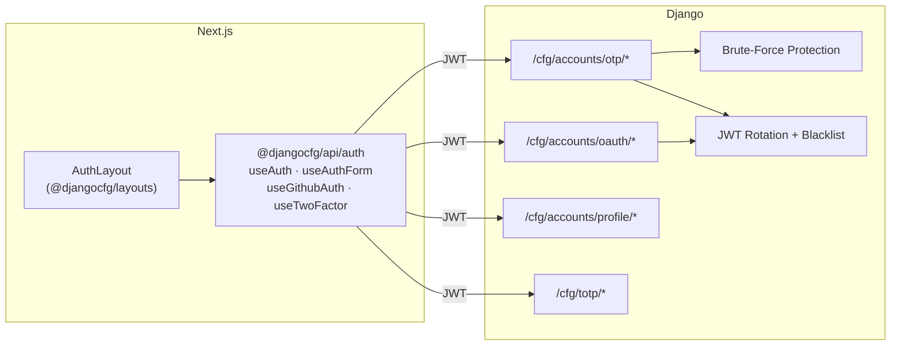

# Accounts App

The **Accounts** app is the authentication backbone of every Django-CFG project — passwordless login, tokens, social auth, and abuse protection, zero boilerplate.

---

## Full Stack Picture



---

## What's Included

| Feature | Description |
|---|---|
| **OTP Login** | Passwordless email — 6-digit codes, 10-min expiry |
| **JWT Tokens** | Access + refresh with rotation and blacklist |
| **2FA (TOTP)** | Google Auth, Authy, any TOTP app |
| **OAuth** | GitHub social login |
| **Brute-force protection** | 4-layer defense — IP rate limits, per-email throttle, lockout |
| **Email validation** | 5-layer pipeline: syntax → TLD → specials → disposable blocklist → MX |
| **Soft delete** | GDPR-safe account archive |
| **Cleanup jobs** | RQ tasks for expired OTPs and JWT blacklist |

---

## Enable

```python
from django_cfg import DjangoConfig, JWTConfig

class MyConfig(DjangoConfig):
    enable_accounts = True
    jwt = JWTConfig()  # secure defaults: 30-min access, 90-day refresh, rotation on
```

---

<Cards>
  <Card title="Frontend Integration" href="/features/built-in-apps/user-management/accounts/frontend">
    AuthLayout, useAuth / useAuthForm hooks, middleware
  </Card>
  <Card title="OTP & Brute-Force" href="/features/built-in-apps/user-management/accounts/otp">
    Auth flow, throttle layers, anti-enumeration
  </Card>
  <Card title="JWT" href="/features/built-in-apps/user-management/accounts/jwt">
    Token lifetimes, rotation, blacklist
  </Card>
  <Card title="Two-Factor Auth" href="/features/built-in-apps/user-management/accounts/two-factor">
    TOTP setup, enforcement, backup codes
  </Card>
  <Card title="OAuth (GitHub)" href="/features/built-in-apps/user-management/accounts/oauth">
    Social login, account linking, CSRF protection
  </Card>
</Cards>

TAGS: accounts, otp, jwt, 2fa, oauth, authentication
DEPENDS_ON: [frontend, otp, jwt, two-factor, oauth]
