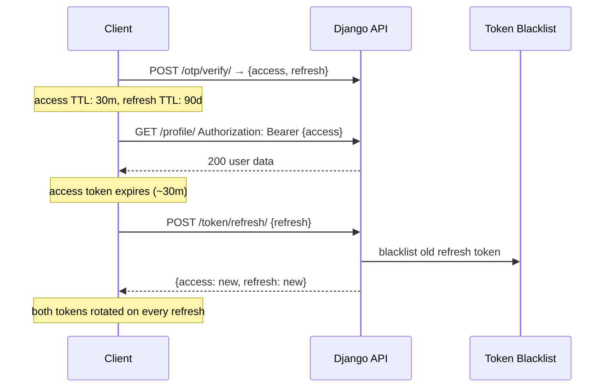
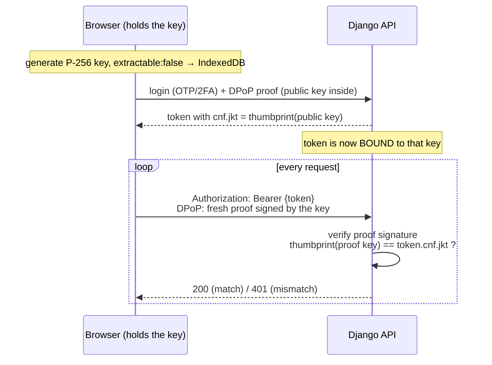
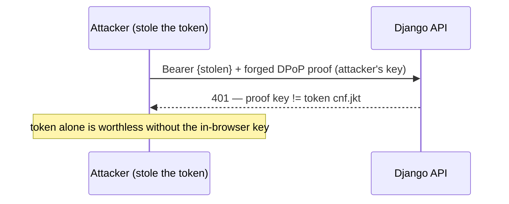

# JWT Configuration

Django-CFG wraps `djangorestframework-simplejwt` in a type-safe `JWTConfig`
Pydantic model. No manual `SIMPLE_JWT` dict needed — and it is **secure by
default**, so most projects write nothing at all.

## Quick Start

```python
from django_cfg import DjangoConfig, JWTConfig

class MyConfig(DjangoConfig):
    jwt = JWTConfig()  # 30-min access · 90-day refresh · rotation + blacklist on
```

That bare `JWTConfig()` already gives the recommended posture. Override only if
you have a specific reason.

---

## Configuration Options

### Token Lifetimes

```python
jwt = JWTConfig(
    access_token_lifetime_minutes=30,    # MINUTES. Default 30. None = max (1 year).
    refresh_token_lifetime_days=90,      # Default 90. None = max (1 year).
    rotate_refresh_tokens=True,          # Rotate on every refresh (default)
    blacklist_after_rotation=True,       # Blacklist old refresh token (default)
)
```

> **Single access knob — minutes.** Access lifetime is expressed in
> `access_token_lifetime_minutes` (there is no `_hours` field). Keep it short:
> a leaked access token, sent on every request, then expires in minutes while
> the long refresh token keeps the user logged in.

### Security Settings

```python
jwt = JWTConfig(
    algorithm="HS256",           # HS256 | HS384 | HS512 | RS256 | RS384 | RS512 | ES256...
    update_last_login=True,      # Update user.last_login on token issue
    leeway=0,                    # Expiry leeway in seconds (0 = strict)
    audience="my-app",           # Optional JWT audience claim
    issuer="my-company",         # Optional JWT issuer claim
)
```

### Token Claims

```python
jwt = JWTConfig(
    user_id_field="id",              # User model field for ID
    user_id_claim="user_id",         # JWT claim name for user ID
    token_type_claim="token_type",   # JWT claim name for token type
    jti_claim="jti",                 # JWT claim name for token ID
    auth_header_types=("Bearer",),   # Accepted Authorization header types
)
```

### DPoP — sender-constrained tokens (RFC 9449)

```python
jwt = JWTConfig(dpop_enabled=True)    # default: False
```

Binds each issued token to a **non-extractable** browser key, so a stolen token
(XSS, logs, a copied cURL) **can't be replayed** — the attacker lacks the key
and any proof they forge is rejected. No BFF/proxy needed. Pair with the frontend
flag `createBaseNextConfig({ dpop: true })`. See the dedicated
[DPoP & token security](#dpop--make-a-stolen-token-useless) section below and the
`@djangocfg/nextjs` `@docs/DPOP.md` guide.

---

## Secure-by-default philosophy

`JWTConfig` encodes the same layered model big SaaS platforms use — you inherit
it for free:

| Layer | What it does | Setting |
|-------|--------------|---------|
| Short access | small replay window for the most-exposed token | `access_token_lifetime_minutes=30` |
| Long refresh | "log in once, stay logged in" | `refresh_token_lifetime_days=90` |
| Rotation | every refresh issues a fresh refresh token | `rotate_refresh_tokens=True` |
| Blacklist | a reused (stolen) refresh token is revoked | `blacklist_after_rotation=True` |
| DPoP (opt-in) | a stolen token is unusable elsewhere | `dpop_enabled=True` |

Per-environment overrides are just plain config — e.g. tighten in production:

```python
class MyConfig(DjangoConfig):
    jwt: JWTConfig = JWTConfig()

    def model_post_init(self, __context):
        if not self.debug:  # production
            self.jwt = JWTConfig(access_token_lifetime_minutes=15, dpop_enabled=True)
```

---

## Token Lifecycle



`ROTATE_REFRESH_TOKENS = True` + `BLACKLIST_AFTER_ROTATION = True` by default.
Reusing a blacklisted token signals theft — rejected immediately.

---

## DPoP — make a stolen token useless

> **Intuition — the stamp that can't be copied.** Think of the token as a *club
> pass*. Normally "whoever holds the pass gets in" — so a stolen pass works.
> DPoP gives you a magic *stamp* (a private key) that is glued to your desk: you
> can stamp papers with it, but you can never take it out or copy it. The pass is
> printed with "belongs to the owner of THIS stamp", and at the door you must
> stamp a fresh paper on the spot. A thief who steals the pass can't stamp with
> your stamp → the pass is a worthless piece of paper. That "glued stamp" is a
> Web Crypto key with `extractable: false`.

With `dpop_enabled=True`, the access token carries `cnf: { jkt }` binding it to a
P-256 key the browser generates with `extractable: false` (Web Crypto, kept in
IndexedDB — **JS, including XSS, can sign with it but never read it**). Every
request sends a fresh `DPoP` proof signed by that key; the backend verifies the
signature and that its thumbprint matches the token's `cnf.jkt`.

### Full flow



### Why a stolen token is useless



- **No BFF/proxy** — the frontend still calls Django directly, even cross-origin.
- **Mixed clients OK** — tokens without `cnf` (CLI / server / `X-API-Key`) take
  the plain Bearer path unchanged.
- **For scripts**, use an API key (`X-API-Key`), not a browser token. A copied
  Bearer under DPoP just returns 401 (the proof can't leave the browser).

Backend mechanics live in `django_cfg/middleware/dpop.py` and the auth class
`JWTAuthenticationWithLastLogin`. ⚠️ A view that hardcodes stock
`rest_framework_simplejwt` `JWTAuthentication` bypasses DPoP — use the django-cfg
auth class / built-in mixins.

---

## Supported Algorithms

| Type | Algorithms |
|------|-----------|
| HMAC (symmetric) | `HS256`, `HS384`, `HS512` |
| RSA (asymmetric) | `RS256`, `RS384`, `RS512` |
| ECDSA (asymmetric) | `ES256`, `ES384`, `ES512` |

The token's own signing algorithm is independent of DPoP (DPoP proofs always use
the client's ES256 key), so keeping `HS256` for tokens is fine. For multi-service
verification without sharing a secret, `RS256` is convenient:

```python
jwt = JWTConfig(algorithm="RS256")
```

---

## Migration from manual SIMPLE_JWT

Before:
```python
# settings.py
SIMPLE_JWT = {
    'ACCESS_TOKEN_LIFETIME': timedelta(minutes=30),
    'REFRESH_TOKEN_LIFETIME': timedelta(days=90),
    'ROTATE_REFRESH_TOKENS': True,
    'BLACKLIST_AFTER_ROTATION': True,
    # ... 15+ more settings
}
```

After:
```python
# config.py
jwt = JWTConfig()   # secure defaults; everything configured automatically
```

---

## Introspection

```python
# Effective access-token lifetime (timedelta)
config.jwt.get_effective_access_token_lifetime()
# → datetime.timedelta(seconds=1800)   # 30 min

# Raw Django settings (incl. the DPoP flag)
settings = config.jwt.to_django_settings(config.secret_key)
settings['SIMPLE_JWT']['ACCESS_TOKEN_LIFETIME']   # → timedelta(minutes=30)
settings['DJANGO_CFG_DPOP_ENABLED']               # → False (or True)
```

TAGS: jwt, JWTConfig, DPoP, token rotation, simplejwt, token lifetime, sender-constrained
DEPENDS_ON: [index, otp]
