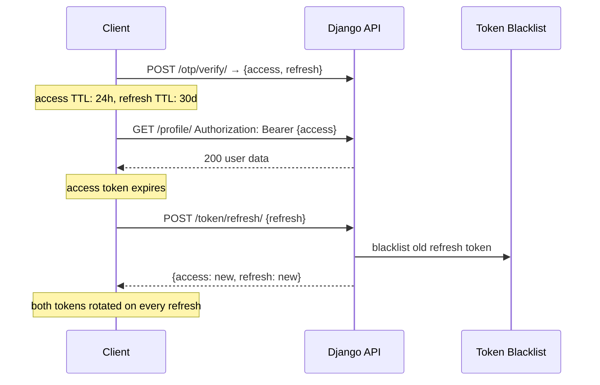

# JWT Configuration

Django-CFG wraps `djangorestframework-simplejwt` in a type-safe `JWTConfig` Pydantic model. No manual `SIMPLE_JWT` dict needed.

## Quick Start

```python
from django_cfg import DjangoConfig, JWTConfig

class MyConfig(DjangoConfig):
    jwt = JWTConfig(
        access_token_lifetime_hours=24,
        refresh_token_lifetime_days=30,
    )
```

All other JWT settings are automatically configured with secure defaults.

---

## Configuration Options

### Token Lifetimes

```python
jwt = JWTConfig(
    access_token_lifetime_hours=24,      # 1–8760 hours (1 year max)
    refresh_token_lifetime_days=30,      # 1–365 days (1 year max)
    rotate_refresh_tokens=True,          # Rotate on every refresh
    blacklist_after_rotation=True,       # Blacklist old refresh token
)
```

### Security Settings

```python
jwt = JWTConfig(
    algorithm="HS256",           # HS256 | HS384 | HS512 | RS256 | RS384 | RS512 | ES256...
    update_last_login=True,      # Update user.last_login on token issue
    leeway=0,                    # Expiry leeway in seconds (0 = strict)
    audience="my-app",           # Optional JWT audience claim
    issuer="my-company",         # Optional JWT issuer claim
)
```

### Token Claims

```python
jwt = JWTConfig(
    user_id_field="id",              # User model field for ID
    user_id_claim="user_id",         # JWT claim name for user ID
    token_type_claim="token_type",   # JWT claim name for token type
    jti_claim="jti",                 # JWT claim name for token ID
    auth_header_types=("Bearer",),   # Accepted Authorization header types
)
```

---

## Environment-Aware Presets

```python
# Development: short tokens, relaxed leeway
jwt_dev = jwt.configure_for_environment("development", debug=True)
# → access: 1h, refresh: 7d, leeway: 30s

# Production: standard tokens, strict
jwt_prod = jwt.configure_for_environment("production", debug=False)
# → access: 24h, refresh: 30d, leeway: 0s

# Testing: fast expiry, no rotation (simpler test setup)
jwt_test = jwt.configure_for_environment("testing")
# → access: 1h, refresh: 1d, rotate: False
```

Or adapt dynamically in your config:

```python
class MyConfig(DjangoConfig):
    jwt: JWTConfig = JWTConfig()

    def model_post_init(self, __context):
        env = "development" if self.debug else "production"
        self.jwt = self.jwt.configure_for_environment(env, self.debug)
```

---

## Token Lifecycle



`ROTATE_REFRESH_TOKENS = True` + `BLACKLIST_AFTER_ROTATION = True` by default. Reusing a blacklisted token signals theft — rejected immediately.

---

## Supported Algorithms

| Type | Algorithms |
|------|-----------|
| HMAC (symmetric) | `HS256`, `HS384`, `HS512` |
| RSA (asymmetric) | `RS256`, `RS384`, `RS512` |
| ECDSA (asymmetric) | `ES256`, `ES384`, `ES512` |

For production, RSA is recommended for key rotation without secret sharing:

```python
jwt = JWTConfig(
    algorithm="RS256",
    leeway=0,
    rotate_refresh_tokens=True,
    blacklist_after_rotation=True,
)
```

---

## Migration from manual SIMPLE_JWT

Before:
```python
# settings.py
SIMPLE_JWT = {
    'ACCESS_TOKEN_LIFETIME': timedelta(hours=24),
    'REFRESH_TOKEN_LIFETIME': timedelta(days=30),
    'ROTATE_REFRESH_TOKENS': True,
    'BLACKLIST_AFTER_ROTATION': True,
    # ... 15+ more settings
}
```

After:
```python
# config.py
jwt = JWTConfig(
    access_token_lifetime_hours=24,
    refresh_token_lifetime_days=30,
)
# Everything else configured automatically.
```

---

## Introspection

```python
# Check configured values
info = config.jwt.get_token_info()
# → {'access_token': '24 hours', 'refresh_token': '30 days', 'algorithm': 'HS256', 'rotation': 'enabled'}

# Access raw Django settings
jwt_settings = config.jwt.to_django_settings(config.secret_key)
jwt_settings['SIMPLE_JWT']['ACCESS_TOKEN_LIFETIME']
# → datetime.timedelta(hours=24)
```

TAGS: jwt, JWTConfig, token rotation, simplejwt, token lifetime
DEPENDS_ON: [index, otp]
