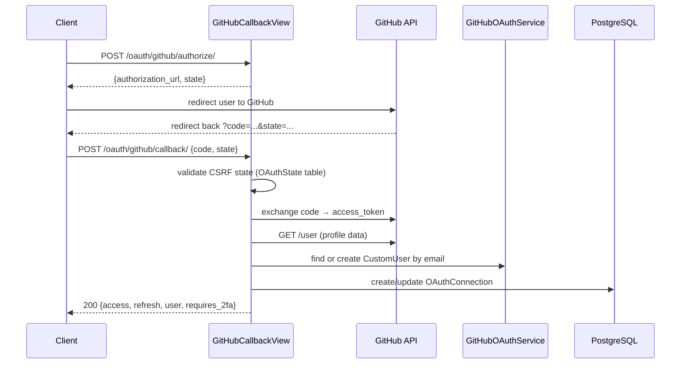

import { Callout } from 'nextra/components'

# OAuth (Social Login)

GitHub social login out of the box — no external dependencies, returns the same JWT token structure as OTP login.

## Configuration

```python
from django_cfg import DjangoConfig, GitHubOAuthConfig

class MyConfig(DjangoConfig):
    github_oauth = GitHubOAuthConfig(
        enabled=True,
        client_id="${GITHUB_CLIENT_ID}",
        client_secret="${GITHUB_CLIENT_SECRET}",
    )
```

### All options

| Parameter | Default | Description |
|-----------|---------|-------------|
| `enabled` | `False` | Enable/disable GitHub OAuth endpoints |
| `client_id` | `""` | GitHub OAuth App Client ID |
| `client_secret` | `""` | GitHub OAuth App Client Secret |
| `scope` | `["user:email", "read:user"]` | OAuth scopes to request |
| `auto_create_user` | `True` | Create Django user on first OAuth login |
| `allow_account_linking` | `True` | Link OAuth to existing user by email match |
| `state_timeout_seconds` | `300` | CSRF state token validity (5 minutes) |

### Enable only when credentials are present

```python
import os

_id = os.environ.get("GITHUB_CLIENT_ID", "")
_secret = os.environ.get("GITHUB_CLIENT_SECRET", "")

github_oauth = (
    GitHubOAuthConfig(enabled=True, client_id=_id, client_secret=_secret)
    if _id and _secret
    else None
)
```

---

## Setup: Create GitHub OAuth App

1. Go to [GitHub → Settings → Developer settings → OAuth Apps → New](https://github.com/settings/applications/new)
2. Fill in:
   - **Application name**: your app name
   - **Homepage URL**: `https://yourapp.com`
   - **Authorization callback URL**: your frontend URL (e.g. `https://yourapp.com/auth/callback`)
3. Copy **Client ID** and **Client Secret** to `.env`

```bash
GITHUB_CLIENT_ID=Iv1.abc123def456
GITHUB_CLIENT_SECRET=your-secret-here
```

Run migrations after first enable:

```bash
python manage.py migrate django_cfg_accounts
```

---

## OAuth Flow



The callback response is **identical in structure to OTP verify** — `useAuth` handles both transparently.

---

## API Endpoints

| Method | Endpoint | Rate limit | Auth | Description |
|--------|----------|------------|------|-------------|
| GET | `/cfg/accounts/oauth/providers/` | — | public | List enabled providers |
| POST | `/cfg/accounts/oauth/github/authorize/` | 20/min/IP | public | Start OAuth flow → get authorization URL |
| POST | `/cfg/accounts/oauth/github/callback/` | 10/min/IP | public | Exchange code → JWT tokens |
| GET | `/cfg/accounts/oauth/connections/` | — | required | List user's OAuth connections |
| POST | `/cfg/accounts/oauth/disconnect/` | — | required | Disconnect a provider |

The callback response mirrors `otp/verify/` exactly — same fields including `requires_2fa`, `session_id`, `is_new_user`, `is_new_connection`, and `should_prompt_2fa`.

---

## Data Models

```python
class OAuthConnection(models.Model):
    user = models.ForeignKey(CustomUser, on_delete=models.CASCADE)
    provider = models.CharField(max_length=20)           # "github"
    provider_user_id = models.CharField(max_length=100)
    provider_email = models.EmailField(blank=True)
    provider_username = models.CharField(max_length=100, blank=True)
    provider_name = models.CharField(max_length=200, blank=True)   # display name
    provider_avatar_url = models.URLField(max_length=500, blank=True)
    access_token = models.TextField()
    refresh_token = models.TextField(blank=True)
    token_expires_at = models.DateTimeField(null=True, blank=True)
    scopes = models.JSONField(default=list, blank=True)
    raw_data = models.JSONField(default=dict, blank=True)  # raw provider payload
    connected_at = models.DateTimeField(auto_now_add=True)
    updated_at = models.DateTimeField(auto_now=True)
    last_login_at = models.DateTimeField(default=timezone.now)

class OAuthState(models.Model):
    state = models.CharField(max_length=64, primary_key=True)  # CSRF token
    provider = models.CharField(max_length=20)
    redirect_uri = models.URLField()
    expires_at = models.DateTimeField()
```

<Callout type="info">
`OAuthState` is stored in the database (not cache) to survive server restarts and prevent CSRF attacks even in multi-process deployments.
</Callout>

---

## Account Linking

When `allow_account_linking=True` (default), a GitHub user whose email matches an existing `CustomUser` is linked to that account instead of creating a new one.

When `allow_account_linking=False`, a new user is always created — regardless of email match.

---

## Frontend Integration

```typescript
import { useAuthForm } from '@djangocfg/api/auth'

const form = useAuthForm({
  onSuccess: (user) => router.push('/dashboard'),
  githubOAuthEnabled: true,
})
```

```tsx
import { AuthLayout } from '@djangocfg/layouts'

// GitHub button appears automatically when githubOAuthEnabled=true
<AuthLayout githubOAuthEnabled={true} redirectUrl="/dashboard" />
```

---

## Security

- **CSRF protection** — state tokens stored in DB with expiry, validated on callback
- **IP rate limiting** — `/oauth/callback/` limited to 10 req/min per IP
- **No token leakage** — GitHub access token stored server-side, never sent to client
- **Identical response on failure** — OAuth errors return same structure as OTP errors

TAGS: oauth, github, social login, GitHubOAuthConfig, account linking
DEPENDS_ON: [index, otp, jwt]
