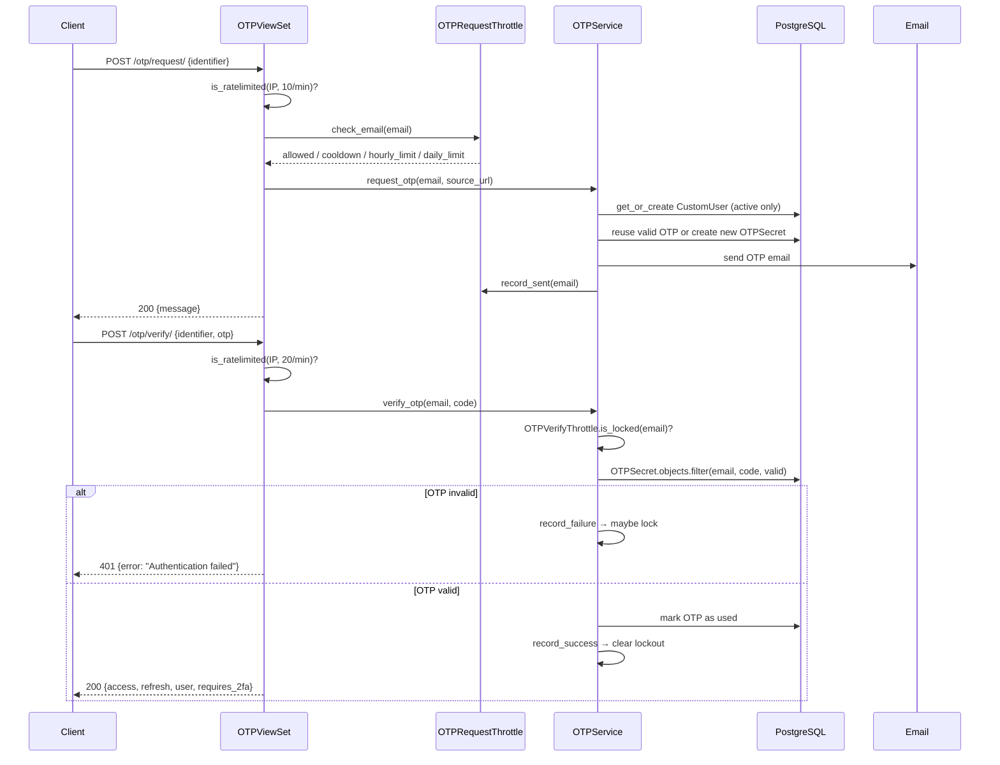

import { Callout } from 'nextra/components'

# OTP Authentication & Brute-Force Protection

Email → 6-digit code → JWT tokens. No passwords.

## Authentication Flow



### Key design decisions

- **Anti-enumeration** — all failure paths return identical `HTTP 401 {"error": "Authentication failed"}`. Wrong OTP, expired OTP, unknown email, and locked account are indistinguishable.
- **OTP reuse** — if a valid unexpired OTP exists, a re-request returns the same code. Reduces SMTP load, avoids confusing users with multiple codes in inbox.
- **Active-only lookup** — `OTPService` always filters `deleted_at__isnull=True`. Soft-deleted accounts cannot authenticate.
- **Test account bypass** — users with `is_test_account=True` accept any OTP code. Intended for App Store review / CI environments where real email delivery isn't available.

---

## Brute-Force Protection Layers

Four independent layers working in sequence:

```mermaid
graph LR
    REQ[Request] --> L1

    subgraph L1["Layer 1: IP Rate Limit (django-ratelimit)"]
        IP1["/otp/request/ → 10/min"]
        IP2["/otp/verify/ → 20/min"]
        IP3["/oauth/callback/ → 10/min"]
    end

    L1 -->|pass| L2

    subgraph L2["Layer 2: OTPRequestThrottle (per-email)"]
        C1[Cooldown: 60s between resends]
        C2[Hourly budget: 10 requests]
        C3[Daily budget: 20 requests]
    end

    L2 -->|pass| L3

    subgraph L3["Layer 3: OTPVerifyThrottle (per-email)"]
        F1[5 failed attempts → 15-min lockout]
        F2[Success clears counter]
    end

    L3 -->|pass| SVC[OTPService]
```



All per-email state lives in Redis under **SHA-256 hashed keys** — no PII in cache:

```python
key = f"otp:cooldown:{sha256(email.lower())[:16]}"
# e.g. "otp:cooldown:b4c9a289323b21a0"
```

### OTPRequestThrottle — prevent email bombing

```python
from django_cfg.apps.system.accounts.services.brute_force_service import OTPRequestThrottle

throttle = OTPRequestThrottle()

# Before sending OTP
allowed, reason, retry_after = throttle.check_email(email)
# reason: "ok" | "cooldown" | "hourly_limit" | "daily_limit"
# retry_after: seconds until retry allowed (0 if allowed)

if allowed:
    throttle.record_sent(email)  # sets cooldown + increments hourly/daily counters
```

Default limits (override via settings):

| Limit | Default | Setting |
|-------|---------|---------|
| Resend cooldown | 60 seconds | `OTP_RESEND_COOLDOWN_SECONDS` |
| Hourly per email | 10 requests | `OTP_HOURLY_LIMIT` |
| Daily per email | 20 requests | `OTP_DAILY_LIMIT` |

### OTPVerifyThrottle — prevent brute-forcing

Brute-forcing a 6-digit code space (10^6 combinations) requires stopping after repeated failures.

```python
from django_cfg.apps.system.accounts.services.brute_force_service import OTPVerifyThrottle

throttle = OTPVerifyThrottle()

# Check before verifying
locked, retry_after = throttle.is_locked(email)
if locked:
    return None  # generic failure — do not reveal lockout

# On wrong OTP:
just_locked, remaining = throttle.record_failure(email)

# On correct OTP:
throttle.record_success(email)  # clears failure counter + lockout
```

Default limits (override via settings):

| Limit | Default | Setting |
|-------|---------|---------|
| Max failed attempts | 5 | `OTP_MAX_VERIFY_ATTEMPTS` |
| Lockout duration | 15 minutes | `OTP_VERIFY_LOCKOUT_SECONDS` |

---

## Soft Delete & Email Uniqueness

`CustomUser` uses a **partial unique index** on email instead of a global `UNIQUE` constraint:

```sql
-- Migration 0015
CREATE UNIQUE INDEX unique_active_email
ON django_cfg_accounts_customuser (email)
WHERE deleted_at IS NULL;
```

This allows multiple deleted accounts to share the same email (historical archive) while preventing duplicate active accounts.

```python
user.soft_delete()   # sets deleted_at, does NOT remove from DB
user.is_deleted      # True / False

# Re-registering after deletion creates a fresh account
user, created = CustomUser.objects.register_user(
    email="user@example.com",
    source_url="https://myapp.com",
)
```

---

## Cleanup Jobs

Two RQ cron jobs keep the database lean. Auto-registered when `DjangoRQConfig.enabled = True`:

| Job | Cron | Purpose |
|-----|------|---------|
| `cleanup_expired_otps` | `*/10 * * * *` | Delete expired/used `OTPSecret` rows |
| `cleanup_jwt_blacklist` | `0 3 * * *` | Flush expired JWT blacklist entries |

Both are idempotent and safe to run manually:

```python
from django_cfg.apps.system.accounts.services.cleanup_service import (
    cleanup_expired_otps,
    cleanup_jwt_blacklist,
)

cleanup_expired_otps()
cleanup_jwt_blacklist()
```

---

## Service Usage

```python
from django_cfg.apps.system.accounts.services.otp_service import OTPService

# Request OTP
result = OTPService.request_otp(
    email="user@example.com",
    source_url="https://myapp.com",
)
# result.success: bool
# result.error_code: "invalid_email" | "cooldown" | "hourly_limit" | "daily_limit"
#                    | "user_creation_failed" | "email_send_failed" | "internal_error" | ""
# result.retry_after: int | None  (seconds until retry allowed)

# Verify OTP
user = OTPService.verify_otp(
    email="user@example.com",
    otp_code="123456",
    source_url="https://myapp.com",
)
# Returns user or None (always None on failure — no error details revealed to caller)
```

---

## Source Files

| File | Role |
|------|------|
| `accounts/views/otp.py` | OTP request + verify endpoints |
| `accounts/services/otp_service.py` | Core auth logic |
| `accounts/services/brute_force_service.py` | `OTPRequestThrottle`, `OTPVerifyThrottle` |
| `accounts/services/cleanup_service.py` | RQ cleanup jobs |
| `accounts/models/user.py` | `CustomUser`, soft-delete |
| `accounts/models/auth.py` | `OTPSecret` |
| `accounts/migrations/0015_*.py` | Partial unique email constraint |

TAGS: otp, brute-force, OTPRequestThrottle, OTPVerifyThrottle, soft-delete, cleanup
DEPENDS_ON: [index, jwt, two-factor]
