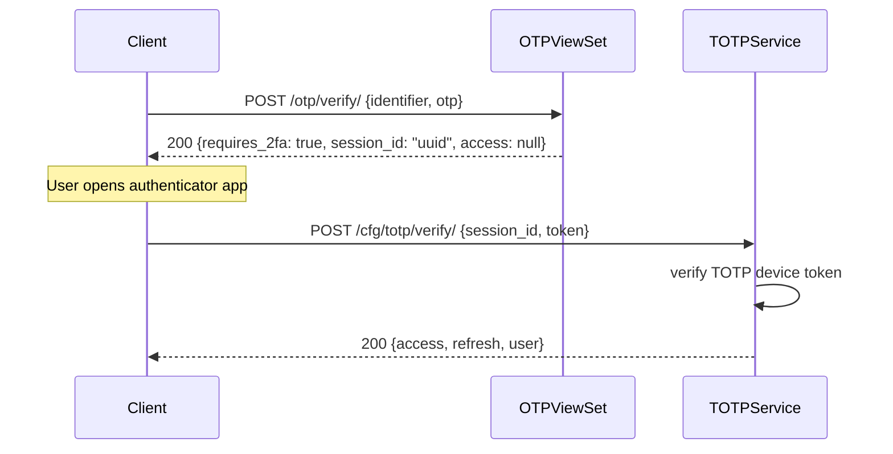
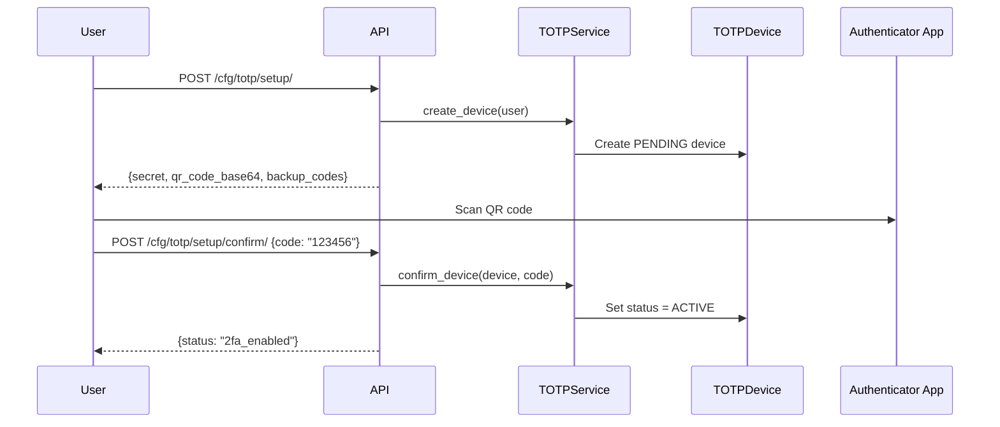
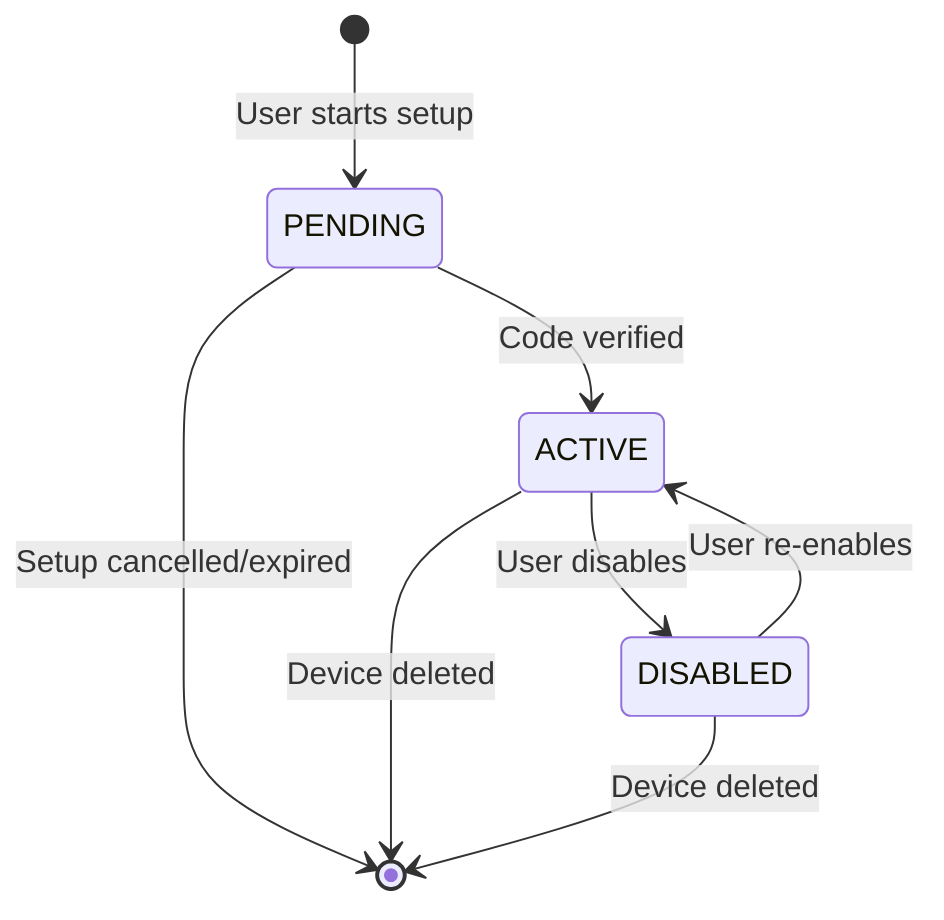

import { Callout } from 'nextra/components'

# Two-Factor Authentication (2FA)

TOTP-based 2FA that works with Google Authenticator, Authy, Microsoft Authenticator, and any RFC 6238 app.

## Configuration

```python
from django_cfg import DjangoConfig
from django_cfg.models.api.twofactor import TwoFactorConfig

class MyConfig(DjangoConfig):
    two_factor = TwoFactorConfig(
        enabled=True,
        enforcement="optional",        # optional | encouraged | required | admin_only
        session_lifetime_minutes=5,    # 2FA session timeout
        max_failed_attempts=5,         # Attempts before lockout
        grace_period_days=7,           # Days before mandatory (when enforcement="required")
        allow_totp=True,
        allow_backup_codes=True,
        backup_codes_count=10,
        issuer_name="My App",          # Shown in authenticator app
    )
```

## Enforcement Modes

| Mode | Behavior |
|------|----------|
| `optional` | Users choose to enable 2FA — default |
| `encouraged` | Prompted on login, but not blocked |
| `required` | All users must have 2FA (grace period applies) |
| `admin_only` | Only staff/superusers require 2FA |

<Callout type="warning">
When using `required`, set `grace_period_days` to give existing users time to enroll before being blocked.
</Callout>

---

## Authentication Flow

When a user has an active TOTP device:



`session_id` is a short-lived UUID in cache — bridges OTP and TOTP steps without issuing tokens prematurely.

---

## Setup Flow



---

## API Endpoints

| Endpoint | Method | Description |
|----------|--------|-------------|
| `/cfg/totp/setup/` | POST | Initialize 2FA — get secret + QR code |
| `/cfg/totp/setup/confirm/` | POST | Confirm with initial code → activate device |
| `/cfg/totp/verify/` | POST | Verify TOTP code during login |
| `/cfg/totp/verify/backup/` | POST | Verify using backup code |
| `/cfg/totp/devices/` | GET | List user's 2FA devices |
| `/cfg/totp/devices/{id}/` | DELETE | Remove a 2FA device |
| `/cfg/totp/backup-codes/` | GET | Backup codes status |
| `/cfg/totp/backup-codes/regenerate/` | POST | Generate new backup codes |

---

## Service Layer

```python
from django_cfg.apps.system.totp.services import TOTPService, BackupCodeService

# Create device
device = TOTPService.create_device(user=user, name="My Phone", make_primary=True)

# Get QR code for authenticator app
uri = TOTPService.get_provisioning_uri(device, issuer="MyApp")
qr_base64 = TOTPService.generate_qr_code(uri, format="base64")

# Verify and activate
success = TOTPService.confirm_device(device, code="123456")

# Verify during login
is_valid = TOTPService.verify_code(device, code="123456")

# Backup codes
codes = BackupCodeService.generate_codes(user, count=10)
# Returns: ["XXXX-XXXX", ...]

is_valid = BackupCodeService.verify_code(user, code="XXXX-XXXX")
# Single-use — marks code as consumed
```

## Device Lifecycle



---

## Admin Runtime Configuration

2FA settings can be changed at runtime via Django Admin (`TwoFactorSettings` model) without redeploying:

```python
from django_cfg.apps.system.accounts.models import TwoFactorSettings

settings = TwoFactorSettings.get_settings()

# Check per-user requirements
requires = settings.user_requires_2fa(user)
should_prompt = settings.user_should_prompt_2fa(user)
```

Admin can change: enable/disable globally, enforcement policy, session timeout, lockout settings, allowed methods.

---

## Frontend

`AuthLayout` handles the full 2FA flow automatically — no extra code needed:

```tsx
import { AuthLayout } from '@djangocfg/layouts'

// Automatically handles: identifier → otp → 2fa (if required) → success
<AuthLayout githubOAuthEnabled={true} redirectUrl="/dashboard" />
```

Steps rendered by `AuthContent`:
- `identifier` — email input
- `otp` — 6-digit OTP input
- `2fa` — TOTP authenticator code
- `2fa-setup` — enroll new TOTP device
- `success` — confirmation + auto-redirect

TAGS: 2fa, totp, TwoFactorConfig, backup codes, authenticator app
DEPENDS_ON: [index, otp, jwt]
