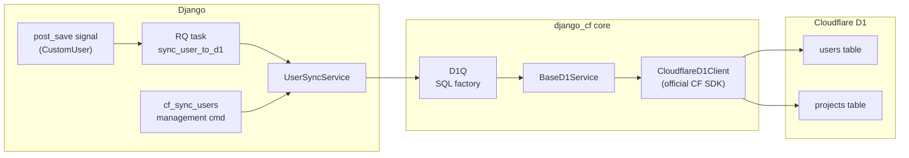

# Cloudflare D1 — `django_cf`

`django_cf` is an auto-configuring module that connects Django to **Cloudflare D1** — SQLite-over-HTTP served at the edge. It handles credential management, schema migration, user sync, and provides the `D1Q` SQL factory used by other modules (including `django_monitor`).

---

## Architecture



---

## Key Concepts

**D1 is SQLite-over-HTTP.** There's no persistent connection — every query is an HTTP request to the Cloudflare API. `CloudflareD1Client` wraps the official `cloudflare` Python SDK.

**`D1Q` is the SQL factory.** Define a table once with `D1Table` (columns, PK, indexes, conflict strategy), then call `D1Q.upsert(TABLE, data)` to get `(sql, params)`. No raw SQL strings anywhere.

**`BaseD1Service`** is the abstract base for all D1-backed services. Provides `_get_client()`, `_get_api_url()`, and `_ensure_schema()`. Both `UserSyncService` (users) and `MonitorSyncService` (monitor events) inherit from it.

---

## Quick Start

### 1. Install credentials

```bash
# .env.secrets
CF_ACCOUNT_ID=your-account-id
CF_API_TOKEN=your-d1-edit-token
CF_D1_DATABASE_ID=your-database-uuid
```

### 2. Add to config

```python
# djangoconfig.py
from django_cfg import CloudflareConfig

class MyConfig(DjangoConfig):
    cloudflare: CloudflareConfig = CloudflareConfig(
        enabled=True,
        account_id="${CF_ACCOUNT_ID}",
        api_token="${CF_API_TOKEN}",
        d1_database_id="${CF_D1_DATABASE_ID}",
    )
```

Django-CFG registers `DjangoCfConfig` automatically. On startup it:
- Connects `post_save` signal for user sync
- Connects `django_monitor` capture hooks (if monitor module is present)
- Runs `_ensure_schema()` lazily on first use

### 3. Verify

```bash
python manage.py cf_status
```

---

## What Gets Synced

| Table | Trigger | Method |
|---|---|---|
| `users` | `post_save` → RQ task | `UserSyncService.push_user()` — upsert |
| `users` (bulk) | `cf_sync_users` command | `full_sync_users()` — batched upsert |
| `projects` | startup (planned) | metadata upsert |

---

## What's Next

<Cards>
  <Card title="Configuration" href="./configuration">All `CloudflareConfig` fields and env vars</Card>
  <Card title="D1Q — SQL Factory" href="./d1-query">How to define tables and generate SQL with `D1Q`</Card>
  <Card title="User Sync" href="./user-sync">Sync flow, bulk sync, and RQ task details</Card>
  <Card title="Monitor Module" href="../django-monitor/overview">Error tracking built on top of `django_cf`</Card>
</Cards>

---

TAGS: django_cf, cloudflare-d1, user-sync, edge-database
DEPENDS_ON: []
