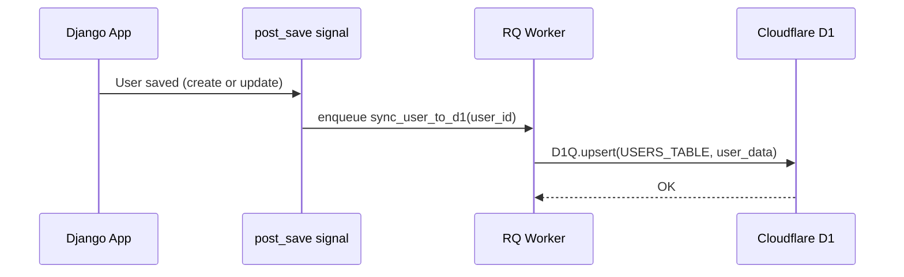

# User Sync

`django_cf` automatically mirrors Django users into a Cloudflare D1 `users` table. This makes user data available at the edge for low-latency lookups, analytics, and integrations.

---

## Sync Flow



The signal fires on **every save** — creates and updates. The RQ task runs asynchronously, so the HTTP response is never delayed.

---

## Automatic Sync

Enabled by default when `sync_users=True` (the default). No extra configuration needed.

To disable:

```python
cloudflare: CloudflareConfig = CloudflareConfig(
    enabled=True,
    # ...
    sync_users=False,
)
```

---

## Bulk Sync

To sync all existing users (e.g. after first setup or after enabling the module on an existing project):

```bash
python manage.py cf_sync_users
```

Options:

```bash
# Sync in batches of 100 instead of default 500
python manage.py cf_sync_users --batch-size 100

# Dry run — show counts without writing to D1
python manage.py cf_sync_users --dry-run
```

`full_sync_users()` iterates all `CustomUser` records, batches them by `sync_batch_size`, and upserts each batch to D1.

---

## Users Table Schema

| Column | Type | Description |
|---|---|---|
| `id` | TEXT | Django user UUID (primary key) |
| `api_url` | TEXT | Project API URL (composite PK) |
| `email` | TEXT | User email |
| `username` | TEXT | Username |
| `first_name` | TEXT | First name |
| `last_name` | TEXT | Last name |
| `is_active` | INTEGER | 0 / 1 |
| `is_staff` | INTEGER | 0 / 1 |
| `date_joined` | TEXT | ISO 8601 |
| `updated_at` | TEXT | ISO 8601 — last sync time |

---

## Public API

```python
from django_cfg.modules.django_cf import get_service
from django_cfg.modules.django_cf.users.types import UserSyncData

service = get_service()

# Push a single user
data = UserSyncData.from_user(user, api_url="https://api.example.com")
service.push_user(data)

# Bulk sync all users
service.full_sync_users(api_url="https://api.example.com", batch_size=500)
```

---

## See Also

- **[Configuration](./configuration)** — `sync_users`, `sync_batch_size`
- **[Overview](./overview)** — Architecture and BaseD1Service
- **[D1Q](./d1-query)** — SQL factory used by UserSyncService

TAGS: django_cf, user-sync, cloudflare-d1, rq
DEPENDS_ON: [django-cf/overview]
