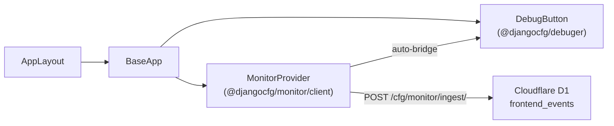

# Frontend SDK — `@djangocfg/monitor`

`@djangocfg/monitor` is the JavaScript counterpart to `django_monitor`. Browser and server events go to `POST /cfg/monitor/ingest/` and land in D1 as `frontend_events`.

---

## Package Structure

```
@djangocfg/monitor          — types only, server-safe
@djangocfg/monitor/client   — browser SDK ("use client")
@djangocfg/monitor/server   — Node.js / Edge Runtime
```

---

## Install

```bash
pnpm add @djangocfg/monitor
```

Optional peer dependencies:

| Package | Purpose |
|---|---|
| `consola` | consola reporter instead of `console.*` patch |
| `zustand` | required for the client entry point event buffer |

---

## Integration via `@djangocfg/layouts` (recommended)

If your app uses `@djangocfg/layouts`, you get monitor **for free** — no `MonitorProvider` needed.

```tsx
// app/layout.tsx
import { AppLayout } from '@djangocfg/layouts'

export default function RootLayout({ children }) {
  return (
    <html lang="en" suppressHydrationWarning>
      <body>
        <AppLayout
          project="my-app"
          auth={{ apiUrl: process.env.NEXT_PUBLIC_API_URL }}
          theme={{ defaultTheme: 'dark' }}
          // monitor is auto-enabled via `project` prop
        >
          {children}
        </AppLayout>
      </body>
    </html>
  )
}
```

`AppLayout` (and `BaseApp`) include `MonitorProvider` automatically. The `project` prop is passed through to monitor as-is.

To override monitor defaults:

```tsx
<AppLayout
  project="my-app"
  monitor={{ baseUrl: 'https://api.example.com', captureConsole: false }}
>
```

### How it connects



---

## Standalone `MonitorProvider`

Without `@djangocfg/layouts`, drop it directly into your root layout:

```tsx
import { MonitorProvider } from '@djangocfg/monitor/client'

export default function RootLayout({ children }) {
  return (
    <html>
      <body>
        <MonitorProvider
          project="my-app"
          environment={process.env.NODE_ENV}
          // baseUrl defaults to same origin
        />
        {children}
      </body>
    </html>
  )
}
```

Auto-captured after init:

| Source | Mechanism |
|---|---|
| JS exceptions | `window.onerror` + `unhandledrejection` |
| Console warnings/errors | consola reporter or `console.*` patch |
| `@djangocfg/api` Zod failures | `zod-validation-error` CustomEvent |

---

## Network Monitoring

```typescript
import { monitoredFetch } from '@djangocfg/monitor/client'

const res = await monitoredFetch('/api/orders', { method: 'POST', body: JSON.stringify(order) })
// non-2xx responses → captured as NETWORK_ERROR event
```

---

## Manual Capture (client)

```typescript
import { FrontendMonitor } from '@djangocfg/monitor/client'
import { EventType, EventLevel } from '@djangocfg/monitor'

FrontendMonitor.capture({
  event_type: EventType.JS_ERROR,
  level: EventLevel.ERROR,
  message: 'Payment failed',
  url: window.location.href,
  extra: { orderId: '123' },
})
```

---

## `window.monitor` — DevTools API

After `MonitorProvider` mounts, `window.monitor` is available in the browser console:

```javascript
// Fire events manually
window.monitor.error('Something broke', { context: 'checkout' })
window.monitor.warn('Slow response', { ms: 2500 })
window.monitor.info('User action', { action: 'checkout' })
window.monitor.network(404, 'GET', '/api/users/')
window.monitor.network(502, 'POST', '/api/orders/', { retries: 3 })

// Force-flush buffered events
window.monitor.flush()

// Inspect current state (config, buffer size, session_id)
window.monitor.status()
```

---

## Server Usage (Next.js Route Handlers)

### Configure once

```typescript
// lib/monitor.ts
import { serverMonitor } from '@djangocfg/monitor/server'

serverMonitor.configure({
  project: process.env.PROJECT_NAME ?? 'my-app',
  environment: process.env.NODE_ENV,
  baseUrl: 'https://api.myapp.com',  // required if backend is on a different origin
})

export { serverMonitor }
```

### Route handler — manual

```typescript
// app/api/orders/route.ts
import { serverMonitor } from '@/lib/monitor'

export async function POST(req: Request) {
  try {
    // ...
  } catch (err) {
    await serverMonitor.captureError(err, { url: req.url })
    return new Response('Internal Server Error', { status: 500 })
  }
}
```

### Route handler — `withMonitor` HOC

```typescript
import { withMonitor } from '@djangocfg/nextjs/monitor'

export const POST = withMonitor(async (req) => {
  // errors captured automatically — no try/catch needed
})
```

---

## Debug Panel Integration (`@djangocfg/debuger`)

Install `@djangocfg/debuger` alongside `@djangocfg/monitor`:

```bash
pnpm add @djangocfg/debuger
```

The monitor auto-bridges its event store into the debug panel's **Logs** tab — no extra setup. Monitor events appear as `monitor:JS_ERROR`, `monitor:NETWORK_ERROR`, etc.

Open the panel with **`Cmd+D`** or add `?debug=1` to the URL.

<Callout type="info">
When using `@djangocfg/layouts`, the debug panel is already included — just add `@djangocfg/debuger` as a dependency.
</Callout>

---

## Client Configuration Reference

| Option | Type | Default | Description |
|---|---|---|---|
| `project` | `string` | `''` | Project name sent with every event |
| `environment` | `string` | `''` | `production` / `staging` / `development` |
| `baseUrl` | `string` | same origin | Base URL of the django-cfg backend |
| `flushInterval` | `number` | `5000` | Buffer flush interval (ms) |
| `maxBufferSize` | `number` | `20` | Max events before immediate flush |
| `captureJsErrors` | `boolean` | `true` | `window.onerror` + unhandled rejections |
| `captureConsole` | `boolean` | `true` | `console.warn` / `console.error` interception |
| `debug` | `boolean` | `false` | Log init info to console |

---

## Transport

Events are batched and flushed via the generated API client:

- **Normal flush** → `monitorApi.monitor.ingestCreate(batch)` (standard fetch)
- **Page unload** → `KeepAliveFetchAdapter` with `keepalive: true` — ensures delivery after navigation

Transport errors are **always swallowed** — monitor never crashes your app.

---

## Ingest Endpoint

```
POST /cfg/monitor/ingest/
Content-Type: application/json
```

| Parameter | Value |
|---|---|
| Authentication | Not required |
| Max batch size | 50 events |
| Success response | `202 Accepted` |

---

## See Also

- **[Overview](./overview)** — Full architecture and D1 storage
- **[Server-Side Capture](./server-capture)** — Django-side capture hooks
- **[Configuration](./configuration)** — Telegram alerts, cleanup

TAGS: django_monitor, frontend-sdk, javascript, next.js, layouts, debuger
DEPENDS_ON: [django-monitor/overview]
