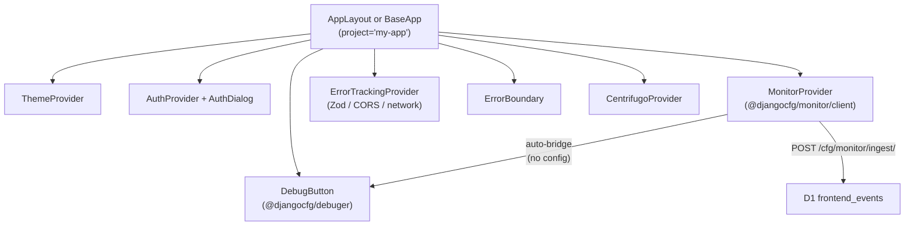

# `@djangocfg/layouts` Integration

`@djangocfg/layouts` is the recommended way to use the monitor in a Next.js app. Drop in `AppLayout` or `BaseApp` and monitoring, the debug panel, and error tracking are all wired up automatically.

---

## What `AppLayout` / `BaseApp` provide



The `project` prop flows through to both `MonitorProvider` and the debug panel title automatically.

---

## Minimum Setup

```tsx
// app/[locale]/layout.tsx — providers root (mounted once)
import { BaseApp } from '@djangocfg/layouts'

export default function RootLayout({ children }) {
  return (
    <html lang="en" suppressHydrationWarning>
      <body>
        <BaseApp
          project="my-app"
          auth={{ apiUrl: process.env.NEXT_PUBLIC_API_URL }}
          theme={{ defaultTheme: 'dark', storageKey: 'theme' }}
        >
          {children}
        </BaseApp>
      </body>
    </html>
  )
}
```

That's it. Monitor is live — JS errors, unhandled rejections, and console errors
flow to D1. Per-section shells (`PrivateLayout` / `PublicLayout`) are mounted in
native route-group `layout.tsx` files, not here.

---

## Overriding Monitor Defaults

```tsx
<BaseApp
  project="my-app"
  monitor={{
    baseUrl: 'https://api.example.com',   // if backend is on a different origin
    captureConsole: false,                // disable console interception
    flushInterval: 10000,                 // flush every 10s
  }}
>
```

All `MonitorConfig` options are accepted. `project` and `environment` come from the top-level `project` prop by default.

---

## Debug Panel

`@djangocfg/layouts` includes `@djangocfg/debuger`'s `DebugButton` automatically. The monitor bridges its event store into the panel's **Logs** tab — no extra config.

Open with: **`Cmd+D`** or `?debug=1` in the URL.

```tsx
// Add custom tabs (e.g. Zustand store viewer)
import type { CustomDebugTab } from '@djangocfg/debuger'

const myTabs: CustomDebugTab[] = [
  { id: 'store', label: 'Stores', icon: Database, panel: StoreTab },
]

<BaseApp debug={{ panel: { tabs: myTabs } }}>
```

To disable:

```tsx
<BaseApp debug={{ enabled: false }}>
```

---

## Fullscreen Pages

Providers (auth, monitor, theme) live in the root `BaseApp`, so they stay active
on every route. To render a page **without** a shell (fullscreen terminal,
embed, print, auth), simply place it in a route segment that has no
`PrivateLayout` / `PublicLayout` wrapper — there's no `noLayoutPaths` config, the
absence of a shell *is* the fullscreen.

---

## Error Tracking

Two mechanisms work in parallel:

| Mechanism | What it catches | Where |
|---|---|---|
| `MonitorProvider` | JS errors, unhandled rejections, console | D1 `frontend_events` |
| `ErrorTrackingProvider` | Zod validation, CORS, API errors | in-app error state |

```tsx
// Emit from any component
import { useErrorEmitter, emitRuntimeError } from '@djangocfg/layouts'

const { emitError } = useErrorEmitter('PaymentForm')
emitError('Payment failed', error)

// Outside React
emitRuntimeError('PaymentService', 'Gateway timeout', error)
```

---

## CSS Setup

Add to `globals.css` **before** `@import "tailwindcss"`:

```css
@import "@djangocfg/ui-nextjs/styles";
@import "@djangocfg/layouts/styles";
@import "@djangocfg/ui-tools/styles";
@import "@djangocfg/debuger/styles";
@import "tailwindcss";
```

---

## Package Reference

| Package | Role |
|---|---|
| `@djangocfg/layouts` | Smart layout router + all providers |
| `@djangocfg/monitor` | Monitor types + SDK |
| `@djangocfg/debuger` | Debug panel (auto-bridges monitor) |

---

## See Also

- **[Frontend SDK](./frontend-sdk)** — Standalone `MonitorProvider`, `withMonitor`, `window.monitor`
- **[Overview](/features/modules/django-monitor)** — Full stack picture (Django + D1 + browser)

TAGS: django_monitor, layouts, debuger, next.js, appLayout
DEPENDS_ON: [django-monitor/frontend-sdk]
