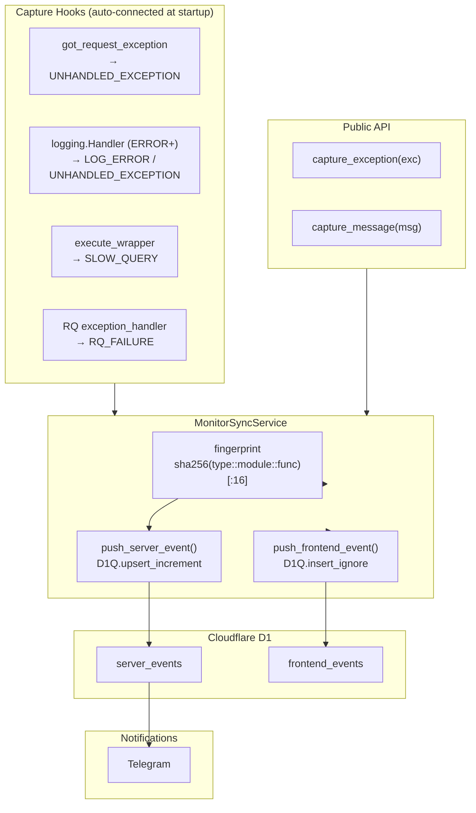

# Monitor — `django_monitor`

`django_monitor` captures server-side errors and browser events, then pushes them to **Cloudflare D1** via `django_cf`. No separate database, no PostgreSQL tables — events live at the edge alongside your user data.

<Callout type="info">
`django_monitor` requires `django_cf` to be configured (`CloudflareConfig(enabled=True, ...)`). If Cloudflare is not configured, all capture paths silently no-op.
</Callout>

---

## How It Fits Together



---

## What Gets Captured

| Source | Event type | Dedup |
|---|---|---|
| `got_request_exception` signal | `UNHANDLED_EXCEPTION` | by fingerprint |
| `logging.Handler` with exception | `UNHANDLED_EXCEPTION` | by fingerprint |
| `logging.Handler` without exception | `LOG_ERROR` | by fingerprint |
| `execute_wrapper` (slow DB query) | `SLOW_QUERY` | by fingerprint |
| RQ `exception_handler` | `RQ_FAILURE` | by fingerprint |
| `capture_exception()` | `SERVER_ERROR` | by fingerprint |
| `capture_message()` | `LOG_ERROR` | by message hash |
| Browser SDK (`@djangocfg/monitor`) | various | append-only |

**Server events** are deduplicated — same fingerprint = `occurrence_count++` on the existing row.

**Frontend events** are append-only — duplicate `(session_id, event_id)` pairs are silently ignored.

---

## Quick Start

### 1. Configure `django_cf`

```python
# djangoconfig.py
from django_cfg import CloudflareConfig

class MyConfig(DjangoConfig):
    cloudflare: CloudflareConfig = CloudflareConfig(
        enabled=True,
        account_id="${CF_ACCOUNT_ID}",
        api_token="${CF_API_TOKEN}",
        d1_database_id="${CF_D1_DATABASE_ID}",
        telegram_alerts_enabled=True,
    )
```

`DjangoMonitorConfig` AppConfig is registered automatically. On first event, the schema (`server_events` + `frontend_events` tables) is created in D1.

### 2. Manual capture (optional)

```python
from django_cfg.modules.django_monitor import capture_exception, capture_message

try:
    process_payment(order)
except Exception as e:
    capture_exception(e, url="/api/orders/", http_method="POST")

capture_message("payment gateway slow", level="warning", extra={"latency_ms": 3200})
```

Both calls are **fire-and-forget** — they never raise.

### 3. Check status

```bash
python manage.py monitor_status
```

---

## Streamlit Admin Dashboard

Events are visible in the **Streamlit admin** under the **Monitor** section:

- **Server Events** — deduplicated list with `occurrence_count`, `first_seen`, `last_seen`
- **Frontend Events** — browser event stream, filterable by type, project, session

---

## What's Next

<Cards>
  <Card title="Server-Side Capture" href="./server-capture">All automatic hooks and the manual `capture_exception` / `capture_message` API</Card>
  <Card title="Configuration" href="./configuration">Slow query threshold, Telegram alerts, retention</Card>
  <Card title="Frontend SDK" href="./frontend-sdk">Browser `@djangocfg/monitor` package, `withMonitor`, `window.monitor`</Card>
  <Card title="@djangocfg/layouts" href="./layouts-integration">Zero-config monitor + debug panel via `AppLayout`</Card>
  <Card title="Management Commands" href="./management-commands">`monitor_status`, `monitor_cleanup`</Card>
  <Card title="Cloudflare D1 Module" href="../django-cf/overview">The underlying storage layer</Card>
</Cards>

---

TAGS: django_monitor, error-tracking, cloudflare-d1, server-events, frontend-events
DEPENDS_ON: [django-cf/overview]
