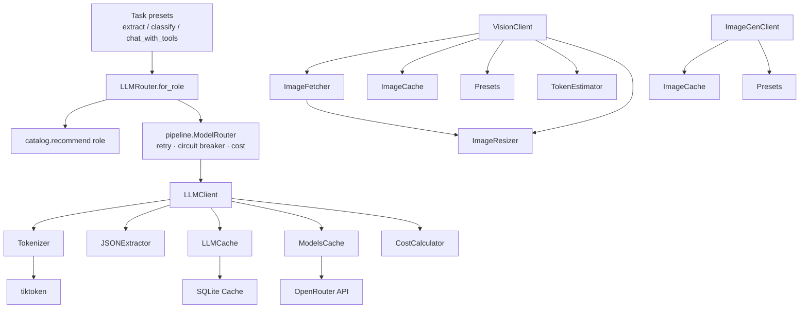
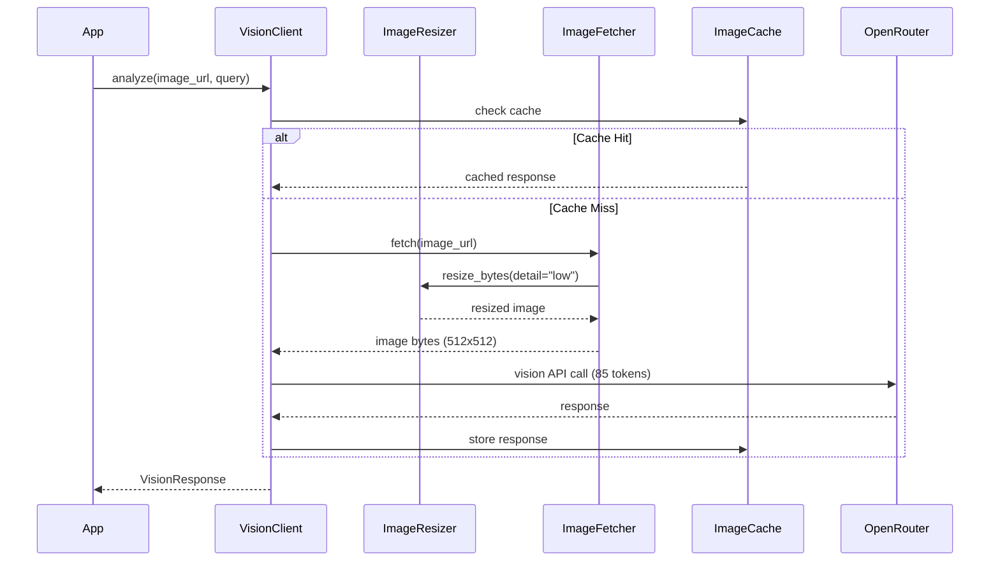
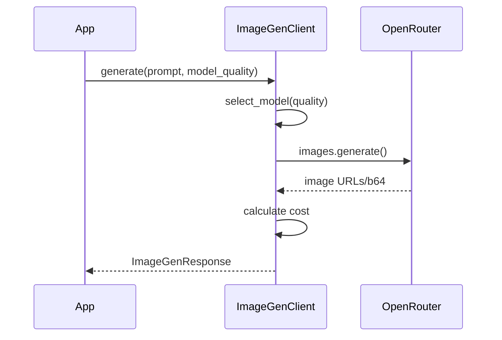

# Django LLM Module

## Overview

**Django LLM** is a modular, type-safe LLM integration system for Django applications built with `django-cfg`. It provides multi-provider support, intelligent caching, cost tracking, vision/OCR capabilities, and image generation.

**Key Features:**
- Multi-provider support (OpenAI, OpenRouter)
- **Task presets** — call an LLM by *job* (`extract` / `classify` / `chat_with_tools` / `escalate`), not by model; async twins (`aextract` …) + bounded fan-out (`extract_many`)
- Model catalog — role-based model selection with curated verdicts
- Cascading multi-model router with retry, circuit breaker, and fallback
- Strict structured output (provider-enforced JSON schema → Pydantic)
- Advisory layer — warns on risky model/role mismatches
- Vision analysis with model quality presets
- **Automatic image resizing** for token optimization (90% cost savings)
- OCR with multiple extraction modes
- Image generation (DALL-E, FLUX, etc.)
- Automatic cost calculation and tracking
- Intelligent caching with TTL (SQLite-backed, fail-open)
- Type-safe configuration with Pydantic 2
- Token counting and usage analytics

---

## Modules

### Core Components

```
django_llm/
├── client/                    # Text LLM client
│   ├── client.py              # Main LLMClient class
│   ├── chat_handler.py        # Chat completion handling
│   └── embedding_handler.py   # Embedding generation
├── core/                      # Shared types and errors
├── providers/                 # Provider management (OpenAI, OpenRouter)
├── registry/                  # Model catalogue, pricing, cost calculation
│   ├── models.py              # Model cache + pricing data
│   ├── pricing.py             # Cost calculation utilities
│   └── free_models.py         # OpenRouter free/structured model discovery
├── catalog/                   # Model selection by role + advisory
│   ├── roles.py               # ModelRole + Verdict enums
│   ├── models.py              # Curated per-model traits + recommend()
│   └── advisories.py          # check() — risky model/role warnings
├── core/                      # Shared types, errors, tokenizer (primitives)
│   ├── types.py               # Pydantic response models
│   ├── errors.py              # Typed error taxonomy + classify_exception()
│   └── tokenizer.py           # Token counting utilities
├── storage/                   # Response caching with TTL (SQLite, fail-open)
├── structured/                # Structured output + JSON extraction + enum coercion
├── pipeline/                  # Retry, circuit breaker, rate limit, cost, router
├── routing/                   # Ergonomics layer — pick a job, not a model
│   ├── llm_router.py          # LLMRouter — cascading multi-model facade + for_role()
│   └── presets.py             # extract / classify / chat_with_tools / escalate
├── monitoring/                # LLM provider balance monitoring
├── features/
│   ├── vision/                # VisionClient, OCR, image resize
│   ├── image_gen/             # ImageGenClient
│   └── translator/            # DjangoTranslator
├── _integration.py            # Host seam — the only host-coupled file
└── __init__.py                # Public API exports
```

> Layering: `core/` (primitives) → `providers/` + `structured/` → `client/` →
> `pipeline/` (reliability) → `routing/` (ergonomics) → `features/`. The module
> root holds only `__init__.py` (public API) and `_integration.py` (host seam);
> every other file lives in a subpackage.

### Architecture



---

## Image Auto-Resize (Token Optimization)

### Why Resize?

OpenAI Vision API charges tokens based on image size:
- **Low detail**: 85 tokens (fixed, image resized to 512x512)
- **High detail**: 85 base + 170 tokens per 512x512 tile

For high-volume OCR tasks, pre-resizing images can save **90% on token costs**:
- 15,000 images/day: $1.72 → $0.19

### Usage

```python
from django_cfg.modules.django_llm.features.vision import VisionClient

# Default: auto_resize=True, default_detail="low"
client = VisionClient()

# All images automatically resized to 512x512 (85 tokens each)
response = client.analyze(
    image_url="https://example.com/large-image.jpg",
    query="Extract text from this image"
)

# Override for specific calls
response = client.analyze(
    image_url="https://example.com/detailed-chart.jpg",
    query="Analyze this chart in detail",
    resize=True,
    detail="high"  # 768px short side, more tiles
)

# Disable resize globally
client = VisionClient(auto_resize=False)
```

### Detail Modes

| Mode | Size | Tokens | Use Case |
|------|------|--------|----------|
| `low` | 512x512 | 85 (fixed) | OCR, text extraction, quick checks |
| `high` | 768px short side | 85 + 170/tile | Detailed analysis, charts, diagrams |
| `auto` | Adaptive | Varies | Auto-select based on image size |

### ImageResizer Class

```python
from django_cfg.modules.django_llm.features.vision import ImageResizer

# Resize PIL image
from PIL import Image
img = Image.open("photo.jpg")
resized = ImageResizer.resize_image(img, detail="low")

# Resize bytes directly
resized_bytes, content_type = ImageResizer.resize_bytes(
    image_bytes,
    detail="low",
    output_format="JPEG",
    quality=85
)

# Estimate token savings
savings = ImageResizer.estimate_savings(4000, 3000, "low")
print(f"Tokens saved: {savings['tokens_saved']}")
print(f"Savings: {savings['savings_percent']}%")
# Output: Tokens saved: 680, Savings: 88.9%

# Get optimal dimensions
new_w, new_h = ImageResizer.get_optimal_size(2000, 1500, "low")
# Output: (512, 384)
```

### ImageFetcher with Resize

```python
from django_cfg.modules.django_llm.features.vision import ImageFetcher

# Default: resize=True, detail="low"
fetcher = ImageFetcher()

# Fetch and auto-resize
data, content_type = await fetcher.fetch("https://example.com/image.jpg")

# Override resize settings
data, content_type = await fetcher.fetch(
    "https://example.com/image.jpg",
    resize=False  # Disable resize for this call
)

# Fetch as base64 with resize
data_url = await fetcher.fetch_as_base64_url(
    "https://example.com/image.jpg",
    detail="high"  # Use high detail mode
)
```

---

## Vision & OCR

### VisionClient

**Image analysis and OCR with model quality presets**

```python
from django_cfg.modules.django_llm.features.vision import VisionClient

# Initialize (API key auto-detected from django config)
# Default: auto_resize=True, default_detail="low"
client = VisionClient()

# Simple image analysis
response = client.analyze(
    image_source="https://example.com/image.jpg",
    query="Describe this image"
)
print(response.content)
print(f"Cost: ${response.cost_usd:.4f}")

# Analysis with quality preset
response = client.analyze_with_quality(
    image_url="https://example.com/image.jpg",
    prompt="What objects are in this image?",
    model_quality="balanced"  # fast, balanced, best
)
print(response.description)
```

### Model Quality Presets

| Preset | Model | Use Case |
|--------|-------|----------|
| `fast` | Auto-select cheapest | Quick checks, high volume |
| `balanced` | llama-3.2-11b-vision | General purpose |
| `best` | gpt-4o | Complex analysis, accuracy critical |

### OCR Methods

```python
# Simple text extraction
text = client.extract_text(image_url="https://example.com/document.jpg")

# OCR with mode selection
response = client.ocr(
    image_url="https://example.com/receipt.jpg",
    mode="base"  # tiny, small, base, gundam
)
print(response.text)

# Async OCR
response = await client.aocr(
    image="base64_encoded_image_data",
    mode="gundam"  # Most detailed extraction
)
```

### OCR Modes

| Mode | Description |
|------|-------------|
| `tiny` | Minimal prompt, fastest |
| `small` | Basic OCR prompt |
| `base` | Standard detailed extraction |
| `gundam` | Maximum detail, preserves formatting |

### Async Methods

```python
# Async analysis
response = await client.aanalyze(
    image_source="https://example.com/image.jpg",
    query="Analyze this"
)

# Async with quality preset
response = await client.aanalyze_with_quality(
    image="base64_data",
    model_quality="best"
)

# Async OCR
response = await client.aocr(image_url="https://example.com/doc.jpg")
```

### Token Estimation

```python
from django_cfg.modules.django_llm.features.vision import estimate_image_tokens

# Estimate tokens for image
tokens = estimate_image_tokens(width=1024, height=1024, detail="high")
# Returns: 765 (85 base + 170 * 4 tiles)

# Auto-detect optimal detail mode
from django_cfg.modules.django_llm.features.vision import get_optimal_detail_mode
mode = get_optimal_detail_mode(width=512, height=512)  # Returns "low"
mode = get_optimal_detail_mode(width=2048, height=2048)  # Returns "high"
```

---

## Image Generation

### ImageGenClient

```python
from django_cfg.modules.django_llm.features.image_gen import ImageGenClient

# Initialize (API key auto-detected)
client = ImageGenClient()

# Generate image
response = client.generate(
    prompt="A sunset over mountains, photorealistic",
    model_quality="best",  # fast, balanced, best
    size="1024x1024",
    quality="hd",
    style="vivid"
)
print(response.first_url)
print(f"Cost: ${response.cost_usd:.4f}")

# Quick generation (returns URL directly)
url = client.generate_quick("A cute cat wearing a hat")

# Async generation
response = await client.agenerate(
    prompt="Abstract art",
    size="1792x1024"
)
```

### Image Generation Presets

| Preset | Model | Best For |
|--------|-------|----------|
| `fast` | Auto-select | Quick prototypes |
| `balanced` | DALL-E 3 | General use |
| `best` | FLUX Pro | Highest quality |

### Supported Sizes

- `256x256`, `512x512`, `1024x1024`
- `1792x1024`, `1024x1792` (wide/tall)

---

## Image Fetching

### ImageFetcher

```python
from django_cfg.modules.django_llm.features.vision import ImageFetcher

fetcher = ImageFetcher(
    timeout=30.0,
    max_size_mb=10,
    allowed_domains=["example.com", "cdn.example.com"],  # Optional whitelist
    resize=True,      # Auto-resize images (default: True)
    detail="low",     # Detail mode (default: "low")
)

# Fetch as bytes (auto-resized)
data, content_type = await fetcher.fetch("https://example.com/image.jpg")

# Fetch without resize
data, content_type = await fetcher.fetch(
    "https://example.com/image.jpg",
    resize=False
)

# Fetch as base64 data URL
data_url = await fetcher.fetch_as_base64_url("https://example.com/image.jpg")
# Returns: "data:image/jpeg;base64,/9j/4AAQ..."

# Sync versions
data, content_type = fetcher.fetch_sync("https://example.com/image.jpg")
data_url = fetcher.fetch_as_base64_url_sync("https://example.com/image.jpg")

# Format detection from base64
content_type = ImageFetcher.detect_format_from_base64("/9j/4AAQ...")  # "image/jpeg"
content_type = ImageFetcher.detect_format_from_base64("iVBORw0KGgo...")  # "image/png"
```

---

## Caching

### Image Cache

```python
from django_cfg.modules.django_llm.features.vision import ImageCache, get_image_cache

# Get global cache instance
cache = get_image_cache(cache_dir=Path("cache/images"), ttl_hours=168)

# Store/retrieve images
cache.set_image(url, image_bytes, "image/jpeg")
result = cache.get_image(url)  # Returns (bytes, content_type) or None

# Store/retrieve responses
cache.set_response(cache_key, {"text": "extracted", "cost": 0.001})
result = cache.get_response(cache_key)

# Cache management
stats = cache.get_stats()  # {"enabled": True, "image_count": 10, ...}
count = cache.clear()  # Returns number of files cleared
count = cache.cleanup_expired()  # Remove expired entries
```

---

## Configuration

Clients are configured through their constructor arguments. API keys are
resolved through `_integration.get_api_keys()` when omitted (see [API Keys](#api-keys)).

```python
from django_cfg.modules.django_llm.features.vision import VisionClient
from django_cfg.modules.django_llm.features.image_gen import ImageGenClient

# Vision: auto_resize and default_detail tune token usage
vision = VisionClient(auto_resize=True, default_detail="low")

# Image generation
image_gen = ImageGenClient()
```

---

## LLM Client (Text)

### Basic Usage

```python
from django_cfg.modules.django_llm.client import LLMClient

client = LLMClient(
    apikey_openrouter="sk-or-v1-...",
    apikey_openai="sk-proj-...",
    cache_dir=Path("cache/llm"),
    cache_ttl=3600
)

# Chat completion
response = client.chat_completion(
    messages=[{"role": "user", "content": "Explain quantum computing"}],
    model="openai/gpt-4o-mini"
)

# Generate embeddings
embedding = client.generate_embedding(
    text="Sample text",
    model="text-embedding-ada-002"
)
```

### Cost Calculation

```python
from django_cfg.modules.django_llm.registry import estimate_cost

# Real pricing — the registry catalogue auto-populates on first use.
cost = estimate_cost(
    "openai/gpt-4o-mini",
    input_tokens=100,
    output_tokens=50,
    models_cache=models_cache,
)
```

### Tokenizer

```python
from django_cfg.modules.django_llm.core import Tokenizer  # also: core.tokenizer.Tokenizer

tokenizer = Tokenizer()
count = tokenizer.count_tokens("Hello world", "gpt-4o-mini")
count = tokenizer.count_messages_tokens(messages, "gpt-4o-mini")
```

### JSON Extraction

```python
from django_cfg.modules.django_llm.structured import JSONExtractor

extractor = JSONExtractor()
json_data = extractor.extract_json_from_response("Here's the data: {'name': 'John'}")
```

---

## Task Presets — call an LLM by job, not by model

The fastest way to use the module. Each preset picks the curated model chain
for its **role** from the catalog (`recommend(role)`), so you never pass a
model slug and never repeat the cascade / structured-output wiring.

```python
from django_cfg.modules.django_llm import extract, classify, chat_with_tools, escalate

# Structured extraction (EXTRACTION role) — strict json_schema → Pydantic
car, model_used, usage = extract(CarListing, "2021 Hyundai Grandeur, 41k km...")

# Cheap structured classification (CLASSIFY role)
label, model_used, _ = classify(Sentiment, "the dealer never called back")

# Agentic multi-tool chat (TOOL_CHAT role) → (text, model_used)
text, model_used = chat_with_tools(messages)

# Quality-over-cost for hard / customer-facing turns (ESCALATION role)
text, model_used = escalate(messages)
```

`extract` / `classify` return `(parsed_pydantic, model_used, usage)`;
`chat_with_tools` / `escalate` return `(text, model_used)`. Override the model
choice when you must: `models=[...]` replaces the role chain, `extra_models=[...]`
appends last-resort fallbacks.

### Async + fan-out

Every preset has an async twin (`aextract`, `aextract_chat`, `aclassify`,
`achat_with_tools`, `aescalate`) plus `LLMRouter.aparse` / `acomplete`. They run
the **same** sync cascade + validate-and-repair ladder on a worker thread
(`asyncio.to_thread`), so the event loop stays free and there is **zero
duplicated logic** — one cascade, one ladder, run concurrently. Use them from
async (adrf) views:

```python
from django_cfg.modules.django_llm import aextract

car, model_used, usage = await aextract(CarListing, "2021 Hyundai Grandeur...")
```

The headline win is **fan-out** — process many inputs concurrently with bounded
parallelism (via [aiometer](https://github.com/florimondmanca/aiometer)):

```python
from django_cfg.modules.django_llm import extract_many, classify_many

# 17 translations / a batch of listings in parallel instead of one-by-one
results = await extract_many(
    TranslatedFields, texts,
    max_at_once=8,        # cap simultaneous in-flight calls
    max_per_second=None,  # optional spawn-rate cap (respect provider RPM)
)
# results: list[(instance, model_used, usage)] in input order
```

`extract_many` / `classify_many` keep an all-or-nothing contract: a per-item
failure raises out of the batch. Wrap each call yourself if you need partial
results.

---

## LLM Router

`LLMRouter` is the facade the presets are built on — over `LLMClient` +
`pipeline.ModelRouter`. It runs a cascading model chain (one classified attempt
per model, each with its own circuit breaker), falling through on failure and
raising `LLMRouterError` when every model is exhausted.

```python
from django_cfg.modules.django_llm import LLMRouter, LLMRouterError, ModelRole

# Build from the catalog's recommended chain for a role (preferred):
router = LLMRouter.for_role(ModelRole.EXTRACTION)

# …or pass an explicit chain:
router = LLMRouter(model_chain=["openai/gpt-4o-mini", "google/gemini-2.5-flash-lite"])

# Structured output — pass a Pydantic schema, get a validated instance back
result, model_used, usage = router.parse(
    schema=MySchema,
    messages=[{"role": "user", "content": "..."}],
)
# usage: {"tokens": int, "cost_usd": float}

# Raw text completion
text, model_used = router.complete(
    messages=[{"role": "user", "content": "..."}],
    max_tokens=1024,
)
```

On a strict `json_schema` request to OpenRouter the router sets
`provider.require_parameters` so the schema is enforced by the provider —
a non-enforcing provider errors and the cascade falls through, rather than
silently downgrading to plain `json_object`.

---

## Model Catalog & Advisory

`catalog/` is the single source of truth for **which model for what**.
Models are graded per *role* — the same model earns a different verdict
per job (Qwen3.5-Flash: fine for `classify`, a runaway for `extraction`,
a narrate-after-first-call failure for `tool_chat`).

```python
from django_cfg.modules.django_llm.catalog import ModelRole, recommend, traits

recommend(ModelRole.EXTRACTION)
# ['google/gemini-2.5-flash-lite', 'openai/gpt-4o-mini', 'deepseek/deepseek-v4-flash']

traits("qwen/qwen3.5-flash-02-23").verdict(ModelRole.EXTRACTION)   # Verdict.AVOID
```

The **advisory layer** warns — deduped, never blocks — when a model is
used against a role or request shape it is known to fail.
`LLMRouter.parse()` runs it over every chain model automatically:

```python
from django_cfg.modules.django_llm.catalog import check, ModelRole

check("qwen/qwen3.5-flash-02-23", role=ModelRole.EXTRACTION)
# warns: reasoning model in the EXTRACTION hot path; catalog grades it AVOID
```

Verdicts are curated from real benchmarks; the narrative lives in
[`@docs/insights/`](./@docs/insights/), the design in
[`@dev/v2/PLAN.md`](./@dev/v2/PLAN.md).

---

## Data Models

### Vision Models

```python
from django_cfg.modules.django_llm.features.vision import (
    VisionAnalyzeRequest,
    VisionAnalyzeResponse,
    OCRRequest,
    OCRResponse,
    ImageResizer,
    DetailMode,
)

# Request with validation
request = VisionAnalyzeRequest(
    image_url="https://example.com/image.jpg",
    prompt="Describe this",
    model_quality="balanced",
    ocr_mode="base"
)

# Response with computed properties
response = VisionAnalyzeResponse(
    extracted_text="Hello World",
    description="A greeting message",
    model="openai/gpt-4o",
    cost_usd=0.001,
    tokens_input=100,
    tokens_output=50
)
print(response.tokens_total)  # 150
```

### Image Generation Models

```python
from django_cfg.modules.django_llm.features.image_gen import (
    ImageGenRequest,
    ImageGenResponse,
    GeneratedImage,
)

request = ImageGenRequest(
    prompt="A sunset",
    n=2,
    size="1024x1024",
    quality="hd",
    style="vivid"
)

response = ImageGenResponse(
    model="openai/dall-e-3",
    prompt="A sunset",
    images=[GeneratedImage(url="https://...")],
    cost_usd=0.08
)
print(response.first_url)
print(response.count)
```

---

## Flows

### Vision Analysis Flow



### Image Generation Flow



---

## API Keys

Every client and the model registry read provider keys through one
function — `_integration.get_api_keys()`, the single host seam. No
client reads host config on its own.

```python
# Clients resolve keys via _integration.get_api_keys() when omitted:
client = VisionClient()       # OpenRouter key from the seam
client = ImageGenClient()
llm = LLMClient()             # openrouter + openai keys

# Or provide explicitly:
client = VisionClient(api_key="sk-or-v1-...")
```

`_integration.py` is the **only** file that touches host config — to
re-point where keys come from, change only `get_api_keys()` there.

---

## Terms

| Term | Description |
|------|-------------|
| **Task preset** | `extract` / `classify` / `chat_with_tools` / `escalate` — call an LLM by job; the model chain is picked from the catalog. Async twins prefixed `a*`. |
| **Fan-out** | `extract_many` / `classify_many` — run many inputs concurrently with bounded parallelism (aiometer `max_at_once` / `max_per_second`) |
| **Role** | What a model is for: `extraction`, `classify`, `tool_chat`, `escalation`, `vision` — the catalog grades each model per role |
| **LLMRouter** | Cascading multi-model facade; `for_role()` builds the chain from the catalog |
| **Verdict** | A model's per-role grade: `good` / `ok` / `avoid` / `unknown` |
| **LLM Client** | Main interface for text-based LLM operations |
| **VisionClient** | Client for image analysis and OCR |
| **ImageGenClient** | Client for image generation |
| **ImageResizer** | Pre-processes images for token optimization |
| **DetailMode** | Image detail level (low/high/auto) |
| **Model Quality** | Preset (fast/balanced/best) for automatic model selection |
| **OCR Mode** | Extraction intensity (tiny/small/base/gundam) |
| **Token** | Smallest unit of text processing in LLMs |
| **Image Tokens** | Estimated tokens for image based on size and detail |
| **Provider** | External LLM service (OpenAI, OpenRouter) |
| **Cache Hit** | Request served from local cache |
| **TTL** | Time-to-live for cached items |
