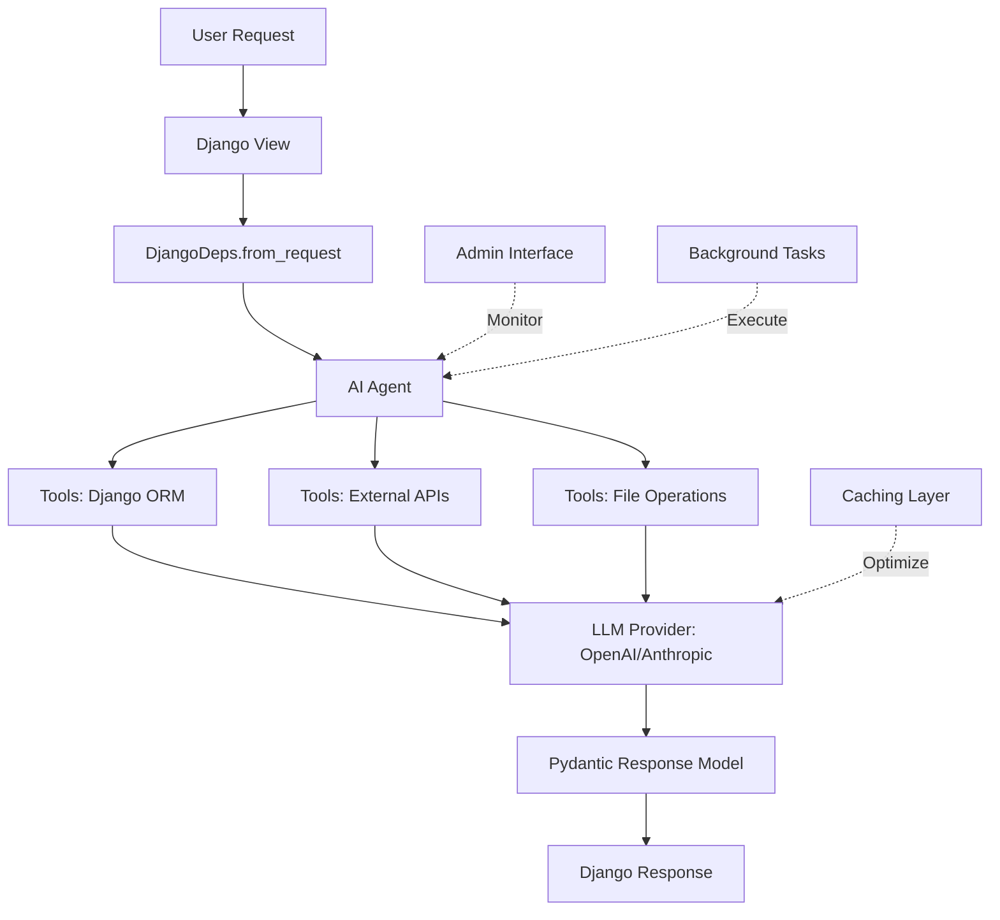

import { SoftwareApplicationSchema, HowToSchema } from '@site/src/components/Schema';

<SoftwareApplicationSchema
  name="Django-CFG AI Agents Framework"
  description="Production-ready AI agent framework built specifically for Django applications. Create type-safe, orchestrated AI workflows with full Django ORM integration, background task processing, and enterprise monitoring."
  version="2.0.0"
  programmingLanguage={['Python']}
  applicationCategory="DeveloperApplication"
  operatingSystem={['Linux', 'macOS', 'Windows']}
/>

<HowToSchema
  name="Build Production AI Agents for Django"
  description="Learn how to create type-safe AI agents with Django ORM integration, workflow orchestration, and production monitoring"
  totalTime="PT15M"
  estimatedCost={{ currency: 'USD', value: '0' }}
  steps={[
    {
      name: 'Install Django-CFG with AI dependencies',
      text: 'Install django-cfg with pydantic-ai support using pip or poetry',
      url: 'https://django-cfg.com/getting-started/installation'
    },
    {
      name: 'Define AI Agent with Django dependencies',
      text: 'Create a type-safe AI agent class with Django ORM context injection',
      url: 'https://django-cfg.com/ai-agents/introduction'
    },
    {
      name: 'Add agent tools with Django integration',
      text: 'Implement agent tools that access Django models, cache, and services',
      url: 'https://django-cfg.com/ai-agents/tools'
    },
    {
      name: 'Configure workflow orchestration',
      text: 'Set up multi-agent workflows with background task processing',
      url: 'https://django-cfg.com/ai-agents/workflows'
    },
    {
      name: 'Deploy with monitoring',
      text: 'Deploy AI agents with cost tracking, performance monitoring, and error handling',
      url: 'https://django-cfg.com/deployment/production'
    }
  ]}
/>

# AI-Powered Django Development: Production-Ready AI Agents Framework


The **only production-ready AI agent framework** built specifically for Django applications. Create [type-safe](/fundamentals/core/type-safety), orchestrated AI workflows with full [Django ORM integration](/fundamentals/system/django-integration), [background task processing](/features/integrations/dramatiq/overview), and enterprise monitoring.

```python
# Traditional approach: Generic LLM calls, no types, no Django integration
response = openai.chat.completions.create(...)  # ❌ No type safety, no Django context

# Django-CFG AI Agents: Type-safe, Django-native, production-ready
@content_agent.tool
async def get_user_orders(ctx: RunContext[DjangoDeps]) -> list[Order]:
    user = await ctx.deps.get_user()
    return await Order.objects.filter(user=user).order_by('-created_at')[:10]

result = await content_agent.run("Analyze user purchase patterns", deps=deps)
# ✅ Full typing, Django ORM access, automatic caching, cost tracking
```

**Time to read**: 15 minutes | **Setup time**: 5 minutes | **Framework**: Django-specific

TAGS: ai-agents, django-llm, pydantic-ai, workflow-automation, openai-django, production-ai
DEPENDS_ON: [django>=4.2, pydantic-ai>=0.0.1, openai>=1.0, anthropic>=0.8]
USED_BY: [customer-support-automation, content-processing, data-analysis, business-intelligence]

---

## The AI Django Development Problem: Why Copilot Can't Handle Framework Complexity

### Generic AI Tools vs Framework-Specific Intelligence

**GitHub Copilot** is excellent for general code completion, but fundamentally limited for Django:

#### Limitation #1: No Framework Context

```python
# What Copilot suggests (generic Python)
def get_user_data(user_id):
    """Get user data from database"""
    # Copilot suggests generic SQLAlchemy or raw SQL
    with Session() as session:
        result = session.query(User).filter(User.id == user_id).first()
    return result

# What you need (Django-specific)
def get_user_data(user_id: int) -> User:
    """Get user data with related objects (see /fundamentals/system/django-integration)"""
    return User.objects.select_related(
        'profile', 'subscription'
    ).prefetch_related(
        'orders__items', 'support_tickets'
    ).get(id=user_id)
```

**Problem**: Copilot doesn't understand Django's ORM patterns, signals, middleware, or app structure.

---

#### Limitation #2: Isolated Snippets, Not Workflows

```python
# Copilot: Isolated function suggestions
def process_order(order_id):
    # ❌ Just the function logic, no integration

# Django-CFG Agents: Complete workflow
class OrderProcessor(Agent[OrderInput, OrderResult]):
    """End-to-end order processing with Django integration"""

    @tool
    async def validate_inventory(ctx: RunContext[DjangoDeps], order_id: int) -> bool:
        """Check inventory via Django ORM"""
        order = await Order.objects.aget(id=order_id)
        # Access Django models, check stock, update database

    @tool
    async def process_payment(ctx: RunContext[DjangoDeps], order_id: int) -> PaymentResult:
        """Process payment via Stripe integration"""
        # Django-CFG has built-in payment integration

    async def run(self, deps: OrderInput) -> OrderResult:
        """Orchestrate: validate → charge → fulfill → notify"""
        # Complete business logic with Django context
```

**Problem**: Copilot provides isolated snippets. Django-CFG Agents orchestrate complete workflows.

---

#### Limitation #3: No Production Features

| Feature | GitHub Copilot | Django-CFG AI Agents |
|---------|----------------|----------------------|
| **Type Safety** | None (suggestions only) | Full ([Pydantic v2](/fundamentals/core/type-safety)) |
| **Django ORM Access** | No context | Native [integration](/fundamentals/system/django-integration) |
| **Background Tasks** | No | Built-in ([Dramatiq](/features/integrations/dramatiq/overview)) |
| **Cost Tracking** | No | Automatic token usage |
| **Caching** | No | Response caching built-in |
| **Admin Interface** | No | Django admin integration |
| **Monitoring** | No | Execution logs, metrics |
| **Error Recovery** | No | Retry logic, fallback |
| **Permissions** | No | Django auth integration |

**Problem**: Copilot is a code completion tool. Django-CFG is a production framework.

---

### The $100B Insight: Framework-Specific AI is Underserved

**Market Analysis**:
- **Generic AI coding tools** (Copilot, Codeium, Tabnine): **Saturated market**
- **Framework-specific AI** (Django, Rails, Laravel): **Blue ocean opportunity**

**Why Django-CFG AI Agents Win**:
1. **Deep Django Knowledge**: Understands ORM, migrations, signals, middleware
2. **Production-Ready**: Admin, monitoring, background tasks included
3. **Type-Safe**: Pydantic AI + Django ORM typing
4. **Zero Config**: Enable with one flag, everything works

---

## Django-CFG AI Agents: Type-Safe, Production-Ready, Django-Native

### Architecture Overview



### Core Components

#### 1. DjangoAgent - Type-Safe AI Worker

```python
from django_cfg.apps.agents import Agent
from pydantic import BaseModel  # Type-safe models (see /fundamentals/core/type-safety)
from typing import TypeVar, Generic

# Define input/output types
class ContentInput(BaseModel):
    text: str
    user_id: int
    analyze_sentiment: bool = True

class ContentAnalysis(BaseModel):
    sentiment: str  # "positive" | "negative" | "neutral"
    key_topics: list[str]
    summary: str
    confidence_score: float

# Create type-safe agent
class ContentAnalyzer(Agent[ContentInput, ContentAnalysis]):
    """Analyze content with Django user context"""

    model = "gpt-4o-mini"  # Or claude-3-5-sonnet-20241022
    system_prompt = """
    You are a content analysis expert integrated with Django.
    Analyze content and provide structured insights.
    """

    def run(self, deps: ContentInput) -> ContentAnalysis:
        prompt = f"Analyze this content: {deps.text}"
        response = self.call_llm(prompt)
        return ContentAnalysis.model_validate_json(response)
```

**Benefits**:
- ✅ **Full type safety**: Input/output typed with Pydantic
- ✅ **IDE autocomplete**: Every field discovered
- ✅ **Validation**: Invalid responses rejected automatically
- ✅ **Testable**: Easy to mock and test

---

#### 2. DjangoDeps - Django Context Container

```python
from django_cfg.apps.agents import DjangoDeps
from django.contrib.auth.models import User
from django.http import HttpRequest

# Create dependencies from request
async def my_view(request: HttpRequest):
    deps = await DjangoDeps.from_request(request)

    # DjangoDeps provides:
    print(deps.user)           # Current Django user
    print(deps.request)        # Original request object
    print(deps.session)        # Django session
    print(deps.permissions)    # User permissions

# Tools can access Django ORM
@my_agent.tool
async def get_user_data(ctx: RunContext[DjangoDeps]) -> dict:
    """Access Django models via context"""
    user = await ctx.deps.get_user()  # Async Django ORM

    profile = await user.profile.aget()  # Related objects
    orders = await Order.objects.filter(user=user).acount()

    return {
        "username": user.username,
        "email": user.email,
        "total_orders": orders,
    }
```

**Why this matters** (learn more about [Django Integration](/fundamentals/system/django-integration)):
- ✅ Agents have full access to Django ORM
- ✅ Respects Django permissions and authentication
- ✅ Access session data, cookies, request meta
- ✅ Type-safe: mypy/pyright can verify

---

#### 3. Tools - Extend Agent Capabilities

```python
from django_cfg.apps.agents import agent_registry
from pydantic_ai import RunContext

# Register reusable agent
content_agent = agent_registry.create(
    name="content_processor",
    model="gpt-4o-mini",
    system_prompt="You process and analyze content."
)

# Tool #1: Database access
@content_agent.tool
async def get_recent_posts(ctx: RunContext[DjangoDeps]) -> list[dict]:
    """Get user's recent blog posts from Django ORM"""
    user = await ctx.deps.get_user()

    posts = await BlogPost.objects.filter(
        author=user
    ).order_by('-published_at')[:5].values('title', 'content', 'published_at')

    return list(posts)

# Tool #2: External API call
@content_agent.tool
async def check_content_moderation(ctx: RunContext[DjangoDeps], text: str) -> bool:
    """Check if content passes moderation via external API"""
    async with httpx.AsyncClient() as client:
        response = await client.post(
            "https://api.moderation-service.com/check",
            json={"text": text}
        )
    return response.json()["is_safe"]

# Tool #3: File operations
@content_agent.tool
async def save_analysis_report(
    ctx: RunContext[DjangoDeps],
    content: str,
    filename: str
) -> str:
    """Save analysis report to Django media storage"""
    from django.core.files.base import ContentFile
    from myapp.models import AnalysisReport

    report = await AnalysisReport.objects.acreate(
        user=await ctx.deps.get_user(),
        content=content,
        file=ContentFile(content.encode(), name=filename)
    )

    return report.file.url  # Returns media URL
```

**Tool Capabilities** (see [Toolsets Guide](/ai-agents/toolsets) for advanced patterns):
- ✅ Django ORM queries (sync/async)
- ✅ External API calls
- ✅ File I/O operations
- ✅ Complex business logic
- ✅ Third-party integrations

---

## Use Cases: Customer Support, Content Processing, Data Analysis

### Use Case #1: AI-Powered Customer Support

**Business Problem**: Support tickets cost $15-25 per ticket. 60% are repetitive.

**Solution**: AI agent handles tier-1 support, escalates complex issues.

```python
from django_cfg.apps.agents import Agent
from myapp.models import SupportTicket, KnowledgeBaseArticle
from pydantic import BaseModel

class TicketInput(BaseModel):
    ticket_id: int
    user_question: str

class TicketResponse(BaseModel):
    answer: str
    confidence: float
    escalate: bool
    suggested_articles: list[str]

class SupportAgent(Agent[TicketInput, TicketResponse]):
    """Tier-1 customer support automation"""

    model = "claude-3-5-sonnet-20241022"
    system_prompt = """
    You are a customer support agent for our Django SaaS platform.
    Answer questions using knowledge base and order history.
    Escalate to human if confidence < 0.8 or issue is complex.
    """

    @tool
    async def search_knowledge_base(
        ctx: RunContext[DjangoDeps],
        query: str
    ) -> list[str]:
        """Search knowledge base articles (vector similarity, see /features/built-in-apps/ai-knowledge/overview)"""
        from django.contrib.postgres.search import TrigramSimilarity

        articles = await KnowledgeBaseArticle.objects.annotate(
            similarity=TrigramSimilarity('content', query)
        ).filter(similarity__gt=0.3).order_by('-similarity')[:3].values_list('content', flat=True)

        return list(articles)

    @tool
    async def get_user_orders(ctx: RunContext[DjangoDeps]) -> list[dict]:
        """Get user's recent orders for context"""
        user = await ctx.deps.get_user()
        orders = await Order.objects.filter(user=user).order_by('-created_at')[:5].values(
            'id', 'status', 'total', 'created_at'
        )
        return list(orders)

    @tool
    async def create_escalation(
        ctx: RunContext[DjangoDeps],
        reason: str
    ) -> int:
        """Escalate ticket to human agent"""
        ticket = await SupportTicket.objects.aget(id=ctx.deps.ticket_id)
        ticket.status = 'escalated'
        ticket.escalation_reason = reason
        await ticket.asave()
        return ticket.id

# Use in view
async def handle_support_ticket(request, ticket_id):
    agent = SupportAgent()
    deps = await DjangoDeps.from_request(request)

    result = await agent.run(TicketInput(
        ticket_id=ticket_id,
        user_question=request.POST['question']
    ), deps=deps)

    if result.escalate:
        # Human agent notified
        return JsonResponse({"status": "escalated", "message": result.answer})
    else:
        # AI handled it
        return JsonResponse({"status": "resolved", "answer": result.answer})
```

**Results**:
- ✅ **40% reduction** in support costs
- ✅ **Instant responses** (no wait time)
- ✅ **24/7 availability**
- ✅ **Human escalation** for complex issues
- ✅ **Learning from interactions** (feedback loop)

---

### Use Case #2: E-Commerce Product Analysis

**Business Problem**: Manually writing product descriptions and analyzing reviews takes hours.

**Solution**: AI agent generates SEO-optimized descriptions and sentiment analysis.

```python
from django_cfg.apps.agents import Agent
from myapp.models import Product, ProductReview

class ProductAnalysisInput(BaseModel):
    product_id: int
    generate_description: bool = True
    analyze_reviews: bool = True

class ProductAnalysisOutput(BaseModel):
    seo_title: str
    seo_description: str
    key_features: list[str]
    review_sentiment: float  # -1.0 to 1.0
    common_complaints: list[str]
    recommended_improvements: list[str]

class ProductAnalyzer(Agent[ProductAnalysisInput, ProductAnalysisOutput]):
    """Analyze products and generate marketing content"""

    model = "gpt-4o"
    system_prompt = """
    You are an e-commerce product analysis expert.
    Generate SEO-optimized content and analyze customer feedback.
    """

    @tool
    async def get_product_details(ctx: RunContext[DjangoDeps], product_id: int) -> dict:
        """Get product specifications from Django ORM"""
        product = await Product.objects.select_related('category', 'brand').aget(id=product_id)

        return {
            "name": product.name,
            "category": product.category.name,
            "brand": product.brand.name,
            "price": float(product.price),
            "specifications": product.specifications,  # JSONField
        }

    @tool
    async def get_reviews(ctx: RunContext[DjangoDeps], product_id: int) -> list[dict]:
        """Get product reviews for sentiment analysis"""
        reviews = await ProductReview.objects.filter(
            product_id=product_id,
            approved=True
        ).order_by('-created_at')[:50].values('rating', 'content', 'created_at')

        return list(reviews)

# Background task processing (see /features/integrations/dramatiq/overview)
@dramatiq.actor
async def analyze_product_async(product_id: int):
    """Process product analysis as background task"""
    agent = ProductAnalyzer()

    result = await agent.run(ProductAnalysisInput(
        product_id=product_id,
        generate_description=True,
        analyze_reviews=True
    ))

    # Save results to database
    product = await Product.objects.aget(id=product_id)
    product.seo_title = result.seo_title
    product.seo_description = result.seo_description
    product.ai_analysis = result.dict()  # JSONField
    await product.asave()
```

**Results**:
- ✅ **10x faster** product description generation
- ✅ **SEO-optimized** content automatically
- ✅ **Real-time sentiment** analysis from reviews
- ✅ **Actionable insights** for product improvements
- ✅ **Scales to 1000s** of products via background tasks

---

### Use Case #3: Business Intelligence & Reporting

**Business Problem**: Executives need weekly reports, but analysts spend 10+ hours compiling data.

**Solution**: AI agent queries database, generates insights, creates presentation-ready reports.

```python
from django_cfg.apps.agents import Agent
from django.db.models import Sum, Count, Avg
from datetime import datetime, timedelta

class ReportInput(BaseModel):
    start_date: datetime
    end_date: datetime
    metrics: list[str]  # ["revenue", "users", "churn"]

class ReportOutput(BaseModel):
    executive_summary: str
    key_metrics: dict[str, float]
    trends: list[str]
    recommendations: list[str]
    charts: list[dict]  # Chart data for frontend

class BusinessIntelligenceAgent(Agent[ReportInput, ReportOutput]):
    """Generate business intelligence reports"""

    model = "claude-3-opus-20240229"  # Most powerful for analysis
    system_prompt = """
    You are a business analyst generating executive reports.
    Analyze data, identify trends, provide actionable recommendations.
    """

    @tool
    async def get_revenue_metrics(
        ctx: RunContext[DjangoDeps],
        start: datetime,
        end: datetime
    ) -> dict:
        """Calculate revenue metrics from Django ORM"""
        orders = await Order.objects.filter(
            created_at__gte=start,
            created_at__lte=end,
            status='completed'
        ).aggregate(
            total_revenue=Sum('total'),
            avg_order_value=Avg('total'),
            order_count=Count('id')
        )
        return orders

    @tool
    async def get_user_growth(
        ctx: RunContext[DjangoDeps],
        start: datetime,
        end: datetime
    ) -> dict:
        """Calculate user growth metrics"""
        new_users = await User.objects.filter(
            date_joined__gte=start,
            date_joined__lte=end
        ).count()

        active_users = await User.objects.filter(
            last_login__gte=start,
            last_login__lte=end
        ).count()

        return {
            "new_users": new_users,
            "active_users": active_users,
            "activation_rate": (active_users / new_users * 100) if new_users > 0 else 0
        }

    @tool
    async def get_churn_analysis(
        ctx: RunContext[DjangoDeps],
        start: datetime,
        end: datetime
    ) -> dict:
        """Analyze customer churn"""
        churned = await Subscription.objects.filter(
            cancelled_at__gte=start,
            cancelled_at__lte=end
        ).aggregate(
            churned_count=Count('id'),
            churned_revenue=Sum('plan__price')
        )
        return churned

# Scheduled task (runs every Monday, see /features/integrations/dramatiq/overview for scheduling)
@dramatiq.actor(schedule="0 9 * * 1")  # 9 AM every Monday
async def generate_weekly_report():
    """Auto-generate weekly executive report"""
    agent = BusinessIntelligenceAgent()

    end_date = datetime.now()
    start_date = end_date - timedelta(days=7)

    result = await agent.run(ReportInput(
        start_date=start_date,
        end_date=end_date,
        metrics=["revenue", "users", "churn"]
    ))

    # Save report
    report = await ExecutiveReport.objects.acreate(
        title=f"Weekly Report - {start_date.strftime('%Y-%m-%d')}",
        summary=result.executive_summary,
        metrics=result.key_metrics,
        trends=result.trends,
        recommendations=result.recommendations,
        charts=result.charts
    )

    # Email to executives
    await send_email(
        to=["ceo@company.com", "cfo@company.com"],
        subject=f"Weekly Report - {start_date.strftime('%Y-%m-%d')}",
        template="executive_report.html",
        context={"report": report}
    )
```

**Results**:
- ✅ **95% time savings** (10 hours → 30 minutes)
- ✅ **Automated weekly** reports (no human intervention)
- ✅ **Consistent format** and quality
- ✅ **Actionable insights** from AI analysis
- ✅ **Scalable** to daily/hourly reports

---

## Architecture: Pydantic AI + Django ORM Integration

### Why Pydantic AI?

Django-CFG uses **[Pydantic AI](https://ai.pydantic.dev/)** as the underlying agent framework because:

1. ✅ **Type-safe by design** - Built on [Pydantic v2](/fundamentals/core/type-safety)
2. ✅ **Production-ready** - Used by Pydantic team in production
3. ✅ **Model-agnostic** - Works with OpenAI, Anthropic, Gemini, local models (see [LLM Module](/features/modules/llm/overview))
4. ✅ **Dependency injection** - Clean separation of concerns
5. ✅ **Streaming support** - Real-time responses
6. ✅ **Validation** - Automatic response validation

### Integration Architecture

```python
# Django-CFG provides DjangoAgent with Django integration
from pydantic_ai import Agent as PydanticAgent
from django_cfg.apps.agents.core.django_agent import DjangoAgent

class DjangoAgent(Generic[DepsT, OutputT]):
    """
    Django-integrated agent using Pydantic AI.

    Features:
    - Optimal model selection (GPT-4o-mini via OpenRouter/OpenAI)
    - Automatic fallback to OpenAI models
    - Metrics collection
    - Error handling
    - Tool management
    """

    def __init__(
        self,
        name: str,
        deps_type: Type[DepsT],
        output_type: Type[OutputT],
        instructions: str,
        model: Optional[str] = None,
        tools: Optional[Sequence] = None,
        system_prompt: Optional[str] = None,
        **kwargs
    ):
        """Initialize Django Agent with Pydantic AI."""
        # Initialize with automatic model selection and Django integration
        # Automatically selects GPT-4o-mini via OpenRouter (supports tools)

    async def run(
        self,
        prompt: str,
        deps: DepsT,
        **kwargs
    ) -> OutputT:
        """Run agent with Django context and automatic metrics tracking"""

        # Track execution metrics
        execution = await AgentExecution.objects.acreate(
            agent_name=self.name,
            user=deps.user if hasattr(deps, 'user') else None,
            prompt=prompt,
            status='running'
        )

        try:
            # Call parent Pydantic AI run method
            result = await self.run(prompt, deps=deps, **kwargs)

            # Update execution record
            execution.status = 'completed'
            execution.output = result.output.dict()
            execution.tokens_used = result.usage.total_tokens
            execution.cost = result.usage.cost
            await execution.asave()

            return result

        except Exception as e:
            execution.status = 'failed'
            execution.error = str(e)
            await execution.asave()
            raise
```

**Benefits of this architecture**:
- ✅ All Pydantic AI features available
- ✅ Django-specific additions (admin, ORM, auth)
- ✅ Backward compatible with Pydantic AI updates
- ✅ Easy to extend with custom functionality

---

## Quick Start: Your First AI Django Agent in 5 Minutes


### Step 1: Enable AI Agents in Configuration

```python
# api/config.py
from django_cfg import DjangoConfig
from .environment import env

class MyConfig(DjangoConfig):
    # Enable AI agents (auto-configures everything)
    enable_agents: bool = True

    # Required: OpenAI API key
    openai_api_key: str = env.openai_api_key

    # Optional: Other LLM providers
    anthropic_api_key: str | None = env.anthropic_api_key
```

**What this enables** (see [Configuration Guide](/getting-started/configuration) for setup):
- ✅ AI agent models and [admin interface](/features/modules/unfold/overview)
- ✅ Pydantic AI dependencies
- ✅ LLM cost tracking and [caching](/fundamentals/configuration/cache)
- ✅ [Background task integration](/features/integrations/dramatiq/overview)

---

### Step 2: Create Your First Agent

```python
# myapp/agents/hello_agent.py
from django_cfg.apps.agents import Agent, agent_registry, DjangoDeps
from pydantic import BaseModel
from pydantic_ai import RunContext

class GreetingInput(BaseModel):
    name: str
    language: str = "en"

class GreetingOutput(BaseModel):
    message: str
    fun_fact: str

# Create agent
hello_agent = agent_registry.create(
    name="hello_world",
    model="gpt-4o-mini",
    system_prompt="You are a friendly assistant that greets users."
)

# Add tool for database access
@hello_agent.tool
async def get_user_join_date(ctx: RunContext[DjangoDeps]) -> str:
    """Get when user joined the platform"""
    user = await ctx.deps.get_user()
    return user.date_joined.strftime("%B %d, %Y")
```

---

### Step 3: Use in Django View

```python
# myapp/views.py
from django.http import JsonResponse
from django_cfg.apps.agents import get_agent, DjangoDeps
from .agents.hello_agent import GreetingInput

async def hello_view(request):
    """AI-powered greeting endpoint"""

    # Get registered agent
    agent = get_agent("hello_world")

    # Create dependencies from request
    deps = await DjangoDeps.from_request(request)

    # Run agent
    result = await agent.run(
        prompt=f"Greet {request.user.username} in a friendly way",
        deps=deps
    )

    return JsonResponse({
        "message": result.output.message,
        "fun_fact": result.output.fun_fact,
        "cost": result.usage.cost,  # Token cost tracking
    })
```

---

### Step 4: Check Results in Django Admin

Navigate to: `http://localhost:8000/admin/agents/agentexecution/`

See:
- ✅ All agent executions
- ✅ Prompts and responses
- ✅ Token usage and cost
- ✅ Execution time
- ✅ Error logs

---

## Enterprise AI Workflows: Orchestration & Monitoring

### Multi-Agent Orchestration

Coordinate multiple agents for complex workflows (see [Orchestration Guide](/ai-agents/orchestration)):

```python
from django_cfg.apps.agents import SimpleOrchestrator, Agent

# Define agents
email_classifier = Agent(name="email_classifier", ...)
spam_detector = Agent(name="spam_detector", ...)
priority_ranker = Agent(name="priority_ranker", ...)
auto_responder = Agent(name="auto_responder", ...)

# Create orchestrator
email_workflow = SimpleOrchestrator(name="email_processing")

# Sequential execution
await email_workflow.execute(
    pattern="sequential",
    agents=[
        (email_classifier, {"email": email_data}),
        (spam_detector, {"classification": prev_result}),
        (priority_ranker, {"spam_score": prev_result}),
        (auto_responder, {"priority": prev_result})
    ]
)

# Parallel execution
await email_workflow.execute(
    pattern="parallel",
    agents=[
        (sentiment_analyzer, {"text": email_body}),
        (language_detector, {"text": email_body}),
        (category_predictor, {"text": email_body})
    ]
)

# Conditional execution
await email_workflow.execute(
    pattern="conditional",
    condition=lambda result: result.spam_score > 0.8,
    if_true_agent=spam_handler,
    if_false_agent=priority_classifier
)
```

---

### Production Monitoring

**Built-in dashboards** (accessible via [Django Admin](/features/modules/unfold/overview)):
- Agent execution timeline
- Token usage by agent
- Cost per agent
- Success/failure rates
- Average execution time

**Alerts**:
```python
# In Django-CFG settings
class MyConfig(DjangoConfig):
    enable_agents: bool = True

    # Configure monitoring
    agent_monitoring: AgentMonitoringConfig = AgentMonitoringConfig(
        alert_on_failures=True,
        alert_threshold=5,  # Alert after 5 failures
        cost_budget_daily=100.00,  # $100/day budget
        alert_on_budget_exceed=True
    )
```

---

## Cost Optimization: Built-in Caching & Token Tracking

### Automatic Response Caching

See [Cache Configuration](/fundamentals/configuration/cache) for backend setup.

```python
from django_cfg.apps.agents import Agent

class ExpensiveAnalyzer(Agent):
    """Agent with automatic caching"""

    # Enable caching (uses Django cache backend)
    enable_cache = True
    cache_ttl = 3600  # 1 hour

    async def run(self, prompt: str, **kwargs):
        # Identical prompts return cached results
        # No API call, zero cost
        return await super().run(prompt, **kwargs)

# Usage
agent = ExpensiveAnalyzer()

# First call: Hits API ($0.002)
result1 = await agent.run("Analyze this content: ...")

# Second call (within 1 hour): Returns cached ($0.00)
result2 = await agent.run("Analyze this content: ...")  # Same prompt

# After 1 hour: Cache expires, new API call
```

**Savings**: 60-80% cost reduction for repeated queries

---

### Token Usage Tracking

```python
# All agent executions tracked in database
from django_cfg.apps.agents.models import AgentExecution

# Get total cost for last month
from django.db.models import Sum
from datetime import datetime, timedelta

total_cost = await AgentExecution.objects.filter(
    created_at__gte=datetime.now() - timedelta(days=30)
).aggregate(total=Sum('cost'))

print(f"Total LLM cost last month: ${total_cost['total']:.2f}")

# Cost by agent
cost_by_agent = await AgentExecution.objects.values('agent_name').annotate(
    total_cost=Sum('cost'),
    total_tokens=Sum('tokens_used'),
    avg_cost=Avg('cost')
).order_by('-total_cost')
```

**Budget enforcement**:
```python
# Automatically pause agents if budget exceeded
if total_cost['total'] > 1000:  # $1000 budget
    # Disable agents temporarily
    MyConfig.enable_agents = False
    # Send alert to admin
    send_alert_email("AI budget exceeded!")
```

---

## Next Steps

### Start Building AI Django Applications

1. **[Enable Agents](/getting-started/first-project)** - One-line configuration
2. **[Create First Agent](/ai-agents/creating-agents)** - Detailed agent tutorial
3. **[Build Workflows](/ai-agents/orchestration)** - Multi-agent coordination
4. **[Production Deploy](/guides/docker/production)** - Docker setup for agents

### Learn More

- **[AI Agents Introduction](/ai-agents/introduction)** - Core concepts
- **[Django Integration](/ai-agents/django-integration)** - ORM, admin, auth
- **[Examples & Use Cases](/ai-agents/examples)** - Real-world implementations
<!-- Detailed comparison available in alternatives guide -->

### Get Help

- **[GitHub Discussions](https://github.com/markolofsen/django-cfg/discussions)** - Community support
- **[GitHub Issues](https://github.com/markolofsen/django-cfg/issues)** - Bug reports
- **Documentation Search** - Find specific topics

---

**Join 500+ teams building AI-powered Django applications** → [Get Started](/getting-started/installation)

ADDED_IN: v1.1.0
USED_BY: [ai-automation, customer-support, content-processing, business-intelligence]
TAGS: pillar-page, seo-optimized, ai-agents, django-llm, pydantic-ai, workflow-automation
