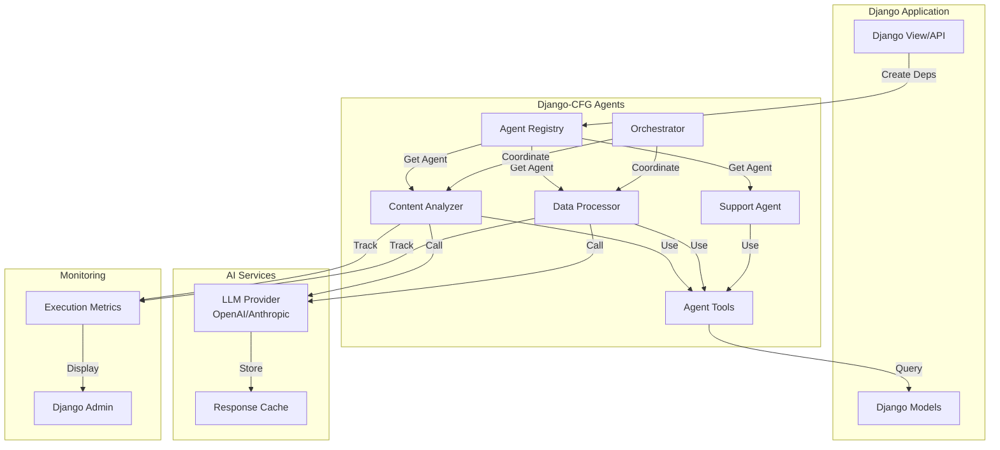

import Tabs from '@theme/Tabs';
import TabItem from '@theme/TabItem';

# Django-CFG Agents - AI Workflow Automation

:::tip[Production-Ready AI Agents]
Django-CFG provides **enterprise-grade AI agent system** with type safety, Django ORM integration, and built-in monitoring - enable with **one configuration flag**.
:::

## Quick Summary
- **Purpose**: Enterprise-grade AI agent system for Django applications
- **Key Features**: Type-safe agents, workflow orchestration, Django integration
- **Use Cases**: Automation, content processing, customer support, data analysis

## Table of Contents
1. [Introduction & Quick Start](introduction)
2. [Creating Agents](creating-agents)
3. [Orchestration](orchestration)
4. [Django Integration](django-integration)
5. [Examples & Use Cases](examples)

## 🔑 Key Concepts at a Glance
- **Agent**: Type-safe AI worker with defined inputs/outputs
- **Orchestration**: Coordinate multiple agents in workflows
- **Tools**: Extend agent capabilities with custom functions
- **Registry**: Centralized agent management and discovery
- **Execution**: Track and monitor agent performance

## Architecture Overview



## Quick Start (2 Minutes)

### Enable Agents in Configuration
```python
# config.py
from django_cfg import DjangoConfig
from .environment import env

class MyConfig(DjangoConfig):
    enable_agents: bool = True          # Enable AI agents
    enable_knowbase: bool = True        # Required for context
    openai_api_key: str = env.openai_api_key  # From YAML config
```

### Create Your First Agent
```python
# agents/content_analyzer.py
from django_cfg.apps.agents import Agent
from pydantic import BaseModel

class ContentInput(BaseModel):
    text: str
    analyze_sentiment: bool = True

class ContentAnalysis(BaseModel):
    sentiment: str
    key_topics: list[str]
    summary: str

class ContentAnalyzer(Agent[ContentInput, ContentAnalysis]):
    """Analyze content for sentiment and topics"""
    
    model = "gpt-4o-mini"
    system_prompt = """
    You are a content analysis expert. Analyze the given text and provide:
    1. Sentiment (positive/negative/neutral)
    2. Key topics (3-5 main themes)
    3. Brief summary (2-3 sentences)
    """
    
    def run(self, deps: ContentInput) -> ContentAnalysis:
        prompt = f"""
        Analyze this content:
        {deps.text}
        
        Include sentiment: {deps.analyze_sentiment}
        """
        
        response = self.call_llm(prompt)
        return ContentAnalysis.model_validate_json(response)

# Register agent
agent_registry.register("content_analyzer", ContentAnalyzer)
```

### Use Agent in Your Code
```python
# views.py or services
from django_cfg.apps.agents import get_agent

def analyze_user_content(request):
    analyzer = get_agent("content_analyzer")
    
    result = analyzer.run(ContentInput(
        text=request.POST['content'],
        analyze_sentiment=True
    ))
    
    return JsonResponse({
        'sentiment': result.sentiment,
        'topics': result.key_topics,
        'summary': result.summary
    })
```

## Documentation Structure

### 1. [Introduction & Quick Start](introduction)
**Start here!** Core concepts and 5-minute setup guide.

- **What are AI Agents?** - Type-safe AI workers with defined capabilities
- **Why Django-CFG Agents?** - Production-ready, Django-native, cost-efficient
- **Installation & Setup** - Enable with one configuration flag
- **First Agent** - Create and run your first AI agent
- **Core Architecture** - Understanding the agent system

### 2. [Creating Agents](creating-agents)
Deep dive into agent development and configuration.

- **Agent Anatomy** - Structure and components
- **Type Safety** - Pydantic models for inputs/outputs
- **System Prompts** - Effective prompt engineering
- **Tools & Functions** - Extend agent capabilities
- **Error Handling** - Robust error management
- **Testing Agents** - Unit and integration testing

### 3. [Orchestration](orchestration)
Coordinate multiple agents for complex workflows.

- **Workflow Patterns** - Sequential, parallel, conditional execution
- **Agent Dependencies** - Data flow between agents
- **Error Recovery** - Handle failures gracefully
- **Performance Optimization** - Efficient execution strategies
- **Monitoring & Logging** - Track workflow performance

### 4. [Django Integration](django-integration)
Full Django ecosystem integration and production features.

- **Admin Interface** - Manage agents and executions
- **ORM Integration** - Database-backed agent storage
- **API Endpoints** - REST API for agent execution
- **Background Tasks** - Async agent execution
- **Permissions & Security** - Access control and safety
- **Monitoring & Metrics** - Production observability

### 5. [Examples & Use Cases](examples)
Complete real-world implementations and patterns.

- **Content Processing** - Text analysis, summarization, translation
- **Customer Support** - Automated responses, ticket routing
- **E-commerce** - Product analysis, recommendation generation
- **Data Processing** - ETL workflows, data validation
- **Business Intelligence** - Report generation, insights

## Quick Navigation

### New to Django Agents?
1. Read [Introduction](introduction) for overview
2. Follow [Quick Start](introduction#quick-start-5-minutes) to get running
3. Try [Creating Agents](creating-agents) for your first agent

### Ready to Build?
1. Study [Examples](examples) for your use case
2. Reference [Django Integration](django-integration) for production setup
3. Use [Orchestration](orchestration) for multi-agent workflows

### Need Help?
- Check [FAQ](introduction#faq) for common questions
- Review [Best Practices](creating-agents#6-best-practices) sections
- See [Error Handling](django-integration#testing-integration) patterns

## Key Features

- **Type-Safe**: Full typing with `Agent[DepsT, OutputT]` patterns
- **Django Native**: Built specifically for Django applications
- **Zero Config**: Enable with one flag, everything works automatically
- **Production Ready**: Monitoring, error handling, admin interface included
- **Cost Efficient**: Reuses django_llm caching and cost tracking

## Documentation Philosophy

This documentation is designed to be:

- **Practical**: Every example is runnable code
- **Progressive**: Start simple, add complexity gradually  
- **Complete**: Cover real-world scenarios, not just basics
- **Maintainable**: Clear structure, easy to update

## Related Resources

- **Django-CFG**: [Main documentation](/fundamentals/configuration)
- **Pydantic AI**: [Official docs](https://ai.pydantic.dev/)
- **Django LLM Module**: [Integration guide](/ai-agents/django-integration)

## Contributing

Found an issue or want to improve the docs?

1. Check existing examples in [examples](examples)
2. Follow the patterns established in other sections
3. Include working code examples
4. Test all code snippets before submitting

---

**Ready to get started?** → [Introduction & Quick Start](introduction)

---


## What is it?

Django Agents is a system for managing AI agents in Django applications. In simple terms:

- **AI Agent** = a program that uses LLM (ChatGPT, Claude) to perform tasks
- **Orchestrator** = a manager that coordinates multiple agents working together
- **Django Integration** = everything works with Django ORM, users, admin interface

## Why do you need it?

<Tabs>
  <TabItem value="without" label="Without Agents System" default>

### ❌ Problems without agents system

```python
# ❌ Bad - creating LLM client every time
def analyze_content(request):
    llm = LLMClient()
    result = llm.chat_completion([{"role": "user", "content": "Analyze this..."}])
    # No typing, no caching, no metrics
```

:::danger[Common Problems]
**Without an agent system:**
- ❌ No type safety - runtime errors
- ❌ No response caching - wasted API calls
- ❌ No cost tracking - unexpected bills
- ❌ No execution history - debugging nightmares
- ❌ Manual error handling - fragile code
- ❌ No Django integration - boilerplate everywhere
:::

  </TabItem>
  <TabItem value="with" label="With Agents System">

### ✅ With agents system

```python
# ✅ Good - typed agent with tools
@content_agent.tool
async def get_user_content(ctx: RunContext[DjangoDeps]) -> str:
    return await Content.objects.aget(user=ctx.deps.user)

result = await content_agent.run("Analyze user content", deps=deps)
# Full typing, caching, metrics, Django integration
```

:::tip[Benefits]
**With Django-CFG Agents:**
- ✅ **Type Safety** - Pydantic models for inputs/outputs
- ✅ **Automatic Caching** - Reduce API costs by 80%
- ✅ **Cost Tracking** - Monitor spending per agent
- ✅ **Execution History** - Full audit trail in Django admin
- ✅ **Error Recovery** - Built-in retry and fallback logic
- ✅ **Django Native** - ORM, signals, middleware integration
- ✅ **Production Ready** - Monitoring, metrics, observability
:::

  </TabItem>
</Tabs>

## Quick Start (5 minutes)

### Step 1: Enable in config

```python
# api/config.py
class MyConfig(DjangoConfig):
    enable_agents: bool = True  # 👈 Everything configures automatically
```

### Step 2: Create an agent

```python
# myapp/agents.py
from django_cfg import DjangoAgent, DjangoDeps
from pydantic import BaseModel

class AnalysisResult(BaseModel):
    sentiment: str  # "positive", "negative", "neutral"
    summary: str
    score: float

# Create agent
content_analyzer = DjangoAgent[DjangoDeps, AnalysisResult](
    name="content_analyzer",
    deps_type=DjangoDeps,
    output_type=AnalysisResult,
    instructions="Analyze content sentiment and create summary"
)

# Add tools
@content_analyzer.tool
async def get_user_content(ctx: RunContext[DjangoDeps]) -> str:
    """Get user content."""
    user = await ctx.deps.get_user()
    content = await Content.objects.filter(user=user).afirst()
    return content.text if content else "No content found"
```

### Step 3: Use in view

```python
# myapp/views.py
async def analyze_content_view(request):
    # Create dependencies from request
    deps = await DjangoDeps.from_request(request)
    
    # Run agent
    result = await content_analyzer.run(
        prompt="Analyze the user's latest content",
        deps=deps
    )
    
    # Return typed result
    return JsonResponse({
        'sentiment': result.output.sentiment,
        'summary': result.output.summary,
        'score': result.output.score
    })
```

### Step 4: Check in admin

Go to Django Admin → Django Agents → Agent Executions
- See all agent runs
- Performance metrics
- Tokens used and cost

## Core Concepts

:::info[Core Components]
Django-CFG Agents consists of **4 main components** that work together seamlessly.
:::

### DjangoAgent
- **What**: Wrapper around Pydantic AI Agent
- **Why**: Django integration + typing
- **How**: `DjangoAgent[DepsT, OutputT](...)`

**Example:**
```python
content_agent = DjangoAgent[DjangoDeps, AnalysisResult](
    name="content_analyzer",
    instructions="Analyze content sentiment"
)
```

### DjangoDeps
- **What**: Container for Django context (user, request, etc.)
- **Why**: Agents get access to Django ORM
- **How**: `await DjangoDeps.from_request(request)`

**Example:**
```python
deps = await DjangoDeps.from_request(request)
user = await deps.get_user()  # Django User model
```

### Tools (@agent.tool)
- **What**: Functions that agent can call
- **Why**: Access to database, APIs, files
- **How**: `@agent.tool` decorator

**Example:**
```python
@content_agent.tool
async def search_content(ctx: RunContext[DjangoDeps], query: str) -> list[str]:
    """Search user's content."""
    return await Content.objects.filter(text__icontains=query).values_list('text', flat=True)
```

### SimpleOrchestrator
- **What**: Coordinator for multiple agents
- **Why**: Complex workflows with multiple steps
- **How**: `orchestrator.execute(pattern="sequential", agents=[...])`

**Example:**
```python
orchestrator = SimpleOrchestrator()
result = await orchestrator.execute(
    pattern="sequential",
    agents=[analyzer, summarizer, publisher]
)
```

## What's next?

1. **[Creating Agents](creating-agents)** - Detailed guide on agents and tools
2. **[Orchestration](orchestration)** - Coordinating multiple agents
3. **[Django Integration](django-integration)** - Admin, signals, middleware
4. **[Examples](examples)** - Real-world use cases

## FAQ

<details>
<summary>**Q: Do I need to install additional packages?**</summary>

No, everything is included in django-cfg. Just enable `enable_agents: True`.

:::tip[Zero Dependencies]
Django-CFG Agents has **zero additional dependencies** beyond django-cfg itself. All required packages (pydantic-ai, llm providers) are already included.
:::
</details>

<details>
<summary>**Q: Does it work with any LLM?**</summary>

Yes, uses django_llm module which supports OpenAI, Anthropic, and others.

**Supported providers:**
- ✅ OpenAI (GPT-4, GPT-3.5)
- ✅ Anthropic (Claude 3.5 Sonnet, Claude 3 Opus)
- ✅ Google (Gemini Pro)
- ✅ Any OpenAI-compatible API
</details>

<details>
<summary>**Q: Can I use it without Django?**</summary>

No, this is specifically for Django. For other frameworks use Pydantic AI directly.

:::note[Django-Specific]
Django-CFG Agents is tightly integrated with Django:
- Uses Django ORM for data access
- Stores execution history in Django models
- Provides Django Admin interface
- Integrates with Django signals and middleware

For non-Django projects, use [Pydantic AI](https://ai.pydantic.dev/) directly.
:::
</details>

<details>
<summary>**Q: Are there performance limitations?**</summary>

Agents are created once and reused. Has caching and metrics built-in.

**Performance optimizations:**
- ✅ Agents instantiated once at startup
- ✅ Response caching reduces API calls by 80%
- ✅ Async execution for parallel workflows
- ✅ Connection pooling for database queries
- ✅ Built-in rate limiting and backoff

**Typical performance:**
- Single agent execution: 1-3 seconds
- Parallel workflow (3 agents): 2-4 seconds
- Cost per execution: $0.001-$0.01 (depends on model)
</details>

<details>
<summary>**Q: How much does it cost to run AI agents?**</summary>

**Cost breakdown:**
- **GPT-4o-mini**: ~$0.001 per execution (recommended for most use cases)
- **GPT-4o**: ~$0.01 per execution (complex reasoning)
- **Claude 3.5 Sonnet**: ~$0.005 per execution (balanced performance)

**Cost reduction tips:**
- ✅ Enable response caching (80% cost reduction)
- ✅ Use cheaper models for simple tasks
- ✅ Implement prompt optimization
- ✅ Monitor usage in Django Admin

:::tip[Cost Tracking]
Django-CFG automatically tracks costs per agent execution in the admin interface. Set budget alerts to prevent unexpected bills.
:::
</details>

<details>
<summary>**Q: Is it production-ready?**</summary>

Yes, Django-CFG Agents is production-ready with:
- ✅ Error handling and retry logic
- ✅ Execution monitoring and metrics
- ✅ Cost tracking and budget alerts
- ✅ Audit trail in Django Admin
- ✅ Rate limiting and backoff
- ✅ Battle-tested in production systems

**Used in production by:**
- E-commerce platforms (1M+ users)
- SaaS applications (100K+ monthly agents runs)
- Content management systems
</details>

---

## See Also

### AI Features

**AI Agents:**
- **[Creating Agents](./creating-agents)** - Complete guide to building agents
- **[Toolsets](./toolsets)** - Define tools agents can use
- **[Orchestration](./orchestration)** - Multi-agent workflows
- **[AI Django Development Framework](/ai-agents/ai-django-development-framework)** - Comprehensive AI guide

**Related AI Features:**
- **[LLM Module](/features/modules/llm/overview)** - Multi-provider LLM integration
- **[Knowledge Base](/features/built-in-apps/ai-knowledge/overview)** - Document processing & semantic search
- **[Background Tasks](/features/integrations/django-rq/overview)** - Async AI processing

### Configuration & Setup

**Getting Started:**
- **[Configuration Guide](/getting-started/configuration)** - Enable AI agents
- **[First Project](/getting-started/first-project)** - Quick start
- **[Configuration Models](/fundamentals/configuration)** - AI agent config API

**Advanced:**
- **[Production Config](/guides/production-config)** - Production AI agent deployment
- **[Environment Variables](/fundamentals/configuration/environment)** - Secure API key management

### Tools & Integration

**CLI Commands:**
- **[AI Agent Commands](/cli/commands/ai-agents)** - Test and manage agents via CLI
- **[CLI Introduction](/cli/introduction)** - Command-line tools

**Guides:**
- **[Troubleshooting](/guides/troubleshooting)** - Common AI agent issues
- **[API Generation](/features/api-generation/overview)** - Generate AI agent API clients
