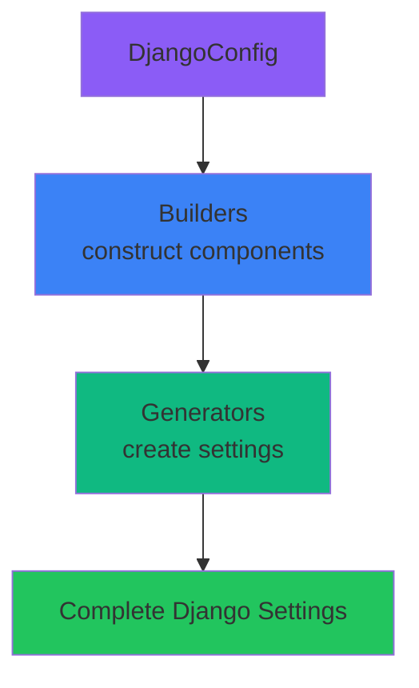

# Builder Pattern in Django-CFG

The Builder Pattern is a core architectural pattern in Django-CFG that separates the construction of complex configuration objects from their representation.

## Overview

Django-CFG uses dedicated builder classes to construct different parts of Django settings from configuration models. This approach provides:

- **Single Responsibility:** Each builder focuses on one aspect of settings
- **Testability:** Builders can be tested independently
- **Extensibility:** Easy to add custom builders
- **Maintainability:** Changes isolated to specific builders

## Core Builders

### InstalledAppsBuilder

Builds the `INSTALLED_APPS` list from your `DjangoConfig`.

**Location:** `django_cfg.core.builders.apps_builder`

**Responsibilities:**
- Combine default Django apps with third-party apps
- Add django-cfg apps based on feature flags
- Handle special ordering requirements
- Auto-enable dependencies
- Remove duplicates while preserving order

**Example:**

```python
from django_cfg.core.builders import InstalledAppsBuilder

# Inside ConfigService
builder = InstalledAppsBuilder(config)
apps = builder.build()
```

**Key Features:**

1. **Accounts Before Admin:** Automatically inserts `django_cfg.apps.accounts` before `django.contrib.admin` for proper migration order

2. **Auto-Enable Tasks:** Automatically adds `django_rearq` when knowbase or agents are enabled

### MiddlewareBuilder

Builds the `MIDDLEWARE` list from your `DjangoConfig`.

**Location:** `django_cfg.core.builders.middleware_builder`

**Responsibilities:**
- Start with Django's default middleware stack
- Insert CORS middleware at correct position
- Add feature-specific middleware
- Add custom user middleware
- Maintain proper ordering

**Example:**

```python
from django_cfg.core.builders import MiddlewareBuilder

builder = MiddlewareBuilder(config)
middleware = builder.build()
```

**Key Features:**

1. **Smart CORS Insertion:** Places CORS middleware after WhiteNoise but before Session
   ```python
   [
       "whitenoise.middleware.WhiteNoiseMiddleware",
       "corsheaders.middleware.CorsMiddleware",  # ← Inserted here
       "django.contrib.sessions.middleware.SessionMiddleware",
       ...
   ]
   ```

2. **Feature Middleware:** Automatically adds middleware for enabled features
   - `UserActivityMiddleware` when accounts enabled
   - Payment middleware when payments configured

### SecurityBuilder

Builds security-related settings like `ALLOWED_HOSTS`.

**Location:** `django_cfg.core.builders.security_builder`

**Responsibilities:**
- Generate `ALLOWED_HOSTS` from `security_domains`
- Add localhost in development
- Handle wildcard domains
- Auto-add www subdomains

**Example:**

```python
from django_cfg.core.builders import SecurityBuilder

builder = SecurityBuilder(config)
allowed_hosts = builder.build_allowed_hosts()
```

**Key Features:**

1. **Environment-Aware Defaults:**
   ```python
   # Development
   security_domains = []
   → ALLOWED_HOSTS = ["localhost", "127.0.0.1", "[::1]"]

   # Production with domains
   security_domains = ["example.com"]
   → ALLOWED_HOSTS = ["example.com", "www.example.com"]
   ```

2. **Production Warning:** Issues warning if no domains configured in production

## Usage Pattern

### Direct Usage

```python
from django_cfg import DjangoConfig
from django_cfg.core.builders import InstalledAppsBuilder

config = DjangoConfig(project_name="MyProject", ...)
builder = InstalledAppsBuilder(config)
apps = builder.build()
```

### Through ConfigService

The recommended approach is through `ConfigService`:

```python
from django_cfg import DjangoConfig

config = DjangoConfig(project_name="MyProject", ...)

# ConfigService automatically uses builders
apps = config.get_installed_apps()  # Uses InstalledAppsBuilder internally
middleware = config.get_middleware()  # Uses MiddlewareBuilder internally
hosts = config.get_allowed_hosts()  # Uses SecurityBuilder internally
```

## Creating Custom Builders

You can create custom builders for your own configuration needs:

```python
from typing import List, TYPE_CHECKING

if TYPE_CHECKING:
    from django_cfg.core.base.config_model import DjangoConfig


class CustomSettingsBuilder:
    """Build custom settings from config."""

    def __init__(self, config: "DjangoConfig"):
        self.config = config

    def build(self) -> dict:
        """Build custom settings."""
        settings = {}

        # Your custom logic here
        if self.config.is_production:
            settings["CUSTOM_FEATURE"] = True

        return settings
```

## Integration with Generators

Builders feed into generators:



Example:

```python
# Builder creates INSTALLED_APPS list
apps_builder = InstalledAppsBuilder(config)
installed_apps = apps_builder.build()

# Generator uses the list in settings
settings = {
    "INSTALLED_APPS": installed_apps,
    ...
}
```

## Testing Builders

Builders are designed to be easily testable:

```python
import pytest
from django_cfg import DjangoConfig
from django_cfg.core.builders import InstalledAppsBuilder


def test_installed_apps_includes_accounts_before_admin():
    config = DjangoConfig(
        project_name="Test",
        secret_key="x" * 50,
        enable_accounts=True,
        databases={"default": {...}},
    )

    builder = InstalledAppsBuilder(config)
    apps = builder.build()

    accounts_index = apps.index("django_cfg.apps.accounts")
    admin_index = apps.index("django.contrib.admin")

    assert accounts_index < admin_index, "Accounts must come before admin"


def test_tasks_auto_enabled_with_knowbase():
    config = DjangoConfig(
        project_name="Test",
        secret_key="x" * 50,
        enable_knowbase=True,
        databases={"default": {...}},
    )

    builder = InstalledAppsBuilder(config)
    apps = builder.build()

    assert "django_rearq" in apps
    assert "django_cfg.apps.tasks" in apps
```

## Best Practices

### 1. Single Responsibility
Each builder should focus on one aspect of configuration:
- ✅ `InstalledAppsBuilder` - only builds apps list
- ✅ `MiddlewareBuilder` - only builds middleware list
- ❌ Don't mix concerns

### 2. Immutability
Builders should not modify the config:
```python
# ✅ Good - read from config
if self.config.enable_accounts:
    apps.append("django_cfg.apps.accounts")

# ❌ Bad - don't modify config
self.config.enable_accounts = True
```

### 3. Deterministic Output
Same config should always produce same output:
```python
# ✅ Good - deterministic
apps = ["app1", "app2", "app3"]

# ❌ Bad - random or time-dependent
import random
apps = random.sample(all_apps, 5)
```

### 4. Error Handling
Provide clear error messages:
```python
if not self.config.databases:
    raise ConfigurationError(
        "At least one database must be configured",
        suggestions=["Add a 'default' database"],
    )
```

## Comparison with Other Patterns

### Builder vs Factory

**Builder Pattern (Django-CFG):**
- Constructs complex objects step-by-step
- Same builder can create different representations
- Focuses on HOW to build

**Factory Pattern:**
- Creates objects in one step
- Different factories for different types
- Focuses on WHAT to build

### Builder vs Template Method

**Builder (Django-CFG):**
- Multiple classes for different aspects
- Composition over inheritance
- More flexible

**Template Method:**
- Single class with hooks
- Inheritance-based
- More rigid structure

## See Also

- [Generator Pattern](../generator-pattern) - How builders feed into generators
- [Architecture](../../fundamentals/core/architecture) - Overall system architecture
- [Configuration](../../fundamentals/configuration) - Configuration model reference
