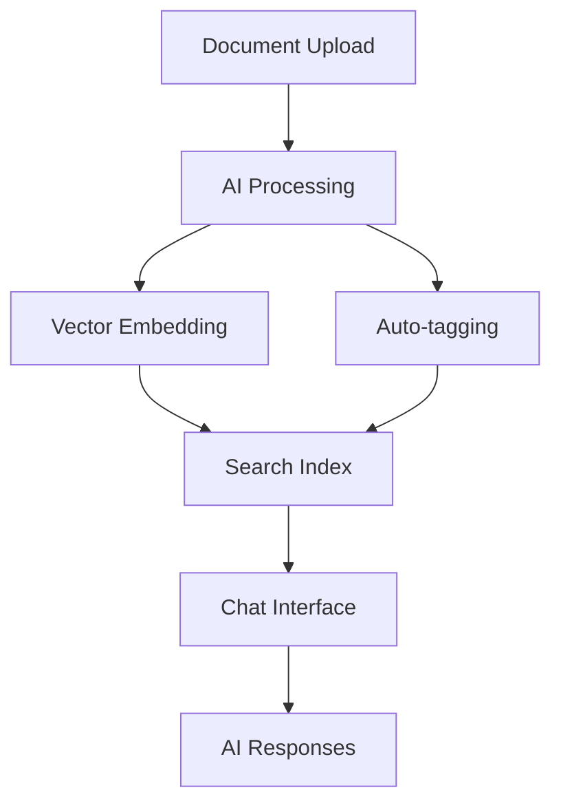

import { TechArticleSchema } from '@site/src/components/Schema';
import Tabs from '@theme/Tabs';
import TabItem from '@theme/TabItem';

<TechArticleSchema
  headline="AI & Knowledge Apps: Semantic Search and AI Agents for Django"
  description="Production-ready AI and knowledge base apps for Django-CFG with document processing, vector search, AI chat interface, and intelligent content management"
  keywords={['django AI knowledge base', 'django semantic search', 'django vector database', 'django AI agents', 'chromadb django integration']}
/>

# AI & Knowledge Apps Overview

AI & Knowledge apps provide intelligent data processing, knowledge management, and AI agent capabilities for your Django-CFG projects.

## 🧠 Knowledge Base App

**Intelligent document processing and semantic search**

- **📄 Document Processing** - PDF, Word, text file ingestion
- **🔍 Semantic Search** - Vector-based similarity search
- **💬 AI Chat Interface** - Natural language queries
- **🏷️ Auto-tagging** - AI-powered content categorization
- **📊 Analytics** - Search patterns and content insights

### Key Features

```python
# Document ingestion and search
from django_cfg.apps.knowbase import DocumentManager, ChatInterface

# Add documents
manager = DocumentManager()
document = manager.add_document(
    file_path="manual.pdf",
    title="User Manual v2.1",
    tags=["documentation", "help"]
)

# AI-powered search
chat = ChatInterface()
response = chat.query("How do I reset my password?")
print(response.answer)  # AI-generated answer with sources
```

### Knowledge Base Components

#### **Setup & Configuration**
- Document upload and processing
- Vector embedding configuration  
- Search index optimization
- Content categorization

#### 💬 **Chat & Search**
- Natural language queries
- Contextual AI responses
- Source attribution
- Search result ranking

#### **Data Integration**
- Multi-format document support
- External data source connections
- API integrations
- Real-time synchronization

---

## AI Agents App

**Autonomous AI agents for task automation**

- **🎯 Custom Agents** - Build domain-specific AI assistants
- **🔧 Tool Integration** - Connect agents to external APIs
- **🔄 Multi-step Workflows** - Complex task orchestration
- **📊 Performance Tracking** - Agent effectiveness metrics
- **🛡️ Safety Controls** - Output validation and filtering

### Key Features

```python
# Create and deploy AI agents
from django_cfg.apps.agents import AgentBuilder, AgentOrchestrator

# Build custom agent
agent = AgentBuilder()
    .with_model("gpt-4")
    .with_tools(["web_search", "email_send", "database_query"])
    .with_prompt("You are a customer service assistant...")
    .build()

# Deploy agent
orchestrator = AgentOrchestrator()
result = orchestrator.process_request(
    agent=agent,
    request="Help customer with billing question",
    context={"customer_id": 123}
)
```

---

## Integration Patterns

### Knowledge-Powered Agents

```python
# Combine knowledge base with AI agents
from django_cfg.apps.knowbase import KnowledgeRetriever
from django_cfg.apps.agents import KnowledgeAgent

# Agent with knowledge base access
kb_agent = KnowledgeAgent(
    knowledge_base="company_docs",
    model="gpt-4",
    max_sources=5
)

# Query with context
response = kb_agent.query(
    question="What's our refund policy?",
    user_context={"customer_tier": "premium"}
)
```

### Smart Document Processing



## Analytics & Insights

### Knowledge Usage Tracking

```python
# Track popular content and search patterns
from django_cfg.apps.knowbase import SearchAnalytics

analytics = SearchAnalytics()

# Popular queries
popular_queries = analytics.get_popular_queries(days=30)

# Content gaps
content_gaps = analytics.identify_content_gaps()

# User engagement
engagement = analytics.get_engagement_metrics()
```

### Agent Performance

```python
# Monitor agent effectiveness
from django_cfg.apps.agents import AgentMetrics

metrics = AgentMetrics()

# Success rates
success_rate = metrics.get_success_rate(agent_id="customer_service")

# Response quality
quality_scores = metrics.get_quality_scores(days=7)

# Cost analysis
cost_breakdown = metrics.get_cost_analysis()
```

## Use Cases

<Tabs groupId="use-cases">
  <TabItem value="support" label="Customer Support" default>

### Customer Support Automation

**AI-powered support with knowledge base access**

```python
# Setup support agent with knowledge base
support_agent = KnowledgeAgent(
    name="Support Bot",
    knowledge_base="support_docs",
    tools=["ticket_create", "escalate_to_human", "knowledge_search"]
)

# Handle customer queries automatically
response = support_agent.handle_query(
    query="My payment failed, what should I do?",
    customer_context={
        "tier": "premium",
        "last_payment": "2024-01-15",
        "order_id": "ORD-12345"
    }
)

# Response includes:
# - AI-generated answer
# - Relevant knowledge base articles
# - Suggested actions
# - Escalation trigger if needed
```

:::tip[Support Automation Benefits]
**Key advantages:**
- ✅ **24/7 Availability** - Instant responses any time
- ✅ **Consistent Quality** - Same high-quality answers every time
- ✅ **Knowledge Access** - Searches entire support documentation
- ✅ **Smart Escalation** - Automatically escalates complex issues
- ✅ **Cost Reduction** - Handles 70-80% of common queries

**Best for:**
- FAQ handling
- Order status inquiries
- Account management
- Troubleshooting guides
:::

  </TabItem>
  <TabItem value="docs" label="Documentation Assistant">

### Technical Documentation Assistant

**Developer-focused documentation helper**

```python
# Setup developer documentation agent
dev_agent = KnowledgeAgent(
    name="Dev Assistant",
    knowledge_base="api_docs",
    tools=["code_search", "example_generate", "api_lookup"]
)

# Answer technical questions
answer = dev_agent.query(
    question="How do I authenticate API requests?",
    context={
        "language": "python",
        "framework": "django",
        "version": "4.2"
    }
)

# Generate code examples
code_example = dev_agent.generate_example(
    task="Create authenticated API request",
    language="python"
)
```

:::info[Developer Assistant Features]
**Capabilities:**
- 🔍 **Smart Search** - Finds relevant API documentation
- 💻 **Code Generation** - Creates working code examples
- 📝 **Explanation** - Explains complex concepts simply
- 🔗 **Cross-references** - Links related documentation
- ⚡ **Quick Answers** - Faster than manual search

**Use cases:**
- API integration help
- SDK usage examples
- Best practices lookup
- Troubleshooting guides
- Migration documentation
:::

  </TabItem>
  <TabItem value="content" label="Content Creation">

### Content Creation & Curation

**AI-powered content generation assistant**

```python
# Setup content creation agent
content_agent = AgentBuilder()
    .with_model("gpt-4")
    .with_tools(["research", "fact_check", "style_guide"])
    .with_knowledge_base("brand_guidelines")
    .build()

# Generate branded content
article = content_agent.create_content(
    topic="Product Launch",
    style="professional",
    length="1000_words",
    tone="enthusiastic",
    keywords=["innovation", "enterprise", "scalability"]
)

# Content curation
curated = content_agent.curate_content(
    sources=["blog_posts", "news_articles"],
    theme="AI in Enterprise",
    target_audience="C-level executives"
)
```

:::warning[Content Quality Assurance]
**Important considerations:**
- ⚠️ **Fact-checking required** - Always verify AI-generated facts
- ⚠️ **Brand voice** - Review for brand consistency
- ⚠️ **Plagiarism check** - Ensure originality
- ⚠️ **Human review** - Final editorial review recommended

**Best practices:**
- Use as first draft, not final copy
- Provide detailed brand guidelines
- Include fact-checking in workflow
- Maintain human oversight
:::

  </TabItem>
  <TabItem value="research" label="Research & Analysis">

### Research & Analysis Assistant

**Intelligent data analysis and research automation**

```python
# Setup research agent
research_agent = AgentBuilder()
    .with_model("gpt-4")
    .with_tools(["web_search", "data_analysis", "citation_tracker"])
    .with_knowledge_base("research_papers")
    .build()

# Conduct research
research = research_agent.research_topic(
    topic="AI in Healthcare",
    depth="comprehensive",
    sources=["academic", "industry", "news"],
    timeframe="last_2_years"
)

# Generate research summary
summary = research_agent.summarize_findings(
    findings=research,
    format="executive_summary",
    length=500,
    include_citations=True
)

# Identify trends
trends = research_agent.analyze_trends(
    data=research,
    metrics=["growth", "adoption", "innovation"]
)
```

:::tip[Research Automation Benefits]
**Advantages:**
- ✅ **Speed** - Hours of research in minutes
- ✅ **Comprehensive** - Covers multiple sources
- ✅ **Citations** - Automatic source tracking
- ✅ **Trend Analysis** - Identifies patterns
- ✅ **Summaries** - Executive-level insights

**Perfect for:**
- Market research
- Competitive analysis
- Literature reviews
- Trend identification
- Strategic planning
:::

  </TabItem>
  <TabItem value="ecommerce" label="E-Commerce Assistant">

### E-Commerce Product Assistant

**Smart product recommendations and customer engagement**

```python
# Setup e-commerce agent
shop_agent = KnowledgeAgent(
    name="Shopping Assistant",
    knowledge_base="product_catalog",
    tools=["inventory_check", "price_compare", "recommendation_engine"]
)

# Product recommendations
recommendations = shop_agent.recommend_products(
    customer_query="I need a laptop for video editing",
    budget_range=(1000, 2000),
    preferences={
        "brand_preference": "none",
        "must_have": ["16GB RAM", "dedicated GPU"],
        "nice_to_have": ["lightweight", "long battery"]
    }
)

# Answer product questions
answer = shop_agent.answer_question(
    product_id="LAPTOP-123",
    question="Can this laptop run Adobe Premiere Pro smoothly?",
    customer_context={"use_case": "4K video editing"}
)

# Size/fit guidance
size_guide = shop_agent.provide_sizing_help(
    product_id="SHIRT-456",
    customer_measurements={"height": 180, "weight": 75}
)
```

:::info[E-Commerce Features]
**Capabilities:**
- 🛒 **Smart Recommendations** - Personalized product suggestions
- ❓ **Product Q&A** - Answers specific product questions
- 📏 **Size Guidance** - Helps with size/fit decisions
- 💰 **Price Comparison** - Finds best deals
- 🔔 **Stock Alerts** - Notifies when items available

**Benefits:**
- Increase conversion rates
- Reduce returns (better sizing)
- Improve customer satisfaction
- 24/7 shopping assistance
- Personalized experience
:::

  </TabItem>
</Tabs>

## Configuration

### Knowledge Base Setup

```python
# config.py
class MyProjectConfig(DjangoConfig):
    # Enable knowledge base
    enable_knowbase: bool = True
    
    # AI configuration
    openai_api_key: str = env.openai.api_key
    embedding_model: str = "text-embedding-ada-002"
    chat_model: str = "gpt-4"
```

### Agent Configuration

```python
# Enable AI agents
enable_agents: bool = True

# Agent safety settings
agent_safety: AgentSafetyConfig = AgentSafetyConfig(
    max_tokens=4000,
    temperature=0.7,
    content_filter=True,
    output_validation=True
)
```

## Security & Safety

### Content Filtering
- **Input Validation** - Sanitize user queries
- **Output Filtering** - Check AI responses for appropriateness
- **Rate Limiting** - Prevent API abuse
- **Access Control** - User-based permissions

### Data Privacy
- **Local Processing** - Option for on-premise deployment
- **Data Encryption** - End-to-end encryption for sensitive content
- **Audit Logging** - Complete interaction logging
- **Compliance** - GDPR, SOC2 compliance features

## See Also

### AI & Knowledge Features

**Knowledge Base:**
- **[Knowledge Base Setup](./knowbase-setup)** - Getting started guide
- **[Knowledge Base Configuration](./knowbase-configuration)** - Advanced configuration
- **[Data Integration](./knowbase-data-integration)** - Connecting data sources
- **[Chat & Search](./knowbase-chat-search)** - Search interface guide

**AI Agents:**
- **[AI Agents Introduction](/ai-agents/introduction)** - AI agent development
- **[AI Django Framework](/ai-agents/ai-django-development-framework)** - Complete AI framework
- **[Creating Agents](/ai-agents/creating-agents)** - Build custom agents
- **[Agent Orchestration](/ai-agents/orchestration)** - Multi-agent workflows

**LLM Integration:**
- **[LLM Module](/features/modules/llm/overview)** - Multi-provider LLM integration

### Configuration & Setup

**Getting Started:**
- **[Configuration Guide](/getting-started/configuration)** - Enable AI apps
- **[First Project](/getting-started/first-project)** - Quick start tutorial
- **[Built-in Apps Overview](/features/built-in-apps/overview)** - All available apps

**Advanced:**
- **[Configuration Models](/fundamentals/configuration)** - AI apps config API
- **[Type-Safe Configuration](/fundamentals/core/type-safety)** - Pydantic patterns
- **[Environment Variables](/fundamentals/configuration/environment)** - API key management

### Tools & Deployment

**Background Processing:**
- **[Dramatiq Integration](/features/integrations/dramatiq/overview)** - Async document processing
- **[Background Tasks](/features/built-in-apps/operations/tasks)** - Task management

**CLI & Deployment:**
- **[CLI Commands](/cli/introduction)** - AI command-line tools
- **[Production Config](/guides/production-config)** - Production AI setup
- **[Troubleshooting](/guides/troubleshooting)** - Common AI issues

AI & Knowledge apps bring intelligent automation to your Django applications! 🤖
