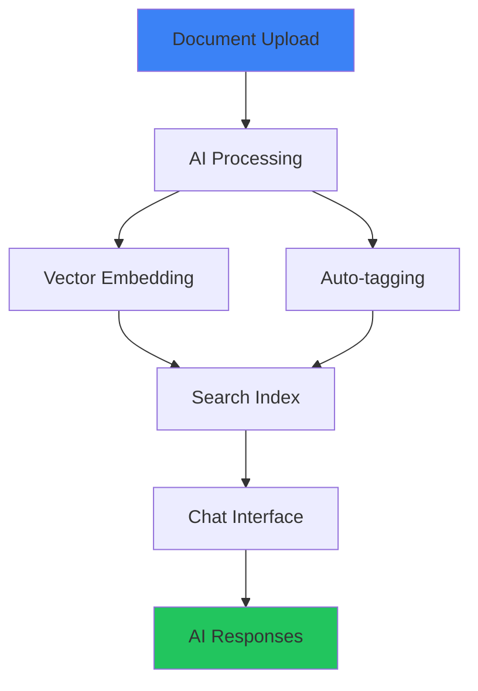

# AI & Knowledge Extensions

AI & Knowledge extensions provide intelligent data processing, knowledge management, and AI agent capabilities for your Django-CFG projects.

<Callout type="info">
**These are [Extensions](/docs/extensions)**
Located in `extensions/apps/` folder. Enable/disable via `__cfg__.py` files.
</Callout>

## Extensions Overview

| Extension | Location | Description |
|-----------|----------|-------------|
| **Knowbase** | `extensions/apps/knowbase/` | Document processing, semantic search, AI chat |
| **Agents** | `extensions/apps/agents/` | Custom AI assistants with tool integration |

---

## Knowbase Extension

**Intelligent document processing and semantic search**

- **📄 Document Processing** - PDF, Word, text file ingestion
- **🔍 Semantic Search** - Vector-based similarity search
- **💬 AI Chat Interface** - Natural language queries
- **🏷️ Auto-tagging** - AI-powered content categorization
- **📊 Analytics** - Search patterns and content insights

### Configuration

```python
# extensions/apps/knowbase/__cfg__.py
from django_cfg.extensions.configs.apps.knowbase import BaseKnowbaseSettings

class KnowbaseSettings(BaseKnowbaseSettings):
    llm_provider: str = "openai"
    openai_api_key: str = env.openai.api_key
    embedding_model: str = "text-embedding-3-small"
    chat_model: str = "gpt-4"

settings = KnowbaseSettings()
```

### Usage

```python
# Document ingestion and search
from extensions.apps.knowbase.services import DocumentManager, ChatInterface

# Add documents
manager = DocumentManager()
document = manager.add_document(
    file_path="manual.pdf",
    title="User Manual v2.1",
    tags=["documentation", "help"]
)

# AI-powered search
chat = ChatInterface()
response = chat.query("How do I reset my password?")
print(response.answer)  # AI-generated answer with sources
```

### Knowledge Base Components

- **Setup & Configuration** - Document upload, vector embeddings, search index
- **Chat & Search** - Natural language queries, contextual AI responses
- **Data Integration** - Multi-format support, external sources, APIs

---

## Agents Extension

**Autonomous AI agents for task automation**

- **🎯 Custom Agents** - Build domain-specific AI assistants
- **🔧 Tool Integration** - Connect agents to external APIs
- **🔄 Multi-step Workflows** - Complex task orchestration
- **📊 Performance Tracking** - Agent effectiveness metrics
- **🛡️ Safety Controls** - Output validation and filtering

### Configuration

```python
# extensions/apps/agents/__cfg__.py
from django_cfg.extensions.configs.apps.agents import BaseAgentsSettings

class AgentsSettings(BaseAgentsSettings):
    default_model: str = "gpt-4"
    max_tokens: int = 4000
    temperature: float = 0.7
    content_filter: bool = True

settings = AgentsSettings()
```

### Usage

```python
# Create and deploy AI agents
from extensions.apps.agents.builder import AgentBuilder
from extensions.apps.agents.orchestrator import AgentOrchestrator

# Build custom agent
agent = AgentBuilder() \
    .with_model("gpt-4") \
    .with_tools(["web_search", "email_send", "database_query"]) \
    .with_prompt("You are a customer service assistant...") \
    .build()

# Deploy agent
orchestrator = AgentOrchestrator()
result = orchestrator.process_request(
    agent=agent,
    request="Help customer with billing question",
    context={"customer_id": 123}
)
```

---

## Integration Patterns

### Knowledge-Powered Agents

```python
# Combine knowledge base with AI agents
from extensions.apps.knowbase.retriever import KnowledgeRetriever
from extensions.apps.agents.knowledge_agent import KnowledgeAgent

# Agent with knowledge base access
kb_agent = KnowledgeAgent(
    knowledge_base="company_docs",
    model="gpt-4",
    max_sources=5
)

# Query with context
response = kb_agent.query(
    question="What's our refund policy?",
    user_context={"customer_tier": "premium"}
)
```

### Smart Document Processing



---

## Enable/Disable Extensions

Each extension is controlled by its `__cfg__.py` file:

```python
# To ENABLE - define settings
settings = KnowbaseSettings()

# To DISABLE - comment out settings
# settings = KnowbaseSettings()
```

---

## Use Cases

### Customer Support Automation

```python
from extensions.apps.agents.knowledge_agent import KnowledgeAgent

support_agent = KnowledgeAgent(
    name="Support Bot",
    knowledge_base="support_docs",
    tools=["ticket_create", "escalate_to_human", "knowledge_search"]
)

response = support_agent.handle_query(
    query="My payment failed, what should I do?",
    customer_context={"tier": "premium", "order_id": "ORD-12345"}
)
```

### Documentation Assistant

```python
dev_agent = KnowledgeAgent(
    name="Dev Assistant",
    knowledge_base="api_docs",
    tools=["code_search", "example_generate", "api_lookup"]
)

answer = dev_agent.query(
    question="How do I authenticate API requests?",
    context={"language": "python", "framework": "django"}
)
```

### E-Commerce Product Assistant

```python
shop_agent = KnowledgeAgent(
    name="Shopping Assistant",
    knowledge_base="product_catalog",
    tools=["inventory_check", "price_compare", "recommendation_engine"]
)

recommendations = shop_agent.recommend_products(
    customer_query="I need a laptop for video editing",
    budget_range=(1000, 2000)
)
```

---

## Analytics & Insights

### Knowledge Usage Tracking

```python
from extensions.apps.knowbase.analytics import SearchAnalytics

analytics = SearchAnalytics()

# Popular queries
popular_queries = analytics.get_popular_queries(days=30)

# Content gaps
content_gaps = analytics.identify_content_gaps()

# User engagement
engagement = analytics.get_engagement_metrics()
```

### Agent Performance

```python
from extensions.apps.agents.metrics import AgentMetrics

metrics = AgentMetrics()

# Success rates
success_rate = metrics.get_success_rate(agent_id="customer_service")

# Response quality
quality_scores = metrics.get_quality_scores(days=7)

# Cost analysis
cost_breakdown = metrics.get_cost_analysis()
```

---

## Security & Safety

### Content Filtering

- **Input Validation** - Sanitize user queries
- **Output Filtering** - Check AI responses for appropriateness
- **Rate Limiting** - Prevent API abuse (see [Rate Limiting](/docs/fundamentals/system/rate-limiting))
- **Access Control** - User-based permissions

### Data Privacy

- **Local Processing** - Option for on-premise deployment
- **Data Encryption** - End-to-end encryption for sensitive content
- **Audit Logging** - Complete interaction logging
- **Compliance** - GDPR, SOC2 compliance features

---

## See Also

### Extension Documentation

- **[Knowledge Base Setup](../knowbase-setup)** - Getting started guide
- **[Knowledge Base Configuration](../knowbase-configuration)** - Advanced configuration
- **[Data Integration](../knowbase-data-integration)** - Connecting data sources
- **[Chat & Search](../knowbase-chat-search)** - Search interface guide

### Related Extensions

- **[User Management](/docs/features/built-in-apps/user-management/overview)** - Customer data for personalization
- **[Support](/docs/features/built-in-apps/user-management/support)** - AI-enhanced ticketing
- **[Payments](/docs/features/built-in-apps/payments/overview)** - Billing context for agents

### Configuration & Setup

- **[Extensions System](/docs/extensions)** - How extensions work
- **[Backend Extensions](/docs/extensions/backend-extensions)** - Creating custom extensions
- **[LLM Module](/docs/features/modules/llm/overview)** - Multi-provider LLM integration
- **[Background Tasks](/docs/features/integrations/django-rq/overview)** - Async document processing
