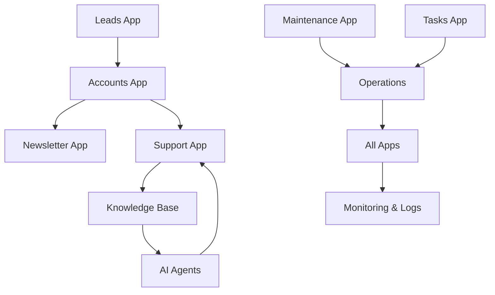

import { TechArticleSchema } from '@site/src/components/Schema';
import Tabs from '@theme/Tabs';
import TabItem from '@theme/TabItem';

<TechArticleSchema
  headline="Django-CFG Built-in Apps: Production-Ready Features Out of the Box"
  description="Comprehensive overview of Django-CFG built-in applications including user management, payments, AI knowledge base, and operational tools for enterprise Django development"
  keywords={['django built-in apps', 'enterprise django features', 'ready-made django apps', 'django-cfg modules', 'production django tools']}
/>

# Built-in Apps Overview

Django-CFG comes with a comprehensive suite of ready-to-use applications, organized into three main categories for easy navigation and understanding. All apps feature [type-safe configuration](/fundamentals/core/type-safety) and seamless [Django integration](/fundamentals/system/django-integration).

## Application Categories

<Tabs groupId="app-categories">
  <TabItem value="user" label="👥 User Management" default>

### Complete Customer Lifecycle Management

Handle authentication, lead generation, customer support, and communication:

**Core Features:**
- **🔐 Accounts** - User authentication, profiles, phone verification
- **📊 Leads** - Lead capture, tracking, and conversion
- **🎧 Support** - Ticketing system, live chat, knowledge base
- **📧 Newsletter** - Email marketing and subscriber management

**Use Cases:**
- SaaS user registration and onboarding
- Lead generation and marketing automation
- Customer support and help desk
- Email campaigns and newsletters

[**Explore User Management →**](./user-management/overview)

  </TabItem>
  <TabItem value="ai" label="🤖 AI & Knowledge">

### Intelligent Data Processing and Automation

Leverage AI for knowledge management and automation (see [AI Agents Framework](/ai-agents/ai-django-development-framework)):

**Core Features:**
- **🧠 Knowledge Base** - Document processing, semantic search, AI chat
- **🤖 [AI Agents](/ai-agents/introduction)** - Custom AI assistants with tool integration
- **🔍 Smart Search** - Vector-based similarity search
- **💬 Natural Language** - Chat interfaces and query processing

**Use Cases:**
- AI-powered customer support
- Document knowledge base with semantic search
- Automated content processing
- Intelligent chatbots and assistants

[**Explore AI & Knowledge →**](./ai-knowledge/overview)

  </TabItem>
  <TabItem value="ops" label="⚙️ Operations">

### Site Maintenance and Background Processing

Operational tools for reliable service delivery (powered by [Django-RQ](/features/integrations/django-rq/overview)):

**Core Features:**
- **🔧 Maintenance** - Cloudflare site maintenance with Page Rules (simplified!)
- **🔄 Tasks** - Asynchronous [background job processing](/features/integrations/django-rq/overview)
- **📊 Monitoring** - System health and performance tracking
- **🤖 Automation** - Operational workflow automation

**Use Cases:**
- Scheduled site maintenance
- Background job processing
- System health monitoring
- Automated operational workflows

[**Explore Operations →**](./operations/overview)

  </TabItem>
</Tabs>

## Quick Start Guide

### 1. **Enable Apps in Configuration**

```python
# config.py (see /getting-started/configuration for complete setup)
from django_cfg import DjangoConfig, TaskConfig

class MyProjectConfig(DjangoConfig):
    # User Management (see /features/built-in-apps/user-management/overview)
    enable_accounts: bool = True
    enable_leads: bool = True
    enable_support: bool = True
    enable_newsletter: bool = True

    # AI & Knowledge (see /ai-agents/introduction)
    enable_knowbase: bool = True
    enable_agents: bool = True

    # Operations (see /features/integrations/django-rq/overview)
    enable_maintenance: bool = True
    tasks: TaskConfig | None = TaskConfig()  # Background task processing
```

### 2. **Run Migrations**

```bash
python manage.py migrate
```

### 3. **Access Admin Interface**

See [Unfold Admin](/features/modules/unfold/overview) for modern admin interface.

```bash
# Navigate to Django admin
http://localhost:8000/admin/

# Each app has its own admin section:
# - /admin/accounts/
# - /admin/leads/  
# - /admin/support/
# - /admin/maintenance/
# etc.
```

## Inter-App Integration

### Complete Customer Journey

```python
# 1. Lead Capture (Leads App)
lead = Lead.objects.create(
    email="prospect@example.com",
    source="website_form"
)

# 2. Account Creation (Accounts App)
user = UserRegistrationService().convert_lead_to_user(lead)

# 3. Newsletter Subscription (Newsletter App)
Subscriber.objects.create(email=user.email, user=user)

# 4. AI-Powered Support (Support + Knowledge Base)
if user.needs_help():
    # Create support ticket
    ticket = Ticket.objects.create(
        customer=user,
        subject="Getting Started"
    )
    
    # AI agent handles initial response using knowledge base
    ai_response = KnowledgeAgent().handle_ticket(ticket)
```

### Data Flow Between Apps



## Feature Comparison

| Feature | User Management | AI & Knowledge | Operations |
|---------|----------------|----------------|------------|
| **User Auth** | ✅ Accounts | ❌ | ❌ |
| **Lead Gen** | ✅ Leads | ❌ | ❌ |
| **Support** | ✅ Support | ✅ AI-Enhanced | ❌ |
| **Email** | ✅ Newsletter | ❌ | ❌ |
| **AI Chat** | ❌ | ✅ Knowledge Base | ❌ |
| **Automation** | ❌ | ✅ AI Agents | ✅ Tasks |
| **Site Ops** | ❌ | ❌ | ✅ Maintenance |
| **Monitoring** | ❌ | ✅ Analytics | ✅ System Health |

## Common Use Cases

<Tabs groupId="use-cases">
  <TabItem value="saas" label="💼 SaaS Application" default>

### Complete SaaS Stack

```python
# config.py
class SaaSConfig(DjangoConfig):
    # User Management
    enable_accounts: bool = True      # User registration/login
    enable_leads: bool = True          # Marketing funnel
    enable_newsletter: bool = True     # Email campaigns
    enable_support: bool = True        # Customer service

    # AI & Knowledge
    enable_knowbase: bool = True       # Help documentation
    enable_agents: bool = True         # AI assistants

    # Operations
    enable_maintenance: bool = True    # Site reliability
    tasks: TaskConfig = TaskConfig()   # Background processing
```

**Perfect for:** SaaS platforms, subscription services, customer-facing applications, and marketing-driven businesses.

  </TabItem>
  <TabItem value="ecommerce" label="🛒 E-Commerce Platform">

### E-Commerce Focused Setup

```python
# config.py
class EcommerceConfig(DjangoConfig):
    # User Management
    enable_accounts: bool = True       # Customer accounts
    enable_leads: bool = True          # Prospect tracking
    enable_support: bool = True        # Order support

    # Operations
    enable_maintenance: bool = True    # Site uptime
    tasks: TaskConfig = TaskConfig()   # Order processing

    # Optional AI
    enable_knowbase: bool = False      # Product knowledge
    enable_agents: bool = False        # Shopping assistants
```

**Perfect for:** Online stores, marketplaces, product catalogs, and order management systems.

  </TabItem>
  <TabItem value="ai" label="🤖 AI-Powered Service">

### AI/ML Focused Setup

```python
# config.py
class AIServiceConfig(DjangoConfig):
    # AI & Knowledge (Primary Focus)
    enable_knowbase: bool = True       # Training data
    enable_agents: bool = True         # AI assistants

    # User Management
    enable_accounts: bool = True       # User management
    enable_support: bool = True        # AI support

    # Operations
    enable_maintenance: bool = True    # Service reliability
    tasks: TaskConfig = TaskConfig()   # ML processing
```

**Perfect for:** AI/ML services, chatbot platforms, document processing services, and intelligent automation.

  </TabItem>
</Tabs>

## Configuration Examples

### Development Setup

```python
# config.dev.py
class DevConfig(DjangoConfig):
    # Enable all apps for development
    enable_accounts: bool = True
    enable_leads: bool = True
    enable_support: bool = True
    enable_newsletter: bool = True
    enable_knowbase: bool = True
    enable_agents: bool = True
    enable_maintenance: bool = True
    tasks: TaskConfig | None = TaskConfig()  # Background tasks

    # Development settings
    debug: bool = True
    database_url: str = "sqlite:///dev.db"
```

### Production Setup

```python
# config.prod.py  
class ProdConfig(DjangoConfig):
    # Essential apps only
    enable_accounts: bool = True
    enable_support: bool = True
    enable_maintenance: bool = True
    tasks: TaskConfig | None = TaskConfig()  # Background tasks

    # Optional based on needs
    enable_leads: bool = env.marketing.enabled
    enable_newsletter: bool = env.marketing.enabled
    enable_knowbase: bool = env.ai.enabled
    enable_agents: bool = env.ai.enabled
    
    # Production settings
    debug: bool = False
    database_url: str = env.database.url
```

## Security & Performance

### Built-in Security Features
- **🔒 Authentication** - Secure user authentication with 2FA support
- **Input Validation** - Pydantic-based input validation
- **🔐 Data Encryption** - Sensitive data encryption at rest
- **📝 Audit Logging** - Complete operation audit trails
- **🚦 Rate Limiting** - API and operation rate limiting

### Performance Optimizations
- **Async Processing** - Background task processing
- **🗄️ Caching** - Built-in caching for frequent operations
- **📊 Connection Pooling** - Database connection optimization
- **🔄 Lazy Loading** - On-demand module loading
- **📈 Monitoring** - Performance tracking and alerting

## Learning Path

### 1. **Start with Basics**
- [**User Management**](./user-management/overview) - Authentication and user lifecycle
- [**Operations**](./operations/overview) - Site maintenance and reliability

### 2. **Add Intelligence**
- [**AI & Knowledge**](./ai-knowledge/overview) - Smart features and automation

### 3. **Advanced Integration**
- [**Configuration Guide**](/fundamentals/configuration) - Advanced setup
- [**Deployment Guide**](/deployment/environment-setup) - Production deployment

## Quick Links

- [**Installation Guide**](/getting-started/installation) - Getting started
- [**Configuration Reference**](/fundamentals/configuration) - Configuration options
- [**CLI Tools**](/cli/introduction) - Command-line tools
- [**API Reference**](/api/intro) - API documentation

Built-in apps provide everything you need to build modern Django applications! 🚀
