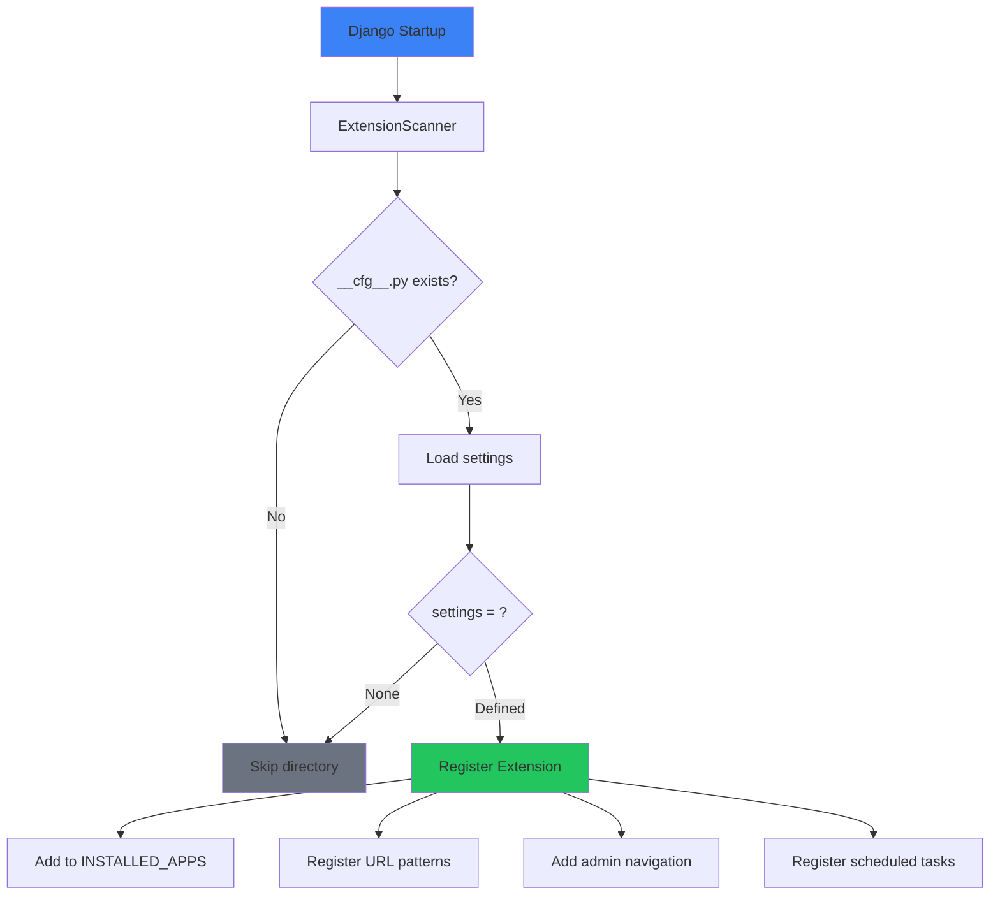
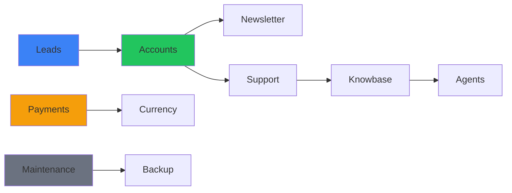

# Bundled Extensions

<Callout type="info">
**What are Bundled Extensions?**
These are [Extensions](/docs/extensions) that come **pre-installed** in the Django-CFG solution template. They're fully functional, customizable Django apps ready to use out of the box.
</Callout>

Django-CFG solution template includes a comprehensive suite of production-ready extensions, organized into three categories. All extensions use the modern [Extensions System](/docs/extensions) with auto-discovery and type-safe [Pydantic configuration](/docs/fundamentals/core/type-safety).

## How Extensions Work

Unlike traditional Django apps that require manual `INSTALLED_APPS` configuration, extensions use **auto-discovery**:

```
your_project/
└── extensions/
    └── apps/
        ├── leads/           # Lead management extension
        │   ├── __cfg__.py   # ← Configuration enables extension
        │   ├── models.py
        │   ├── admin.py
        │   └── urls.py
        ├── payments/        # Payment processing
        ├── support/         # Support tickets
        └── knowbase/        # Knowledge base
```

### Enable/Disable Extensions

Each extension has a `__cfg__.py` file. The `settings = ...` line enables it:

```python
# extensions/apps/leads/__cfg__.py
from django_cfg.extensions.configs.apps.leads import BaseLeadsSettings

class LeadsSettings(BaseLeadsSettings):
    # Customize settings
    telegram_enabled: bool = True
    email_notifications: bool = True

settings = LeadsSettings()  # ← This line ENABLES the extension
```

**To disable**: Comment out or remove `settings = ...`:

```python
# settings = LeadsSettings()  # Extension disabled
```

[Learn more about Extensions System →](/docs/extensions)

---

## Extension Categories

### 👥 User Management

Complete customer lifecycle management - authentication, leads, support, and communication.

| Extension | Description | Location |
|-----------|-------------|----------|
| **Accounts** | User authentication, profiles, OAuth | `extensions/apps/accounts/` |
| **Leads** | Lead capture, tracking, conversion | `extensions/apps/leads/` |
| **Support** | Ticketing system, live chat | `extensions/apps/support/` |
| **Newsletter** | Email marketing, subscribers | `extensions/apps/newsletter/` |

**Use Cases:** SaaS registration, lead generation, customer support, email campaigns.

[**Explore User Management →**](/docs/features/built-in-apps/user-management/overview)

---

### 🤖 AI & Knowledge

Intelligent data processing and automation powered by AI.

| Extension | Description | Location |
|-----------|-------------|----------|
| **Knowbase** | Document processing, semantic search, AI chat | `extensions/apps/knowbase/` |
| **Agents** | Custom AI assistants with tool integration | `extensions/apps/agents/` |

**Use Cases:** AI-powered support, document search, intelligent chatbots.

[**Explore AI & Knowledge →**](/docs/features/built-in-apps/ai-knowledge/overview)

---

### 💳 Payments

Universal payment processing with multiple providers.

| Extension | Description | Location |
|-----------|-------------|----------|
| **Payments** | NowPayments, Stripe, subscriptions | `extensions/apps/payments/` |
| **Currency** | Multi-currency support, exchange rates | `extensions/apps/currency/` |

**Use Cases:** SaaS billing, e-commerce, subscription services.

[**Explore Payments →**](/docs/features/built-in-apps/payments/overview)

---

### ⚙️ Operations

Site maintenance and operational tools.

| Extension | Description | Location |
|-----------|-------------|----------|
| **Maintenance** | Cloudflare maintenance mode | `extensions/apps/maintenance/` |
| **Backup** | Database backups to S3/cloud | `extensions/apps/backup/` |

**Use Cases:** Scheduled maintenance, disaster recovery, system reliability.

[**Explore Operations →**](/docs/features/built-in-apps/operations/overview)

---

## Quick Start

### 1. Configure Extensions

Each extension in `extensions/apps/` has a `__cfg__.py` file:

```python
# extensions/apps/leads/__cfg__.py
from django_cfg.extensions.configs.apps.leads import BaseLeadsSettings

class LeadsSettings(BaseLeadsSettings):
    telegram_enabled: bool = True
    email_enabled: bool = True

settings = LeadsSettings()
```

```python
# extensions/apps/knowbase/__cfg__.py
from django_cfg.extensions.configs.apps.knowbase import BaseKnowbaseSettings

class KnowbaseSettings(BaseKnowbaseSettings):
    llm_provider: str = "openai"
    embedding_model: str = "text-embedding-3-small"

settings = KnowbaseSettings()
```

```python
# extensions/apps/payments/__cfg__.py
from django_cfg.extensions.configs.apps.payments import BasePaymentsSettings

class PaymentsSettings(BasePaymentsSettings):
    nowpayments_api_key: str = env.payments.api_key
    stripe_enabled: bool = True

settings = PaymentsSettings()
```

### 2. Run Migrations

```bash
python manage.py migrate_all
```

### 3. Access Admin Interface

```bash
# Navigate to Django admin
http://localhost:8000/admin/

# Extensions are grouped in admin sidebar:
# - User Management (Leads, Support, Newsletter)
# - AI & Knowledge (Knowbase, Agents)
# - Payments (Payments, Currency)
# - Operations (Maintenance, Backup)
```

---

## Extension Architecture

### Auto-Discovery Flow



### What Extensions Provide

Each extension can include:

- **Models** - Database tables with migrations
- **Admin** - Admin interface with navigation
- **URLs** - API endpoints at `/cfg/{extension}/`
- **Views** - REST API viewsets
- **Tasks** - Background jobs (Django-RQ)
- **Constance** - Runtime settings in admin

### URL Convention

Extensions follow automatic URL routing:

| File | URL Pattern |
|------|-------------|
| `urls.py` | `/cfg/{prefix}/` |
| `urls_admin.py` | `/cfg/{prefix}/admin/` |
| `urls_system.py` | `/cfg/{prefix}/system/` |

---

## Customization

### Override Extension Settings

```python
# extensions/apps/leads/__cfg__.py
from django_cfg.extensions.configs.apps.leads import BaseLeadsSettings

class LeadsSettings(BaseLeadsSettings):
    # Override default values
    telegram_enabled: bool = True
    telegram_bot_token: str = env.telegram.bot_token
    telegram_chat_id: str = env.telegram.chat_id

    # Add custom settings
    custom_lead_sources: list[str] = ["website", "api", "partner"]

settings = LeadsSettings()
```

### Modify Extension Code

All code in `extensions/apps/` can be modified:

```python
# extensions/apps/leads/models.py
from django.db import models

class Lead(models.Model):
    # Add custom fields
    custom_field = models.CharField(max_length=100, blank=True)

    # Override methods
    def save(self, *args, **kwargs):
        # Custom logic before save
        super().save(*args, **kwargs)
```

### Extend Admin

```python
# extensions/apps/leads/admin.py
from django.contrib import admin
from .models import Lead

@admin.register(Lead)
class LeadAdmin(admin.ModelAdmin):
    list_display = ['email', 'name', 'source', 'created_at', 'custom_field']
    list_filter = ['source', 'status']
    search_fields = ['email', 'name']
```

---

## Inter-Extension Integration

Extensions can work together:

```python
# Example: Lead converts to User, subscribes to Newsletter
from extensions.apps.leads.models import Lead
from extensions.apps.newsletter.models import Subscriber
from django.contrib.auth import get_user_model

User = get_user_model()

def convert_lead_to_customer(lead: Lead):
    # Create user account
    user = User.objects.create_user(
        email=lead.email,
        first_name=lead.name,
    )

    # Subscribe to newsletter
    Subscriber.objects.create(
        email=user.email,
        user=user,
        source='lead_conversion',
    )

    # Update lead status
    lead.status = 'converted'
    lead.user = user
    lead.save()

    return user
```

### Data Flow



---

## Configuration Patterns

### Development Setup

Enable all extensions for development:

```python
# Each extension's __cfg__.py has settings = ExtensionSettings()
# All extensions are enabled by default in the solution template
```

### Production Setup

Disable unused extensions by commenting out settings:

```python
# extensions/apps/agents/__cfg__.py
# class AgentsSettings(BaseAgentsSettings):
#     ...
# settings = AgentsSettings()  # Commented = disabled
```

### Minimal Setup

For minimal deployments, keep only needed extensions:

```bash
extensions/apps/
├── leads/          # Keep
├── payments/       # Keep
├── maintenance/    # Keep
└── knowbase/       # Remove or disable __cfg__.py
```

---

## Security & Performance

### Built-in Security

All extensions include:

- **Input Validation** - Pydantic-based validation
- **Authentication** - JWT/session auth support
- **Rate Limiting** - API rate limiting (see [Rate Limiting](/docs/fundamentals/system/rate-limiting))
- **Audit Logging** - Operation audit trails

### Performance Features

- **Async Tasks** - Background processing with Django-RQ
- **Caching** - Redis caching for frequently accessed data
- **Lazy Loading** - Extensions loaded on demand
- **Database Optimization** - Query optimization, connection pooling

---

## Related Documentation

- [Extensions System](/docs/extensions) - How extensions work
- [Backend Extensions](/docs/extensions/backend-extensions) - Creating extensions
- [Frontend Extensions](/docs/extensions/frontend-extensions) - React/TypeScript extensions
- [Migration Guide](/docs/extensions/migration-guide) - Migrating from legacy apps

---

## Extension Hub

<Callout type="success">
**Discover More Extensions**
Browse and install additional extensions from [hub.djangocfg.com](https://hub.djangocfg.com/)

```bash
django-cfg install <extension-name>
```
</Callout>

You can also create and publish your own extensions to share with the community!
