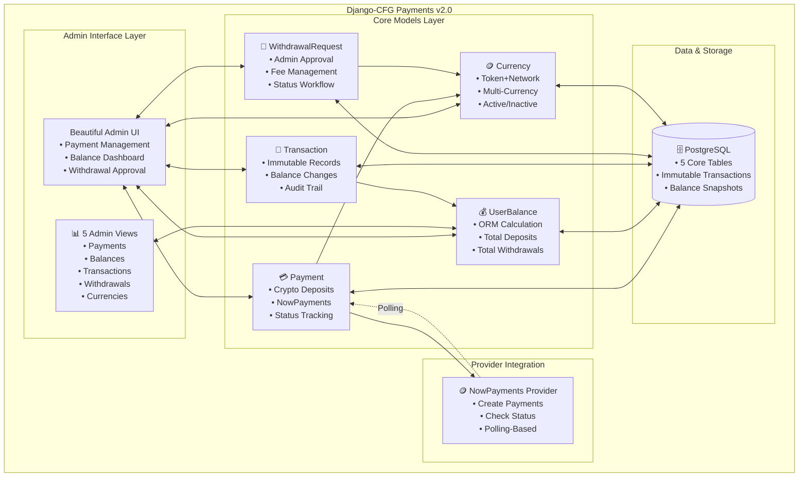
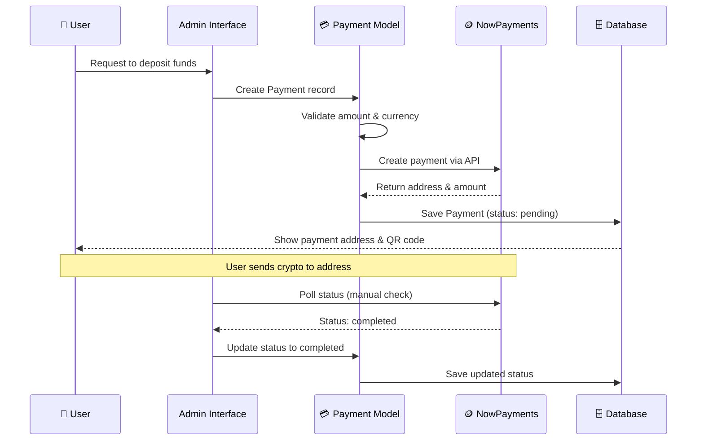
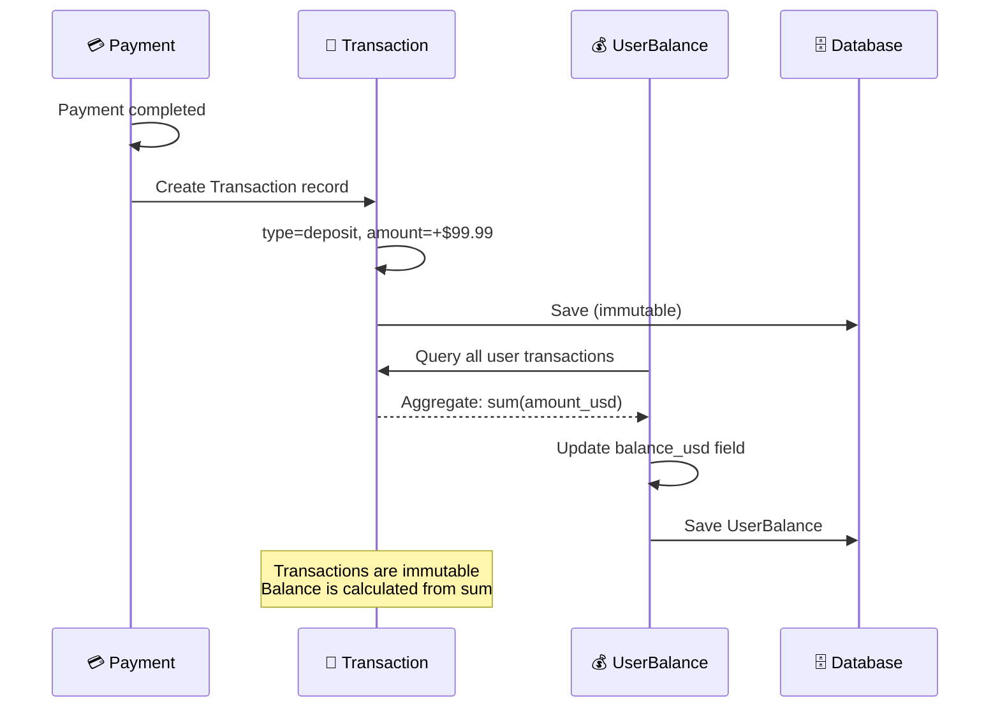
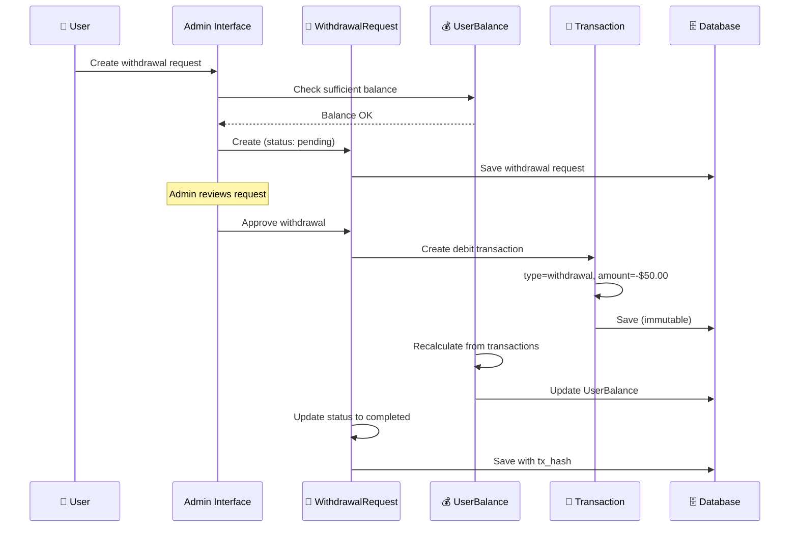
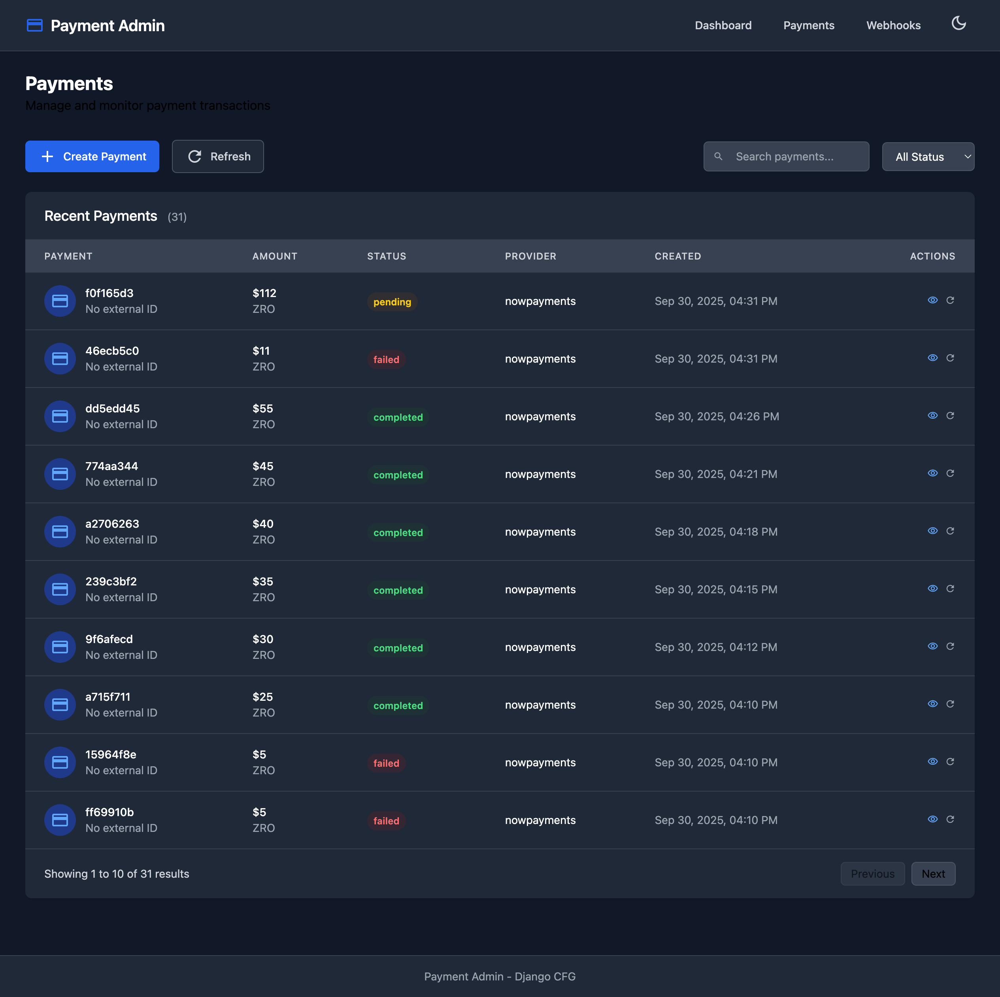

import Tabs from '@theme/Tabs';
import TabItem from '@theme/TabItem';

# Payments System v2.0

:::tip[Simplified Payment System]
Django-CFG's **Payments v2.0** is a production-ready cryptocurrency payment solution focused on simplicity: NowPayments integration, user balance tracking, and manual withdrawal management with a beautiful admin interface.
:::

Django-CFG's **Payments v2.0** is a streamlined cryptocurrency payment system built for production use. Accept crypto payments via NowPayments, track user balances automatically, and manage withdrawals through an intuitive admin interface.

## Philosophy

### "Simplicity First"
Version 2.0 removes complexity and focuses on what matters: accepting crypto payments and managing user balances.

```python
# config.py - Simple configuration
from django_cfg.models.payments import PaymentsConfig

payments: PaymentsConfig = PaymentsConfig(
    enabled=True,
    nowpayments=NowPaymentsConfig(
        api_key=env.nowpayments.api_key,
        sandbox=True,
        enabled=True
    )
)

# Create payments directly with models
from django_cfg.apps.payments.models import Payment, Currency

payment = Payment.objects.create(
    user=user,
    amount_usd=Decimal('99.99'),
    currency=Currency.objects.get(code='USDTTRC20'),
    description='Premium subscription'
)
```

### "Production-First Design"
Built for real-world usage with essential features:

- ✅ **Polling-Based Updates** - Simple status checking without webhook complexity
- ✅ **ORM-Based Balances** - Calculate balances from immutable transaction records
- ✅ **Manual Withdrawal System** - Admin approval workflow for fund withdrawals
- ✅ **Type Safety** - Full Pydantic validation for configurations
- ✅ **Beautiful Admin Interface** - Manage payments, balances, and withdrawals
- ✅ **Multiple Currencies** - Support for various crypto tokens and networks
- ✅ **Transaction Audit Trail** - Immutable records for complete financial history

### "Configuration via YAML"
Provider settings are stored in your environment config, not Python code:

```yaml
# config.dev.yaml - Environment-specific settings
nowpayments:
  api_key: "your_sandbox_api_key_here"
  ipn_secret: "your_ipn_secret_here"
  sandbox: true
```

```python
# config.py - Simple Python configuration
payments: PaymentsConfig = PaymentsConfig(
    enabled=True,
    nowpayments=NowPaymentsConfig(
        api_key=env.nowpayments.api_key,
        ipn_secret=env.nowpayments.ipn_secret,
        sandbox=env.nowpayments.sandbox,
        enabled=True
    )
)
```

## Key Features

### **What Makes It Special**

1. **💳 Cryptocurrency Payments**
   - **NowPayments Integration** - 300+ cryptocurrencies supported
   - **Multiple Networks** - TRC20, ERC20, Bitcoin, and more
   - **Sandbox Testing** - Safe testing environment included
   - **Real-time Status Polling** - Simple status updates without webhooks

2. **💰 User Balance System**
   - **ORM-Based Calculation** - Balances computed from transaction records
   - **Transaction History** - Immutable audit trail of all balance changes
   - **Multiple Transaction Types** - Deposits, withdrawals, payments, refunds, fees, bonuses
   - **Automatic Balance Updates** - Calculated from Transaction model aggregation

3. **🏦 Manual Withdrawal System**
   - **Admin Approval Workflow** - Withdrawals require manual admin approval
   - **Multi-Currency Support** - Withdraw to any supported cryptocurrency
   - **Fee Management** - Configurable network and service fees
   - **Status Tracking** - Pending, approved, processing, completed, rejected

4. **🎯 Admin Interface**
   - **Payment Management** - View, create, and track payments
   - **Balance Dashboard** - Monitor user balances and transactions
   - **Withdrawal Approval** - Approve/reject withdrawal requests
   - **Currency Configuration** - Manage available payment currencies
   - **Transaction Explorer** - Browse complete financial history

5. **🔒 Security & Reliability**
   - **Immutable Transactions** - Transaction records cannot be modified
   - **Balance Validation** - Prevents negative balances
   - **Type-Safe Models** - Pydantic validation for configurations
   - **Audit Trail** - Complete history of all financial operations

### **Perfect For**

- **SaaS Applications** - Usage-based billing, subscriptions
- **E-commerce** - Multi-provider checkout flows
- **API Services** - Pay-per-use pricing models
- **Crypto Projects** - Direct blockchain payments
- **Fintech Apps** - Complex payment flows

## Architecture Overview



## Data Flow

### 📥 **Payment Creation Flow**


### **Balance Update Flow**


### 🏦 **Withdrawal Request Flow**


## Integration Highlights

### **Database Models (v2.0)**
```python
from django_cfg.apps.payments.models import (
    Payment,        # Cryptocurrency deposits
    Currency,       # Supported currencies
    UserBalance,    # User balance tracking
    Transaction,    # Immutable transaction records
    WithdrawalRequest  # Manual withdrawals
)

# Create a payment
payment = Payment.objects.create(
    user=user,
    amount_usd=Decimal('99.99'),
    currency=Currency.objects.get(code='USDTTRC20'),
    description='Premium subscription'
)

# Check user balance
balance = UserBalance.objects.get_or_create_for_user(user)
print(f"Balance: {balance.balance_display}")

# View transaction history
transactions = Transaction.objects.filter(user=user).order_by('-created_at')

# Request withdrawal
withdrawal = WithdrawalRequest.objects.create(
    user=user,
    amount_usd=Decimal('50.00'),
    currency=Currency.objects.get(code='USDTTRC20'),
    wallet_address='TExampleAddress...'
)
```

### **Admin Interface**
```python
# Admin automatically available when enabled:
payments: PaymentsConfig = PaymentsConfig(enabled=True)

# 5 Admin Views Available:
# 1. PaymentAdmin - Manage cryptocurrency deposits
# 2. CurrencyAdmin - Configure supported currencies
# 3. UserBalanceAdmin - Monitor user balances
# 4. TransactionAdmin - Browse transaction history
# 5. WithdrawalRequestAdmin - Approve/reject withdrawals

# Features:
# - Create and track payments
# - Monitor user balances
# - Approve withdrawal requests
# - View complete transaction history
# - Configure available currencies
```


*Payment management interface with status tracking*

### **Type-Safe Configuration**
```python
# Pydantic validation for provider configs
from django_cfg.models.payments import PaymentsConfig, NowPaymentsConfig

payments = PaymentsConfig(
    enabled=True,
    nowpayments=NowPaymentsConfig(
        api_key=env.nowpayments.api_key,
        ipn_secret=env.nowpayments.ipn_secret,
        sandbox=True,  # Type-checked and validated
        enabled=True
    )
)

# Results in:
# - Compile-time type checking
# - Runtime validation
# - Auto-completion in IDEs
# - Configuration errors caught early
```

### **Immutable Transaction System**
```python
# Transactions are immutable - cannot be modified after creation
transaction = Transaction.objects.create(
    user=user,
    transaction_type=Transaction.TransactionType.DEPOSIT,
    amount_usd=Decimal('99.99'),
    balance_after=Decimal('199.99'),
    description='Payment completed'
)

# Attempting to modify raises ValidationError
transaction.amount_usd = Decimal('50.00')
transaction.save()  # Raises ValidationError: Transactions are immutable

# Balance is calculated from transaction sum
balance = UserBalance.objects.get(user=user)
balance.balance_usd  # Computed from Transaction.objects.filter(user=user).aggregate(Sum('amount_usd'))
```

## Use Cases & Examples

<Tabs>
  <TabItem value="deposits" label="Cryptocurrency Deposits" default>

### 💳 Cryptocurrency Deposits

```python
from django_cfg.apps.payments.models import Payment, Currency

# Create a payment for crypto deposit
payment = Payment.objects.create(
    user=user,
    amount_usd=Decimal('99.99'),
    currency=Currency.objects.get(code='USDTTRC20'),  # USDT on TRC20 network
    description='Premium subscription deposit'
)

# Payment is created with:
# - internal_payment_id: Auto-generated unique ID
# - status: 'pending'
# - Provider integration creates payment address
# - User receives QR code and payment address

# Admin can poll status from provider:
# payment.status → 'confirming' → 'confirmed' → 'completed'
```

:::info[Payment Flow]
**Deposit workflow:**
1. **Create Payment** - User initiates deposit via admin/API
2. **Get Address** - NowPayments returns crypto address
3. **User Sends Funds** - User transfers crypto to address
4. **Status Polling** - Admin polls NowPayments for status
5. **Confirmation** - Blockchain confirmations tracked
6. **Completion** - Payment marked completed, balance updated

**Supported cryptocurrencies:** 300+ via NowPayments including BTC, ETH, USDT (TRC20/ERC20), LTC, and more.
:::

  </TabItem>
  <TabItem value="balances" label="Balance Management">

### 💰 User Balance Management

```python
from django_cfg.apps.payments.models import UserBalance, Transaction

# Get or create user balance
balance = UserBalance.objects.get_or_create_for_user(user)

# Check current balance
print(f"Current balance: {balance.balance_display}")
print(f"Total deposited: ${balance.total_deposited}")
print(f"Total withdrawn: ${balance.total_withdrawn}")

# View transaction history
transactions = Transaction.objects.filter(user=user).order_by('-created_at')
for tx in transactions:
    print(f"{tx.transaction_type}: {tx.amount_display} (Balance: ${tx.balance_after})")

# Balance is calculated from transactions:
# balance_usd = SUM(all transactions for user)
```

:::note[ORM-Based Calculation]
**Balance system features:**
- **Immutable Transactions** - Transaction records cannot be modified
- **Automatic Calculation** - Balance computed from transaction sum
- **Complete Audit Trail** - Every balance change has a transaction record
- **Transaction Types** - deposit, withdrawal, payment, refund, fee, bonus, adjustment
- **Balance Validation** - Prevents negative balances via database constraints

**Balance formula:** `balance_usd = SUM(Transaction.amount_usd WHERE user=user)`
:::

  </TabItem>
  <TabItem value="withdrawals" label="Manual Withdrawals">

### 🏦 Withdrawal Management

```python
from django_cfg.apps.payments.models import WithdrawalRequest, Currency

# User requests withdrawal
withdrawal = WithdrawalRequest.objects.create(
    user=user,
    amount_usd=Decimal('50.00'),
    currency=Currency.objects.get(code='USDTTRC20'),
    wallet_address='TExampleWalletAddress123...',
    network_fee_usd=Decimal('1.00'),
    service_fee_usd=Decimal('0.50')
)
# Status: 'pending' - awaits admin approval

# Admin reviews in admin interface
# Admin can:
# - Approve: withdrawal.status = 'approved'
# - Reject: withdrawal.status = 'rejected' (with admin_notes)
# - Process: withdrawal.status = 'processing'

# After admin sends funds off-platform:
withdrawal.status = 'completed'
withdrawal.transaction_hash = 'blockchain_tx_hash_here'
withdrawal.save()

# Transaction automatically created to debit user balance
```

:::tip[Withdrawal Workflow]
**Withdrawal approval process:**
1. **User Requests** - Creates WithdrawalRequest via admin/API
2. **Balance Check** - System validates sufficient funds
3. **Admin Review** - Staff reviews request in admin interface
4. **Approval** - Admin approves or rejects with notes
5. **Processing** - Admin manually sends funds off-platform
6. **Completion** - Admin marks completed with tx_hash
7. **Balance Update** - Transaction record debits user balance

**Minimum withdrawal:** $10.00 USD
**Fees:** Configurable network and service fees
:::

  </TabItem>
  <TabItem value="currencies" label="Currency Management">

### 🪙 Currency Configuration

```python
from django_cfg.apps.payments.models import Currency

# List active currencies
currencies = Currency.objects.filter(is_active=True)

# Get specific currency
usdt_trc20 = Currency.objects.get(code='USDTTRC20')
print(usdt_trc20.display_name)  # "USDT (TRC20)"
print(usdt_trc20.token)         # "USDT"
print(usdt_trc20.network)       # "TRC20"

# Add new currency (typically done via admin)
currency = Currency.objects.create(
    code='USDTERC20',
    name='USDT (ERC20)',
    token='USDT',
    network='ERC20',
    decimal_places=6,
    is_active=True,
    provider='nowpayments',
    min_amount_usd=Decimal('1.00'),
    sort_order=10
)
```

:::warning[Currency Configuration]
**Currency management:**
- **Code Format** - Matches NowPayments currency codes (e.g., USDTTRC20, BTC, ETH)
- **Token + Network** - Separated for display (USDT on TRC20 vs ERC20)
- **Active Status** - Only active currencies available for payments
- **Sort Order** - Controls display order in dropdowns
- **Minimum Amounts** - Per-currency minimums from provider

**Common currencies:**
- BTC (Bitcoin)
- ETH (Ethereum)
- USDTTRC20 (USDT on Tron)
- USDTERC20 (USDT on Ethereum)
- LTC (Litecoin)
:::

  </TabItem>
</Tabs>

## Getting Started

Ready to add cryptocurrency payments to your Django app?

### **Quick Setup (3 minutes)**
1. **Configure NowPayments**: Get API key from NowPayments.io
2. **Enable in config.py**: Add `PaymentsConfig(enabled=True, nowpayments=...)`
3. **Run migrations**: `python manage.py migrate`
4. **Access Admin**: Visit Django admin to manage payments
5. **Create currencies**: Add supported currencies via CurrencyAdmin
6. **Create payment**: Test with a deposit transaction

### **Next Steps**
👉 **[Configuration Guide](./configuration.md)** - Set up NowPayments provider

👉 **[Integration Guide](./integration.md)** - Use models in your Django app

👉 **[Examples](./examples.md)** - Real-world usage patterns

---

**Why Payments v2.0?**

*Simplified cryptocurrency payment system focused on what matters: deposits, balances, and withdrawals. No webhook complexity, no over-engineering.*

**Key Features in v2.0:**
- ✅ **5 Simple Models** - Payment, Currency, UserBalance, Transaction, WithdrawalRequest
- ✅ **Polling-Based** - No webhook configuration needed
- ✅ **Immutable Transactions** - Complete audit trail
- ✅ **ORM-Based Balances** - Calculated from transaction records
- ✅ **Manual Withdrawals** - Admin approval workflow
- ✅ **Type-Safe Configuration** - Pydantic validation

---

## See Also

### Payment System Documentation

**Payment Features:**
- **[Configuration](./configuration)** - Set up NowPayments provider
- **[Integration](./integration)** - Django ORM integration guide
- **[Examples](./examples)** - Real-world usage patterns
- **[Screenshots](./screenshots)** - Admin interface visual tour

**Related Features:**
- **[User Management](/features/built-in-apps/user-management/overview)** - Customer account integration
- **[Built-in Apps Overview](/features/built-in-apps/overview)** - All production-ready apps

### Configuration & Setup

**Getting Started:**
- **[Configuration Guide](/getting-started/configuration)** - Enable payment system
- **[First Project](/getting-started/first-project)** - Quick start tutorial

**Advanced Configuration:**
- **[Configuration Models](/fundamentals/configuration)** - Complete payment config API
- **[Environment Variables](/fundamentals/configuration/environment)** - Secure API key management

### Guides & CLI

**Practical Guides:**
- **[Production Config](/guides/production-config)** - Production payment setup
- **[Troubleshooting](/guides/troubleshooting)** - Common payment issues
- **[Testing Payments](/cli/commands/payments)** - CLI commands for testing

**API Integration:**
- **[API Generation](/features/api-generation/overview)** - Auto-generate payment API clients
- **[REST API](/features/api-generation/groups)** - Payment API endpoints
