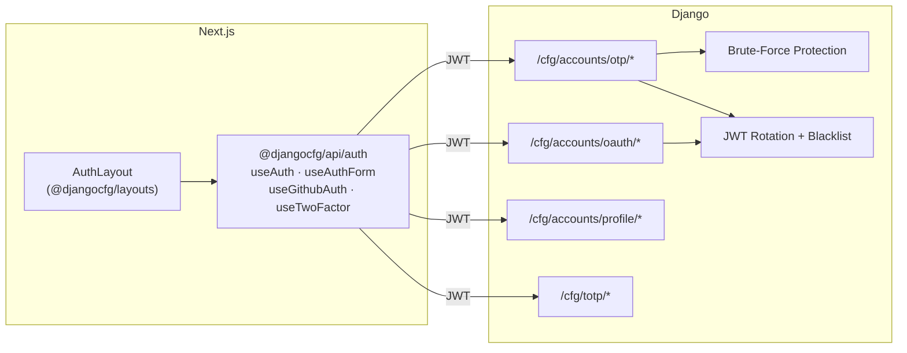

# Accounts App

The **Accounts** app is the authentication backbone of every Django-CFG project — passwordless login, tokens, social auth, and abuse protection, zero boilerplate.

---

## Full Stack Picture



---

## What's Included

| Feature | Description |
|---|---|
| **OTP Login** | Passwordless email — 4-digit codes, 10-min expiry |
| **JWT Tokens** | Access + refresh with rotation and blacklist |
| **2FA (TOTP)** | Google Auth, Authy, any TOTP app |
| **OAuth** | GitHub social login |
| **Brute-force protection** | 4-layer defense — IP rate limits, per-email throttle, lockout |
| **Email validation** | RFC syntax check + normalization (no blocklist, no MX/DNS lookups) |
| **Soft delete** | GDPR-safe account archive |
| **Cleanup jobs** | RQ tasks for expired OTPs and JWT blacklist |

---

## User profiles &amp; avatars

Profile fields (name, phone, company, position, avatar) live on the built-in
user model and are read/updated through `/cfg/accounts/profile/*`. Avatar upload
is a dedicated multipart endpoint:

```
POST   /cfg/accounts/profile/avatar/   # multipart/form-data, field: avatar
```

**Uploads are resized on the fly — the original is never stored.** Every
uploaded avatar is normalized server-side before it reaches storage:

| Step | Behaviour |
|---|---|
| **Orientation** | EXIF rotation is applied (phone photos land upright) |
| **Crop** | Center-cropped to a square (crop-to-fill, no letterboxing) |
| **Resize** | Downscaled to **400×400** |
| **Transparency** | Alpha/palette flattened onto white → clean RGB |
| **Format** | Re-encoded to **WebP** (~3–5× smaller than the source JPEG/PNG) |

Only the processed thumbnail is written to disk, so a multi-megabyte upload
becomes a few-KB `.webp` regardless of the source format. Accepted inputs: JPEG,
PNG, GIF, WebP, up to 5 MB (a non-image or oversize payload is rejected with a
validation error).

The normalization is a serializer-level concern (`AvatarUploadSerializer` calls
the `process_avatar` service), so it applies to **every** save path — the upload
endpoint, the Django admin, and any direct serializer use — identically.

---

## Extension signals

The accounts app fires Django signals at key lifecycle points so your product
can hook in without patching the app:

| Signal | Fired | Provides |
|---|---|---|
| `user_authenticated` | On a successful login | `user`, `request` |
| `user_email_verified` | Whenever an email is proven — every OTP verify, and every OAuth login (the provider email is already verified) | `user`, `consent` (a dict on the OTP path, `None` on OAuth) — see [OTP consent](./otp#verify--the-user_email_verified-signal) |
| `user_soft_deleted` | Synchronously, inside the account-deletion transaction, after the user is soft-deleted | `user` |

`user_soft_deleted` exists because a soft delete does not run the database's
`on_delete` handlers. Use it to apply your own deletion policy for records that
would otherwise only be cleaned up on a hard delete (e.g. revoking credentials or
purging personal product data). Because it runs **inside** the deletion
transaction, a receiver that **raises rolls the whole deletion back**, leaving the
account usable rather than half-deleted:

```python
from django.dispatch import receiver
from django_cfg.apps.system.accounts.signals import user_soft_deleted

@receiver(user_soft_deleted)
def purge_product_data(sender, user, **kwargs):
    # Raise on failure — the account deletion is rolled back if this fails.
    MyRecord.objects.filter(owner=user).delete()
```

`user_email_verified` is the hook to enroll a newsletter/marketing subscription
on sign-up. It fires for **both** login paths — OTP verify and OAuth (GitHub's
primary email arrives already verified) — so a receiver connected to it covers
every way a user reaches your service. The framework stores no subscription and
sends no consent of its own on the OAuth path (`consent=None`); your receiver
decides what proof it requires and where the subscription lives:

```python
from django.dispatch import receiver
from django_cfg.apps.system.accounts.signals import user_email_verified

@receiver(user_email_verified)
def enroll_newsletter(sender, user, consent=None, **kwargs):
    # Treat any verified login as the opt-in, or gate on `consent["marketing_consent"]`
    # from the OTP flow — your product's policy, not the framework's.
    subscribe(user.email)
```

---

## Enable

```python
from django_cfg import DjangoConfig, JWTConfig

class MyConfig(DjangoConfig):
    enable_accounts = True
    jwt = JWTConfig()  # secure defaults: 30-min access, 90-day refresh, rotation on
```

---

<Cards>
  <Card title="Frontend Integration" href="/features/built-in-apps/user-management/accounts/frontend">
    AuthLayout, useAuth / useAuthForm hooks, middleware
  </Card>
  <Card title="OTP & Brute-Force" href="/features/built-in-apps/user-management/accounts/otp">
    Auth flow, throttle layers, anti-enumeration
  </Card>
  <Card title="JWT" href="/features/built-in-apps/user-management/accounts/jwt">
    Token lifetimes, rotation, blacklist
  </Card>
  <Card title="Two-Factor Auth" href="/features/built-in-apps/user-management/accounts/two-factor">
    TOTP setup, enforcement, backup codes
  </Card>
  <Card title="OAuth (GitHub)" href="/features/built-in-apps/user-management/accounts/oauth">
    Social login, account linking, CSRF protection
  </Card>
</Cards>

TAGS: accounts, otp, jwt, 2fa, oauth, authentication, profile, avatar
DEPENDS_ON: [frontend, otp, jwt, two-factor, oauth]
