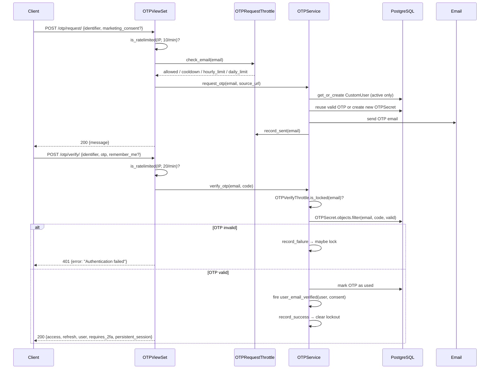

import { Callout } from 'nextra/components'

# OTP Authentication & Brute-Force Protection

Email → 4-digit code → JWT tokens. No passwords.

## Authentication Flow



### Key design decisions

- **Anti-enumeration** — all failure paths return identical `HTTP 401 {"error": "Authentication failed"}`. Wrong OTP, expired OTP, unknown email, and locked account are indistinguishable.
- **OTP reuse** — if a valid unexpired OTP exists, a re-request returns the same code. Reduces SMTP load, avoids confusing users with multiple codes in inbox.
- **Active-only lookup** — `OTPService` always filters `deleted_at__isnull=True`. Soft-deleted accounts cannot authenticate.
- **Test account bypass** — users with `is_test_account=True` accept any OTP code. Intended for App Store review / CI environments where real email delivery isn't available.

---

## Persistent Session (`remember_me`)

`POST /cfg/accounts/otp/verify/` accepts an optional `remember_me` boolean
(default `false`). When `true`, the issued refresh token gets a **30-day**
lifetime (`REMEMBER_ME_LIFETIME`) plus an absolute `cfg_session_expires_at`
deadline; without it the refresh token uses the server's default SimpleJWT
lifetime.

The deadline is a hard ceiling: `CustomTokenRefreshView` re-reads
`cfg_session_expires_at` on every rotation and re-clamps the new tokens to it, so
continued refresh activity cannot extend the 30-day window.

Both branches of the verify response now report the outcome:

```jsonc
// POST /cfg/accounts/otp/verify/  { "identifier": "...", "otp": "...", "remember_me": true }
{
  "access": "...",
  "refresh": "...",
  "user": { /* ... */ },
  "requires_2fa": false,
  "persistent_session": true   // mirrors the effective remember_me
}
```

When `requires_2fa` is `true`, no tokens are minted yet; the `remember_me` choice
is carried on the 2FA session and applied after the second factor — see
[Two-Factor Authentication](./two-factor#persistent-session).

<Callout type="info">
Session **length** is a server decision (`remember_me` → refresh-token lifetime).
It is not the same as *where* the generated client stores the token — see
[Storage modes](/features/api-generation/generated-clients#storage-modes).
</Callout>

---

## Marketing Consent Capture

The OTP flow doubles as the consent-capture point for marketing email: the choice is made at request time, but only becomes evidence once the address is **proven** at verify time.

### Request — optional consent fields

`POST /cfg/accounts/otp/request/` accepts two optional fields alongside `identifier`:

| Field | Type | Meaning |
|-------|------|---------|
| `marketing_consent` | `bool \| null` | Choice made at signup. Absent/`null` = not asked, `false` = declined |
| `consent_disclosure_version` | `str` (≤ 64) | Version tag of the disclosure copy shown (e.g. `product-updates-reg-v1`) |

The pair is stored on the `OTPSecret` row (migration `0024_otpsecret_consent_capture`) together with a **jurisdiction hint** — the normalized `CF-IPCountry` header seen by the edge. On a re-request for an existing valid OTP, the latest explicit choice wins; a consent-less resend keeps the stored one.

### Verify — the `user_email_verified` signal

On **every** successful verify (not just the first), the accounts app fires a Django signal:

```python
from django_cfg.apps.system.accounts.signals import user_email_verified

# Fired as: user_email_verified.send(sender=CustomUser, user=user, consent=consent)
# consent = {
#     "marketing_consent": True | False | None,
#     "disclosure_version": "product-updates-reg-v1",
#     "jurisdiction_hint": "DE",          # normalized CF-IPCountry, or ""
#     "verified_at": "2026-07-21T12:00:00+00:00",
# }  — or None when the request carried no consent data
```

The **same signal also fires on OAuth login** (GitHub's email is already
verified), but there `consent` is `None` — no consent UI is involved. So a
single receiver covers every login path; just default `consent=None` and handle
the missing-evidence case.

Consumers subscribe to bridge consent into their own systems — the framework itself stores **no subscription state on the user model**, deliberately:

```python
from django.dispatch import receiver
from django_cfg.apps.system.accounts.signals import user_email_verified

@receiver(user_email_verified)
def bridge_marketing_consent(sender, user, consent=None, **kwargs):
    # OTP path: consent is a dict. OAuth path: consent is None.
    if consent and consent["marketing_consent"]:
        enqueue_newsletter_subscribe(user.email, evidence=consent)
    # …or treat any verified login as the opt-in — your product's policy.
```

Receivers must accept `**kwargs` — the payload may gain keys. The dev-mode and test-account verify bypasses also forward the latest stored consent for the email, so dev behavior does not diverge from the real-OTP path.

### Consent policy endpoint

`GET /cfg/accounts/otp/consent-policy/` tells the frontend how the consent checkbox should default for the caller's jurisdiction:

```json
{"country": "DE", "marketing_consent_default": "unchecked"}
```

The default is derived from the edge-provided `CF-IPCountry` header against the server-side `EXPLICIT_CONSENT_COUNTRIES` constant (EU-27 + EEA + UK + CH → `"unchecked"`; unknown country → `"unchecked"` fail-safe; everywhere else → `"checked"`). Because the **same** `CF-IPCountry` signal is stored as the consent evidence's `jurisdiction_hint`, the UI decision and the recorded evidence cannot drift apart.

---

## Brute-Force Protection Layers

Four independent layers working in sequence:

```mermaid
graph LR
    REQ[Request] --> L1

    subgraph L1["Layer 1: IP Rate Limit (django-ratelimit)"]
        IP1["/otp/request/ → 10/min"]
        IP2["/otp/verify/ → 20/min"]
        IP3["/oauth/callback/ → 10/min"]
    end

    L1 -->|pass| L2

    subgraph L2["Layer 2: OTPRequestThrottle (per-email)"]
        C1[Cooldown: 60s between resends]
        C2[Hourly budget: 10 requests]
        C3[Daily budget: 20 requests]
    end

    L2 -->|pass| L3

    subgraph L3["Layer 3: OTPVerifyThrottle (per-email)"]
        F1[5 failed attempts → 15-min lockout]
        F2[Success clears counter]
    end

    L3 -->|pass| SVC[OTPService]
```



All per-email state lives in Redis under **SHA-256 hashed keys** — no PII in cache:

```python
key = f"otp:cooldown:{sha256(email.lower())[:16]}"
# e.g. "otp:cooldown:b4c9a289323b21a0"
```

### OTPRequestThrottle — prevent email bombing

```python
from django_cfg.apps.system.accounts.services.brute_force_service import OTPRequestThrottle

throttle = OTPRequestThrottle()

# Before sending OTP
allowed, reason, retry_after = throttle.check_email(email)
# reason: "ok" | "cooldown" | "hourly_limit" | "daily_limit"
# retry_after: seconds until retry allowed (0 if allowed)

if allowed:
    throttle.record_sent(email)  # sets cooldown + increments hourly/daily counters
```

Default limits (override via settings):

| Limit | Default | Setting |
|-------|---------|---------|
| Resend cooldown | 60 seconds | `OTP_RESEND_COOLDOWN_SECONDS` |
| Hourly per email | 10 requests | `OTP_HOURLY_LIMIT` |
| Daily per email | 20 requests | `OTP_DAILY_LIMIT` |

### OTPVerifyThrottle — prevent brute-forcing

Brute-forcing a 4-digit code space (10^4 combinations) requires stopping after repeated failures.

```python
from django_cfg.apps.system.accounts.services.brute_force_service import OTPVerifyThrottle

throttle = OTPVerifyThrottle()

# Check before verifying
locked, retry_after = throttle.is_locked(email)
if locked:
    return None  # generic failure — do not reveal lockout

# On wrong OTP:
just_locked, remaining = throttle.record_failure(email)

# On correct OTP:
throttle.record_success(email)  # clears failure counter + lockout
```

Default limits (override via settings):

| Limit | Default | Setting |
|-------|---------|---------|
| Max failed attempts | 5 | `OTP_MAX_VERIFY_ATTEMPTS` |
| Lockout duration | 15 minutes | `OTP_VERIFY_LOCKOUT_SECONDS` |

---

## Soft Delete & Email Uniqueness

`CustomUser` uses a **partial unique index** on email instead of a global `UNIQUE` constraint:

```sql
-- Migration 0015
CREATE UNIQUE INDEX unique_active_email
ON django_cfg_accounts_customuser (email)
WHERE deleted_at IS NULL;
```

This allows multiple deleted accounts to share the same email (historical archive) while preventing duplicate active accounts.

```python
user.soft_delete()   # sets deleted_at, does NOT remove from DB
user.is_deleted      # True / False

# Re-registering after deletion creates a fresh account
user, created = CustomUser.objects.register_user(
    email="user@example.com",
    source_url="https://myapp.com",
)
```

---

## Cleanup Jobs

Two RQ cron jobs keep the database lean. Auto-registered when `DjangoRQConfig.enabled = True`:

| Job | Cron | Purpose |
|-----|------|---------|
| `cleanup_expired_otps` | `*/10 * * * *` | Delete expired/used `OTPSecret` rows |
| `cleanup_jwt_blacklist` | `0 3 * * *` | Flush expired JWT blacklist entries |

Both are idempotent and safe to run manually:

```python
from django_cfg.apps.system.accounts.services.cleanup_service import (
    cleanup_expired_otps,
    cleanup_jwt_blacklist,
)

cleanup_expired_otps()
cleanup_jwt_blacklist()
```

---

## Service Usage

```python
from django_cfg.apps.system.accounts.services.otp_service import OTPService
from django_cfg.apps.system.accounts.services.otp_service.types import ConsentCapture

# Request OTP
result = OTPService.request_otp(
    email="user@example.com",
    source_url="https://myapp.com",
    consent=ConsentCapture(               # optional — see Marketing Consent Capture
        marketing_consent=True,
        disclosure_version="product-updates-reg-v1",
        jurisdiction_hint="DE",
    ),
)
# result.success: bool
# result.error_code: "invalid_email" | "cooldown" | "hourly_limit" | "daily_limit"
#                    | "user_creation_failed" | "email_send_failed" | "internal_error" | ""
# result.retry_after: int | None  (seconds until retry allowed)

# Verify OTP
user = OTPService.verify_otp(
    email="user@example.com",
    otp_code="123456",
    source_url="https://myapp.com",
)
# Returns user or None (always None on failure — no error details revealed to caller)
```

---

## Source Files

| File | Role |
|------|------|
| `accounts/views/otp.py` | OTP request + verify + consent-policy endpoints |
| `accounts/services/otp_service/` | Core auth logic (`request.py`, `verify.py`, `types.py`) |
| `accounts/services/brute_force_service.py` | `OTPRequestThrottle`, `OTPVerifyThrottle` |
| `accounts/services/cleanup_service.py` | RQ cleanup jobs |
| `accounts/signals.py` | `user_email_verified`, `user_authenticated` signals |
| `accounts/models/user.py` | `CustomUser`, soft-delete |
| `accounts/models/auth.py` | `OTPSecret` (incl. consent fields) |
| `accounts/migrations/0015_*.py` | Partial unique email constraint |
| `accounts/migrations/0024_otpsecret_consent_capture.py` | Consent fields on `OTPSecret` |

TAGS: otp, brute-force, OTPRequestThrottle, OTPVerifyThrottle, soft-delete, cleanup, marketing-consent, user_email_verified
DEPENDS_ON: [index, jwt, two-factor]
