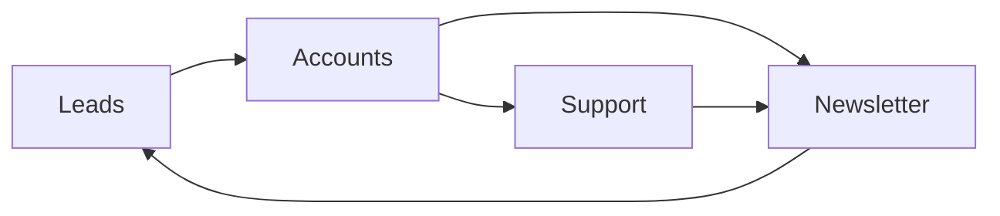

# User Management Apps Overview

User Management apps handle authentication, lead generation, customer support, and communication for your Django-CFG projects.

## Accounts App

**Complete user authentication and account management**

- **🔑 Authentication** - Login, registration, password reset
- **📱 Phone Verification** - SMS-based phone number verification
- **🔄 Social Login** - OAuth integration with major providers
- **👤 Profile Management** - User profiles and preferences
- **🔒 Security** - Two-factor authentication, session management

### Key Features

```python
# User registration with phone verification
from django_cfg.apps.accounts import UserRegistrationService

service = UserRegistrationService()
user = service.register_user(
    email="user@example.com",
    phone="+1234567890",
    password="secure_password"
)
# SMS verification sent automatically
```

---

## Leads App

**Lead generation and conversion tracking**

- **📝 Lead Capture** - Forms and landing page integration
- **📊 Tracking** - Source attribution and conversion metrics
- **🔄 Pipeline Management** - Lead status and qualification
- **📧 Follow-up** - Automated email sequences
- **📈 Analytics** - Lead performance and ROI tracking

### Key Features

```python
# Capture and track leads
from django_cfg.apps.leads import Lead

lead = Lead.objects.create(
    email="prospect@example.com",
    source="website_form",
    campaign="summer_promo",
    metadata={"page": "/pricing", "referrer": "google"}
)
```

---

## 🎧 Support App

**Customer support and ticket management**

- **🎫 Ticketing System** - Multi-channel support tickets
- **💬 Live Chat** - Real-time customer communication
- **📚 Knowledge Base** - Self-service help articles
- **👥 Team Management** - Support agent assignment and routing
- **📊 SLA Tracking** - Response time and resolution metrics

### Key Features

```python
# Create support ticket
from django_cfg.apps.support import Ticket

ticket = Ticket.objects.create(
    customer=user,
    subject="Payment Issue",
    priority=Ticket.Priority.HIGH,
    channel=Ticket.Channel.EMAIL
)
```

---

## Newsletter App

**Email marketing and subscriber management**

- **📮 Subscribers** - Email list management and segmentation
- **📧 Campaigns** - Email campaign creation and scheduling
- **📊 Analytics** - Open rates, click-through rates, conversions
- **🎨 Templates** - Responsive email templates
- **🔄 Automation** - Drip campaigns and triggered emails

### Key Features

```python
# Manage newsletter subscriptions
from django_cfg.apps.newsletter import Subscriber, Campaign

# Add subscriber
subscriber = Subscriber.objects.create(
    email="subscriber@example.com",
    tags=["customer", "premium"],
    preferences={"frequency": "weekly"}
)

# Create campaign
campaign = Campaign.objects.create(
    subject="Monthly Update",
    template="monthly_newsletter",
    segment="active_customers"
)
```

---

## Integration Flow

### Complete Customer Journey

```python
# 1. Lead Capture
lead = Lead.objects.create(email="prospect@example.com")

# 2. Account Registration  
user = UserRegistrationService().convert_lead_to_user(lead)

# 3. Newsletter Subscription
Subscriber.objects.create(email=user.email, user=user)

# 4. Support (if needed)
if user.needs_help():
    Ticket.objects.create(customer=user, subject="Getting Started")
```

### Data Flow Between Apps



## Best Practices

### 1. **Connect Lead to Account**
```python
# Always link leads to user accounts when possible
lead.convert_to_user(email, password)
```

### 2. **Segment Newsletter Subscribers**
```python
# Use tags for targeted campaigns
subscriber.tags.add("premium_customer", "product_user")
```

### 3. **Track Support Interactions**
```python
# Connect support tickets to user journey
ticket = Ticket.objects.create(
    customer=user,
    source_lead=user.original_lead,  # Track back to acquisition
    subject="Feature Request"
)
```

### 4. **Unified User Experience**
```python
# Single dashboard for user management
user_context = {
    'account': user.account,
    'leads': user.lead_history,
    'support_tickets': user.tickets.all(),
    'newsletter_status': user.subscriber.is_active
}
```

## See Also

### Feature Documentation

**User Management Apps:**
- **[Accounts](./accounts)** - Authentication, profiles, OTP verification
- **[Leads](./leads)** - Lead generation, tracking, and conversion
- **[Support](./support)** - Ticketing system, live chat, knowledge base
- **[Newsletter](./newsletter)** - Email marketing and subscriber management

**Related Features:**
- **[Operations Apps](/features/built-in-apps/operations/overview)** - System monitoring and maintenance
- **[AI Knowledge Base](/features/built-in-apps/ai-knowledge/overview)** - Document processing for support
- **[Payment System](/features/built-in-apps/payments/overview)** - Customer billing integration

### Configuration & Setup

**Getting Started:**
- **[Built-in Apps Overview](/features/built-in-apps/overview)** - All production-ready apps
- **[Configuration Guide](/getting-started/configuration)** - Enable user management apps
- **[First Project](/getting-started/first-project)** - Quick start tutorial

**Advanced Configuration:**
- **[Configuration Models](/fundamentals/configuration)** - Complete API reference
- **[Email Configuration](/features/modules/email/overview)** - SMTP setup for notifications
- **[Background Tasks](/features/integrations/dramatiq/overview)** - Async email processing

### Guides & Tutorials

**Practical Guides:**
- **[Production Config](/guides/production-config)** - Production deployment checklist
- **[Migration Guide](/guides/migration-guide)** - Migrate existing user system
- **[Troubleshooting](/guides/troubleshooting)** - Common user management issues

**API & Integration:**
- **[API Generation](/features/api-generation/overview)** - Auto-generate user management clients
- **[CLI Commands](/cli/introduction)** - User management CLI tools

User Management apps provide a complete customer lifecycle solution! 👥
