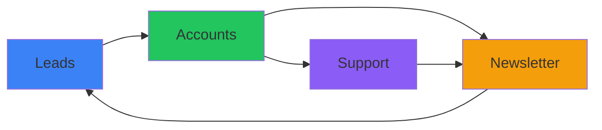

# User Management Extensions

User Management extensions handle authentication, lead generation, customer support, and communication for your Django-CFG projects.

<Callout type="info">
**These are [Extensions](/docs/extensions)**
Located in `extensions/apps/` folder. Enable/disable via `__cfg__.py` files.
</Callout>

## Extensions Overview

| Extension | Location | Description |
|-----------|----------|-------------|
| **Accounts** | `extensions/apps/accounts/` | User authentication, profiles, OAuth |
| **Leads** | `extensions/apps/leads/` | Lead capture, tracking, conversion |
| **Support** | `extensions/apps/support/` | Ticketing system, live chat |
| **Newsletter** | `extensions/apps/newsletter/` | Email marketing, subscribers |

---

## Accounts Extension

**Complete user authentication and account management**

- **🔑 Authentication** - Login, registration, password reset
- **🔄 Social Login** - OAuth integration with major providers
- **👤 Profile Management** - User profiles and preferences
- **🔒 Security** - Two-factor authentication, session management

### Configuration

```python
# extensions/apps/accounts/__cfg__.py
from django_cfg.extensions.configs.apps.base import BaseExtensionSettings

class AccountsSettings(BaseExtensionSettings):
    name: str = "accounts"
    oauth_providers: list[str] = ["google", "github"]

settings = AccountsSettings()
```

### Usage

```python
# User registration
from extensions.apps.accounts.services import UserRegistrationService

service = UserRegistrationService()
user = service.register_user(
    email="user@example.com",
    password="secure_password"
)
```

---

## Leads Extension

**Lead generation and conversion tracking**

- **📝 Lead Capture** - Forms and landing page integration
- **📊 Tracking** - Source attribution and conversion metrics
- **🔄 Pipeline Management** - Lead status and qualification
- **📧 Follow-up** - Automated email sequences
- **📈 Analytics** - Lead performance and ROI tracking

### Configuration

```python
# extensions/apps/leads/__cfg__.py
from django_cfg.extensions.configs.apps.leads import BaseLeadsSettings

class LeadsSettings(BaseLeadsSettings):
    telegram_enabled: bool = True
    telegram_bot_token: str = env.telegram.bot_token
    email_notifications: bool = True

settings = LeadsSettings()
```

### Usage

```python
# Capture and track leads
from extensions.apps.leads.models import Lead

lead = Lead.objects.create(
    email="prospect@example.com",
    source="website_form",
    campaign="summer_promo",
    metadata={"page": "/pricing", "referrer": "google"}
)
```

---

## Support Extension

**Customer support and ticket management**

- **🎫 Ticketing System** - Multi-channel support tickets
- **💬 Live Chat** - Real-time customer communication
- **📚 Knowledge Base** - Self-service help articles
- **👥 Team Management** - Support agent assignment and routing
- **📊 SLA Tracking** - Response time and resolution metrics

### Configuration

```python
# extensions/apps/support/__cfg__.py
from django_cfg.extensions.configs.apps.support import BaseSupportSettings

class SupportSettings(BaseSupportSettings):
    auto_assign: bool = True
    sla_response_hours: int = 24
    enable_live_chat: bool = True

settings = SupportSettings()
```

### Usage

```python
# Create support ticket
from extensions.apps.support.models import Ticket

ticket = Ticket.objects.create(
    customer=user,
    subject="Payment Issue",
    priority=Ticket.Priority.HIGH,
    channel=Ticket.Channel.EMAIL
)
```

---

## Newsletter Extension

**Email marketing and subscriber management**

- **📮 Subscribers** - Email list management and segmentation
- **📧 Campaigns** - Email campaign creation and scheduling
- **📊 Analytics** - Open rates, click-through rates, conversions
- **🎨 Templates** - Responsive email templates
- **🔄 Automation** - Drip campaigns and triggered emails

### Configuration

```python
# extensions/apps/newsletter/__cfg__.py
from django_cfg.extensions.configs.apps.newsletter import BaseNewsletterSettings

class NewsletterSettings(BaseNewsletterSettings):
    default_from_email: str = "newsletter@example.com"
    unsubscribe_page: str = "/unsubscribe"

settings = NewsletterSettings()
```

### Usage

```python
# Manage newsletter subscriptions
from extensions.apps.newsletter.models import Subscriber, Campaign

# Add subscriber
subscriber = Subscriber.objects.create(
    email="subscriber@example.com",
    tags=["customer", "premium"],
    preferences={"frequency": "weekly"}
)

# Create campaign
campaign = Campaign.objects.create(
    subject="Monthly Update",
    template="monthly_newsletter",
    segment="active_customers"
)
```

---

## Integration Flow

### Complete Customer Journey

```python
from extensions.apps.leads.models import Lead
from extensions.apps.accounts.services import UserRegistrationService
from extensions.apps.newsletter.models import Subscriber
from extensions.apps.support.models import Ticket

# 1. Lead Capture
lead = Lead.objects.create(email="prospect@example.com", source="landing_page")

# 2. Account Registration
user = UserRegistrationService().convert_lead_to_user(lead)

# 3. Newsletter Subscription
Subscriber.objects.create(email=user.email, user=user)

# 4. Support (if needed)
if user.needs_help():
    Ticket.objects.create(customer=user, subject="Getting Started")
```

### Data Flow Between Extensions



---

## Enable/Disable Extensions

Each extension is controlled by its `__cfg__.py` file:

```python
# To ENABLE - define settings
settings = LeadsSettings()

# To DISABLE - comment out settings
# settings = LeadsSettings()
```

---

## Best Practices

### 1. Connect Lead to Account

```python
# Always link leads to user accounts when possible
lead.convert_to_user(email, password)
```

### 2. Segment Newsletter Subscribers

```python
# Use tags for targeted campaigns
subscriber.tags.add("premium_customer", "product_user")
```

### 3. Track Support Interactions

```python
# Connect support tickets to user journey
ticket = Ticket.objects.create(
    customer=user,
    source_lead=user.original_lead,
    subject="Feature Request"
)
```

### 4. Unified User Experience

```python
# Single dashboard for user management
user_context = {
    'account': user.account,
    'leads': user.lead_history,
    'support_tickets': user.tickets.all(),
    'newsletter_status': user.subscriber.is_active
}
```

---

## See Also

### Extension Documentation

- **[Accounts](../accounts)** - Authentication, profiles, OAuth
- **[Leads](../leads)** - Lead generation, tracking, and conversion
- **[Support](../support)** - Ticketing system, live chat, knowledge base
- **[Newsletter](../newsletter)** - Email marketing and subscriber management

### Related Extensions

- **[Operations](/docs/features/built-in-apps/operations/overview)** - System monitoring and maintenance
- **[AI Knowledge Base](/docs/features/built-in-apps/ai-knowledge/overview)** - Document processing for support
- **[Payments](/docs/features/built-in-apps/payments/overview)** - Customer billing integration

### Configuration & Setup

- **[Extensions System](/docs/extensions)** - How extensions work
- **[Backend Extensions](/docs/extensions/backend-extensions)** - Creating custom extensions
- **[Email Configuration](/docs/features/modules/email/overview)** - SMTP setup for notifications
- **[Background Tasks](/docs/features/integrations/django-rq/overview)** - Async email processing
