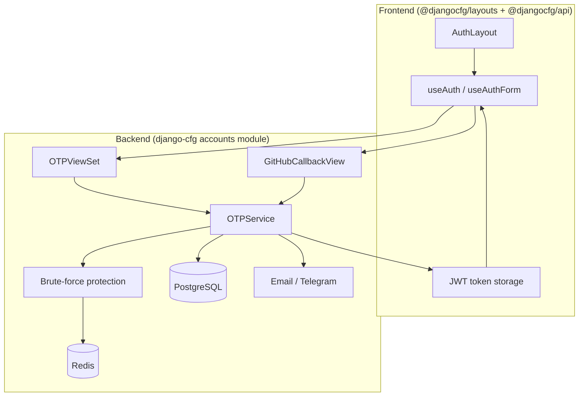
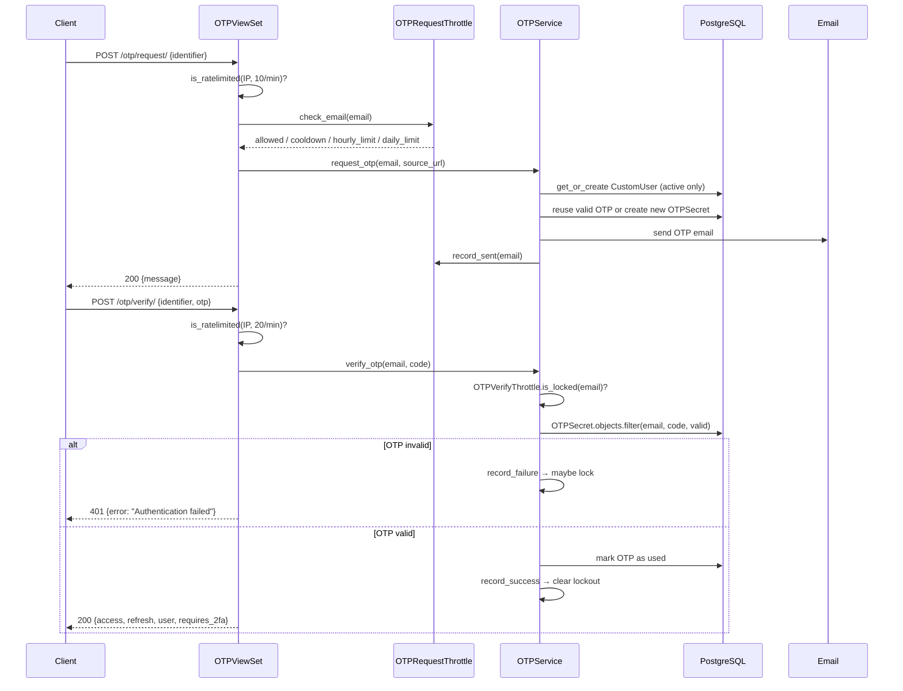
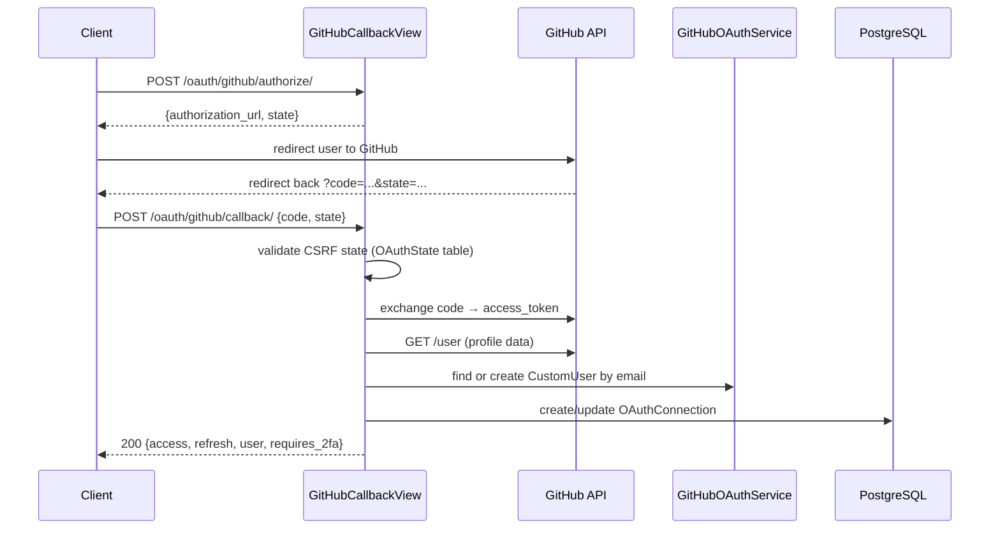
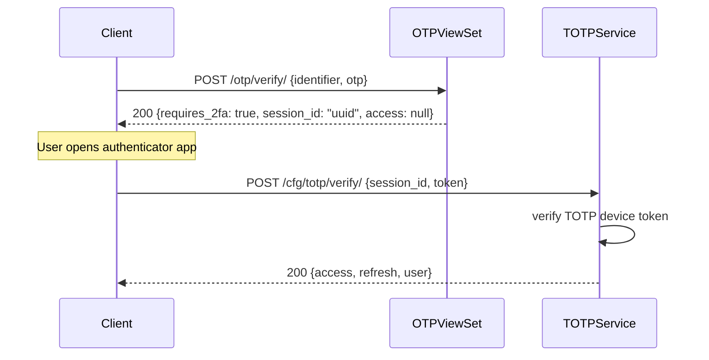
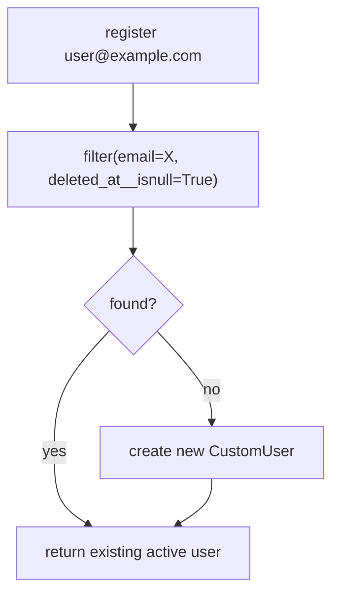
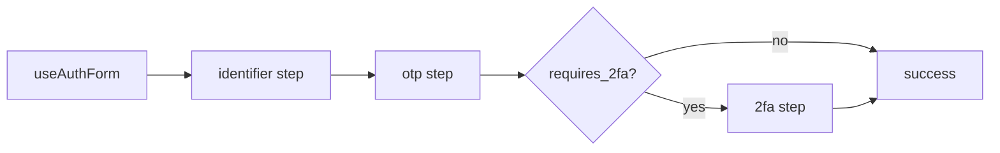
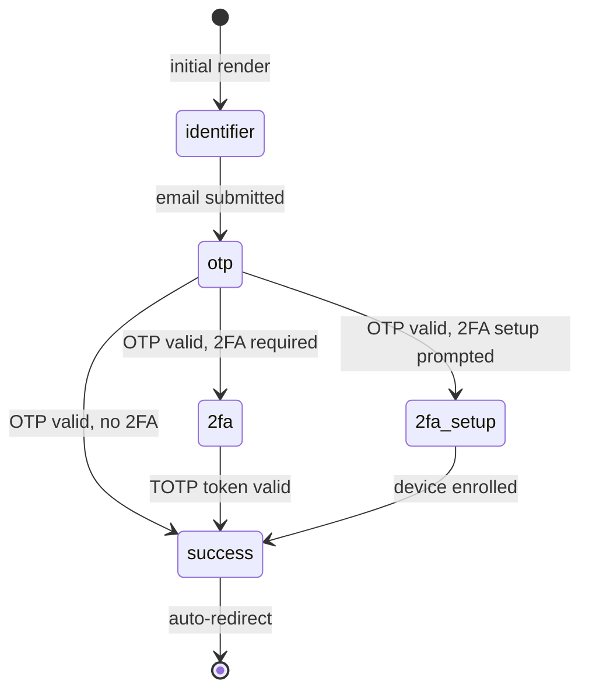
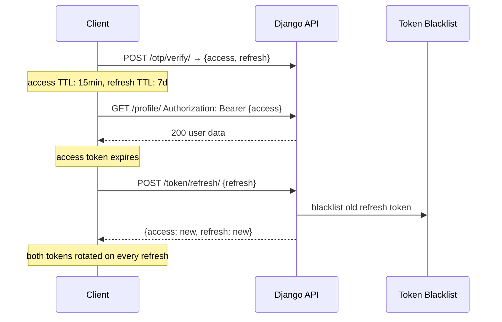
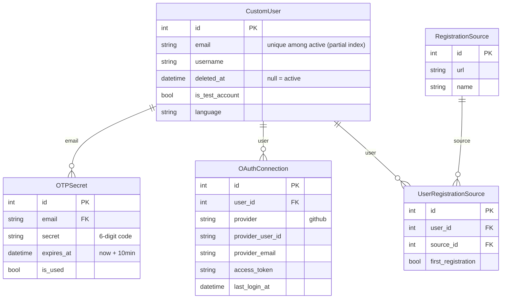

import { Callout, Steps, Tabs } from 'nextra/components'

# Authentication System — Architecture

This document covers the full authentication stack in django-cfg: how the backend modules work, how abuse protection is layered, and how the frontend (`@djangocfg/api` + `@djangocfg/layouts`) plugs in out of the box.

<Callout type="info">
For configuration reference see [Authentication](/features/integrations/auth) and [OAuth](/features/integrations/oauth). This page is a developer-oriented deep-dive into how the system works internally.
</Callout>

---

## System Overview



---

## OTP Authentication Flow

The core authentication strategy: email → 6-digit code → JWT tokens.



### Key design decisions

- **Anti-enumeration:** All failure paths return identical `HTTP 401 {"error": "Authentication failed"}` — wrong OTP, expired OTP, and unknown email are indistinguishable to the client.
- **OTP reuse:** If a valid unexpired OTP exists for the email, a re-request returns the same code rather than generating a new one. This reduces SMTP load and avoids confusing users with multiple codes.
- **Active-only lookup:** `OTPService` always queries `CustomUser.objects.filter(deleted_at__isnull=True)` — soft-deleted accounts cannot authenticate.

---

## OAuth (GitHub) Flow



The callback response is identical in structure to `otp/verify/` — the frontend `useAuth` hook handles both transparently.

---

## 2FA Flow (TOTP)

When both system-wide 2FA is enabled and the user has an active TOTP device:



`session_id` is a short-lived UUID stored in cache — it bridges the OTP verification and TOTP verification steps without issuing tokens prematurely.

---

## Brute-Force Protection Layers

```mermaid
graph LR
    REQ[Request] --> L1

    subgraph L1["Layer 1: IP Rate Limit (django-ratelimit)"]
        IP1["/otp/request/ → 10/min"]
        IP2["/otp/verify/ → 20/min"]
        IP3["/oauth/callback/ → 10/min"]
    end

    L1 -->|pass| L2

    subgraph L2["Layer 2: Per-Email Throttle (OTPRequestThrottle)"]
        C1[Cooldown: 60s between resends]
        C2[Hourly budget: 5 requests]
        C3[Daily budget: 10 requests]
    end

    L2 -->|pass| L3

    subgraph L3["Layer 3: Lockout (OTPVerifyThrottle)"]
        F1[5 failed attempts → 15-min lockout]
        F2[Success clears counter]
    end

    L3 -->|pass| SVC[OTPService]
```



All per-email state is stored in Redis using **SHA-256 hashed keys** — no PII in cache:

```python
key = f"otp:cooldown:{sha256(email.lower())[:16]}"
# e.g. "otp:cooldown:b4c9a289323b21a0"
```

---

## Soft Delete & Email Uniqueness

`CustomUser` uses a **partial unique constraint** instead of a global `UNIQUE` on email:

```sql
-- Migration 0015
CREATE UNIQUE INDEX unique_active_email
ON django_cfg_accounts_customuser (email)
WHERE deleted_at IS NULL;
```

This allows multiple deleted accounts to share the same email (historical archive) while preventing duplicate active accounts.



Re-registering after deletion creates a **fresh account** — the deleted one is archived, not reactivated.

---

## Frontend Integration

### `@djangocfg/api` — Authentication hooks

The `@djangocfg/api` package provides a complete authentication client:

```typescript
import { useAuth, useAuthForm } from '@djangocfg/api/auth'

// Full auth state
const { user, isAuthenticated, logout } = useAuth()

// Auth form with OTP + OAuth + 2FA steps
const form = useAuthForm({
  onSuccess: (user) => router.push('/dashboard'),
  githubOAuthEnabled: true,
})
```

Token management is automatic — access token refresh, rotation, and blacklist handling are transparent to the caller. Tokens are shared across all packages via a single storage layer.



### `@djangocfg/layouts` — AuthLayout

`AuthLayout` implements the full multi-step auth UI out of the box:

```tsx
import { AuthLayout } from '@djangocfg/layouts'

export default function LoginPage() {
  return (
    <AuthLayout
      githubOAuthEnabled={true}
      redirectUrl="/dashboard"
      onSuccess={(user) => console.log('logged in', user)}
    />
  )
}
```

The layout automatically routes between steps based on server responses:



**Available steps** (rendered by `AuthContent` in `AuthLayout.tsx`):
- `identifier` — email input
- `otp` — 6-digit code input
- `2fa` — TOTP authenticator code
- `2fa-setup` — enroll a new TOTP device
- `success` — confirmation screen with auto-redirect

---

## JWT Token Lifecycle



`ROTATE_REFRESH_TOKENS = True` and `BLACKLIST_AFTER_ROTATION = True` are enabled by default. Reusing a blacklisted refresh token signals theft — the token is rejected immediately.

The `cleanup_jwt_blacklist` RQ job runs daily at 03:00 UTC to purge expired entries from the blacklist table.

---

## Data Model



---

## Background Jobs (RQ)

Auto-registered when `DjangoRQConfig.enabled = True`:

| Job | Cron | Queue | Purpose |
|-----|------|-------|---------|
| `cleanup_expired_otps` | `*/10 * * * *` | low | Delete expired/used `OTPSecret` rows |
| `cleanup_jwt_blacklist` | `0 3 * * *` | low | Flush expired JWT blacklist entries |

Both jobs are idempotent and safe to run manually.

---

## Quick Reference

### Backend entry points

| Layer | File | Role |
|-------|------|------|
| Views | `accounts/views/otp.py` | OTP request + verify endpoints |
| Views | `accounts/views/oauth.py` | GitHub OAuth endpoints |
| Service | `accounts/services/otp_service.py` | Core auth logic |
| Protection | `accounts/services/brute_force_service.py` | `OTPRequestThrottle`, `OTPVerifyThrottle` |
| Cleanup | `accounts/services/cleanup_service.py` | RQ jobs |
| Model | `accounts/models/user.py` | `CustomUser`, soft-delete |
| Model | `accounts/models/auth.py` | `OTPSecret` |
| Migration | `accounts/migrations/0015_*.py` | Partial unique email constraint |

### Frontend entry points

| Package | Import | Role |
|---------|--------|------|
| `@djangocfg/api` | `useAuth` | Auth state, logout |
| `@djangocfg/api` | `useAuthForm` | OTP + OAuth + 2FA form flow |
| `@djangocfg/api` | `useAuthGuard` | Route protection |
| `@djangocfg/layouts` | `AuthLayout` | Complete auth UI (all steps) |
| `@djangocfg/layouts` | `PrivateLayout` | Authenticated page wrapper |

### Related docs

- [Authentication configuration](/features/integrations/auth) — JWT settings, OTP config
- [OAuth integration](/features/integrations/oauth) — GitHub OAuth setup
- [Accounts app reference](/features/built-in-apps/user-management/accounts) — API endpoints, models
- [2FA setup guide](/features/integrations/auth#two-factor-authentication) — TOTP configuration
