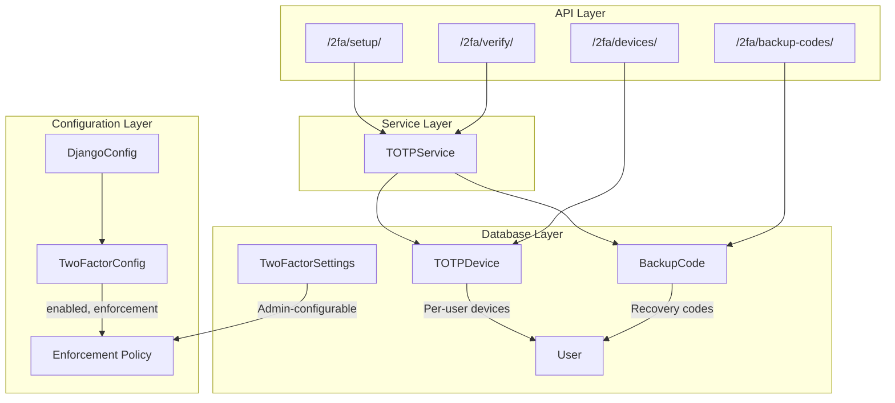
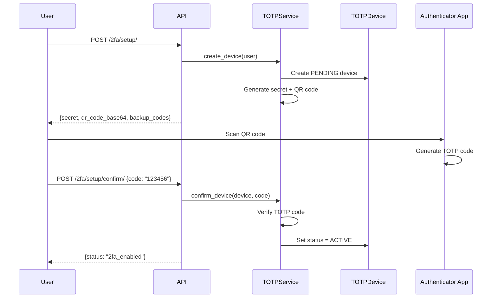
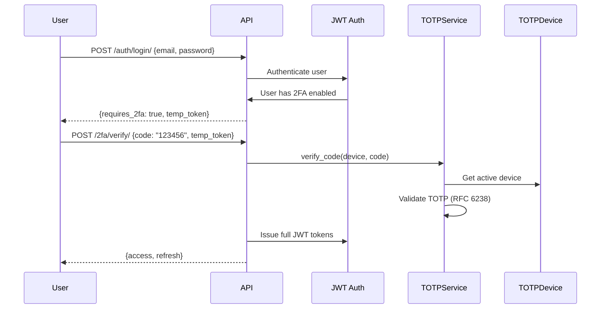
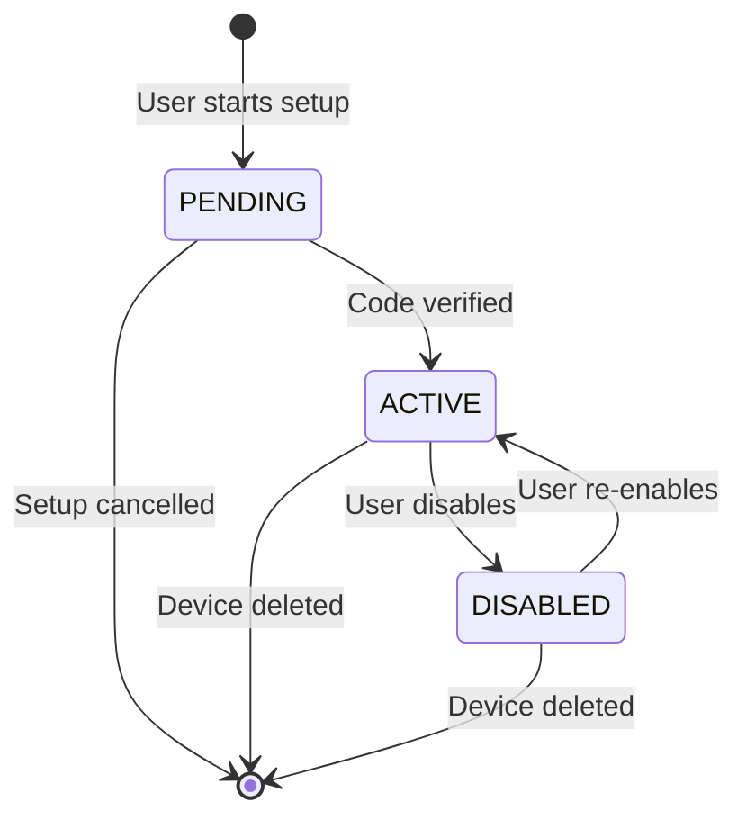

# 🔐 Authentication Integration

## Overview

Django-CFG provides a comprehensive authentication system with:

- **JWT Tokens** - Stateless authentication with configurable lifetimes
- **OTP Login** - Passwordless login via email
- **Two-Factor Authentication (2FA)** - TOTP-based second factor using authenticator apps
- **OAuth** - Social login (GitHub, etc.)

## JWT Configuration


Django CFG provides comprehensive JWT authentication configuration through the `JWTConfig` class, offering type-safe, environment-aware JWT token management.

## Quick Start

```python
from django_cfg import DjangoConfig, JWTConfig

class MyConfig(DjangoConfig):
    project_name: str = "My Project"
    
    # JWT Configuration
    jwt: JWTConfig = JWTConfig(
        access_token_lifetime_hours=24,
        refresh_token_lifetime_days=30,
    )

config = MyConfig()
```

## Configuration Options

### Token Lifetimes

```python
jwt: JWTConfig = JWTConfig(
    # Token lifetimes
    access_token_lifetime_hours=24,      # 1-8760 hours (1 year max)
    refresh_token_lifetime_days=30,      # 1-365 days (1 year max)
    
    # Token rotation
    rotate_refresh_tokens=True,          # Rotate tokens on refresh
    blacklist_after_rotation=True,       # Blacklist old tokens
)
```

### Security Settings

```python
jwt: JWTConfig = JWTConfig(
    # Security
    algorithm="HS256",                   # JWT signing algorithm
    update_last_login=True,              # Update user's last login
    leeway=0,                           # Token expiration leeway (seconds)
    
    # Optional claims
    audience="my-app",                   # JWT audience claim
    issuer="my-company",                 # JWT issuer claim
)
```

### Token Claims

```python
jwt: JWTConfig = JWTConfig(
    # Claims configuration
    user_id_field="id",                  # User model field for ID
    user_id_claim="user_id",             # JWT claim name for user ID
    token_type_claim="token_type",       # JWT claim name for token type
    jti_claim="jti",                     # JWT claim name for token ID
)
```

### Authentication Headers

```python
jwt: JWTConfig = JWTConfig(
    # Header configuration
    auth_header_types=("Bearer",),       # Accepted header types
    auth_header_name="HTTP_AUTHORIZATION", # HTTP header name
)
```

## Environment-Aware Configuration

JWT configuration automatically adapts to different environments:

### Development Environment
```python
# Automatically configured for development
jwt_dev = jwt_config.configure_for_environment("development", debug=True)
# Result: 1 hour access, 7 days refresh, 30s leeway
```

### Production Environment
```python
# Automatically configured for production
jwt_prod = jwt_config.configure_for_environment("production", debug=False)
# Result: 24 hours access, 30 days refresh, 0s leeway
```

### Testing Environment
```python
# Automatically configured for testing
jwt_test = jwt_config.configure_for_environment("testing")
# Result: 1 hour access, 1 day refresh, no rotation
```

## Advanced Usage

### Custom Environment Configuration

```python
class MyConfig(DjangoConfig):
    jwt: JWTConfig = JWTConfig()
    
    def __post_init__(self):
        # Configure JWT based on environment
        if self.debug:
            # Development: short-lived tokens
            self.jwt = self.jwt.configure_for_environment("development", True)
        else:
            # Production: long-lived tokens
            self.jwt = self.jwt.configure_for_environment("production", False)
```

### Token Information

```python
# Get human-readable token info
token_info = config.jwt.get_token_info()
print(token_info)
# Output: {
#     'access_token': '24 hours',
#     'refresh_token': '30 days', 
#     'algorithm': 'HS256',
#     'rotation': 'enabled'
# }
```

### Manual Django Settings

If you need to access the raw Django settings:

```python
# Get Django SIMPLE_JWT settings
jwt_settings = config.jwt.to_django_settings(config.secret_key)
print(jwt_settings['SIMPLE_JWT']['ACCESS_TOKEN_LIFETIME'])
# Output: datetime.timedelta(hours=24)
```

## Supported Algorithms

- **HMAC**: HS256, HS384, HS512
- **RSA**: RS256, RS384, RS512  
- **ECDSA**: ES256, ES384, ES512

## Integration with Django REST Framework

The JWT configuration automatically integrates with `djangorestframework-simplejwt`:

```python
# In your DRF views
from rest_framework_simplejwt.views import TokenObtainPairView

class CustomTokenObtainPairView(TokenObtainPairView):
    # Automatically uses your JWT configuration
    pass
```

## Best Practices

### 1. Environment-Specific Lifetimes
```python
class MyConfig(DjangoConfig):
    jwt: JWTConfig = JWTConfig(
        # Short tokens for development
        access_token_lifetime_hours=1 if debug else 24,
        refresh_token_lifetime_days=7 if debug else 30,
    )
```

### 2. Security in Production
```python
class ProductionConfig(DjangoConfig):
    jwt: JWTConfig = JWTConfig(
        algorithm="RS256",              # Use RSA for production
        leeway=0,                       # No leeway in production
        rotate_refresh_tokens=True,     # Always rotate tokens
        blacklist_after_rotation=True, # Blacklist old tokens
    )
```

### 3. Testing Configuration
```python
class TestConfig(DjangoConfig):
    jwt: JWTConfig = JWTConfig(
        access_token_lifetime_hours=1,
        refresh_token_lifetime_days=1,
        rotate_refresh_tokens=False,    # Simpler for tests
        blacklist_after_rotation=False,
    )
```

## Troubleshooting

### Token Expiration Issues
```python
# Check current token lifetimes
print(f"Access token: {config.jwt.access_token_lifetime_hours} hours")
print(f"Refresh token: {config.jwt.refresh_token_lifetime_days} days")
```

### Algorithm Validation Errors
```python
# Ensure you're using a supported algorithm
try:
    jwt_config = JWTConfig(algorithm="INVALID")
except ValueError as e:
    print(f"Invalid algorithm: {e}")
```

### Environment Detection
```python
# Verify environment configuration
env_jwt = config.jwt.configure_for_environment("production")
print(f"Production access token: {env_jwt.access_token_lifetime_hours} hours")
```

## Migration from Manual Configuration

### Before (Manual SIMPLE_JWT)
```python
# settings.py
SIMPLE_JWT = {
    'ACCESS_TOKEN_LIFETIME': timedelta(hours=24),
    'REFRESH_TOKEN_LIFETIME': timedelta(days=30),
    'ROTATE_REFRESH_TOKENS': True,
    # ... many more settings
}
```

### After (Django CFG)
```python
# config.py
class MyConfig(DjangoConfig):
    jwt: JWTConfig = JWTConfig(
        access_token_lifetime_hours=24,
        refresh_token_lifetime_days=30,
    )
    # All other settings are automatically configured!
```

## Related Documentation

- [Django REST Framework Simple JWT](https://django-rest-framework-simplejwt.readthedocs.io/)
- [JWT.io](https://jwt.io/) - JWT token debugger
- [Django CFG Core Configuration](/docs/fundamentals/configuration)

## OTP Authentication

## Architecture

### Core Components

1. **OTPService** - Central service handling OTP generation and verification
2. **OTPSecret Model** - Unified OTP storage supporting multiple channels
3. **CustomUser Model** - Extended user model with phone support
4. **AccountNotifications** - Multi-channel notification system

### Channel Support

- **Email Channel**: Traditional email-based OTP delivery
- **Auto-detection**: Automatic channel detection based on identifier format

## User Creation Strategy

### Email Authentication
When a user authenticates via email:
```python
email = "user@example.com"
username = "generated_username"  # Auto-generated
```

## API Endpoints

### Request OTP

**Endpoint**: `POST /accounts/otp/request/`

**New Format** (Recommended):
```json
{
  "identifier": "+1234567890",  // or "user@example.com"
  "channel": "phone",           // or "email" (optional, auto-detected)
  "source_url": "https://reforms.ai"
}
```


### Verify OTP

**Endpoint**: `POST /accounts/otp/verify/`

**New Format** (Recommended):
```json
{
  "identifier": "+1234567890",  // or "user@example.com"
  "otp": "123456",
  "channel": "phone",           // or "email" (optional, auto-detected)
  "source_url": "https://reforms.ai"
}
```

**Legacy Format** (Backward Compatible):
```json
{
  "email": "user@example.com",  // For email
  "phone": "+1234567890",       // For phone
  "otp": "123456",
  "source_url": "https://reforms.ai"
}
```

## Service Layer

### OTPService Methods

```python
# Email OTP (convenience methods)
success, error = OTPService.request_email_otp(email, source_url)
user = OTPService.verify_email_otp(email, otp_code, source_url)

# Phone OTP (convenience methods)  
success, error = OTPService.request_phone_otp(phone, source_url)
user = OTPService.verify_phone_otp(phone, otp_code, source_url)

# Unified methods (auto-detect channel)
success, error = OTPService.request_otp(identifier, channel, source_url)
user = OTPService.verify_otp(identifier, otp_code, channel, source_url)
```

### Phone Validation

The system validates phone numbers using E.164 format:
- Must start with `+`
- Must have country code (1-9)
- Must have 7-15 total digits
- Supports common formatting: spaces, dashes, parentheses

**Valid Examples**:
- `+1234567890`
- `+1 (555) 123-4567`
- `+44 20 7946 0958`

**Invalid Examples**:
- `1234567890` (missing +)
- `+0234567890` (starts with 0)
- `+12` (too short)

## Database Schema

### OTPSecret Model

```python
class OTPSecret(models.Model):
    # Legacy field (backward compatibility)
    email = models.EmailField(db_index=True, blank=True, null=True)
    
    # New unified fields
    channel_type = models.CharField(max_length=10, choices=[
        ('email', 'Email'),
        ('phone', 'Phone'),
    ])
    recipient = models.CharField(max_length=255, db_index=True)
    
    # OTP data
    secret = models.CharField(max_length=6)
    created_at = models.DateTimeField(auto_now_add=True)
    expires_at = models.DateTimeField()
    is_used = models.BooleanField(default=False)
```

### CustomUser Model

```python
class CustomUser(AbstractUser):
    # Helper method
    def get_identifier_for_otp(self, channel='email'):
        return self.email if self.email else None
```

## Notification System

### Email Notifications (Client)
- Contains OTP code, verification link, and professional template
- Uses configured email backend

### Telegram Notifications (Admin)
- Sent to admin channels for monitoring
- **Security**: Does NOT include OTP codes
- Includes user info, channel type, and timestamp

```python
# Client notification
AccountNotifications.send_otp_notification(user, otp_code)

# Admin Telegram (no OTP code)
DjangoTelegram.send_info("🔑📱 Phone OTP Login Request", {
    "phone": phone_number,
    "user_type": "New User" if is_new_user else "Existing User",
    "timestamp": "2025-09-15 18:41:52 UTC"
})
```

## Error Handling

### Common Error Types

- `invalid_email` - Invalid email format
- `invalid_phone` - Invalid phone number format  
- `user_creation_failed` - Database error during user creation
- `email_send_failed` - Email delivery failure

### Response Formats

**Success Response**:
```json
{
  "message": "OTP sent to your phone number"
}
```

**Error Response**:
```json
{
  "error": "Invalid phone number"
}
```

**Verification Success**:
```json
{
  "refresh": "jwt_refresh_token",
  "access": "jwt_access_token",
  "user": {
    "id": 1,
    "email": "user@example.com",
    "full_name": "",
    "date_joined": "2025-09-15T18:41:52Z"
  }
}
```

## Security Considerations

### OTP Security
- 6-digit numeric codes
- 10-minute expiration
- Single-use only
- Rate limiting (reuses active OTP)

### Phone Number Security
- E.164 format validation
- Country code verification
- No international premium numbers

### Data Privacy
- Temporary emails for phone users
- Admin notifications exclude OTP codes
- Phone numbers stored securely
- GDPR compliance ready

## Testing

### Service Layer Tests
```python
# Email OTP tests
def test_request_email_otp_new_user(self):
    success, error_type = OTPService.request_email_otp("user@example.com")
    self.assertTrue(success)

def test_verify_email_otp_success(self):
    user = OTPService.verify_email_otp("user@example.com", "123456")
    self.assertIsNotNone(user)
```

### API Tests
```python
# Views tests
def test_email_otp_request_api(self):
    response = self.client.post('/accounts/otp/request/', {
        "identifier": "user@example.com",
        "channel": "email"
    })
    self.assertEqual(response.status_code, 200)
```

## Migration Strategy

### Backward Compatibility
- Legacy `email` field preserved in OTPSecret
- Old API format still supported
- Gradual migration path available

### Database Migration
```sql
-- Add new fields
ALTER TABLE otpsecret ADD COLUMN channel_type VARCHAR(10) DEFAULT 'email';
ALTER TABLE otpsecret ADD COLUMN recipient VARCHAR(255);

-- Populate recipient field
UPDATE otpsecret SET recipient = email WHERE email IS NOT NULL;
```

## Monitoring & Analytics

### Logging
- OTP request/verification events
- Channel usage statistics  
- Error tracking and analysis
- Performance metrics

### Admin Interface
- OTP management dashboard
- Channel-based filtering
- Bulk operations support

## Future Enhancements

### Planned Features
- Voice call OTP delivery  
- Multi-factor authentication
- Backup authentication codes
- International phone validation
- Carrier detection and routing

### API Evolution
- GraphQL support
- Webhook notifications
- Real-time OTP status
- Advanced rate limiting
- Fraud detection integration

---

## Two-Factor Authentication (2FA)

Django-CFG provides a complete TOTP-based two-factor authentication system that works with authenticator apps like Google Authenticator, Authy, or Microsoft Authenticator.

### Architecture Overview



### Configuration

Configure 2FA through `TwoFactorConfig` in your project config:

```python
from django_cfg import DjangoConfig
from django_cfg.models.api.twofactor import TwoFactorConfig

class MyConfig(DjangoConfig):
    project_name: str = "My Project"

    # Two-Factor Authentication
    two_factor: TwoFactorConfig = TwoFactorConfig(
        enabled=True,                      # Enable 2FA system-wide
        enforcement="optional",            # See enforcement modes below
        session_lifetime_minutes=5,        # 2FA verification timeout
        max_failed_attempts=5,             # Attempts before lockout
        grace_period_days=7,               # Days before mandatory (if required)
        allow_totp=True,                   # Allow authenticator apps
        allow_backup_codes=True,           # Allow backup code recovery
        backup_codes_count=10,             # Number of backup codes
        issuer_name="My App",              # Name shown in authenticator
    )
```

### Enforcement Modes

| Mode | Description | Use Case |
|------|-------------|----------|
| `optional` | Users can enable 2FA voluntarily | Default for most apps |
| `encouraged` | Users are prompted but not required | Security-conscious apps |
| `required` | All users must have 2FA enabled | High-security environments |
| `admin_only` | Only staff/superusers must have 2FA | Admin panel protection |

### 2FA Setup Flow



### 2FA Verification Flow



### API Endpoints

| Endpoint | Method | Description |
|----------|--------|-------------|
| `/cfg/2fa/setup/` | POST | Initialize 2FA setup, get QR code |
| `/cfg/2fa/setup/confirm/` | POST | Confirm setup with initial code |
| `/cfg/2fa/verify/` | POST | Verify TOTP code during login |
| `/cfg/2fa/verify/backup/` | POST | Verify using backup code |
| `/cfg/2fa/devices/` | GET | List user's 2FA devices |
| `/cfg/2fa/devices/{id}/` | DELETE | Remove a 2FA device |
| `/cfg/2fa/backup-codes/` | GET | Get backup codes status |
| `/cfg/2fa/backup-codes/regenerate/` | POST | Generate new backup codes |

### Service Layer

```python
from django_cfg.apps.system.totp.services import TOTPService

# Create new TOTP device for user
device = TOTPService.create_device(
    user=user,
    name="My Phone",
    make_primary=True
)

# Get QR code for authenticator app
provisioning_uri = TOTPService.get_provisioning_uri(device, issuer="MyApp")
qr_code_base64 = TOTPService.generate_qr_code(provisioning_uri, format="base64")

# Verify TOTP code from authenticator
is_valid = TOTPService.verify_code(device, code="123456")

# Confirm device setup (activates device)
success = TOTPService.confirm_device(device, code="123456")
```

### Device Lifecycle



### Backup Codes

Backup codes provide recovery access when the user loses their authenticator device:

```python
from django_cfg.apps.system.totp.services import BackupCodeService

# Generate backup codes (during setup or regeneration)
codes = BackupCodeService.generate_codes(user, count=10)
# Returns: ["XXXX-XXXX", "YYYY-YYYY", ...]

# Verify backup code (single-use)
is_valid = BackupCodeService.verify_code(user, code="XXXX-XXXX")
# Returns True and marks code as used
```

### Admin Configuration

2FA settings can be configured both through code (`TwoFactorConfig`) and Django Admin (`TwoFactorSettings`):

```python
# Get current settings (combines config + admin settings)
from django_cfg.apps.system.accounts.models import TwoFactorSettings

settings = TwoFactorSettings.get_settings()

# Check if user requires 2FA
requires_2fa = settings.user_requires_2fa(user)

# Check if user should be prompted for 2FA
should_prompt = settings.user_should_prompt_2fa(user)
```

The `TwoFactorSettings` model in Django Admin allows runtime modification of:
- Enable/disable 2FA globally
- Change enforcement policy
- Adjust session timeout and lockout settings
- Configure allowed verification methods

### Security Best Practices

1. **Use `required` or `admin_only` for sensitive applications**
2. **Set reasonable `session_lifetime_minutes`** (5-10 minutes recommended)
3. **Limit `max_failed_attempts`** to prevent brute-force attacks
4. **Store backup codes securely** - show only once during setup
5. **Monitor failed 2FA attempts** via admin or logging

### Integration Example

Complete login flow with 2FA:

```python
# views.py
from rest_framework.views import APIView
from rest_framework.response import Response
from django_cfg.apps.system.accounts.models import TwoFactorSettings
from django_cfg.apps.system.totp.services import TOTPService

class LoginView(APIView):
    def post(self, request):
        # Step 1: Authenticate with credentials
        user = authenticate(
            email=request.data.get("email"),
            password=request.data.get("password")
        )

        if not user:
            return Response({"error": "Invalid credentials"}, status=401)

        # Step 2: Check if 2FA is required
        settings = TwoFactorSettings.get_settings()
        has_2fa = TOTPService.user_has_active_device(user)

        if has_2fa:
            # Return temporary token for 2FA verification
            temp_token = generate_temp_token(user)
            return Response({
                "requires_2fa": True,
                "temp_token": temp_token
            })

        # Step 3: Issue JWT tokens (no 2FA)
        tokens = generate_jwt_tokens(user)
        return Response(tokens)


class Verify2FAView(APIView):
    def post(self, request):
        temp_token = request.data.get("temp_token")
        code = request.data.get("code")

        user = verify_temp_token(temp_token)
        device = TOTPService.get_primary_device(user)

        if TOTPService.verify_code(device, code):
            tokens = generate_jwt_tokens(user)
            return Response(tokens)

        return Response({"error": "Invalid 2FA code"}, status=401)
```

---

## Quick Reference

### Key Files

**OTP Authentication:**
- `accounts/models.py` - CustomUser, OTPSecret models
- `accounts/services/otp_service.py` - Core OTP logic
- `accounts/utils/notifications.py` - Notification system
- `accounts/serializers/otp.py` - API serializers
- `accounts/views/otp.py` - REST API endpoints

**Two-Factor Authentication:**
- `totp/models/device.py` - TOTPDevice, BackupCode models
- `totp/services/totp_service.py` - TOTP generation/verification
- `totp/views/` - 2FA API endpoints
- `accounts/models/settings.py` - TwoFactorSettings (admin-configurable)
- `models/api/twofactor.py` - TwoFactorConfig (Pydantic config)

### Dependencies
- `django-rest-framework` - API framework
- `django-rest-framework-simplejwt` - JWT tokens
- `pydantic` - Configuration validation
- `pyotp` - TOTP implementation (RFC 6238)
- `qrcode` - QR code generation

---

*Last updated: December 2025*
*Version: 2.0.0*
*Author: Django-CFG Team*
