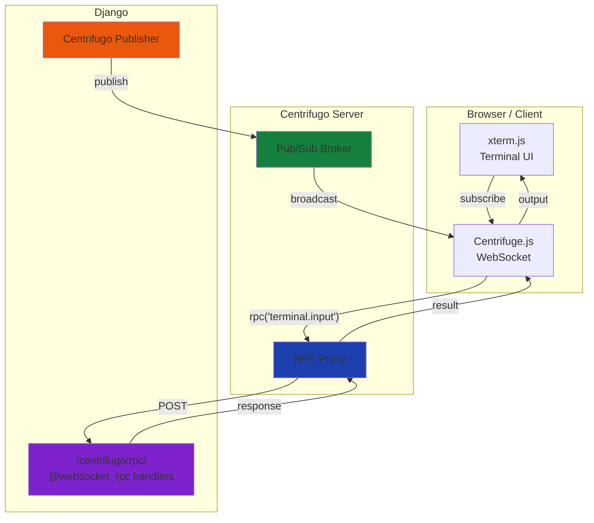
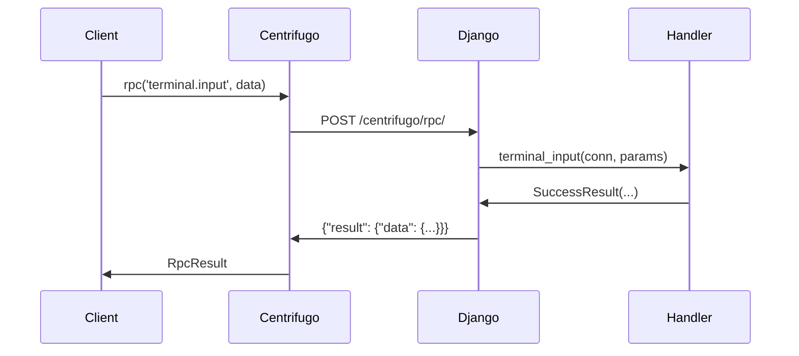
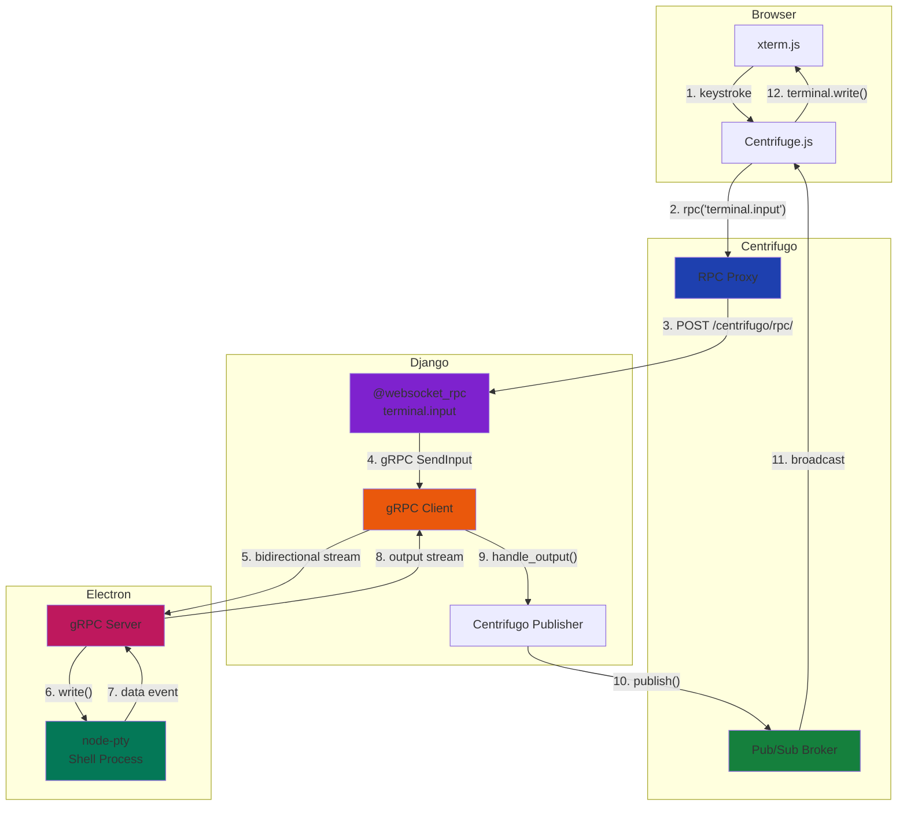
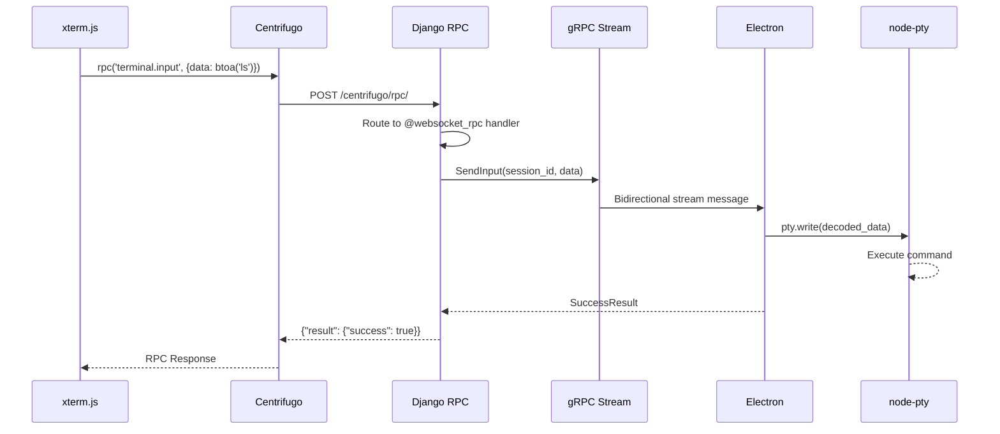
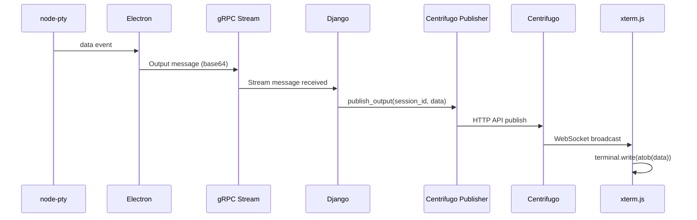

# Architecture

Understanding the Centrifugo WebSocket integration architecture with native RPC proxy and pub/sub patterns.

## Overview

Django-CFG uses **two communication patterns** with Centrifugo:

1. **RPC Proxy** - For request/response operations (input, commands)
2. **Pub/Sub** - For real-time streaming (output, notifications)



## RPC Proxy Pattern

### How It Works

1. Client calls `centrifuge.rpc('method', data)`
2. Centrifuge.js sends RPC request over WebSocket
3. Centrifugo proxies to Django: `POST /centrifugo/rpc/`
4. Django routes to `@websocket_rpc` handler
5. Handler processes and returns result
6. Centrifugo returns response to client

### Request Format (Centrifugo → Django)

```json
{
  "client": "9336a229-2400-4ebc-8c50-0a643d22e8a0",
  "transport": "websocket",
  "protocol": "json",
  "encoding": "json",
  "user": "user-123",
  "method": "terminal.input",
  "data": {
    "session_id": "abc-123",
    "data": "bHMgLWxhCg=="
  }
}
```

### Response Format (Django → Centrifugo)

**Success:**
```json
{
  "result": {
    "data": {
      "success": true,
      "message": "Input sent"
    }
  }
}
```

**Error:**
```json
{
  "error": {
    "code": 102,
    "message": "Method 'unknown.method' not found"
  }
}
```

### Sequence Diagram



## Pub/Sub Pattern

### How It Works

1. Client subscribes to channel
2. Django publishes data via Centrifugo HTTP API
3. Centrifugo broadcasts to all subscribers
4. Clients receive data in real-time

### Channel Naming Convention

```
{namespace}#{type}#{identifier}

Examples:
- terminal#session#abc-123     Terminal session output
- user#123                     User notifications
- notifications#broadcast      Global notifications
```

### Django Publisher

```python
from django_cfg.apps.integrations.centrifugo.services.client import get_direct_centrifugo_client

async def publish_terminal_output(session_id: str, data: bytes):
    client = get_direct_centrifugo_client()

    await client.publish(
        channel=f"terminal#session#{session_id}",
        data={
            "type": "output",
            "data": base64.b64encode(data).decode(),
            "timestamp": timezone.now().isoformat(),
        }
    )
```

### Client Subscription

```typescript
const sub = centrifuge.subscribe(`terminal#session#${sessionId}`);

sub.on('publication', (ctx) => {
  const { type, data } = ctx.data;

  if (type === 'output') {
    terminal.write(atob(data));
  } else if (type === 'status') {
    updateStatus(data);
  }
});

sub.subscribe();
```

## Core Components

### 1. @websocket_rpc Decorator

Registers RPC handlers with the router:

```python
from django_cfg.apps.integrations.centrifugo.decorators import websocket_rpc

@websocket_rpc("terminal.input")
async def terminal_input(conn, params: TerminalInputParams) -> SuccessResult:
    """Handle terminal input from browser."""
    # Process input
    return SuccessResult(success=True)
```

**What it does:**
1. Extracts type hints (Pydantic models)
2. Registers with MessageRouter (runtime)
3. Registers with RPCRegistry (codegen)
4. Validates handler is async

### 2. RPC Proxy View

Routes incoming RPC requests to handlers:

```python
# /centrifugo/rpc/ endpoint
class RPCProxyView(View):
    async def post(self, request):
        # Parse Centrifugo request
        body = json.loads(request.body)
        method = body['method']
        params = body['data']

        # Get handler from router
        router = get_global_router()
        handler = router.get_handler(method)

        # Create connection context
        conn = RPCConnection(body)

        # Call handler
        result = await handler(conn, params)

        # Return Centrifugo response format
        return JsonResponse({"result": {"data": result}})
```

### 3. RPCConnection

Context object passed to handlers:

```python
class RPCConnection:
    client_id: str    # Centrifugo connection ID
    user_id: str      # User ID from JWT token
    transport: str    # 'websocket' or 'sockjs'
    protocol: str     # 'json' or 'protobuf'
    meta: dict        # Connection metadata
```

### 4. Centrifugo Publisher

Publishes data to channels:

```python
class TerminalCentrifugoPublisher:
    async def publish_output(self, session_id: str, data: bytes):
        await self._client.publish(
            channel=f"terminal#session#{session_id}",
            data={"type": "output", "data": base64.b64encode(data).decode()}
        )

    async def publish_status(self, session_id: str, status: str):
        await self._client.publish(
            channel=f"terminal#session#{session_id}",
            data={"type": "status", "status": status}
        )
```

## Configuration

### Centrifugo Server

```json
{
  "client": {
    "allowed_origins": ["*"],
    "token": {
      "hmac_secret_key": "${CENTRIFUGO_TOKEN_HMAC_SECRET}"
    }
  },
  "rpc": {
    "proxy": {
      "endpoint": "${CENTRIFUGO_RPC_PROXY_ENDPOINT}",
      "timeout": "10s"
    },
    "without_namespace": {
      "proxy_enabled": true
    }
  },
  "channel": {
    "namespaces": [
      {
        "name": "terminal",
        "presence": true,
        "history_size": 100,
        "history_ttl": "60s"
      },
      {
        "name": "user",
        "presence": true,
        "history_size": 100,
        "history_ttl": "300s"
      }
    ]
  }
}
```

### Environment Variables

```bash
# Centrifugo Server
CENTRIFUGO_TOKEN_HMAC_SECRET=your-secret
CENTRIFUGO_API_KEY=your-api-key
CENTRIFUGO_RPC_PROXY_ENDPOINT=http://django:8000/centrifugo/rpc/

# Django Client
CENTRIFUGO__ENABLED=true
CENTRIFUGO__CENTRIFUGO_URL=ws://localhost:8000/connection/websocket
CENTRIFUGO__CENTRIFUGO_API_URL=http://centrifugo:8000/api
CENTRIFUGO__CENTRIFUGO_API_KEY=your-api-key
CENTRIFUGO__CENTRIFUGO_TOKEN_HMAC_SECRET=your-secret
```

## Type Safety

### Pydantic as Single Source of Truth

```python
class TerminalInputParams(BaseModel):
    session_id: str = Field(..., description="Session UUID")
    data: str = Field(..., description="Base64 encoded input")

class SuccessResult(BaseModel):
    success: bool
    message: str = ""
```

### Generated TypeScript Types

```typescript
interface TerminalInputParams {
  /** Session UUID */
  session_id: string;
  /** Base64 encoded input */
  data: string;
}

interface SuccessResult {
  success: boolean;
  message?: string;
}
```

### Type Conversion

| Python | TypeScript | Go |
|--------|------------|-----|
| `str` | `string` | `string` |
| `int` | `number` | `int64` |
| `float` | `number` | `float64` |
| `bool` | `boolean` | `bool` |
| `Optional[T]` | `T \| null` | `*T` |
| `List[T]` | `T[]` | `[]T` |
| `BaseModel` | `interface` | `struct` |

## Scalability

### Horizontal Scaling

```
┌─────────┐     ┌─────────┐     ┌─────────┐
│ Client  │     │ Client  │     │ Client  │
│ 1-100k  │     │ 100k+   │     │ 200k+   │
└────┬────┘     └────┬────┘     └────┬────┘
     │               │               │
     ▼               ▼               ▼
┌─────────────────────────────────────────┐
│         Load Balancer (nginx)           │
└─────────┬───────────────────┬───────────┘
          │                   │
     ┌────▼─────┐       ┌────▼─────┐
     │ Centri 1 │       │ Centri 2 │
     └────┬─────┘       └────┬─────┘
          │                   │
          └─────────┬─────────┘
                    │
              ┌─────▼──────┐
              │   Redis    │
              │  (broker)  │
              └─────┬──────┘
                    │
              ┌─────▼──────┐
              │   Django   │
              │  (handlers)│
              └────────────┘
```

### Redis Broker

Centrifugo uses Redis for cross-instance messaging:

```json
{
  "broker": {
    "type": "redis",
    "redis": {
      "address": "redis://redis:6379"
    }
  }
}
```

## Error Handling

### RPC Error Codes

| Code | Description |
|------|-------------|
| 100 | Invalid request format |
| 101 | Method name required |
| 102 | Method not found |
| 103 | Invalid parameters |
| 500 | Internal server error |

### Client Error Handling

```typescript
try {
  const result = await centrifuge.rpc('terminal.input', params);
  console.log('Success:', result.data);
} catch (error) {
  if (error.code) {
    console.error(`RPC Error ${error.code}: ${error.message}`);
  } else {
    console.error('Connection error:', error);
  }
}
```

## Comparison: RPC vs Pub/Sub

| Aspect | RPC | Pub/Sub |
|--------|-----|---------|
| **Direction** | Request/Response | Server → Client(s) |
| **Latency** | Low (single round-trip) | Very low (push) |
| **Use Case** | Commands, queries | Streaming, notifications |
| **Delivery** | Guaranteed (with timeout) | At-most-once (fire and forget) |
| **Example** | `terminal.input` | Terminal output stream |

## Full Stack Architecture: Terminal Example

Complete data flow from browser to PTY and back:



### Input Flow (Browser → PTY)



### Output Flow (PTY → Browser)



### Component Responsibilities

| Component | Role | Technology |
|-----------|------|------------|
| **xterm.js** | Terminal UI, keyboard capture | React, xterm.js |
| **Centrifuge.js** | WebSocket client, RPC calls | centrifuge npm |
| **Centrifugo** | WebSocket server, RPC proxy, Pub/Sub | Go binary |
| **Django RPC** | Route RPC to handlers | Python, async |
| **gRPC Client** | Connect to Electron | grpcio |
| **gRPC Server** | Handle commands | grpc-js |
| **node-pty** | Shell process | Node.js native |

## Next Steps

- **[Setup Guide](../setup)** - Configuration details
- **[Backend Guide](../backend-guide)** - Creating handlers
- **[Frontend Guide](../frontend-guide)** - Using in clients
- **[API Reference](../api-reference)** - Complete API docs
