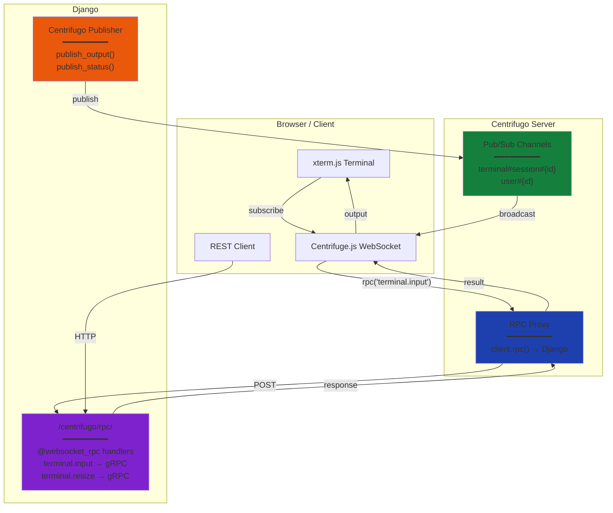

# Centrifugo WebSocket Integration

> **Production-Ready Real-Time Messaging with Native RPC and Type-Safe Clients**

Centrifugo integration provides a complete real-time WebSocket solution with **native RPC proxy** and automatic type-safe client generation for Python, TypeScript, Go, and **Swift (iOS/macOS)**.

## What is Centrifugo?

[Centrifugo](https://centrifugal.dev/) is a scalable real-time messaging server that can handle **millions of concurrent connections**. Django-CFG provides seamless integration with:

- **Native RPC Proxy** - Client calls go through Centrifugo to Django handlers
- **Type-safe RPC handlers** using Pydantic models
- **Auto-generated clients** for Python, TypeScript, Go, and Swift
- **Pub/Sub channels** for real-time updates
- **Production-ready** with minimal latency

## Architecture Overview



## Two Communication Patterns

### 1. RPC (Request/Response)

For commands that need a response:

```typescript
// Client calls RPC
const result = await centrifuge.rpc('terminal.input', {
  session_id: '...',
  data: btoa('ls -la')
});
// Result: { success: true, message: 'Input sent' }
```

Flow:
1. Client calls `centrifuge.rpc('method', data)`
2. Centrifugo forwards to Django `/centrifugo/rpc/`
3. Django routes to `@websocket_rpc` handler
4. Handler returns result
5. Client receives response

### 2. Pub/Sub (Real-time Streaming)

For continuous data streams:

```typescript
// Client subscribes to channel
const sub = centrifuge.subscribe(`terminal#session#${sessionId}`);
sub.on('publication', (ctx) => {
  const output = atob(ctx.data.data);
  terminal.write(output);
});
```

Flow:
1. Client subscribes to channel
2. Django publishes data to channel
3. Centrifugo delivers to all subscribers
4. Client receives in real-time

## Quick Start

### 1. Enable Centrifugo

```python
# config.py
from django_cfg import DjangoConfig, DjangoCfgCentrifugoConfig

class MyConfig(DjangoConfig):
    centrifugo: DjangoCfgCentrifugoConfig = DjangoCfgCentrifugoConfig(
        enabled=True,
        centrifugo_url="ws://localhost:8000/connection/websocket",
        centrifugo_api_url="http://localhost:8000/api",
        centrifugo_api_key="your-api-key",
        centrifugo_token_hmac_secret="your-hmac-secret",
    )
```

### 2. Configure Centrifugo RPC Proxy (v6)

```json
// centrifugo.json
{
  "rpc": {
    "proxy": {
      "endpoint": "http://django:8000/centrifugo/rpc/",
      "timeout": "10s"
    },
    "without_namespace": {
      "proxy_enabled": true
    }
  }
}
```

<Callout type="info">
**Centrifugo v6 Note**: In v6, RPC proxy is enabled per-namespace using `without_namespace.proxy_enabled` (for methods without namespace prefix) or namespace-specific settings. The old `rpc.proxy.enabled` format from v5 is no longer supported.
</Callout>

### 3. Create RPC Handler

```python
# core/centrifugo_handlers.py
from pydantic import BaseModel, Field
from django_cfg.apps.integrations.centrifugo.decorators import websocket_rpc

class PingParams(BaseModel):
    message: str = Field(..., description="Message to echo")

class PingResult(BaseModel):
    echo: str = Field(..., description="Echoed message")

@websocket_rpc("system.ping")
async def ping(conn, params: PingParams) -> PingResult:
    """Echo a message back to the client."""
    return PingResult(echo=f"Pong: {params.message}")
```

### 4. Call from Client

```typescript
// TypeScript
import { Centrifuge } from 'centrifuge';

const centrifuge = new Centrifuge('ws://localhost:8000/connection/websocket', {
  token: 'your-jwt-token'
});

await centrifuge.connect();

// Call RPC method
const result = await centrifuge.rpc('system.ping', { message: 'Hello' });
console.log(result.data); // { echo: 'Pong: Hello' }
```

## Key Features

### Native Centrifugo RPC

- **Direct integration** with Centrifugo's RPC proxy
- **Low latency** - no pub/sub overhead for request/response
- **Automatic routing** to Django handlers

### Type Safety

- **Single Source of Truth**: Pydantic models define types for all languages
- **Compile-time Checking**: TypeScript and Go clients are fully typed
- **Runtime Validation**: Django validates incoming requests

### Auto-Generated Clients

Generate clients for any language:

```bash
python manage.py generate_centrifugo_clients --output ./opensdk --all
```

Generates:
- **Python**: Async/await with Pydantic models
- **TypeScript**: Promise-based with interfaces
- **Go**: Context-aware with structs
- **Swift**: Actor-based with Codable structs (iOS/macOS)

### Pub/Sub for Real-time

- **Channel namespaces**: `terminal#`, `user#`, `notifications#`
- **Presence**: Track who's online
- **History**: Recover missed messages

## Documentation Sections

- **[Setup Guide](./setup)** - Installation and configuration
- **[Backend Guide](./backend-guide)** - Creating RPC handlers
- **[Frontend Guide](./frontend-guide)** - Using clients in your frontend
- **[Client Generation](./client-generation)** - Generate type-safe clients (Python, TypeScript, Go, Swift)
- **[Architecture](./architecture)** - Deep dive into how it works
- **[API Reference](./api-reference)** - Complete API documentation
- **[CLI Commands](./cli-commands)** - Management commands for testing

## Real-World Example: Terminal

The Terminal feature uses both patterns:

**RPC for Input:**
```typescript
// Send keyboard input
await centrifuge.rpc('terminal.input', {
  session_id: sessionId,
  data: btoa(keystroke)
});
```

**Pub/Sub for Output:**
```typescript
// Receive terminal output
const sub = centrifuge.subscribe(`terminal#session#${sessionId}`);
sub.on('publication', (ctx) => {
  if (ctx.data.type === 'output') {
    terminal.write(atob(ctx.data.data));
  }
});
```

---

**Next Steps:**
- Read the [Setup Guide](./setup) for detailed installation
- Follow the [Backend Guide](./backend-guide) to create your first handler
- Check out [Frontend Guide](./frontend-guide) to integrate with your app
