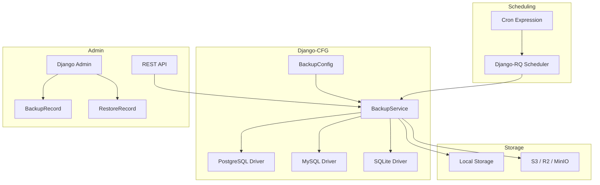
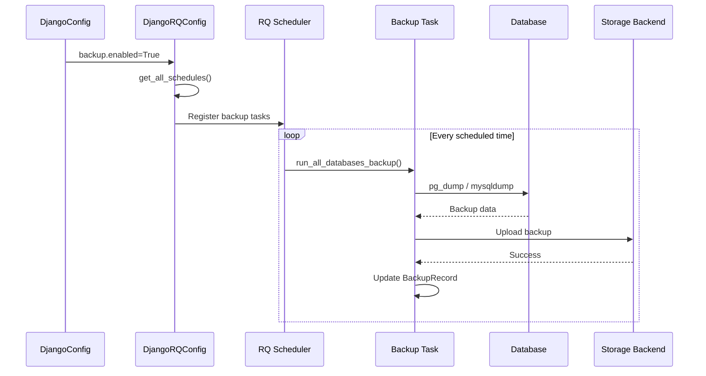

# Database Backup


<Callout type="info">
**Production-Ready**
Automated database backup solution with multi-database support, S3-compatible storage, and seamless Django-RQ integration for scheduled backups.

</Callout>

## Quick Navigation

### For Developers
- [Configuration Guide](../configuration) - Setup `BackupConfig`
- [Storage Backends](../storage-backends) - Local, S3, Cloudflare R2

### For DevOps
- [Scheduling](#automatic-scheduling) - RQ scheduler integration
- [Recovery](#recovery-procedures) - Restore procedures
- [CLI Commands](#management-commands) - Manual operations

---

## Why Database Backup?

Data is your most valuable asset. Django-CFG provides a **zero-configuration** backup solution that:

- **Auto-detects database type** - PostgreSQL, MySQL, SQLite
- **Integrates with Django-RQ** - Automatic scheduled backups
- **Supports cloud storage** - AWS S3, Cloudflare R2, MinIO
- **Provides retention policies** - Automatic cleanup of old backups
- **Includes admin interface** - Visual backup management

---

## Architecture



---

## Key Features

| Feature | Description |
|---------|-------------|
| **Multi-Database** | PostgreSQL (`pg_dump`), MySQL (`mysqldump`), SQLite (`VACUUM INTO`) |
| **Auto-Detection** | Automatically detects database engine from Django settings |
| **Cloud Storage** | S3-compatible: AWS S3, Cloudflare R2, MinIO, DigitalOcean Spaces |
| **Compression** | gzip, bz2, xz, or none |
| **Encryption** | Optional GPG-compatible encryption |
| **Scheduling** | Cron expressions via Django-RQ (automatic if RQ enabled) |
| **Retention** | Daily/weekly/monthly rotation with size limits |
| **Notifications** | Telegram/email on success/failure |
| **Admin UI** | Full Django admin for backup management |
| **REST API** | Programmatic backup/restore operations |

---

## Quick Start

### 1. Enable Backup Module

```python filename="config.py"
from django_cfg import (
    DjangoConfig,
    BackupConfig,
    BackupStorageConfig,
    BackupScheduleConfig,
)

class MyConfig(DjangoConfig):
    # Enable backup with minimal configuration
    backup: BackupConfig = BackupConfig(
        enabled=True,
        storage=BackupStorageConfig(backend="local"),
        schedule=BackupScheduleConfig(cron="0 2 * * *"),  # Daily at 2 AM
    )
```

### 2. Run Migrations

```bash
python manage.py migrate db_backup
```

### 3. Create Your First Backup

```bash
# Manual backup
python manage.py db_backup

# List backups
python manage.py db_backup --list
```

That's it! If Django-RQ is enabled, backups will run automatically on schedule.

---

## How It Works

### Automatic Scheduling

When both `BackupConfig` and `DjangoRQConfig` are enabled:



### Without Django-RQ

If RQ is not enabled, use management commands or external cron:

```bash
# Crontab entry
0 2 * * * cd /app && python manage.py db_backup --all
```

---

## Management Commands

### Create Backup

```bash
# Backup default database
python manage.py db_backup

# Backup specific database
python manage.py db_backup --database=analytics

# Backup all databases
python manage.py db_backup --all

# With verbose output
python manage.py db_backup -v 2
```

### List Backups

```bash
# List recent backups
python manage.py db_backup --list

# Show backup details
python manage.py db_backup --info <backup_id>
```

### Restore Backup

```bash
# Restore to original database
python manage.py db_restore <backup_id>

# Restore to different database
python manage.py db_restore <backup_id> --target=test_db

# Force restore without confirmation
python manage.py db_restore <backup_id> --force
```

### Cleanup Old Backups

```bash
python manage.py db_backup --cleanup
```

---

## Recovery Procedures

### Standard Recovery

1. **List available backups**
   ```bash
   python manage.py db_backup --list
   ```

2. **Verify backup integrity**
   ```bash
   python manage.py db_backup --info <backup_id>
   ```

3. **Restore database**
   ```bash
   python manage.py db_restore <backup_id>
   ```

### Point-in-Time Recovery

For PostgreSQL with WAL archiving, combine with pg_basebackup for PITR capability.

### Disaster Recovery Checklist

- [ ] Verify backup exists in storage
- [ ] Check backup file integrity (checksum)
- [ ] Stop application services
- [ ] Restore database
- [ ] Run migrations if needed
- [ ] Verify data integrity
- [ ] Restart application services

---

## REST API

### Endpoints

| Method | Endpoint | Description |
|--------|----------|-------------|
| `GET` | `/cfg/db/backups/` | List all backups |
| `GET` | `/cfg/db/backups/{id}/` | Get backup details |
| `POST` | `/cfg/db/backups/create/` | Create new backup |
| `POST` | `/cfg/db/backups/{id}/restore/` | Restore from backup |
| `POST` | `/cfg/db/backups/cleanup/` | Run cleanup |
| `GET` | `/cfg/db/databases/` | List databases |

### Example: Create Backup via API

```bash
curl -X POST /cfg/db/backups/create/ \
  -H "Authorization: Token <token>" \
  -H "Content-Type: application/json" \
  -d '{"database_alias": "default"}'
```

---

## Database Support

### PostgreSQL

Uses `pg_dump` with custom format for efficient backup and `pg_restore` for recovery:

```bash
# Backup (automatic)
pg_dump --format=custom --no-password -h host -p port -U user dbname

# Restore (automatic)
pg_restore --no-password --clean --if-exists -h host -p port -U user -d dbname
```

**Requirements**: `pg_dump` and `pg_restore` must be installed (included with PostgreSQL).

### MySQL / MariaDB

Uses `mysqldump` for backup and `mysql` for restore:

```bash
# Backup (automatic)
mysqldump --single-transaction --routines --triggers -h host -P port -u user -p dbname

# Restore (automatic)
mysql -h host -P port -u user -p dbname < backup.sql
```

**Requirements**: `mysqldump` and `mysql` CLI tools must be installed.

### SQLite

Uses `VACUUM INTO` for consistent backups (SQLite 3.27+):

```sql
VACUUM INTO '/path/to/backup.db'
```

Falls back to file copy with locking for older SQLite versions.

---

## Comparison with Alternatives

| Feature | Django-CFG Backup | django-dbbackup | Manual Scripts |
|---------|-------------------|-----------------|----------------|
| **Configuration** | Pydantic model | Django settings | Custom |
| **Auto-scheduling** | Django-RQ integration | External cron | External cron |
| **S3 Support** | Built-in | Plugin | Custom |
| **Admin Interface** | Built-in | None | None |
| **REST API** | Built-in | None | Custom |
| **Multi-database** | Automatic | Manual config | Manual |
| **Type Safety** | Full Pydantic | None | None |

---

## See Also

- [Configuration Guide](../configuration) - Detailed `BackupConfig` setup
- [Storage Backends](../storage-backends) - S3, R2, MinIO configuration
- [Django-RQ Integration](../../django-rq/overview) - Task scheduling
- [Production Deployment](/docs/deployment/environment-setup) - Production best practices
