# Django-RQ Architecture

Complete technical overview of Django-RQ integration in django-cfg, including system design, component interaction, and implementation details.

---

## System Overview

Django-RQ in django-cfg consists of several interconnected components:

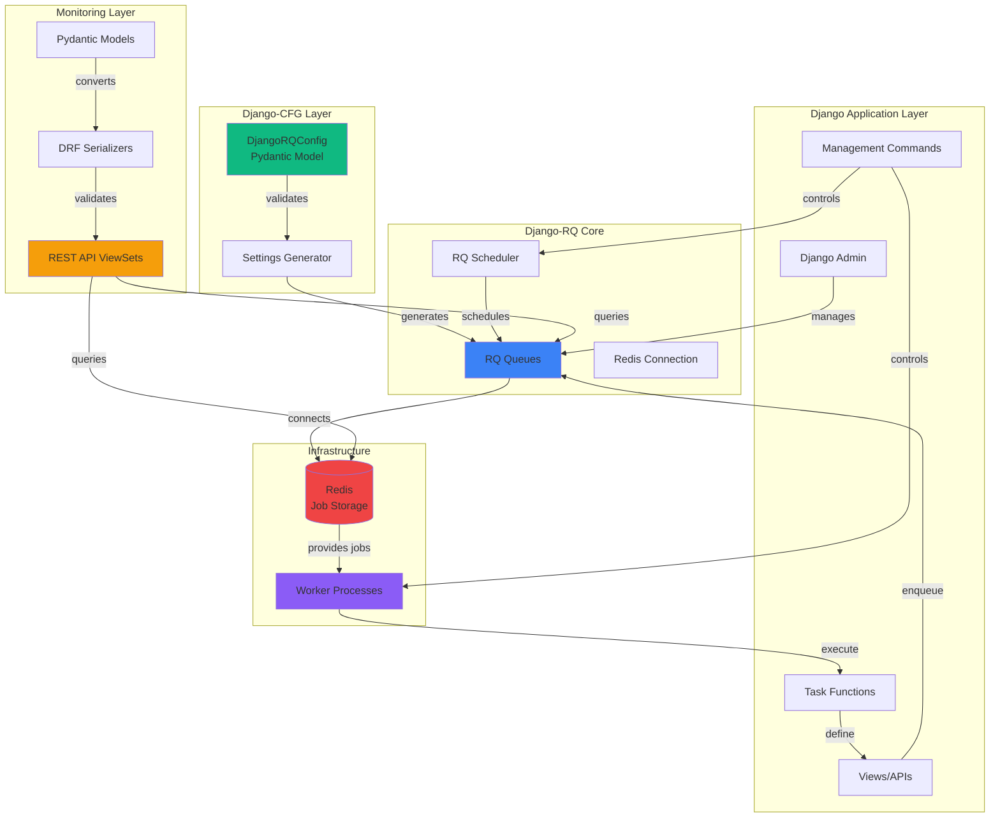
```mermaid
graph TB
    subgraph "Django-CFG Layer"
        Config[DjangoRQConfig<br/>Pydantic Model]
        Generator[Settings Generator]
        Config -->|validates| Generator
    end

    subgraph "Django Application Layer"
        Views[Views/APIs]
        Tasks[Task Functions]
        Management[Management Commands]
        Admin[Django Admin]
    end

    subgraph "Django-RQ Core"
        Queue[RQ Queues]
        Connection[Redis Connection]
        Scheduler[RQ Scheduler]
    end

    subgraph "Infrastructure"
        Redis[(Redis<br/>Job Storage)]
        Workers[Worker Processes]
    end

    subgraph "Monitoring Layer"
        RestAPI[REST API ViewSets]
        Serializers[DRF Serializers]
        Models[Pydantic Models]
    end

    Generator -->|generates| Queue
    Views -->|enqueue| Queue
    Tasks -->|define| Views
    Queue -->|connects| Redis
    Redis -->|provides jobs| Workers
    Workers -->|execute| Tasks
    Scheduler -->|schedules| Queue

    RestAPI -->|queries| Queue
    RestAPI -->|queries| Redis
    Serializers -->|validates| RestAPI
    Models -->|converts| Serializers
    Admin -->|manages| Queue

    Management -->|controls| Workers
    Management -->|controls| Scheduler

    style Config fill:#10b981
    style Queue fill:#3b82f6
    style Redis fill:#ef4444
    style Workers fill:#8b5cf6
    style RestAPI fill:#f59e0b
```

---

## Core Components

### 1. Configuration Layer

Type-safe configuration using Pydantic v2:

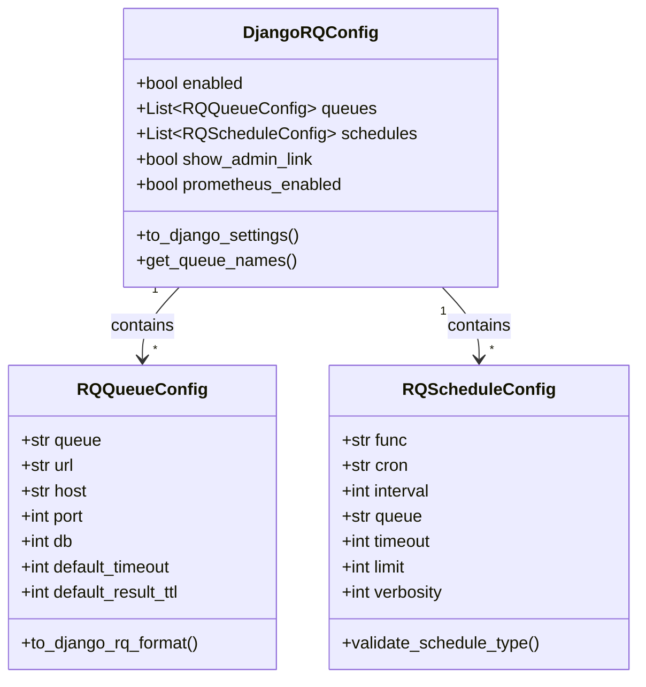
```mermaid
classDiagram
    class DjangoRQConfig {
        +bool enabled
        +List~RQQueueConfig~ queues
        +List~RQScheduleConfig~ schedules
        +bool show_admin_link
        +bool prometheus_enabled
        +to_django_settings()
        +get_queue_names()
    }

    class RQQueueConfig {
        +str queue
        +str url
        +str host
        +int port
        +int db
        +int default_timeout
        +int default_result_ttl
        +to_django_rq_format()
    }

    class RQScheduleConfig {
        +str func
        +str cron
        +int interval
        +str queue
        +int timeout
        +int limit
        +int verbosity
        +validate_schedule_type()
    }

    DjangoRQConfig "1" --> "*" RQQueueConfig : contains
    DjangoRQConfig "1" --> "*" RQScheduleConfig : contains
```

**Key Features:**
- **Validation**: Pydantic ensures type safety and correct values
- **Smart defaults**: Uses `redis_url` from parent `DjangoConfig`
- **Flexibility**: Support for Redis URL, Sentinel, SSL connections
- **Declarative**: Schedule tasks directly in config

### 2. Django-RQ Integration

Django-CFG seamlessly integrates with django-rq:

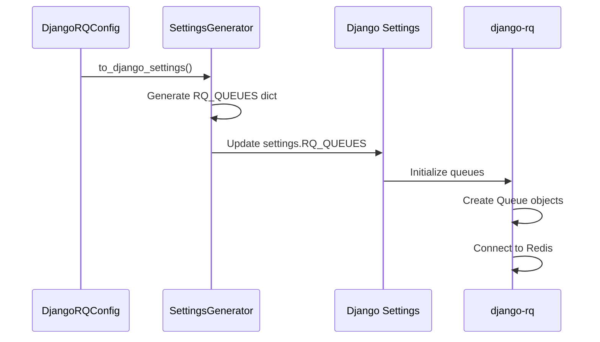
```mermaid
sequenceDiagram
    participant Config as DjangoRQConfig
    participant Gen as SettingsGenerator
    participant Django as Django Settings
    participant DjangoRQ as django-rq

    Config->>Gen: to_django_settings()
    Gen->>Gen: Generate RQ_QUEUES dict
    Gen->>Django: Update settings.RQ_QUEUES
    Django->>DjangoRQ: Initialize queues
    DjangoRQ->>DjangoRQ: Create Queue objects
    DjangoRQ->>DjangoRQ: Connect to Redis
```

**Generated Settings:**

```python
# Django settings.py (auto-generated)
RQ_QUEUES = {
    'default': {
        'URL': 'redis://localhost:6379/0',
        'DEFAULT_TIMEOUT': 360,
        'DEFAULT_RESULT_TTL': 500,
    },
    'high': {
        'URL': 'redis://localhost:6379/0',
        'DEFAULT_TIMEOUT': 180,
        'DEFAULT_RESULT_TTL': 300,
    },
}
RQ_SHOW_ADMIN_LINK = True
```

### 3. Task Execution Flow

Complete lifecycle of a job from enqueue to completion:

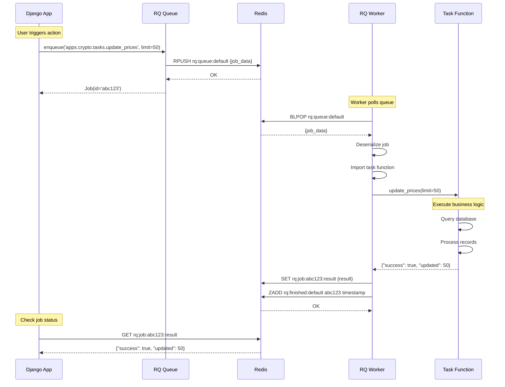
```mermaid
sequenceDiagram
    participant App as Django App
    participant Queue as RQ Queue
    participant Redis as Redis
    participant Worker as RQ Worker
    participant Task as Task Function

    Note over App: User triggers action
    App->>Queue: enqueue('apps.crypto.tasks.update_prices', limit=50)
    Queue->>Redis: RPUSH rq:queue:default {job_data}
    Redis-->>Queue: OK
    Queue-->>App: Job(id='abc123')

    Note over Worker: Worker polls queue
    Worker->>Redis: BLPOP rq:queue:default
    Redis-->>Worker: {job_data}

    Worker->>Worker: Deserialize job
    Worker->>Worker: Import task function
    Worker->>Task: update_prices(limit=50)

    Note over Task: Execute business logic
    Task->>Task: Query database
    Task->>Task: Process records
    Task-->>Worker: {"success": true, "updated": 50}

    Worker->>Redis: SET rq:job:abc123:result {result}
    Worker->>Redis: ZADD rq:finished:default abc123 timestamp
    Redis-->>Worker: OK

    Note over App: Check job status
    App->>Redis: GET rq:job:abc123:result
    Redis-->>App: {"success": true, "updated": 50}
```

### 4. Queue Management

Multiple queues with different priorities:

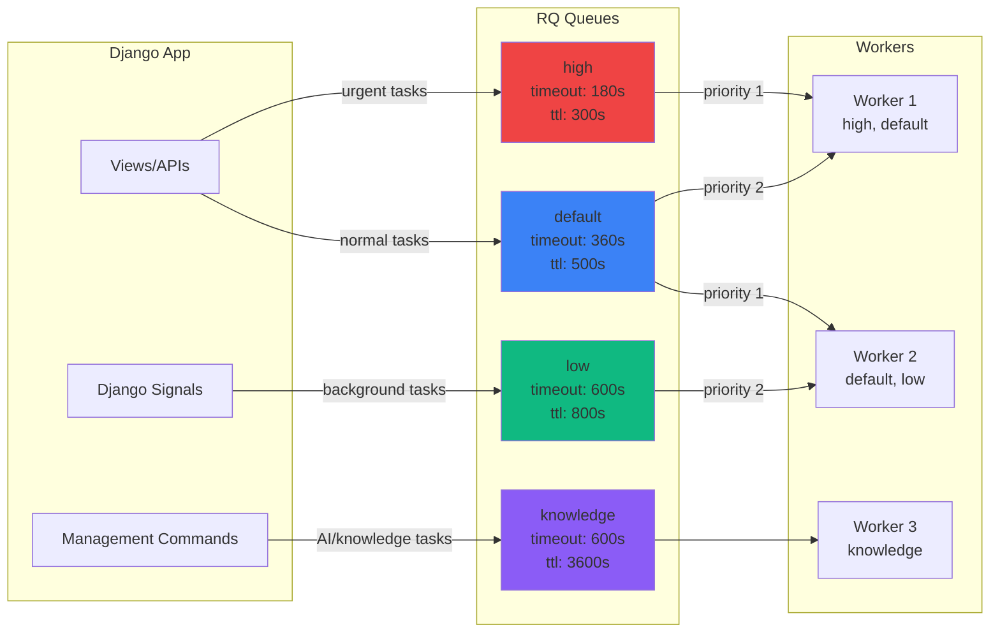
```mermaid
graph LR
    subgraph "Django App"
        ViewsAPI[Views/APIs]
        Signals[Django Signals]
        Commands[Management Commands]
    end

    subgraph "RQ Queues"
        HighQ[high<br/>timeout: 180s<br/>ttl: 300s]
        DefaultQ[default<br/>timeout: 360s<br/>ttl: 500s]
        LowQ[low<br/>timeout: 600s<br/>ttl: 800s]
        KnowledgeQ[knowledge<br/>timeout: 600s<br/>ttl: 3600s]
    end

    subgraph "Workers"
        W1[Worker 1<br/>high, default]
        W2[Worker 2<br/>default, low]
        W3[Worker 3<br/>knowledge]
    end

    ViewsAPI -->|urgent tasks| HighQ
    ViewsAPI -->|normal tasks| DefaultQ
    Signals -->|background tasks| LowQ
    Commands -->|AI/knowledge tasks| KnowledgeQ

    HighQ -->|priority 1| W1
    DefaultQ -->|priority 2| W1
    DefaultQ -->|priority 1| W2
    LowQ -->|priority 2| W2
    KnowledgeQ --> W3

    style HighQ fill:#ef4444
    style DefaultQ fill:#3b82f6
    style LowQ fill:#10b981
    style KnowledgeQ fill:#8b5cf6
```

**Queue Strategy:**
- **high**: Critical tasks (payment processing, auth)
- **default**: Normal tasks (emails, notifications)
- **low**: Batch operations (reports, cleanup)
- **knowledge**: AI/ML tasks (document processing, embeddings)

### 5. Scheduler Architecture

RQ Scheduler provides cron-like scheduling:

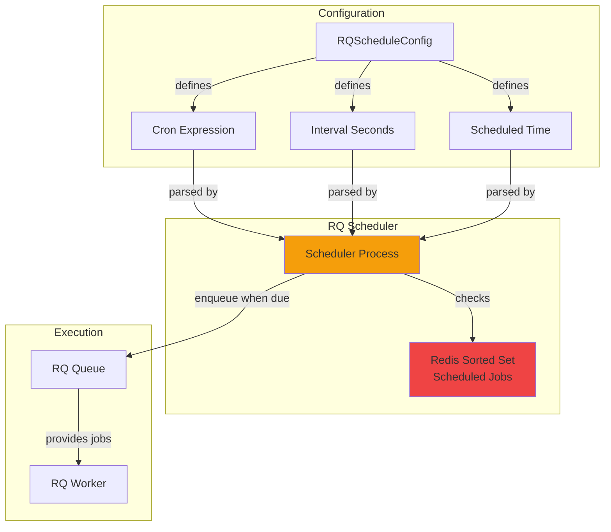
```mermaid
graph TB
    subgraph "Configuration"
        Config[RQScheduleConfig]
        Cron[Cron Expression]
        Interval[Interval Seconds]
        OneTime[Scheduled Time]
    end

    subgraph "RQ Scheduler"
        Scheduler[Scheduler Process]
        SortedSet[Redis Sorted Set<br/>Scheduled Jobs]
    end

    subgraph "Execution"
        Queue[RQ Queue]
        Worker[RQ Worker]
    end

    Config -->|defines| Cron
    Config -->|defines| Interval
    Config -->|defines| OneTime

    Cron -->|parsed by| Scheduler
    Interval -->|parsed by| Scheduler
    OneTime -->|parsed by| Scheduler

    Scheduler -->|checks| SortedSet
    Scheduler -->|enqueue when due| Queue
    Queue -->|provides jobs| Worker

    style Scheduler fill:#f59e0b
    style SortedSet fill:#ef4444
```

**Schedule Registration:**

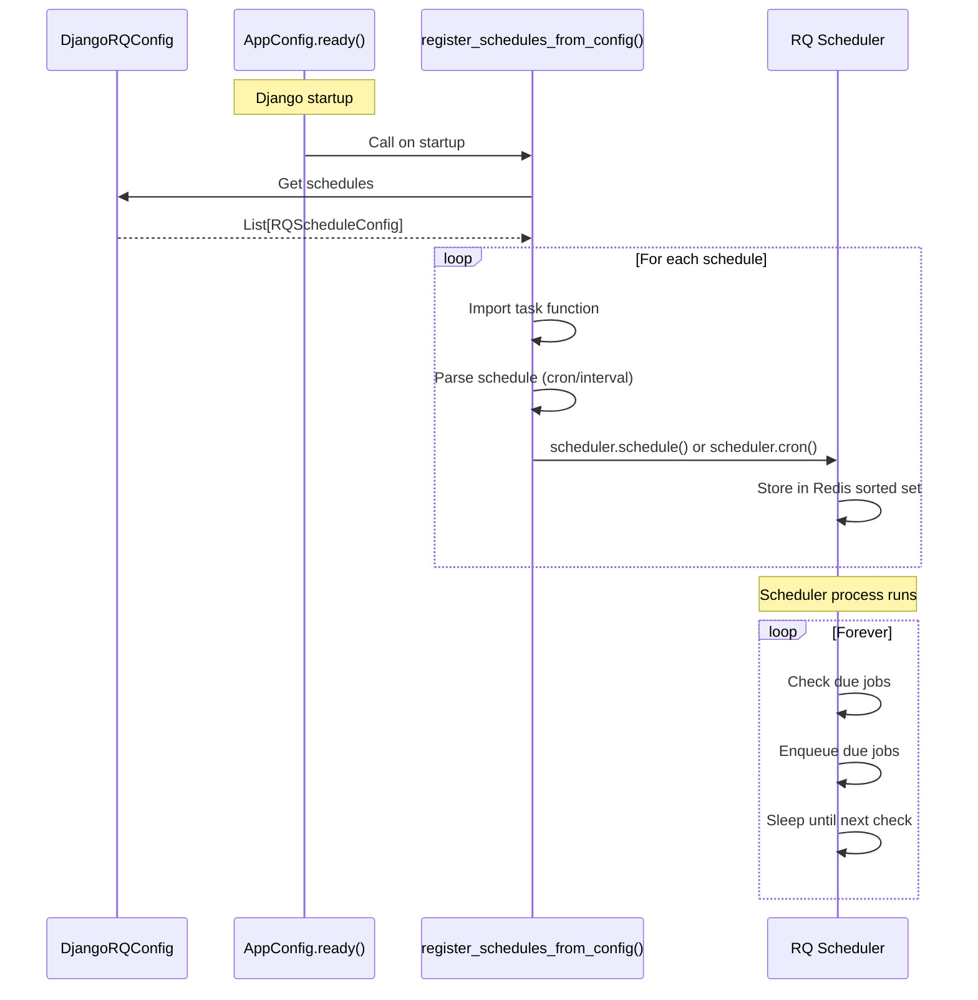
```mermaid
sequenceDiagram
    participant Config as DjangoRQConfig
    participant AppReady as AppConfig.ready()
    participant Helper as register_schedules_from_config()
    participant Scheduler as RQ Scheduler

    Note over AppReady: Django startup
    AppReady->>Helper: Call on startup
    Helper->>Config: Get schedules
    Config-->>Helper: List[RQScheduleConfig]

    loop For each schedule
        Helper->>Helper: Import task function
        Helper->>Helper: Parse schedule (cron/interval)
        Helper->>Scheduler: scheduler.schedule() or scheduler.cron()
        Scheduler->>Scheduler: Store in Redis sorted set
    end

    Note over Scheduler: Scheduler process runs
    loop Forever
        Scheduler->>Scheduler: Check due jobs
        Scheduler->>Scheduler: Enqueue due jobs
        Scheduler->>Scheduler: Sleep until next check
    end
```

---

## Monitoring Architecture

### REST API Layer

Django-CFG provides comprehensive REST API for monitoring:

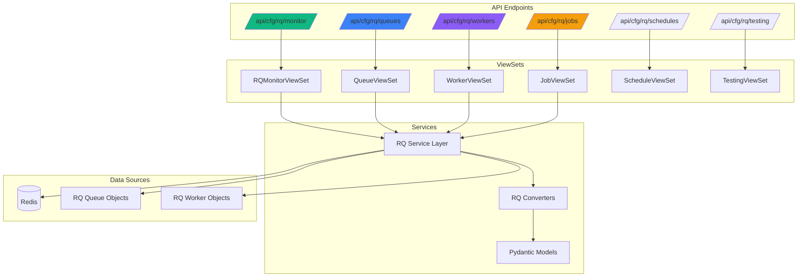
```mermaid
graph TB
    subgraph "API Endpoints"
        Monitor[/api/cfg/rq/monitor/]
        Queues[/api/cfg/rq/queues/]
        Workers[/api/cfg/rq/workers/]
        Jobs[/api/cfg/rq/jobs/]
        Schedules[/api/cfg/rq/schedules/]
        Testing[/api/cfg/rq/testing/]
    end

    subgraph "ViewSets"
        MonitorVS[RQMonitorViewSet]
        QueuesVS[QueueViewSet]
        WorkersVS[WorkerViewSet]
        JobsVS[JobViewSet]
        SchedulesVS[ScheduleViewSet]
        TestingVS[TestingViewSet]
    end

    subgraph "Services"
        RQService[RQ Service Layer]
        Converters[RQ Converters]
        Models[Pydantic Models]
    end

    subgraph "Data Sources"
        Redis[(Redis)]
        RQQueues[RQ Queue Objects]
        RQWorkers[RQ Worker Objects]
    end

    Monitor --> MonitorVS
    Queues --> QueuesVS
    Workers --> WorkersVS
    Jobs --> JobsVS
    Schedules --> SchedulesVS
    Testing --> TestingVS

    MonitorVS --> RQService
    QueuesVS --> RQService
    WorkersVS --> RQService
    JobsVS --> RQService

    RQService --> Converters
    Converters --> Models
    RQService --> Redis
    RQService --> RQQueues
    RQService --> RQWorkers

    style Monitor fill:#10b981
    style Queues fill:#3b82f6
    style Workers fill:#8b5cf6
    style Jobs fill:#f59e0b
```

### Data Flow

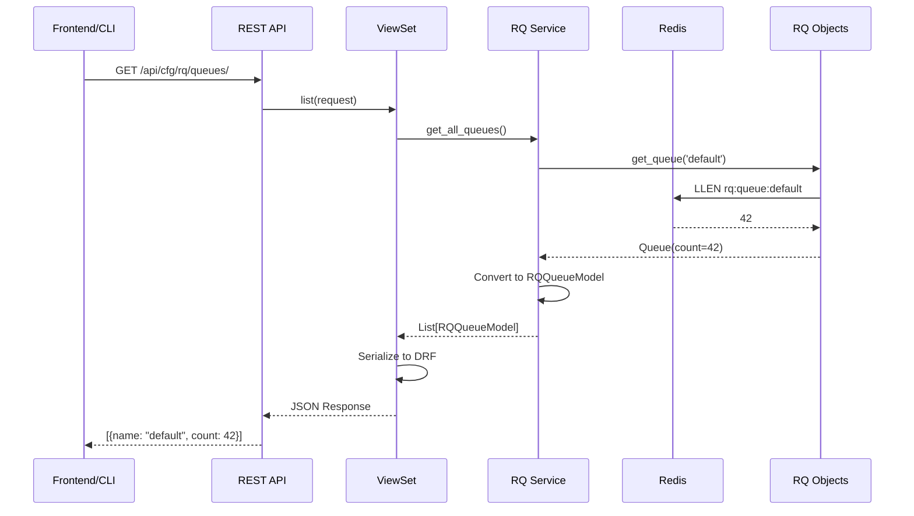
```mermaid
sequenceDiagram
    participant Client as Frontend/CLI
    participant API as REST API
    participant ViewSet as ViewSet
    participant Service as RQ Service
    participant Redis as Redis
    participant RQ as RQ Objects

    Client->>API: GET /api/cfg/rq/queues/
    API->>ViewSet: list(request)
    ViewSet->>Service: get_all_queues()

    Service->>RQ: get_queue('default')
    RQ->>Redis: LLEN rq:queue:default
    Redis-->>RQ: 42
    RQ-->>Service: Queue(count=42)

    Service->>Service: Convert to RQQueueModel
    Service-->>ViewSet: List[RQQueueModel]

    ViewSet->>ViewSet: Serialize to DRF
    ViewSet-->>API: JSON Response
    API-->>Client: [{name: "default", count: 42}]
```

### Pydantic Models

Internal models for type-safe data handling:

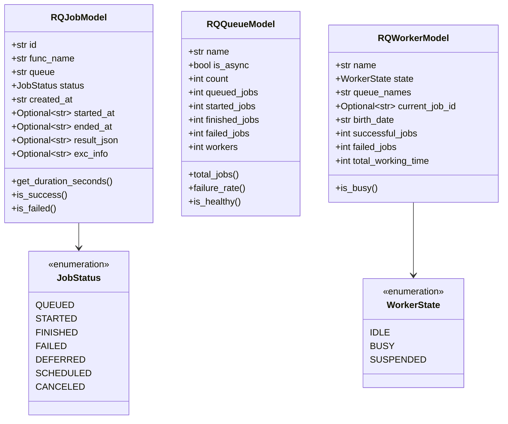
```mermaid
classDiagram
    class RQJobModel {
        +str id
        +str func_name
        +str queue
        +JobStatus status
        +str created_at
        +Optional~str~ started_at
        +Optional~str~ ended_at
        +Optional~str~ result_json
        +Optional~str~ exc_info
        +get_duration_seconds()
        +is_success()
        +is_failed()
    }

    class RQQueueModel {
        +str name
        +bool is_async
        +int count
        +int queued_jobs
        +int started_jobs
        +int finished_jobs
        +int failed_jobs
        +int workers
        +total_jobs()
        +failure_rate()
        +is_healthy()
    }

    class RQWorkerModel {
        +str name
        +WorkerState state
        +str queue_names
        +Optional~str~ current_job_id
        +str birth_date
        +int successful_jobs
        +int failed_jobs
        +int total_working_time
        +is_busy()
    }

    class JobStatus {
        <<enumeration>>
        QUEUED
        STARTED
        FINISHED
        FAILED
        DEFERRED
        SCHEDULED
        CANCELED
    }

    class WorkerState {
        <<enumeration>>
        IDLE
        BUSY
        SUSPENDED
    }

    RQJobModel --> JobStatus
    RQWorkerModel --> WorkerState
```

---

## Integration Patterns

### 1. Enqueue from Anywhere

Tasks can be enqueued from any Django component:

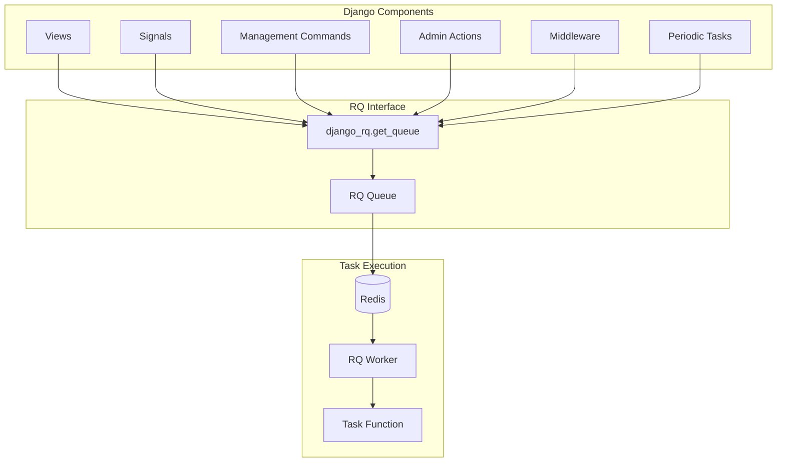
```mermaid
graph TB
    subgraph "Django Components"
        Views[Views]
        Signals[Signals]
        Commands[Management Commands]
        Admin[Admin Actions]
        Middleware[Middleware]
        Celery[Periodic Tasks]
    end

    subgraph "RQ Interface"
        DjangoRQ[django_rq.get_queue]
        Queue[RQ Queue]
    end

    subgraph "Task Execution"
        Redis[(Redis)]
        Worker[RQ Worker]
        Task[Task Function]
    end

    Views --> DjangoRQ
    Signals --> DjangoRQ
    Commands --> DjangoRQ
    Admin --> DjangoRQ
    Middleware --> DjangoRQ
    Celery --> DjangoRQ

    DjangoRQ --> Queue
    Queue --> Redis
    Redis --> Worker
    Worker --> Task
```

### 2. Result Handling

Multiple ways to handle job results:

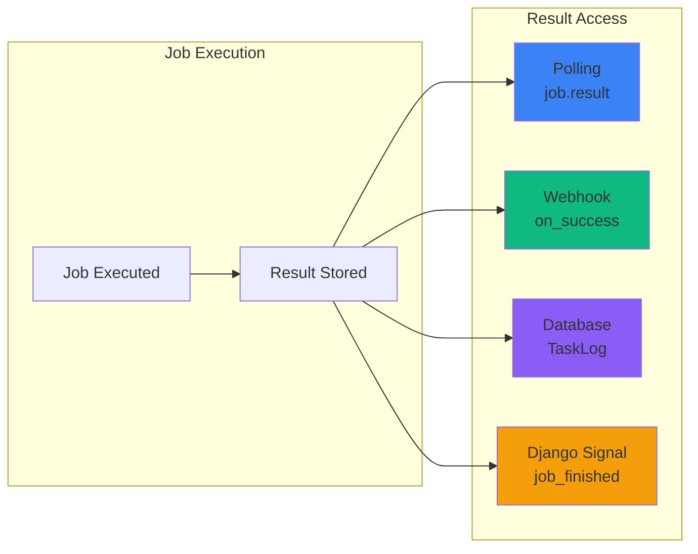
```mermaid
graph LR
    subgraph "Job Execution"
        Job[Job Executed]
        Result[Result Stored]
    end

    subgraph "Result Access"
        Poll[Polling<br/>job.result]
        Webhook[Webhook<br/>on_success]
        DB[Database<br/>TaskLog]
        Signal[Django Signal<br/>job_finished]
    end

    Job --> Result
    Result --> Poll
    Result --> Webhook
    Result --> DB
    Result --> Signal

    style Poll fill:#3b82f6
    style Webhook fill:#10b981
    style DB fill:#8b5cf6
    style Signal fill:#f59e0b
```

### 3. Error Handling

Comprehensive error handling and retry logic:

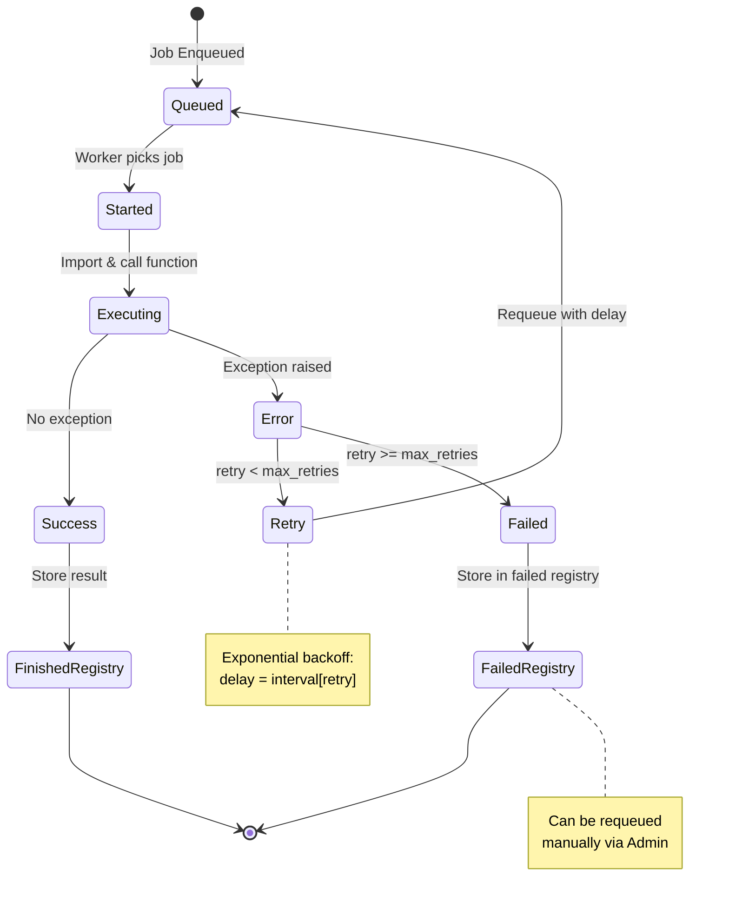
```mermaid
stateDiagram-v2
    [*] --> Queued: Job Enqueued
    Queued --> Started: Worker picks job
    Started --> Executing: Import & call function

    Executing --> Success: No exception
    Executing --> Error: Exception raised

    Error --> Retry: retry < max_retries
    Error --> Failed: retry >= max_retries

    Retry --> Queued: Requeue with delay
    Failed --> FailedRegistry: Store in failed registry
    Success --> FinishedRegistry: Store result

    FailedRegistry --> [*]
    FinishedRegistry --> [*]

    note right of Retry
        Exponential backoff:
        delay = interval[retry]
    end note

    note right of FailedRegistry
        Can be requeued
        manually via Admin
    end note
```

---

## Performance Optimization

### 1. Worker Pool Architecture

Multiple workers for parallelism:

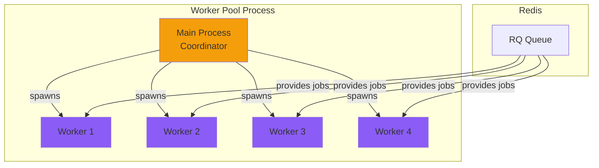
```mermaid
graph TB
    subgraph "Worker Pool Process"
        Main[Main Process<br/>Coordinator]
        W1[Worker 1]
        W2[Worker 2]
        W3[Worker 3]
        W4[Worker 4]
    end

    subgraph "Redis"
        Queue[RQ Queue]
    end

    Main -->|spawns| W1
    Main -->|spawns| W2
    Main -->|spawns| W3
    Main -->|spawns| W4

    Queue -->|provides jobs| W1
    Queue -->|provides jobs| W2
    Queue -->|provides jobs| W3
    Queue -->|provides jobs| W4

    style Main fill:#f59e0b
    style W1 fill:#8b5cf6
    style W2 fill:#8b5cf6
    style W3 fill:#8b5cf6
    style W4 fill:#8b5cf6
```

**Benefits:**
- Utilize multiple CPU cores
- Parallel job execution
- Better throughput
- Fault isolation

### 2. Redis Data Structures

Efficient use of Redis:

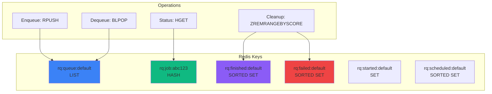
```mermaid
graph TB
    subgraph "Redis Keys"
        QueueList[rq:queue:default<br/>LIST]
        JobHash[rq:job:abc123<br/>HASH]
        FinishedSet[rq:finished:default<br/>SORTED SET]
        FailedSet[rq:failed:default<br/>SORTED SET]
        StartedSet[rq:started:default<br/>SET]
        ScheduledSet[rq:scheduled:default<br/>SORTED SET]
    end

    subgraph "Operations"
        Enqueue[Enqueue: RPUSH]
        Dequeue[Dequeue: BLPOP]
        Status[Status: HGET]
        Cleanup[Cleanup: ZREMRANGEBYSCORE]
    end

    Enqueue --> QueueList
    Dequeue --> QueueList
    Status --> JobHash
    Cleanup --> FinishedSet
    Cleanup --> FailedSet

    style QueueList fill:#3b82f6
    style JobHash fill:#10b981
    style FinishedSet fill:#8b5cf6
    style FailedSet fill:#ef4444
```

### 3. Connection Pooling

Redis connection management:

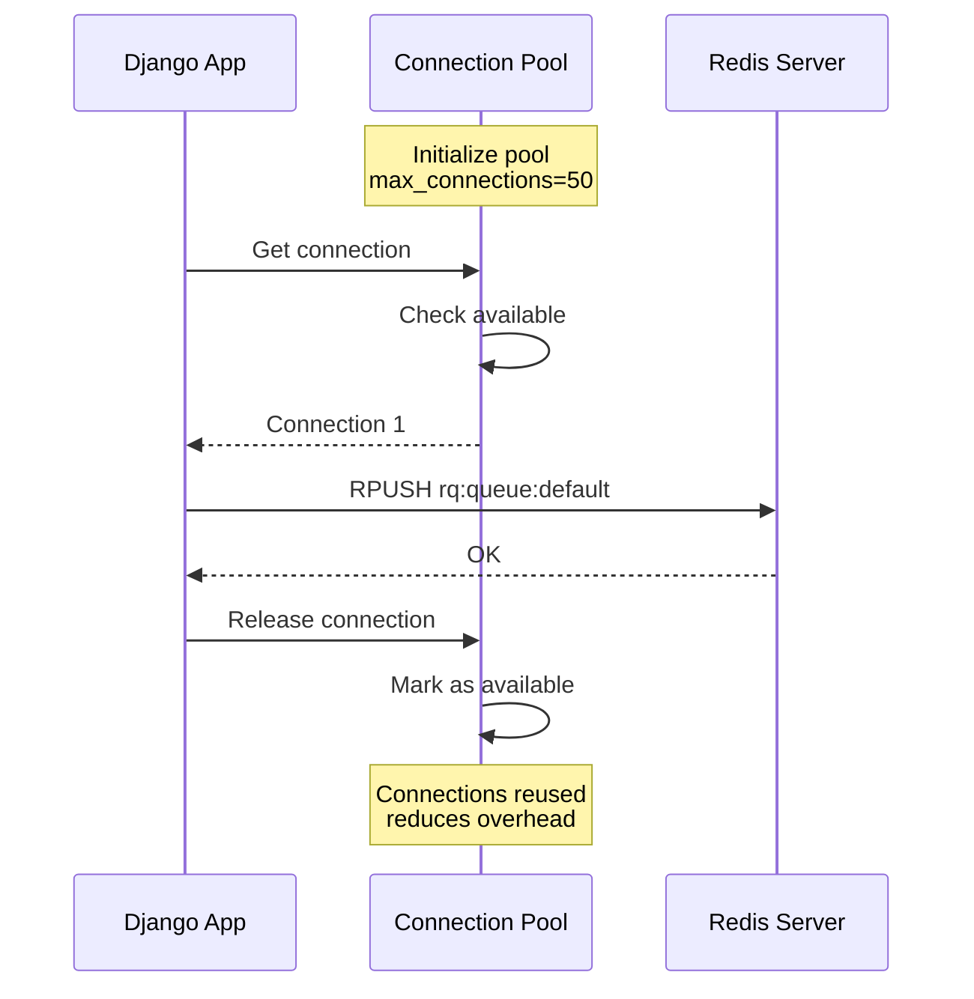
```mermaid
sequenceDiagram
    participant App as Django App
    participant Pool as Connection Pool
    participant Redis as Redis Server

    Note over Pool: Initialize pool<br/>max_connections=50

    App->>Pool: Get connection
    Pool->>Pool: Check available
    Pool-->>App: Connection 1

    App->>Redis: RPUSH rq:queue:default
    Redis-->>App: OK

    App->>Pool: Release connection
    Pool->>Pool: Mark as available

    Note over Pool: Connections reused<br/>reduces overhead
```

---

## Deployment Architecture

### Single-Server Setup

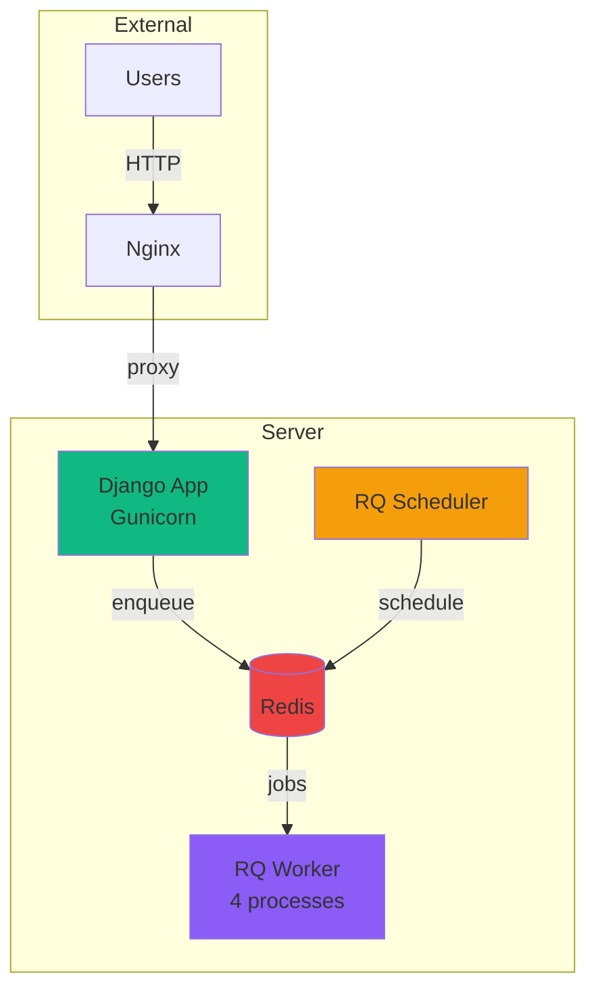
```mermaid
graph TB
    subgraph "Server"
        Django[Django App<br/>Gunicorn]
        Worker[RQ Worker<br/>4 processes]
        Scheduler[RQ Scheduler]
        Redis[(Redis)]
    end

    subgraph "External"
        Users[Users]
        Nginx[Nginx]
    end

    Users -->|HTTP| Nginx
    Nginx -->|proxy| Django
    Django -->|enqueue| Redis
    Redis -->|jobs| Worker
    Scheduler -->|schedule| Redis

    style Django fill:#10b981
    style Worker fill:#8b5cf6
    style Scheduler fill:#f59e0b
    style Redis fill:#ef4444
```

### Multi-Server Setup

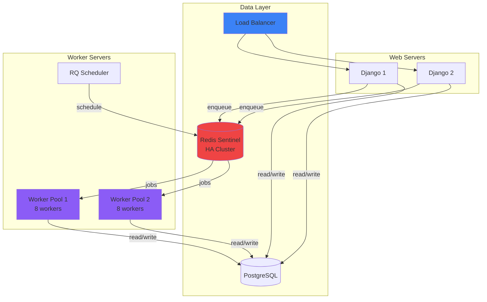
```mermaid
graph TB
    subgraph "Web Servers"
        Web1[Django 1]
        Web2[Django 2]
    end

    subgraph "Worker Servers"
        Worker1[Worker Pool 1<br/>8 workers]
        Worker2[Worker Pool 2<br/>8 workers]
        Scheduler[RQ Scheduler]
    end

    subgraph "Data Layer"
        LB[Load Balancer]
        Redis[(Redis Sentinel<br/>HA Cluster)]
        DB[(PostgreSQL)]
    end

    LB --> Web1
    LB --> Web2

    Web1 -->|enqueue| Redis
    Web2 -->|enqueue| Redis

    Redis -->|jobs| Worker1
    Redis -->|jobs| Worker2

    Scheduler -->|schedule| Redis

    Worker1 -->|read/write| DB
    Worker2 -->|read/write| DB
    Web1 -->|read/write| DB
    Web2 -->|read/write| DB

    style LB fill:#3b82f6
    style Redis fill:#ef4444
    style Worker1 fill:#8b5cf6
    style Worker2 fill:#8b5cf6
```

---

## See Also

### Configuration
- [Configuration Guide](../configuration) - Detailed setup guide
- [Examples](../examples) - Real-world examples
- [Deployment](../deployment) - Production deployment

### Reference
- [Django-RQ Docs](https://github.com/rq/django-rq) - Official documentation
- [RQ Docs](https://python-rq.org/) - Core RQ documentation
- [Redis Docs](https://redis.io/docs/) - Redis documentation

### Related
- [Integration Patterns](../../patterns) - Common patterns
