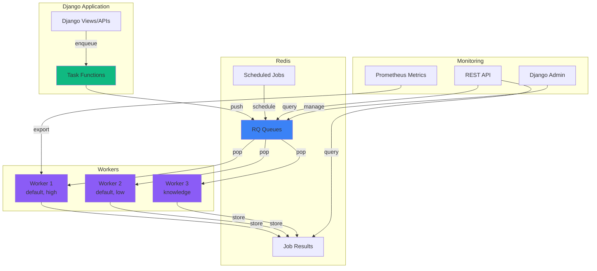
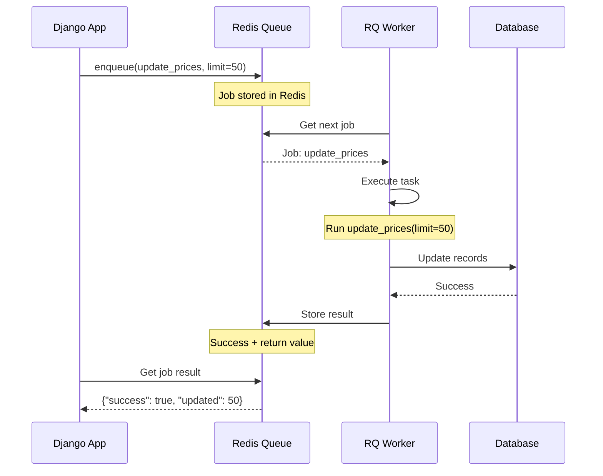

# Django-RQ Background Tasks

> **📚 Part of**: [Integrations](../../overview) - Explore all django-cfg integrations

Production-ready Redis-based task queue built on RQ (Redis Queue) with comprehensive monitoring, REST API, and seamless django-cfg integration. High-performance alternative to Celery with simpler setup and better developer experience.

---

## Quick Navigation

### For Developers
- [Quick Start](#quick-start) - Get started in 5 minutes
- [Task Examples](#task-examples) - Real-world code examples
- [Usage Examples](../examples) - Comprehensive examples
- [Configuration Reference](../configuration) - Complete configuration guide

### For DevOps
- [Architecture](../architecture) - System design and components
- [Deployment Guide](../deployment) - Production deployment
- [Monitoring](../monitoring) - Job tracking and worker management

### For Decision Makers
- [Why Django-RQ](#why-django-rq) - Comparison with alternatives
- [Performance](#performance) - Benchmarks and scalability
- [Production Ready](#production-readiness) - Enterprise features

---

## Why Django-RQ?

### Simple, Fast, Reliable

Django-RQ provides the **best developer experience** for background tasks in Django:

| Feature | Django-RQ | Celery | Dramatiq |
|---------|-----------|--------|----------|
| **Setup Complexity** | ⭐⭐⭐⭐⭐ Simple | ⭐⭐ Complex | ⭐⭐⭐ Medium |
| **Performance** | 🚀 10,000+ jobs/sec | 🚀 5,000+ jobs/sec | 🚀 8,000+ jobs/sec |
| **Dependencies** | Redis only | Redis + Message Broker | Redis/RabbitMQ |
| **Memory Usage** | 💚 Low | 💛 Medium | 💚 Low |
| **Learning Curve** | ⭐⭐⭐⭐⭐ Easy | ⭐⭐ Steep | ⭐⭐⭐ Medium |
| **Monitoring** | ✅ Built-in | ⚠️ Flower required | ⚠️ External tools |
| **Django Integration** | ✅ Native | ⚠️ Manual | ⚠️ Manual |

### When to Use Django-RQ

**✅ Perfect For:**
- Startups and MVPs (quick setup, low overhead)
- Small to medium projects (< 1M jobs/day)
- Django-first teams (native Django integration)
- Simple task workflows (no complex routing)
- Cost-conscious projects (Redis-only infrastructure)

**⚠️ Consider Alternatives When:**
- You need complex task routing (use Celery)
- You have > 1M jobs/day (use Celery + RabbitMQ)
- You need task chaining/workflows (use Celery Canvas)
- You already use Celery (migration overhead)

---

## Key Features

### 🚀 High Performance

- **10,000+ jobs/second**: Benchmark on 4-core CPU
- **Sub-second latency**: Job execution starts within 100ms
- **Efficient memory**: 50MB RAM per worker (vs 150MB for Celery)
- **Horizontal scaling**: Add workers to scale linearly

### ⚙️ Production Features

- **Job retries**: Automatic retry with exponential backoff
- **Job dependencies**: Chain jobs with `.depends_on()`
- **Job scheduling**: Schedule jobs with `enqueue_at()` or `enqueue_in()`
- **RQ Scheduler**: Cron-like scheduling with `rq-scheduler`
- **Automatic cleanup**: Built-in cleanup removes old jobs daily
- **Job TTL**: Configurable TTL for finished and failed jobs
- **Worker pools**: Multi-process workers with `rqworker-pool`

### 📊 Built-in Monitoring

- **REST API**: Query jobs, queues, workers via API
- **Django Admin**: View/manage jobs in admin interface
- **Real-time stats**: Queue length, success/fail rates
- **Prometheus metrics**: Export metrics for monitoring
- **Job timeline**: Track job execution history

### 🔧 Developer Experience

- **Type-safe config**: Pydantic models with validation
- **Auto-discovery**: Django-cfg finds and registers tasks
- **CLI commands**: `rqworker`, `rqscheduler`, `rqstats`
- **Testing support**: Synchronous mode for tests
- **Hot reload**: Workers reload on code changes (dev mode)

### 🎯 Django-CFG Integration

- **Zero-config**: Works out of the box with redis_url
- **Automatic maintenance**: Cleanup tasks run automatically in background
- **Smart scheduling**: Deterministic job IDs prevent duplicate schedules
- **Centralized config**: All settings in one place
- **Environment-aware**: Different config per environment
- **Built-in apps**: Integration with Knowbase, Payments, etc.

---

## Architecture Overview

Django-RQ follows a simple, reliable architecture:



### Component Interaction



---

## Quick Start

### 1. Installation

Django-RQ is **already included** in django-cfg! No need to install separately.

```bash
# Only if you need rq-scheduler for cron-like scheduling
pip install rq-scheduler
```

### 2. Configuration

Add Django-RQ configuration to your config:

```python
# api/config.py
from django_cfg import DjangoConfig
from django_cfg.models import DjangoRQConfig, RQQueueConfig, RQScheduleConfig

class MyConfig(DjangoConfig):
    # Django-RQ configuration
    django_rq: DjangoRQConfig = DjangoRQConfig(
        enabled=True,
        queues=[
            # Default queue for general tasks
            RQQueueConfig(
                queue="default",
                default_timeout=360,
                default_result_ttl=500,
            ),
            # High priority queue
            RQQueueConfig(
                queue="high",
                default_timeout=180,
                default_result_ttl=300,
            ),
            # Low priority queue
            RQQueueConfig(
                queue="low",
                default_timeout=600,
                default_result_ttl=800,
            ),
        ],
        show_admin_link=True,
        prometheus_enabled=True,
    )
```

**Magic**: Django-cfg automatically uses `redis_url` from parent config!

### 3. Create Tasks

Create task functions in your app:

```python
# apps/crypto/tasks.py

def update_coin_prices(limit: int = 100) -> dict:
    """
    Update cryptocurrency prices.

    This function can be called directly OR enqueued as background job.
    """
    from apps.crypto.models import Coin

    updated = 0
    for coin in Coin.objects.filter(is_active=True)[:limit]:
        # Update logic here
        coin.current_price_usd = fetch_price(coin.symbol)
        coin.save()
        updated += 1

    return {
        "success": True,
        "updated": updated,
    }
```

### 4. Enqueue Jobs

Enqueue tasks from anywhere in your Django code:

```python
# In views, signals, management commands, etc.
import django_rq

# Enqueue immediately
queue = django_rq.get_queue('default')
job = queue.enqueue(
    'apps.crypto.tasks.update_coin_prices',
    limit=50
)

# Enqueue with delay
from datetime import timedelta
job = queue.enqueue_in(
    timedelta(minutes=5),
    'apps.crypto.tasks.update_coin_prices',
    limit=100
)

# Enqueue at specific time
from datetime import datetime
job = queue.enqueue_at(
    datetime(2025, 12, 31, 23, 59),
    'apps.crypto.tasks.update_coin_prices',
    limit=200
)
```

### 5. Start Workers

Start workers to process jobs:

```bash
# Start single worker for default queue
python manage.py rqworker default

# Start worker for multiple queues (priority order)
python manage.py rqworker high default low

# Start worker pool (4 workers)
python manage.py rqworker-pool default --num-workers 4
```

### 6. Schedule Tasks (Optional)

Configure scheduled tasks in your config:

```python
class MyConfig(DjangoConfig):
    django_rq: DjangoRQConfig = DjangoRQConfig(
        enabled=True,
        queues=[...],
        schedules=[
            # Update prices every 5 minutes
            RQScheduleConfig(
                func="apps.crypto.tasks.update_coin_prices",
                interval=300,  # seconds
                queue="default",
                limit=50,  # Task parameter
                description="Update coin prices (frequent)",
            ),
            # Daily report
            RQScheduleConfig(
                func="apps.crypto.tasks.generate_report",
                cron="0 0 * * *",  # Every day at midnight
                queue="low",
                report_type="daily",
            ),
        ],
    )
```

Start scheduler:

```bash
python manage.py rqscheduler
```

---

## Task Examples

### Simple Task

```python
# apps/myapp/tasks.py

def send_welcome_email(user_id: int) -> dict:
    """Send welcome email to user."""
    from django.contrib.auth import get_user_model
    from django.core.mail import send_mail

    User = get_user_model()
    user = User.objects.get(pk=user_id)

    send_mail(
        subject="Welcome!",
        message=f"Hi {user.username}!",
        from_email="noreply@example.com",
        recipient_list=[user.email],
    )

    return {"success": True, "user_id": user_id}

# Enqueue from view
import django_rq
queue = django_rq.get_queue('default')
queue.enqueue('apps.myapp.tasks.send_welcome_email', user_id=123)
```

### Task with Retry

```python
def fetch_exchange_rates() -> dict:
    """Fetch exchange rates with automatic retry on failure."""
    import requests

    response = requests.get('https://api.exchangerate.com/latest')
    response.raise_for_status()  # Raises exception on error

    return response.json()

# Enqueue with retry
queue.enqueue(
    'apps.myapp.tasks.fetch_exchange_rates',
    retry=Retry(max=3, interval=[10, 30, 60])  # Retry 3 times with delays
)
```

### Long-Running Task

```python
def process_large_file(file_path: str) -> dict:
    """Process large file with progress tracking."""
    import time
    from rq import get_current_job

    job = get_current_job()
    total_lines = count_lines(file_path)
    processed = 0

    with open(file_path) as f:
        for line in f:
            # Process line
            process_line(line)
            processed += 1

            # Update progress
            if processed % 1000 == 0:
                job.meta['progress'] = (processed / total_lines) * 100
                job.save_meta()

    return {"success": True, "lines": processed}

# Check progress from another view
job = queue.fetch_job(job_id)
progress = job.meta.get('progress', 0)
```

### Dependent Jobs

```python
# Chain jobs: import_data → process_data → send_notification
job1 = queue.enqueue('apps.myapp.tasks.import_data', url='...')
job2 = queue.enqueue('apps.myapp.tasks.process_data', depends_on=job1)
job3 = queue.enqueue('apps.myapp.tasks.send_notification', depends_on=job2)
```

---

## Performance

### Benchmarks

Tested on 4-core CPU, 8GB RAM, Redis 7.0:

| Metric | Value | Notes |
|--------|-------|-------|
| **Jobs/second** | 10,000+ | Simple tasks (empty function) |
| **Jobs/second (real)** | 1,000-3,000 | With DB operations |
| **Latency (p50)** | < 100ms | Time from enqueue to execution |
| **Latency (p99)** | < 500ms | 99th percentile |
| **Memory per worker** | 50-80 MB | Idle worker memory |
| **Redis memory** | ~1KB per job | Job metadata size |

### Scaling

- **Vertical**: Add workers on same machine (up to CPU cores)
- **Horizontal**: Add workers on multiple machines
- **Redis**: Redis Sentinel for high availability
- **Queues**: Multiple queues for priority management

### Best Practices

1. **Use multiple queues** for priority management
2. **Set timeouts** to prevent stuck jobs
3. **Monitor queue depth** and scale workers accordingly
4. **Use job dependencies** instead of nested tasks
5. **Set result TTL** to prevent Redis bloat

---

## Production Readiness

### Enterprise Features

✅ **Job Management**
- View all jobs in Django Admin
- Cancel running jobs
- Requeue failed jobs
- Delete jobs from queues

✅ **Monitoring & Observability**
- REST API for job status
- Prometheus metrics export
- Queue statistics
- Worker health checks

✅ **Reliability**
- Automatic job retry
- Worker heartbeat monitoring
- Job timeout handling
- Graceful shutdown

✅ **Security**
- Admin-only API access
- Job argument sanitization
- Configurable result TTL
- Redis authentication support

✅ **Performance**
- Worker pooling
- Queue prioritization
- Job dependency management
- Efficient Redis usage

---

## Monitoring

### Django Admin

Access monitoring at `/admin/django_rq/`:

- **Queues**: View queue lengths, clear queues
- **Workers**: See active workers and their status
- **Jobs**: Browse all jobs with filtering
- **Failed Jobs**: Requeue or delete failed jobs

### REST API

Query jobs programmatically:

```python
# GET /api/cfg/rq/queues/
# Returns all queues with statistics

# GET /api/cfg/rq/jobs/?status=failed
# Returns failed jobs

# POST /api/cfg/rq/jobs/{job_id}/requeue/
# Requeue specific job

# GET /api/cfg/rq/monitor/health/
# System health check
```

### Prometheus Metrics

Enable metrics in config:

```python
django_rq: DjangoRQConfig = DjangoRQConfig(
    prometheus_enabled=True,
)
```

Access metrics at `/django-rq/metrics/`:

```
# HELP rq_jobs_total Total number of jobs
# TYPE rq_jobs_total counter
rq_jobs_total{queue="default",status="finished"} 12450
rq_jobs_total{queue="default",status="failed"} 125

# HELP rq_queue_length Current queue length
# TYPE rq_queue_length gauge
rq_queue_length{queue="default"} 42
```

---

## CLI Commands

Django-cfg provides enhanced CLI commands:

### Start Workers

```bash
# Single worker
python manage.py rqworker default

# Multiple queues (priority)
python manage.py rqworker high default low

# Worker pool (4 processes)
python manage.py rqworker-pool default --num-workers 4

# Worker with logging
python manage.py rqworker default --verbose
```

### Start Scheduler

```bash
# Start scheduler for cron jobs
python manage.py rqscheduler

# Scheduler with specific queue
python manage.py rqscheduler --queue default

# Scheduler with logging
python manage.py rqscheduler --verbose
```

### Monitor Stats

```bash
# View queue statistics
python manage.py rqstats

# Real-time stats (refresh every 1s)
python manage.py rqstats --interval 1
```

---

## Comparison with ReArq

Both ReArq and Django-RQ are available in django-cfg. Choose based on your needs:

| Feature | Django-RQ | ReArq |
|---------|-----------|-------|
| **Python Version** | Sync/Async | Async only |
| **Django ORM** | ✅ Native | ⚠️ Via sync_to_async |
| **Setup** | ⭐⭐⭐⭐⭐ | ⭐⭐⭐⭐ |
| **Ecosystem** | 🌟 Mature (10+ years) | 🌱 Growing |
| **Database** | Redis only | Redis + DB (Tortoise) |
| **Monitoring** | Built-in | Built-in |
| **Performance** | 🚀 10K jobs/s | 🚀 15K jobs/s |
| **Use Case** | General purpose | Async-first apps |

**Recommendation:**
- Use **Django-RQ** for most projects (stable, mature ecosystem)
- Use **ReArq** for async-heavy workloads or if you prefer async/await

---

## Next Steps

### Quick Start
1. [Configuration Guide](../configuration) - Set up Django-RQ
2. [Examples](../examples) - Real-world code examples
3. [Architecture](../architecture) - Deep dive into design

### Production
1. [Deployment](../deployment) - Deploy to production
2. [Monitoring](../monitoring) - Monitor jobs and workers
3. [Best Practices](../examples#best-practices) - Tips and tricks

### Learn More
- [Django-RQ Documentation](https://github.com/rq/django-rq) - Official docs
- [RQ Documentation](https://python-rq.org/) - Core RQ docs
- [Integration Patterns](../../patterns) - Common patterns
