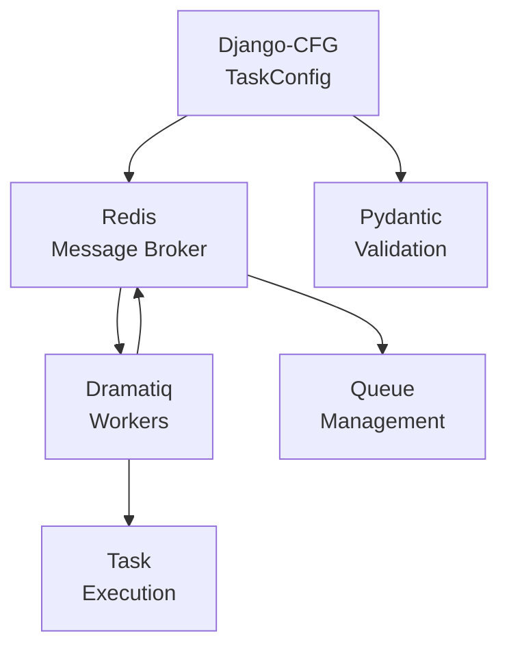

# 🎭 Dramatiq Integration

Dramatiq is a distributed task processing library for Python. Django-CFG provides zero-configuration integration with type-safe Pydantic models and production-ready defaults.

## Quick Navigation

### For Developers
- **Getting Started** → [Quick Start](#quick-start)
- **Configuration** → [Configuration Guide](./configuration)
- **Task Patterns** → [Examples](./examples)
- **Error Handling** → [Monitoring & Observability](./monitoring)

### For Project Managers
- **Implementation Timeline** → [Implementation Roadmap](./implementation)
- **Resource Requirements** → [Architecture Overview](#architecture-overview)

### For DevOps Engineers
- **Production Setup** → [Quick Start](#quick-start)
- **Monitoring** → [Monitoring Guide](./monitoring)
- **Deployment** → [Examples](./examples)

## Key Features

### ✅ What's Included
- **Zero Configuration** - Works out of the box with Redis
- **Type Safety** - Full Pydantic v2 validation
- **Production Ready** - Comprehensive middleware stack
- **Redis Reuse** - Leverages existing cache configuration
- **Optional Dependency** - Install only when needed

### Use Cases
- **Background Tasks** - Email sending, report generation
- **Async Processing** - File uploads, data processing
- **Scheduled Jobs** - Cleanup tasks, periodic reports
- **High Reliability** - Payment processing, critical operations

## Implementation Status

| Component | Status | Documentation |
|-----------|--------|---------------|
| **Core Models** | 📝 Designed | [Implementation](./implementation) |
| **Service Layer** | 📝 Designed | [Implementation](./implementation) |
| **Django Integration** | 📝 Designed | [Implementation](./implementation) |
| **Management Commands** | 📝 Designed | [Examples](./examples) |
| **Testing Strategy** | 📝 Planned | [Implementation](./implementation) |
| **Production Examples** | ✅ Complete | [Examples](./examples) |

## Quick Start

### 1. Installation
```bash
# Install Django-CFG with task support
pip install django-cfg[tasks]
```

### 2. Configuration
```python
# config.py
from django_cfg import DjangoConfig, CacheConfig
from django_cfg.models.tasks import TaskConfig

class MyConfig(DjangoConfig):
    project_name: str = "MyApp"

    # Redis for cache + tasks
    cache_default: CacheConfig = CacheConfig(redis_url="redis://localhost:6379/0")

    # Enable tasks with zero configuration
    tasks: TaskConfig = TaskConfig()

config = MyConfig()
```

### 3. Define Tasks
```python
# tasks.py
import dramatiq

@dramatiq.actor
def send_email(user_id: int):
    # Task implementation
    pass
```

### 4. Use Tasks
```python
# views.py
send_email.send(user.id)  # Queue task
```

### 5. Run Workers
```bash
python manage.py rundramatiq
```

## Architecture Overview



**Workflow:**
1. **Django-CFG** validates task configuration at startup
2. **Redis** acts as message broker for task queues
3. **Dramatiq workers** process tasks asynchronously
4. **Pydantic v2** ensures type safety throughout

## Next Steps

- **Configuration** → [Configuration Patterns](./configuration)
- **Implementation** → [Roadmap & Details](./implementation)
- **Examples** → [Code Examples](./examples)
- **Monitoring** → [Observability Guide](./monitoring)

## 🤝 Contributing

### Documentation Standards
- Follow [@DOCS_MODULE.md](/getting-started/intro) methodology
- Keep files under 1000 lines
- Include working code examples

### Code Standards
- Type hints for all functions
- Pydantic v2 for configuration
- Comprehensive error handling
- Production-ready defaults

## 📞 Support

### Issues and Questions
- **Technical Issues** → Create GitHub issue with `dramatiq` label
- **Configuration Help** → Check [Examples](./examples)
- **Performance Issues** → See [Monitoring Guide](./monitoring)

### Community Resources
- **Django-CFG Discussions** → GitHub Discussions
- **Dramatiq Documentation** → https://dramatiq.io/
- **Redis Documentation** → https://redis.io/documentation

---

## See Also

### Background Tasks Documentation

**Dramatiq Integration:**
- **[Configuration](./configuration)** - Set up Dramatiq workers and brokers
- **[Examples](./examples)** - Real-world task patterns
- **[Monitoring](./monitoring)** - Track task performance
- **[Testing](./testing)** - Test background tasks

**Related Features:**
- **[Payment System](/features/built-in-apps/payments/overview)** - Async payment processing
- **[Email Module](/features/modules/email/overview)** - Background email sending
- **[AI Knowledge Base](/features/built-in-apps/ai-knowledge/overview)** - Document processing tasks
- **[Newsletter](/features/built-in-apps/user-management/newsletter)** - Bulk email campaigns

### Configuration & Setup

**Getting Started:**
- **[Built-in Apps Overview](/features/built-in-apps/overview)** - Apps using background tasks
- **[Configuration Guide](/getting-started/configuration)** - Enable Dramatiq integration
- **[Production Config](/guides/production-config)** - Production task queue setup

**Infrastructure:**
- **[Configuration Models](/fundamentals/configuration)** - Complete Dramatiq config API
- **[Redis Setup](/fundamentals/configuration/cache)** - Configure Redis as message broker
- **[Docker Deployment](/guides/docker/production)** - Containerize workers

### Guides & CLI

**Practical Guides:**
- **[Troubleshooting](/guides/troubleshooting)** - Common task queue issues
- **[Background Task Commands](/cli/commands/background-tasks)** - Manage workers via CLI
- **[Testing](/features/integrations/dramatiq/testing)** - Test async tasks

**Alternative Integrations:**
- **[Ngrok Integration](/features/integrations/ngrok/overview)** - Test webhooks triggering tasks

---

**Made with ❤️ by the Django-CFG Team**

*Dramatiq Integration: Because background tasks should be simple, safe, and powerful.*
