# gRPC Interceptors

:::tip[Powerful Middleware System]
Interceptors provide a clean way to add cross-cutting concerns like logging, authentication, metrics, and error handling without modifying service code.
:::

## 🎯 What are Interceptors?

Interceptors are similar to middleware in web frameworks - they wrap gRPC service calls to add functionality:

- 🔐 **Authentication** - Verify JWT tokens, load users
- 📝 **Logging** - Log requests to database and console
- 📊 **Metrics** - Collect performance statistics
- ❌ **Error Handling** - Convert exceptions to gRPC status codes
- ⏱️ **Timing** - Measure request duration

## 🏗️ Interceptors Pipeline

```mermaid
graph LR
    Request["gRPC<br/>Request"] --> I1["1️⃣ Request<br/>Logger"]
    I1 --> I2["2️⃣ Console<br/>Logger"]
    I2 --> I3["3️⃣ JWT<br/>Auth"]
    I3 --> I4["4️⃣ Error<br/>Handler"]
    I4 --> I5["5️⃣ Metrics<br/>Collector"]
    I5 --> Service["Business<br/>Service"]
    Service --> I5b["5️⃣ Metrics"]
    I5b --> I4b["4️⃣ Error<br/>Handler"]
    I4b --> I3b["3️⃣ Auth"]
    I3b --> I2b["2️⃣ Logger"]
    I2b --> I1b["1️⃣ Request<br/>Logger"]
    I1b --> Response["gRPC<br/>Response"]

    style I1 fill:#e1f5ff
    style I3 fill:#fff3e0
    style I4 fill:#ffebee
    style Service fill:#e8f5e9
```



**Execution order:**
1. Request flows through interceptors (1→2→3→4→5)
2. Service executes
3. Response flows back through interceptors (5→4→3→2→1)

## 📝 Built-in Interceptors

### 1. RequestLoggerInterceptor

Logs all gRPC requests to database for monitoring and debugging.

**Location:** `django_cfg.apps.integrations.grpc.interceptors.RequestLoggerInterceptor`

**Features:**
- Creates `GRPCRequestLog` entry on request start
- Updates entry with response/error details
- Tracks duration, status, user, client IP
- Supports all call types (unary, streaming)

**Database fields tracked:**
```python
{
    "request_id": "uuid",
    "service_name": "UserService",
    "method_name": "GetUser",
    "status": "success",  # pending/success/error/cancelled/timeout
    "grpc_status_code": "OK",
    "duration_ms": 125,
    "request_size": 1024,
    "response_size": 2048,
    "user": User object or None,
    "client_ip": "192.168.1.100",
    "user_agent": "grpc-python/1.60.0",
    "error_message": None,
    "created_at": "2025-11-03T14:30:00Z"
}
```

**Configuration:**
```python
# Enabled by default, logs to GRPCRequestLog model
# No additional configuration needed
```

### 2. LoggingInterceptor

Structured console logging for development.

**Location:** `django_cfg.apps.integrations.grpc.interceptors.LoggingInterceptor`

**Features:**
- Pretty console output with colors
- Request/response logging
- Duration tracking
- Error highlighting

**Console output:**
```
[gRPC] ➡️  UserService.GetUser | peer=ipv4:127.0.0.1:54321
[gRPC] ✅ UserService.GetUser | status=OK | time=125.50ms
```

**Configuration:**
```python
# Automatically enabled in DEBUG mode
# Disabled in production for performance
```

### 3. JWTAuthInterceptor

Authenticates requests using JWT tokens.

**Location:** `django_cfg.apps.integrations.grpc.auth.JWTAuthInterceptor`

**Features:**
- Extracts JWT from `Authorization` metadata
- Verifies token signature and expiration
- Loads Django User from token
- Sets `user` on context for services
- Supports public methods whitelist

**Flow:**


**Configuration:**
```python
# api/config.py
grpc: GRPCConfig = GRPCConfig(
    auth=GRPCAuthConfig(
        enabled=True,
        require_auth=False,  # Allow public methods
        jwt_algorithm="HS256",
        public_methods=[
            "/grpc.health.v1.Health/Check",
            "/grpc.health.v1.Health/Watch",
        ],
    ),
)
```

### 4. ErrorHandlingInterceptor

Converts Python/Django exceptions to gRPC status codes.

**Location:** `django_cfg.apps.integrations.grpc.interceptors.ErrorHandlingInterceptor`

**Exception mapping:**
```python
{
    # Django exceptions
    ObjectDoesNotExist: StatusCode.NOT_FOUND,
    PermissionDenied: StatusCode.PERMISSION_DENIED,
    ValidationError: StatusCode.INVALID_ARGUMENT,

    # Python exceptions
    ValueError: StatusCode.INVALID_ARGUMENT,
    TypeError: StatusCode.INVALID_ARGUMENT,
    NotImplementedError: StatusCode.UNIMPLEMENTED,
    TimeoutError: StatusCode.DEADLINE_EXCEEDED,

    # Generic fallback
    Exception: StatusCode.INTERNAL,
}
```

**Example:**
```python
# In your service
class UserService(BaseService):
    def GetUser(self, request, context):
        try:
            user = User.objects.get(id=request.user_id)
            return user_pb2.User(...)
        except User.DoesNotExist:
            # ErrorHandlingInterceptor converts to NOT_FOUND
            raise
```

### 5. MetricsInterceptor

Collects in-memory performance metrics.

**Location:** `django_cfg.apps.integrations.grpc.interceptors.MetricsInterceptor`

**Metrics collected:**
- Total requests count
- Success/error counts
- Average duration
- P95/P99 latency
- Requests per service/method

**Access metrics:**
```python
from django_cfg.apps.integrations.grpc.interceptors import get_metrics

metrics = get_metrics()
# {
#     "total_requests": 1543,
#     "successful_requests": 1489,
#     "error_requests": 54,
#     "avg_duration_ms": 125.3,
#     "services": {
#         "UserService": {
#             "total": 845,
#             "success": 830,
#             "errors": 15
#         }
#     }
# }
```

## 🔧 Custom Interceptors

### Creating Custom Interceptor

```python
import grpc
import logging

logger = logging.getLogger(__name__)

class CustomInterceptor(grpc.ServerInterceptor):
    """Custom interceptor example."""

    def intercept_service(self, continuation, handler_call_details):
        """
        Intercept gRPC service call.

        Args:
            continuation: Function to invoke next interceptor/service
            handler_call_details: Details about the RPC call
        """
        method = handler_call_details.method
        metadata = dict(handler_call_details.invocation_metadata)

        # Pre-processing
        logger.info(f"Before calling {method}")

        # Call next interceptor or service
        handler = continuation(handler_call_details)

        # Wrap the actual RPC method
        if handler and handler.unary_unary:
            original_method = handler.unary_unary

            def wrapped_method(request, context):
                # Before service call
                logger.info(f"Request: {request}")

                try:
                    # Call service
                    response = original_method(request, context)

                    # After service call (success)
                    logger.info(f"Response: {response}")
                    return response

                except Exception as e:
                    # After service call (error)
                    logger.error(f"Error: {e}")
                    raise

            return grpc.unary_unary_rpc_method_handler(
                wrapped_method,
                request_deserializer=handler.request_deserializer,
                response_serializer=handler.response_serializer,
            )

        return handler
```

### Registering Custom Interceptor

```python
# In your gRPC server configuration
from django_cfg.apps.integrations.grpc.interceptors import (
    RequestLoggerInterceptor,
    JWTAuthInterceptor,
)
from myapp.interceptors import CustomInterceptor

# Order matters! Earlier interceptors wrap later ones
interceptors = [
    RequestLoggerInterceptor(),
    CustomInterceptor(),  # Your custom interceptor
    JWTAuthInterceptor(),
]

server = grpc.server(
    futures.ThreadPoolExecutor(max_workers=10),
    interceptors=interceptors,
)
```

## 🎯 Common Use Cases

### 1. Rate Limiting

```python
import time
from collections import defaultdict

class RateLimitInterceptor(grpc.ServerInterceptor):
    """Rate limit requests per client."""

    def __init__(self, max_requests=100, window_seconds=60):
        self.max_requests = max_requests
        self.window = window_seconds
        self.requests = defaultdict(list)

    def intercept_service(self, continuation, handler_call_details):
        # Get client IP from peer
        metadata = dict(handler_call_details.invocation_metadata)
        peer = metadata.get('peer', 'unknown')

        # Check rate limit
        now = time.time()
        self.requests[peer] = [
            ts for ts in self.requests[peer]
            if now - ts < self.window
        ]

        if len(self.requests[peer]) >= self.max_requests:
            # Rate limit exceeded
            def abort_rate_limit(*args, **kwargs):
                context = args[1] if len(args) > 1 else None
                if context:
                    context.abort(
                        grpc.StatusCode.RESOURCE_EXHAUSTED,
                        "Rate limit exceeded"
                    )

            return grpc.unary_unary_rpc_method_handler(
                abort_rate_limit,
                request_deserializer=lambda x: x,
                response_serializer=lambda x: x,
            )

        # Record request
        self.requests[peer].append(now)

        return continuation(handler_call_details)
```

### 2. Request ID Propagation

```python
import uuid

class RequestIDInterceptor(grpc.ServerInterceptor):
    """Add unique request ID to all requests."""

    def intercept_service(self, continuation, handler_call_details):
        handler = continuation(handler_call_details)

        if handler and handler.unary_unary:
            original_method = handler.unary_unary

            def wrapped_method(request, context):
                # Generate or extract request ID
                metadata = dict(context.invocation_metadata())
                request_id = metadata.get('x-request-id', str(uuid.uuid4()))

                # Set on context for service access
                context.request_id = request_id

                # Add to response metadata
                context.set_trailing_metadata([
                    ('x-request-id', request_id)
                ])

                return original_method(request, context)

            return grpc.unary_unary_rpc_method_handler(
                wrapped_method,
                request_deserializer=handler.request_deserializer,
                response_serializer=handler.response_serializer,
            )

        return handler
```

### 3. Audit Logging

```python
class AuditInterceptor(grpc.ServerInterceptor):
    """Log sensitive operations for audit trail."""

    AUDITED_METHODS = [
        'DeleteUser',
        'UpdatePermissions',
        'TransferFunds',
    ]

    def intercept_service(self, continuation, handler_call_details):
        method = handler_call_details.method.split('/')[-1]

        if method in self.AUDITED_METHODS:
            handler = continuation(handler_call_details)

            if handler and handler.unary_unary:
                original_method = handler.unary_unary

                def wrapped_method(request, context):
                    user = getattr(context, 'user', None)

                    # Log before
                    AuditLog.objects.create(
                        user=user,
                        action=method,
                        request_data=MessageToDict(request),
                        timestamp=timezone.now(),
                    )

                    return original_method(request, context)

                return grpc.unary_unary_rpc_method_handler(
                    wrapped_method,
                    request_deserializer=handler.request_deserializer,
                    response_serializer=handler.response_serializer,
                )

        return continuation(handler_call_details)
```

## 🔍 Debugging Interceptors

### Enable Debug Logging

```python
# settings.py
LOGGING = {
    'loggers': {
        'django_cfg.apps.integrations.grpc.interceptors': {
            'level': 'DEBUG',
            'handlers': ['console'],
        },
    },
}
```

### Interceptor Execution Order

Print execution order for debugging:

```python
class DebugInterceptor(grpc.ServerInterceptor):
    """Debug interceptor to trace execution."""

    def __init__(self, name):
        self.name = name

    def intercept_service(self, continuation, handler_call_details):
        print(f"→ {self.name}: Before")
        handler = continuation(handler_call_details)
        print(f"← {self.name}: After")
        return handler

# Use multiple debug interceptors
interceptors = [
    DebugInterceptor("First"),
    DebugInterceptor("Second"),
    DebugInterceptor("Third"),
]
```

Output:
```
→ First: Before
→ Second: Before
→ Third: Before
[Service executes]
← Third: After
← Second: After
← First: After
```

## 📚 Related Documentation

- **[Authentication](./authentication.md)** - JWT authentication details
- **[Monitoring](./monitoring.md)** - Request logging and metrics
- **[Backend Guide](./backend-guide.md)** - Using interceptors in services
- **[Architecture](./architecture.md)** - System architecture

---

**Next:** Learn about [troubleshooting](./troubleshooting.md) common gRPC issues.
