# gRPC Architecture & Design

This document explains the architecture and design patterns behind Django-CFG's gRPC integration.

## 🏗️ System Architecture

### High-Level Overview

```mermaid
graph TB
    subgraph "External Clients"
        PythonClient([Python Client])
        GoClient([Go Client])
        JSClient([JavaScript Client])
        MobileClient([Mobile App])
    end

    subgraph "Django-CFG Application"
        subgraph "gRPC Server Layer"
            Server["🚀 gRPC Server<br/>(asyncio/threading)"]
            Reflection["Server Reflection<br/>(grpcurl support)"]
            Health["Health Check Service"]
        end

        subgraph "Interceptors Pipeline"
            direction LR
            I1["Request Logger"]
            I2["Console Logger"]
            I3["JWT Auth"]
            I4["Error Handler"]
            I5["Metrics"]

            I1 --> I2 --> I3 --> I4 --> I5
        end

        subgraph "Service Layer"
            Discovery["Service Discovery<br/>(Auto-registration)"]
            BaseClasses["Base Service Classes<br/>(BaseService, ReadOnlyService, AuthRequiredService)"]
        end

        subgraph "Business Services"
            UserService["UserService"]
            ProductService["ProductService"]
            OrderService["OrderService"]
            CustomServices["Custom Services..."]
        end

        subgraph "Django Integration"
            ORM[("💾 Django ORM")]
            Auth["Django Auth<br/>(User, Permissions)"]
            Signals["Django Signals"]
            Cache{{Redis Cache}}
        end

        subgraph "Data Layer"
            DB[("PostgreSQL / MySQL / SQLite")]
            Redis[("Redis")]
        end

        subgraph "Monitoring Layer"
            LogModel["GRPCRequestLog<br/>Model"]
            AdminUI["Django Admin<br/>Interface"]
            RestAPI["REST Monitoring<br/>API"]
        end
    end

    PythonClient -->|gRPC| Server
    GoClient -->|gRPC| Server
    JSClient -->|gRPC| Server
    MobileClient -->|gRPC| Server

    Server --> Reflection
    Server --> Health
    Server --> I1

    I5 --> Discovery
    Discovery --> BaseClasses
    BaseClasses --> UserService
    BaseClasses --> ProductService
    BaseClasses --> OrderService
    BaseClasses --> CustomServices

    UserService --> ORM
    ProductService --> ORM
    OrderService --> ORM

    ORM --> DB
    Auth --> DB
    Cache --> Redis

    I1 -.->|Log| LogModel
    LogModel --> DB
    LogModel --> AdminUI
    LogModel --> RestAPI

    style Server fill:#1e40af
    style BaseClasses fill:#15803d
    style LogModel fill:#7e22ce
    style Discovery fill:#be185d
```



## 🔄 Request Flow Architecture

### Complete Request Lifecycle


### Error Flow


## 🧩 Component Architecture

### 1. Interceptors Pipeline

The interceptors execute in a specific order to ensure proper request handling:

```mermaid
graph TB
    Request["Incoming<br/>Request"] --> I1

    subgraph "Interceptors (Execution Order)"
        I1["1️⃣ Request Logger<br/>━━━━━━━━━━━<br/>• Generate request ID<br/>• Create log entry<br/>• Extract metadata"]
        I2["2️⃣ Console Logger<br/>━━━━━━━━━━━<br/>• Structured logging<br/>• Request/response size<br/>• Duration tracking"]
        I3["3️⃣ JWT Auth<br/>━━━━━━━━━━━<br/>• Extract token<br/>• Verify signature<br/>• Load Django user<br/>• Set user context"]
        I4["4️⃣ Error Handler<br/>━━━━━━━━━━━<br/>• Wrap service call<br/>• Catch exceptions<br/>• Map to gRPC status<br/>• Format error details"]
        I5["5️⃣ Metrics<br/>━━━━━━━━━━━<br/>• Collect metrics<br/>• Performance data<br/>• Success/error rates"]
    end

    Service["Business<br/>Service"]
    Response["Outgoing<br/>Response"]

    I1 --> I2 --> I3 --> I4 --> I5 --> Service
    Service --> I5 --> I4 --> I3 --> I2 --> I1 --> Response

    style I1 fill:#1e40af
    style I3 fill:#ea580c
    style I4 fill:#dc2626
    style Service fill:#15803d
```



**Key Design Decisions:**

1. **Request Logger First** - Creates log entry before any processing
2. **Auth Before Error Handler** - User context available for error logging
3. **Error Handler Wraps Service** - Catches all service exceptions
4. **Bidirectional Flow** - Interceptors process both request and response

### 2. Service Discovery System

```mermaid
graph TB
    Config["GRPCConfig<br/>━━━━━━━━━━━<br/>auto_register_apps=True<br/>enabled_apps=[...]"]

    Discovery["ServiceDiscovery<br/>━━━━━━━━━━━"]

    subgraph "Discovery Process"
        Apps["Load Django Apps"]
        Scan["Scan for Service Modules"]
        Import["Import Service Classes"]
        Register["Register with gRPC Server"]
    end

    subgraph "Service Module Patterns"
        P1["app/grpc_services.py"]
        P2["app/grpc_handlers.py"]
        P3["app/services/grpc.py"]
        P4["app/handlers/grpc.py"]
        P5["app/api/grpc.py"]
    end

    subgraph "Service Registration"
        Server["gRPC Server"]
        Servicer["Add Servicer"]
        Reflection["Update Reflection"]
    end

    Config --> Discovery
    Discovery --> Apps --> Scan

    Scan --> P1
    Scan --> P2
    Scan --> P3
    Scan --> P4
    Scan --> P5

    P1 --> Import
    P2 --> Import
    P3 --> Import
    P4 --> Import
    P5 --> Import

    Import --> Register
    Register --> Servicer
    Register --> Reflection
    Servicer --> Server

    style Discovery fill:#be185d
    style Server fill:#1e40af
```



### 3. Base Service Classes Hierarchy


## 🔐 Authentication Architecture

### JWT Token Flow


### Public vs Protected Methods


## 📊 Monitoring Architecture

### Request Logging System

```mermaid
graph TB
    subgraph "Request Processing"
        Request["gRPC Request"]
        Interceptor["Request Logger Interceptor"]
        Service["Service Execution"]
        Response["gRPC Response"]
    end

    subgraph "Logging Pipeline"
        Create["Create Log Entry<br/>━━━━━━━━━━━<br/>• request_id (UUID)<br/>• service_name<br/>• method_name<br/>• status = PENDING<br/>• timestamp"]

        Update["Update Log Entry<br/>━━━━━━━━━━━<br/>• status = SUCCESS/ERROR<br/>• duration_ms<br/>• response_size<br/>• grpc_status_code<br/>• error_message"]
    end

    subgraph "Database"
        LogTable["GRPCRequestLog Table<br/>━━━━━━━━━━━<br/>• All request metadata<br/>• Indexed by service/method<br/>• Indexed by status<br/>• Indexed by user"]
    end

    subgraph "Monitoring Interfaces"
        Admin["Django Admin<br/>━━━━━━━━━━━<br/>• Beautiful UI<br/>• Color-coded badges<br/>• Filtering & search<br/>• Export to CSV"]

        RestAPI["REST Monitoring API<br/>━━━━━━━━━━━<br/>/cfg/integrations/grpc/monitor/overview<br/>/cfg/integrations/grpc/monitor/requests<br/>/cfg/integrations/grpc/monitor/services<br/>/cfg/integrations/grpc/monitor/timeline"]

        Metrics["Metrics & Stats<br/>━━━━━━━━━━━<br/>• Total requests<br/>• Success rate<br/>• Avg duration<br/>• P95 latency"]
    end

    Request --> Interceptor
    Interceptor --> Create
    Create --> LogTable

    Interceptor --> Service
    Service --> Response

    Response --> Interceptor
    Interceptor --> Update
    Update --> LogTable

    LogTable --> Admin
    LogTable --> RestAPI
    LogTable --> Metrics

    style Create fill:#047857
    style Update fill:#1e40af
    style LogTable fill:#7e22ce
```



### Statistics & Metrics

```mermaid
graph TB
    subgraph "Data Collection"
        Logs["GRPCRequestLog<br/>Records"]
    end

    subgraph "Aggregation (ORM)"
        Manager["GRPCRequestLogManager<br/>━━━━━━━━━━━"]

        Stats["get_statistics(hours=24)<br/>━━━━━━━━━━━<br/>• total requests<br/>• successful requests<br/>• error count<br/>• success_rate %<br/>• avg_duration_ms<br/>• p95_duration_ms"]

        Filters["Filter Methods<br/>━━━━━━━━━━━<br/>• recent(hours)<br/>• successful()<br/>• error()<br/>• by_service(name)<br/>• by_method(name)<br/>• by_user(user)"]
    end

    subgraph "Presentation"
        Overview["Overview Dashboard<br/>━━━━━━━━━━━<br/>📊 Total Requests<br/>✅ Success Rate<br/>⚡ Avg Duration<br/>🔥 Top Services"]

        Timeline["Timeline View<br/>━━━━━━━━━━━<br/>📈 Requests over time<br/>🕐 Hourly breakdown<br/>📉 Error trends"]

        Services["Services View<br/>━━━━━━━━━━━<br/>📋 Service list<br/>🎯 Per-service stats<br/>🔍 Method breakdown"]
    end

    Logs --> Manager
    Manager --> Stats
    Manager --> Filters

    Stats --> Overview
    Filters --> Timeline
    Filters --> Services

    style Manager fill:#be185d
    style Overview fill:#047857
    style Timeline fill:#1e40af
```



## 🔄 Phase 4: Dynamic Invocation

### Dynamic gRPC Client Architecture


**Key Features:**
1. **Service Discovery** - Automatically discover all available services
2. **Method Introspection** - Get method signatures and schemas
3. **Dynamic Message Creation** - Create protobuf messages from JSON/dict
4. **No Proto Files Required** - Use reflection to understand service contracts

Learn more: [Dynamic Invocation Guide](./dynamic-invocation.md)

---

## 🎯 Design Patterns

### 1. Interceptor Pattern

**Purpose:** Cross-cutting concerns (logging, auth, metrics) without modifying service code.

**Implementation:**
```python
class MyInterceptor(grpc.ServerInterceptor):
    def intercept_service(self, continuation, handler_call_details):
        # Pre-processing
        # ...

        # Call next interceptor/service
        response = continuation(handler_call_details)

        # Post-processing
        # ...

        return response
```

### 2. Service Discovery Pattern

**Purpose:** Automatic registration of gRPC services from Django apps.

**Key Components:**
- Module scanning (grpc_services.py, grpc_handlers.py)
- Lazy loading support
- Convention over configuration

### 3. Django Integration Pattern

**Purpose:** Seamless access to Django features in gRPC services.

**Integration Points:**
- ORM via models
- User authentication via JWT
- Permissions via Django auth
- Admin interface for monitoring
- Signals for events

### 4. Error Mapping Pattern

**Purpose:** Convert Django exceptions to appropriate gRPC status codes.

**Mapping:**
```
Django Exception          → gRPC Status Code
━━━━━━━━━━━━━━━━━━━━━━━━━━━━━━━━━━━━━━━━━━━━
ValidationError           → INVALID_ARGUMENT
ObjectDoesNotExist        → NOT_FOUND
PermissionDenied          → PERMISSION_DENIED
NotImplementedError       → UNIMPLEMENTED
TimeoutError              → DEADLINE_EXCEEDED
Exception                 → INTERNAL
```

## 🚀 Performance Considerations

### Threading Model


**Configuration:**
```python
GRPCServerConfig(
    max_workers=10,  # Thread pool size
    # More workers = more concurrent requests
    # But higher memory usage
)
```

### Database Optimization

- **Connection Pooling** - Reuse database connections
- **Select Related / Prefetch Related** - Reduce N+1 queries
- **Indexed Fields** - Fast lookups on service/method/status
- **Async Logging** - Non-blocking request logging

## 📚 Related Documentation

- **[Getting Started](./getting-started.md)** - Configure gRPC in your project
- **[Configuration](./configuration.md)** - Configure gRPC settings
- **[Concepts](./concepts.md)** - Core gRPC concepts
- **[FAQ](./faq.md)** - Common questions and answers

---

**Next:** Learn how to [get started with gRPC](./getting-started.md) in your Django-CFG project.
