# gRPC Core Concepts

Understanding the key concepts behind Django-CFG's gRPC integration.

## 🏗️ Architecture Overview

```mermaid
graph TB
    subgraph "Client Layer"
        Client(["gRPC Clients<br/>(Python, Go, JS, etc)"])
    end

    subgraph "gRPC Server"
        Server["🚀 gRPC Server<br/>(Port 50051)"]

        subgraph "Interceptors Pipeline"
            I1["Request Logger"]
            I2["API Key Auth"]
            I3["Error Handler"]
        end

        subgraph "Service Layer"
            Discovery["Auto-Discovery"]
            Base["Base Classes"]
            Services["Your Services"]
        end
    end

    subgraph "Django Layer"
        ORM[("💾 Django ORM")]
        Auth["Django Auth"]
        Admin["Admin Interface"]
        ApiKeys["API Key Manager"]
        ServerStatus["Server Monitor"]
    end

    Client -->|gRPC Call| Server
    Server --> I1 --> I2 --> I3 --> I4
    I4 --> Discovery --> Base --> Services
    Services --> ORM
    Services --> Auth
    I1 -.->|Logs| Admin
    I2 -.->|Validates| ApiKeys
    Server -.->|Tracks| ServerStatus

    style Server fill:#1e40af
    style Services fill:#15803d
    style ORM fill:#7e22ce
```



### Key Components

1. **gRPC Server** - Runs on separate port (default: 50051)
2. **Interceptors** - Middleware for cross-cutting concerns (logging, auth, errors)
3. **Services** - Your business logic (auto-discovered)
4. **Django Integration** - Full ORM and auth access
5. **API Key Manager** - Secure API key generation and validation
6. **Server Monitor** - Real-time server status and uptime tracking

## 🔄 Request Flow


**Flow steps:**
1. Request enters server
2. Interceptors process metadata (logging, auth)
3. User loaded from API key
4. Service method executes
5. Django ORM queries database
6. Response flows back through interceptors
7. Completion logged to database

## 🎯 Service Discovery

### How It Works

Django-CFG automatically discovers gRPC services from your Django apps:

```python
# Configuration
grpc: GRPCConfig = GRPCConfig(
    auto_register_apps=True,
    enabled_apps=["apps.users", "apps.products"],
)
```

**Discovery locations** (in order):
1. `app/grpc_services.py`
2. `app/grpc_handlers.py`
3. `app/services/grpc.py`
4. `app/api/grpc.py`

**Example:**
```
apps/users/
├── models.py
├── grpc_services.py    # ✅ Discovered automatically
└── ...
```

### Pattern


**Benefits:**
- ✅ Zero configuration (convention over configuration)
- ✅ Automatic registration
- ✅ Hot reload in development
- ✅ No manual service lists

## 🔐 Authentication & Authorization

### API Key Authentication Flow


### Access Levels

**Public methods** (no authentication):
```python
from django_cfg.apps.integrations.grpc.services import BaseService

class UserService(BaseService):
    def GetUser(self, request, context):
        # No auth required
        user = User.objects.get(id=request.user_id)
        return user_pb2.User(...)
```

**Protected methods** (authentication required):
```python
class UserService(BaseService):
    def UpdateProfile(self, request, context):
        # Require authentication
        user = self.require_user(context)
        user.bio = request.bio
        user.save()
        return user_pb2.User(...)
```

**Permission checks**:
```python
class UserService(BaseService):
    def DeleteUser(self, request, context):
        # Require staff permission
        self.require_staff(context)
        User.objects.get(id=request.user_id).delete()
        return user_pb2.Empty()
```

### Base Service Classes


**Choose based on use case:**
- `BaseService` - Flexible (some methods public, some protected)
- `ReadOnlyService` - Only queries, no writes
- `AuthRequiredService` - All methods require authentication

## 🔌 Interceptors Pipeline

### Concept

Interceptors are like middleware - they wrap service calls to add functionality without modifying service code.


### Built-in Interceptors

**1. RequestLoggerInterceptor**
- Logs every request to database
- Tracks duration, status, errors
- Links to API key used for authentication
- Available in Django Admin with beautiful UI

**2. ApiKeyAuthInterceptor** (New!)
- Extracts API key from `x-api-key` metadata
- Validates against GrpcApiKey model
- Accepts Django SECRET_KEY for dev/internal use
- Updates usage tracking (last_used_at, request_count)
- Sets user and api_key on context
- Supports public methods whitelist

**3. ErrorHandlingInterceptor**
- Catches Python exceptions
- Converts to gRPC status codes
- Maps Django exceptions properly

**Example mapping:**
```python
User.DoesNotExist      → StatusCode.NOT_FOUND
PermissionDenied       → StatusCode.PERMISSION_DENIED
ValidationError        → StatusCode.INVALID_ARGUMENT
Exception              → StatusCode.INTERNAL
```

### Execution Order

Interceptors execute in specific order:
1. **Request Logger** - First to log everything
2. **API Key Auth** - Validate API key and load user
3. **Error Handler** - Catch all exceptions
4. **Service** - Your business logic

Response flows back in reverse order.

## 📝 Request Logging

### What Gets Logged

Every gRPC request creates a database record:

```python
GRPCRequestLog:
    - request_id: UUID
    - service_name: "UserService"
    - method_name: "GetUser"
    - status: success/error/cancelled/timeout
    - duration_ms: 125
    - user: User object or None
    - api_key: GrpcApiKey object or None  # NEW!
    - is_authenticated: True/False
    - client_ip: "192.168.1.100"
    - error_message: if failed
    - created_at: timestamp
```

### Use Cases

1. **Debugging** - Find slow or failing requests
2. **Monitoring** - Track service health
3. **Analytics** - Understand usage patterns
4. **Auditing** - Security and compliance

### Access Logs

**Django Admin:**
```
/admin/integrations/grpc/grpcrequestlog/
```

**Programmatically:**
```python
from django_cfg.apps.integrations.grpc.models import GRPCRequestLog

# Recent errors
errors = GRPCRequestLog.objects.filter(
    status='error'
).order_by('-created_at')[:10]

# Filter by API key
api_key_logs = GRPCRequestLog.objects.filter(
    api_key__name="Analytics Service"
)

# Statistics
stats = GRPCRequestLog.objects.get_statistics(hours=24)
# {
#     "total": 1543,
#     "successful": 1489,
#     "success_rate": 96.5,
#     "avg_duration_ms": 125.3
# }
```

## 📊 Server Status Tracking

### What Gets Tracked

Every gRPC server instance is tracked in real-time:

```python
GRPCServerStatus:
    - instance_id: "hostname:port:pid"
    - address: "[::]:50051"
    - host: "[::]"
    - port: 50051
    - pid: 12345
    - hostname: "server-01"
    - status: starting/running/stopping/stopped/error
    - started_at: timestamp
    - last_heartbeat: timestamp
    - stopped_at: timestamp or None
    - uptime_seconds: calculated
    - max_workers: 10
    - enable_reflection: True/False
    - enable_health_check: True/False
    - registered_services: JSON array of service metadata
    - error_message: if status is error
```

### Environment-Aware Process Detection

The server status tracking uses environment-aware detection:

- **Production Mode**: Assumes external server in Docker, relies on heartbeat only
- **Development/Test**: Checks local process PID + heartbeat
- **Auto-detects** based on `config.env_mode`

This allows proper monitoring in both containerized and local environments.

### Usage

```python
from django_cfg.apps.integrations.grpc.models import GRPCServerStatus

# Get all running servers
running = GRPCServerStatus.objects.filter(status="running")

# Check if server is alive
for server in running:
    if server.is_running:
        print(f"Server {server.address}: {server.uptime_display}")
        print(f"  Registered services: {len(server.registered_services)}")
```

## 🔄 Dynamic Invocation (Phase 4)

### Concept

Test and invoke gRPC methods without writing client code or having proto files.


### How It Works

**1. Discover services:**
```python
from django_cfg.apps.integrations.grpc.services.grpc_client import DynamicGRPCClient

client = DynamicGRPCClient(host="localhost", port=50051)
services = client.list_services()
# ['api.users.UserService', 'api.products.ProductService']
```

**2. Invoke methods:**
```python
response = client.invoke_method(
    service="api.users.UserService",
    method="GetUser",
    request_data={"user_id": 1}
)
# Returns protobuf response as dict
```

**Benefits:**
- ✅ No proto files needed
- ✅ Test during development
- ✅ API exploration
- ✅ Automated testing

## 🎨 Design Patterns

### 1. Convention Over Configuration

Services are discovered automatically based on file naming:
```python
# Just create the file, no registration needed
# apps/users/grpc_services.py

class UserService(BaseService):
    def GetUser(self, request, context):
        # Automatically discovered and registered
        pass
```

### 2. Django Integration

Full Django features available in services:
```python
class OrderService(BaseService):
    def CreateOrder(self, request, context):
        user = self.require_user(context)  # Django user

        # Django ORM
        order = Order.objects.create(user=user)

        # Django signals
        order_created.send(sender=Order, instance=order)

        # Django cache
        cache.set(f'order:{order.id}', order, 300)

        return order_pb2.Order(...)
```

### 3. Base Classes

Inherit from base classes for common patterns:
```python
# For flexible auth
class PublicService(BaseService):
    pass

# For read-only
class CatalogService(ReadOnlyService):
    pass

# For always authenticated
class AccountService(AuthRequiredService):
    pass
```

## 🔍 Key Principles

### 1. Separation of Concerns

- **Services** - Business logic only
- **Interceptors** - Cross-cutting concerns
- **Models** - Data access
- **Serializers** - Data transformation

### 2. Django-First

gRPC is integrated into Django, not the other way around:
- Use Django ORM
- Use Django auth
- Use Django admin
- Use Django signals

### 3. Developer Experience

- Auto-discovery (no manual registration)
- Base classes (common patterns built-in)
- Clear error messages
- Good logging

### 4. Production-Ready

- Request logging
- Performance monitoring
- Error handling
- Security (API key auth)

## 📚 Next Steps

- **[Getting Started](./getting-started.md)** - Build your first service
- **[Authentication](./authentication.md)** - API keys authentication
- **[Configuration](./configuration.md)** - Configure gRPC settings
- **[Dynamic Invocation](./dynamic-invocation.md)** - Test without client code
- **[FAQ](./faq.md)** - Common questions

---

**Key Takeaway:** Django-CFG gRPC provides production-ready gRPC server with full Django integration through convention over configuration, automatic service discovery, powerful interceptors pipeline, and beautiful PydanticAdmin-powered admin interface for API keys and server monitoring.
