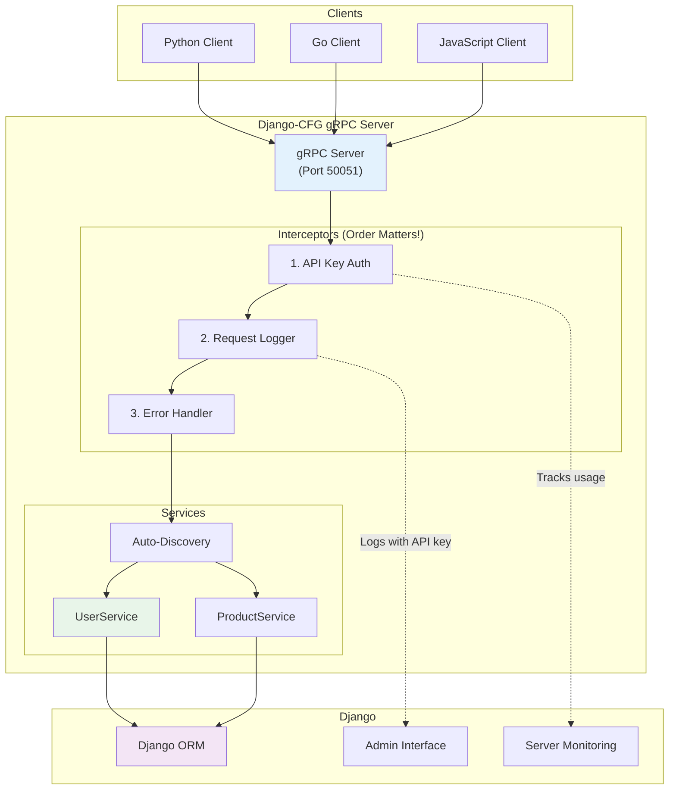
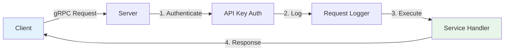
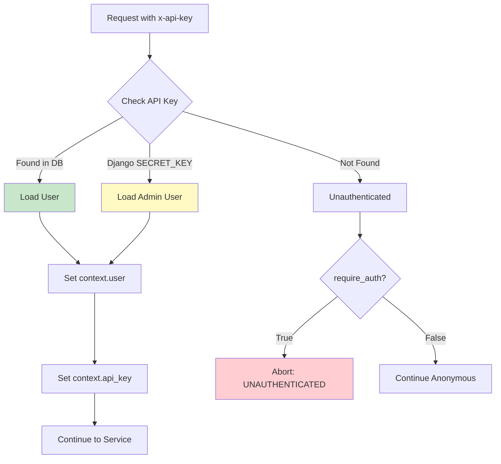

# gRPC Integration

:::tip[Production-Ready gRPC Server]
Build high-performance gRPC APIs with full Django integration - ORM, authentication, admin interface, and automatic service discovery.
:::

## 🎯 What is This?

Django-CFG provides a **complete gRPC server** that integrates seamlessly with Django:

- ✅ **Auto-Discovery** - Services automatically registered from Django apps
- ✅ **Django Integration** - Full ORM, auth, admin, signals access
- ✅ **API Key Authentication** - Simple, secure API key management with admin interface
- ✅ **Request Logging** - All requests logged to database with API key tracking
- ✅ **Server Monitoring** - Real-time server status and uptime tracking
- ✅ **REST API** - Monitor services and manage API keys via REST endpoints
- ✅ **Production-Ready** - Interceptors, error handling, monitoring
- ✅ **Developer-Friendly** - Base classes, helpers, zero configuration

## 🚀 Quick Start

### 1. Install

```bash
pip install django-cfg[grpc]
```

### 2. Enable in Config

```python
# api/config.py
from django_cfg import DjangoConfig, GRPCConfig, GRPCServerConfig

class MyConfig(DjangoConfig):
    grpc = GRPCConfig(
        enabled=True,
        server=GRPCServerConfig(
            host="[::]",
            port=50051,
        ),
        enabled_apps=["apps.users", "apps.products"],
    )
```

### 3. Create Service

```python
# apps/users/grpc_services.py
from django_cfg.apps.integrations.grpc.services import BaseService
from django.contrib.auth import get_user_model

User = get_user_model()

class UserService(BaseService):
    def GetUser(self, request, context):
        user = User.objects.get(id=request.user_id)
        return UserResponse(
            id=user.id,
            username=user.username,
            email=user.email,
        )
```

### 4. Start Server

```bash
python manage.py rungrpc
```

Output:
```
🚀 Starting gRPC server...
📡 Server running at [::]:50051
✅ Registered 1 service: api.users.UserService
```

### 5. Test

```bash
grpcurl -plaintext -d '{"user_id": 1}' \
  localhost:50051 api.users.UserService/GetUser
```

**That's it!** Your gRPC service is running. 🎉

## 🏗️ Architecture



## 🎯 Key Features

### Auto-Discovery

Services are automatically discovered from your Django apps:

```python
# No registration needed! Just create the file:
# apps/users/grpc_services.py

class UserService(BaseService):
    def GetUser(self, request, context):
        # Automatically discovered and registered
        pass
```

**Discovery locations:**
- `app/grpc_services.py` ✅
- `app/grpc_handlers.py` ✅
- `app/services/grpc.py` ✅

### Django Integration

Full access to Django features:

```python
class OrderService(BaseService):
    def CreateOrder(self, request, context):
        # Django ORM
        user = self.require_user(context)  # From JWT token
        order = Order.objects.create(user=user)

        # Django signals
        order_created.send(sender=Order, instance=order)

        # Django cache
        cache.set(f'order:{order.id}', order, 300)

        return OrderResponse(...)
```

### API Key Authentication

Manage API keys through Django Admin for secure service authentication:

**Create key:**
1. Go to Django Admin → gRPC API Keys
2. Click "Add gRPC API Key"
3. Fill in name, user, type, expiration
4. Save and copy the generated key

**Use key:**
```bash
grpcurl -H "x-api-key: <your-key>" \
  localhost:50051 api.users.UserService/GetUser
```

**Features:**
- Auto-generated secure keys (64-character hex)
- Managed through Django Admin
- Optional expiration dates
- Usage tracked automatically (request count, last used)
- Easy revocation
- Django SECRET_KEY support for dev/internal use

**Example service with auth:**
```python
class UserService(BaseService):
    def UpdateProfile(self, request, context):
        # Require authentication
        user = self.require_user(context)

        # Check permissions
        if not user.has_perm('users.change_profile'):
            self.abort_permission_denied(context, "No access")

        # Access API key info
        api_key = getattr(context, 'api_key', None)
        if api_key:
            print(f"Request from: {api_key.name}")

        # Update profile
        user.bio = request.bio
        user.save()
        return UserResponse(...)
```

### Request Logging

All requests automatically logged to database **with API key tracking**:

```python
# View in Django Admin
/admin/integrations/grpc/grpcrequestlog/

# Query programmatically
from django_cfg.apps.integrations.grpc.models import GRPCRequestLog

stats = GRPCRequestLog.objects.get_statistics(hours=24)
# {
#     "total": 1543,
#     "successful": 1489,
#     "success_rate": 96.5,
#     "avg_duration_ms": 125.3
# }

# Filter by API key
api_key_logs = GRPCRequestLog.objects.filter(
    api_key__name="Analytics Service"
)

# Filter by user
user_logs = GRPCRequestLog.objects.filter(
    user__username="service_user",
    is_authenticated=True
)

# Get recent requests with API key info (via REST API)
# GET /api/grpc/monitor/requests/
# Returns: user_id, username, api_key_id, api_key_name for each request
```

### Server Monitoring

Real-time server status tracking:

**View in Django Admin:** `/admin/` → gRPC Server Status

See server monitoring:
- Server address and port
- Status (running/stopped)
- Uptime
- Registered services

### Integration Testing

Test your complete gRPC setup with a single command:

```bash
python manage.py test_grpc_integration [--app APP_NAME] [--quiet]
```

**What it tests:**
1. ✅ Proto file generation
2. ✅ Server startup
3. ✅ API key authentication
4. ✅ Request logging with API key tracking
5. ✅ Service discovery
6. ✅ Automatic cleanup

**Example output:**
```
🧪 gRPC Integration Test
━━━━━━━━━━━━━━━━━━━━━━━━━━━━━━━━━━━━━━━━━━━━

✅ Step 1/6: Generated proto files
✅ Step 2/6: Started gRPC server (PID: 12345)
✅ Step 3/6: Created test API key
✅ Step 4/6: Client tests passed (3/3)
   ✓ With API key
   ✓ With SECRET_KEY
   ✗ Invalid key (expected failure)
✅ Step 5/6: Request logs verified
   • Total logs: 95
   • With API key: 33
   • With SECRET_KEY: 62
✅ Step 6/6: Cleanup completed

━━━━━━━━━━━━━━━━━━━━━━━━━━━━━━━━━━━━━━━━━━━━
🎉 All tests passed! (6/6)
```

:::tip Production Testing
Use this command in CI/CD pipelines to verify your gRPC setup before deployment.
:::

## 📊 Process Flows

### Simple Request Flow



### API Key Authentication Flow



### Interceptor Chain

```mermaid
graph LR
    A[Request] --> B[1. ApiKeyAuth<br/>Sets context]
    B --> C[2. RequestLogger<br/>Uses context]
    C --> D[3. Service<br/>Handles request]
    D --> E[Response]

    style B fill:#ffebee
    style C fill:#e1f5fe
    style D fill:#e8f5e9

    note1[⚠️ ORDER MATTERS!<br/>Auth must be first]
    note1 -.-> B
```



### Base Service Classes

Three base classes for common patterns:

```python
# Flexible authentication
from django_cfg.apps.integrations.grpc.services import BaseService

class MyService(BaseService):
    pass

# Read-only operations
from django_cfg.apps.integrations.grpc.services import ReadOnlyService

class CatalogService(ReadOnlyService):
    pass

# All methods require auth
from django_cfg.apps.integrations.grpc.services import AuthRequiredService

class AccountService(AuthRequiredService):
    pass
```

### Dynamic Invocation (Phase 4)

Test services without proto files using reflection:

```python
from django_cfg.apps.integrations.grpc.services.grpc_client import DynamicGRPCClient

client = DynamicGRPCClient("localhost", 50051)

# Discover services
services = client.list_services()

# Invoke method
response = client.invoke_method(
    "api.users.UserService",
    "GetUser",
    {"user_id": 1}
)
```

## 🔄 Request Flow


## 📚 Documentation

### Core Guides
- **[Getting Started](./getting-started.md)** - Build your first service (10 min)
- **[Concepts](./concepts.md)** - Architecture and design patterns
- **[Configuration](./configuration.md)** - Complete configuration reference
- **[Authentication](./authentication.md)** - API key authentication

### Advanced Topics
- **[REST API](./rest-api.md)** - REST endpoints for monitoring and management
- **[Dynamic Invocation](./dynamic-invocation.md)** - Test without proto files
- **[FAQ](./faq.md)** - Common questions and troubleshooting

## 💡 Why Django-CFG gRPC?

### vs. Plain gRPC

| Feature | Plain gRPC | Django-CFG gRPC |
|---------|------------|-----------------|
| Service Registration | Manual | ✅ Automatic |
| Django ORM | Manual setup | ✅ Built-in |
| API Key Auth | DIY | ✅ Built-in with admin |
| Request Logging | DIY | ✅ Automatic with API key tracking |
| Server Monitoring | DIY | ✅ Real-time status tracking |
| REST API | None | ✅ Full monitoring and management API |
| Admin Interface | None | ✅ Django Admin integration |
| Error Handling | Manual | ✅ Automatic |

### vs. REST

| Aspect | REST | gRPC |
|--------|------|------|
| Performance | Good | ✅ Excellent |
| Binary Protocol | No | ✅ Yes (smaller, faster) |
| Streaming | Limited | ✅ Bidirectional |
| Type Safety | Optional | ✅ Built-in (protobuf) |
| Browser Support | ✅ Native | Limited (grpc-web) |
| Public APIs | ✅ Better | Good |

**Use gRPC for:**
- Microservices communication
- Mobile app backends
- Real-time systems
- High-performance APIs

**Use REST for:**
- Public APIs
- Browser-based apps
- Simple CRUD

---

**Ready to start?** Check out the [Getting Started Guide](./getting-started.md) and build your first gRPC service in 10 minutes! 🚀
