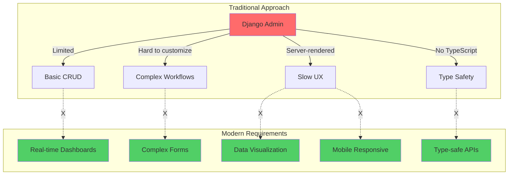
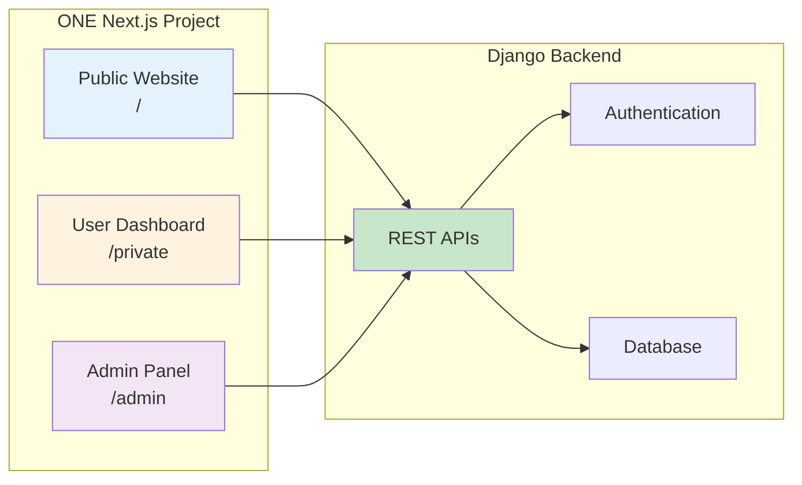
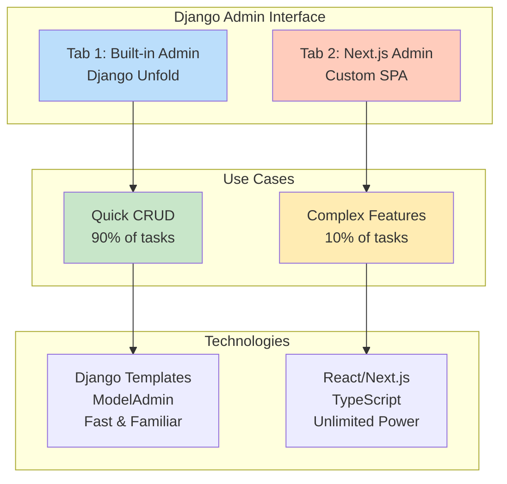
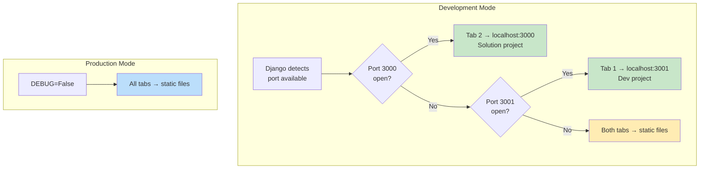
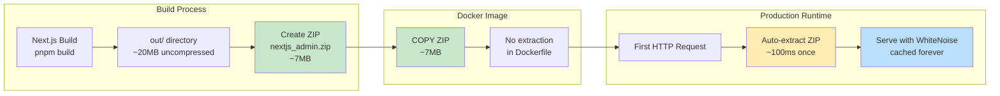
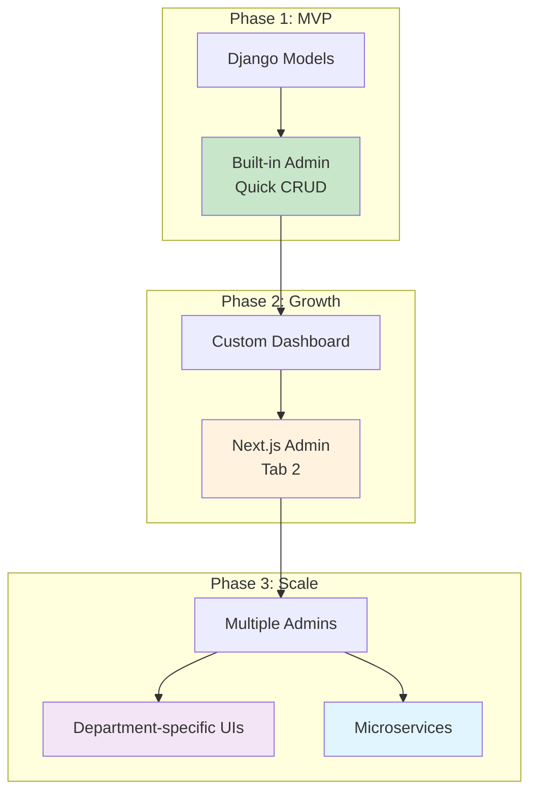
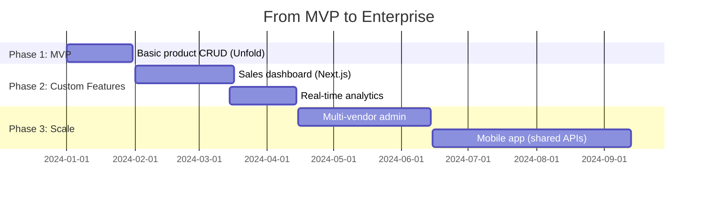

# Core Concepts

## The Problem We Solve

### Traditional Django Admin Pain Points



**The gap**: Django Admin is great for 90% of tasks, but **hits a ceiling** for complex requirements.

---

## The django-cfg Solution

### Three-in-One Architecture



**One codebase, three interfaces:**
- 🌐 **Public** (`/`) - Marketing, landing pages
- 👤 **User Dashboard** (`/private`) - User features
- ⚙️ **Admin Panel** (`/admin`) - Management interface

:::tip Why This Matters
Instead of maintaining 3 separate projects, you get **shared components**, **shared layouts**, and **shared API clients** - all in one Next.js monorepo.
:::

---

## Dual Admin Strategy

### Best of Both Worlds



### When to Use Each Tab

| Scenario | Use Tab 1 (Built-in) | Use Tab 2 (Next.js) |
|----------|---------------------|-------------------|
| **Simple CRUD** | ✅ Perfect | ❌ Overkill |
| **Quick edits** | ✅ Fast | ❌ Slower |
| **Custom dashboard** | ❌ Limited | ✅ Unlimited |
| **Real-time data** | ❌ No WebSocket | ✅ Full WebSocket |
| **Complex forms** | ❌ Django forms | ✅ React components |
| **Data visualization** | ❌ Basic | ✅ Charts/Graphs |
| **Mobile responsive** | ⚠️ Limited | ✅ Fully responsive |

:::info Progressive Enhancement
Start with **Tab 1** for quick wins, graduate to **Tab 2** when you need more power. No migration needed - both coexist!
:::

---

## Automatic API Generation

### Zero-Config TypeScript Clients

```mermaid
sequenceDiagram
    participant Dev as Developer
    participant Django
    participant Generator
    participant NextJS as Next.js App

    Dev->>Django: 1. Define Django Model
    Note over Django: class Order(models.Model):<br/>    title = CharField()

    Dev->>Generator: 2. Run generate_clients
    Note over Generator: python manage.py<br/>generate_clients --typescript

    Generator->>Generator: 3. Scan Django APIs
    Note over Generator: Introspect models,<br/>views, serializers

    Generator->>Generator: 4. Generate TypeScript
    Note over Generator: Create types,<br/>client classes, HTTP methods

    Generator->>NextJS: 5. Copy to Next.js
    Note over NextJS: apps/admin/src/api/generated/

    Dev->>NextJS: 6. Use in React
    Note over NextJS: import { OrdersClient }<br/>const orders = await client.list()

    NextJS-->>Django: 7. Type-safe API calls

    style Dev fill:#e1f5fe
    style Generator fill:#f3e5f5
    style NextJS fill:#c8e6c9
```

### What You Get

```typescript
// ✅ Auto-generated from Django models
import { OrdersClient, Order } from '@/api/generated/orders';

const client = new OrdersClient();

// ✅ Full TypeScript support
const orders: Order[] = await client.list();

// ✅ Type-safe parameters
const order = await client.get(123);

// ✅ Validated payloads
await client.create({
  title: "New Order",
  price: 99.99,
  // ❌ TypeScript error if invalid fields
});
```

**Zero manual work** - types stay in sync with Django automatically!

---

## Authentication Flow

### Seamless JWT Integration

```mermaid
sequenceDiagram
    participant User
    participant DjangoAdmin as Django Admin
    participant NextJSIframe as Next.js iframe
    participant LocalStorage
    participant DjangoAPI as Django API

    User->>DjangoAdmin: 1. Login to Django
    DjangoAdmin->>DjangoAdmin: 2. Authenticate user

    User->>DjangoAdmin: 3. Open Admin Panel
    DjangoAdmin->>NextJSIframe: 4. Load iframe

    DjangoAdmin->>DjangoAdmin: 5. Generate JWT tokens
    Note over DjangoAdmin: RefreshToken.for_user(user)

    DjangoAdmin->>NextJSIframe: 6. Inject tokens in HTML
    Note over DjangoAdmin: <script>localStorage.setItem(...)</script>

    NextJSIframe->>LocalStorage: 7. Store tokens
    Note over LocalStorage: auth_token<br/>refresh_token

    NextJSIframe->>DjangoAPI: 8. API call with token
    Note over NextJSIframe: Authorization: Bearer <token>

    DjangoAPI->>NextJSIframe: 9. Authenticated response

    style User fill:#e1f5fe
    style DjangoAdmin fill:#c8e6c9
    style NextJSIframe fill:#fff3e0
    style LocalStorage fill:#f3e5f5
```

**Zero configuration needed** - authentication "just works"!

:::tip Security
- Tokens are **only injected** for authenticated users
- Tokens include **user permissions** and **expiry**
- iframe uses **restrictive sandbox** attributes
:::

---

## Development vs Production

### Auto-Detection Magic



**How it works:**

1. **Django checks** if `DEBUG=True`
2. **Quick socket test** (0.1s) to see which ports are open:
   - Port 3000 available → Tab 2 shows dev server ✅
   - Port 3001 available → Tab 1 shows dev server ✅
3. **No env variables needed** - automatic detection!

:::info No Configuration
Just run `make dev-admin` or `make dev` - Django figures it out automatically!
:::

---

## Deployment Architecture

### ZIP-Based Distribution



### Why ZIP Instead of Direct Copy?

| Metric | Uncompressed | ZIP Archive |
|--------|--------------|-------------|
| **File size** | ~20MB | ~7MB |
| **Docker layer size** | ~25MB | ~8MB |
| **Files to copy** | ~3000 files | 1 file |
| **Build time** | ~30s | ~5s |
| **First request penalty** | 0ms | ~100ms (once) |
| **Subsequent requests** | Fast | Fast (cached) |

**Winner**: ZIP! Smaller images, faster builds, one-time extraction cost.

---

## Theme Synchronization

### Cross-iframe Communication

```mermaid
sequenceDiagram
    participant User
    participant DjangoUnfold as Django Unfold
    participant LocalStorage
    participant NextJSIframe as Next.js iframe

    User->>DjangoUnfold: Toggle theme
    DjangoUnfold->>LocalStorage: Set unfold_theme='dark'

    LocalStorage-->>NextJSIframe: storage event
    NextJSIframe->>NextJSIframe: Update theme state
    NextJSIframe->>NextJSIframe: Apply dark mode styles

    Note over DjangoUnfold,NextJSIframe: Both UIs stay in sync!

    style DjangoUnfold fill:#c8e6c9
    style NextJSIframe fill:#fff3e0
    style LocalStorage fill:#f3e5f5
```

**Bidirectional sync:**
- Django changes theme → Next.js updates ✅
- Next.js changes theme → Django updates ✅

---

## File Structure Philosophy

### Monorepo Organization

```
django_admin/                    # ONE Next.js project
├── apps/
│   └── admin/
│       ├── pages/
│       │   ├── index.tsx        # 🌐 Public: Landing page
│       │   ├── auth.tsx         # 🌐 Public: Login
│       │   ├── legal/           # 🌐 Public: Terms, Privacy
│       │   │   ├── privacy.tsx
│       │   │   └── terms.tsx
│       │   ├── private/         # 👤 User Dashboard
│       │   │   ├── index.tsx
│       │   │   ├── profile.tsx
│       │   │   └── payments.tsx
│       │   └── admin/           # ⚙️ Admin Panel
│       │       ├── index.tsx
│       │       ├── crypto.tsx
│       │       └── trading.tsx
│       │
│       └── src/
│           ├── components/      # 🔁 SHARED across all
│           │   ├── ui/
│           │   └── forms/
│           ├── layouts/         # 🔁 SHARED layouts
│           │   ├── PublicLayout.tsx
│           │   ├── PrivateLayout.tsx
│           │   └── AdminLayout.tsx
│           └── api/generated/   # 🔁 SHARED API clients
│               ├── orders/
│               └── profiles/
```

**Key insight**: Everything is **shared** - write once, use everywhere!

:::tip DRY Principle
One Button component works in:
- Public landing page
- User dashboard
- Admin panel

**No duplication!**
:::

---

## Scalability Model

### From Startup to Enterprise



**Growth path:**
1. **Start simple** - Use built-in admin (Tab 1)
2. **Add features** - Build custom UI (Tab 2)
3. **Scale up** - Multiple Next.js apps (future)

**No migration, no rewrites** - just progressive enhancement!

---

## Comparison Matrix

### vs Other Solutions

| Feature | django-cfg | Django Unfold | React Admin | Retool |
|---------|-----------|---------------|-------------|--------|
| **Django integration** | ✅ Native | ✅ Native | ⚠️ Manual | ❌ External |
| **TypeScript** | ✅ Auto-generated | ❌ No | ✅ Manual | ⚠️ Limited |
| **Built-in + Custom** | ✅ Both | ✅ Built-in only | ❌ Custom only | ❌ External only |
| **Hot reload** | ✅ Yes | ❌ No | ✅ Yes | ⚠️ Cloud only |
| **Zero config** | ✅ Yes | ✅ Yes | ❌ Complex | ⚠️ WYSIWYG |
| **Cost** | ✅ Free | ✅ Free | ✅ Free | ❌ $$$$ |
| **Customization** | ✅ Unlimited | ⚠️ Limited | ✅ High | ⚠️ Locked-in |
| **WebSocket** | ✅ Yes | ❌ No | ⚠️ Manual | ✅ Yes |
| **Docker ready** | ✅ Yes | ✅ Yes | ⚠️ Manual | ❌ Cloud |
| **Multi-tenant** | ✅ Planned | ❌ No | ⚠️ Manual | ✅ Yes |

---

## Core Principles

### 1. **Convention over Configuration**

```python
# All you need:
nextjs_admin=NextJsAdminConfig(
    project_path="../django_admin",
)
# Everything else has smart defaults!
```

### 2. **Progressive Enhancement**

Start with basics → Add features → Scale up

No big rewrites, no migrations.

### 3. **Zero Lock-in**

```typescript
// It's just Next.js + Django
// No proprietary APIs
// Standard tech stack
// Easy to eject if needed
```

### 4. **Developer Experience First**

- **Hot reload** in development
- **Auto-generated types** from Django
- **Instant feedback** loops
- **Zero configuration** magic

---

## Real-World Example

### E-commerce Platform Evolution



**Timeline:**
- **Day 1-30**: Built-in admin for products (Tab 1)
- **Day 31-75**: Custom sales dashboard (Tab 2)
- **Day 76-105**: Real-time analytics with WebSocket
- **Day 106+**: Scale with multiple admins

**Total cost**: $0 (open source)
**Total rewrites**: 0 (incremental)
**Developer happiness**: 💯

---

## Next Steps

Now that you understand the **why** and **how**, let's get practical:

<div className="row margin-top--lg">
  <div className="col col--6">
    <div className="card">
      <div className="card__header">
        <h3>🚀 Quick Start</h3>
      </div>
      <div className="card__body">
        <p>Get your first Next.js admin running in 5 minutes.</p>
      </div>
      <div className="card__footer">
        <a href="./quick-start" className="button button--primary button--block">Start Building →</a>
      </div>
    </div>
  </div>
  <div className="col col--6">
    <div className="card">
      <div className="card__header">
        <h3>🔧 How It Works</h3>
      </div>
      <div className="card__body">
        <p>Deep dive into the technical implementation.</p>
      </div>
      <div className="card__footer">
        <a href="./how-it-works" className="button button--secondary button--block">Learn More →</a>
      </div>
    </div>
  </div>
</div>

---

## Philosophy

:::tip The django-cfg Way
We believe admin interfaces should be:
- **Fast to start** - Zero config, smart defaults
- **Easy to customize** - Unlimited React power when needed
- **Free to scale** - No lock-in, no rewrites
- **Fun to build** - Great DX with hot reload and TypeScript

**Not just another admin framework** - it's a complete **full-stack solution** for Django + Next.js.
:::
