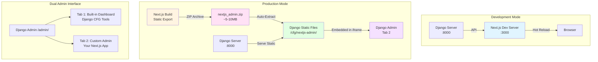
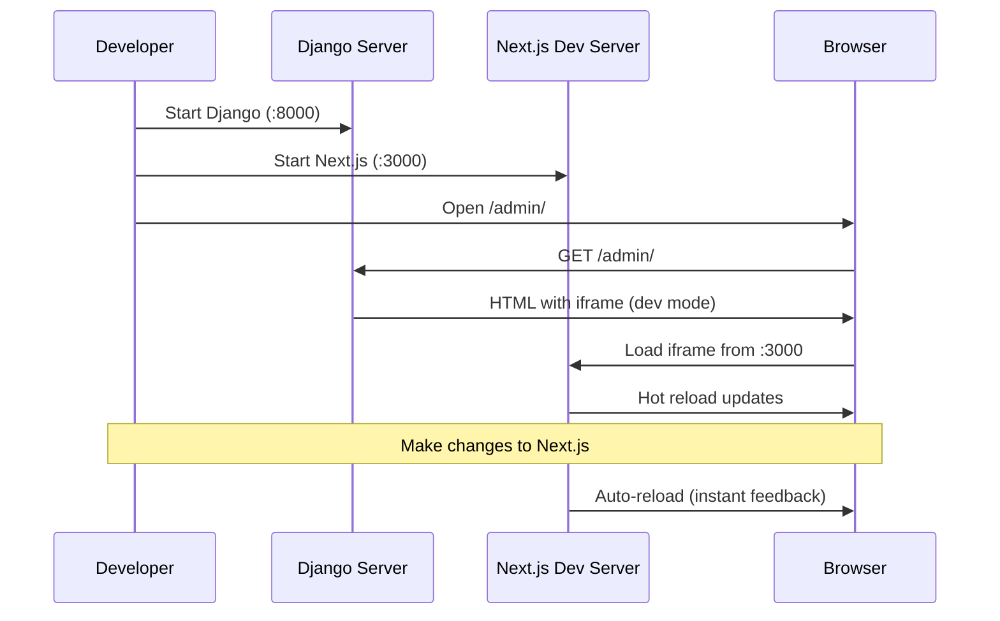
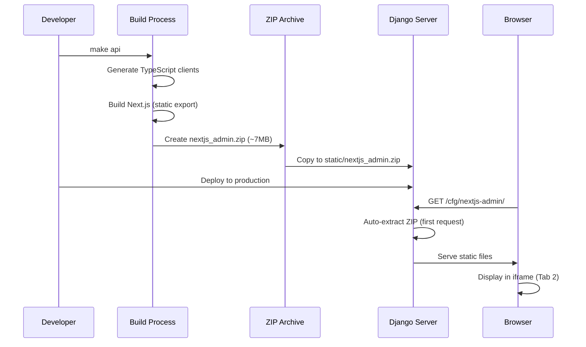

# Creating Custom Admin Panel

Django CFG provides a powerful and elegant way to create custom Next.js admin panels that integrate seamlessly with your Django backend. This guide covers the complete workflow from setup to deployment.

## Overview

Django CFG supports **dual admin architecture** with two independent admin interfaces:

1. **Tab 1: Built-in Dashboard** - Pre-configured admin interface for Django CFG tools
2. **Tab 2: Custom Next.js Admin** - Your custom admin panel (static build, no Node.js server required)

### Key Benefits

- ✅ **Universal Project** - Works as standalone Next.js app AND embedded in Django
- ✅ **Zero Server Overhead** - Static build doesn't require Node.js in production
- ✅ **Automatic Integration** - ZIP archive auto-extracts on first request
- ✅ **Type-Safe APIs** - Auto-generated TypeScript clients from Django models
- ✅ **Hot Reload** - Full development experience with instant feedback

## Architecture



## Quick Start

### Step 1: Configure Next.js Admin

In your Django project's `api/config.py`:

```python
from django_cfg import DjangoConfig, NextJsAdminConfig

config = DjangoConfig(
    # ... other config ...
    
    # === Next.js Admin Integration ===
    nextjs_admin: Optional[NextJsAdminConfig] = NextJsAdminConfig(
        # Path to Next.js admin project (relative to manage.py directory)
        project_path="../frontend/apps/admin",
        
        # Customize where TypeScript clients are copied
        api_output_path="app/_lib/api/generated",
        
        # Optional: static files URL prefix (default: /cfg/admin/)
        # static_url="/cfg/admin/",
        
        # Optional: Next.js dev server URL (default: http://localhost:3001)
        # dev_url="http://localhost:3001",
        
        # Optional: iframe route for default view (default: /private)
        # iframe_route="/private",
        
        # Optional: tab title in admin (default: Next.js Admin)
        # tab_title="Dashboard",
    )
)
```

### Step 2: Generate API Clients & Build

In your Next.js admin project directory:

```bash
# Generate TypeScript API clients and build Next.js
make api
```

Or manually:

```bash
# From Django project root
cd ../frontend/apps/admin
python ../../../django/manage.py generate_clients --typescript

# This automatically:
# 1. Generates TypeScript clients from Django OpenAPI schema
# 2. Copies clients to app/_lib/api/generated/
# 3. Builds Next.js with NEXT_PUBLIC_STATIC_BUILD=true
# 4. Creates ZIP archive: ../../../django/static/nextjs_admin.zip
```

### Step 3: Access in Django Admin

```bash
# Start Django server
python manage.py runserver

# Visit: http://localhost:8000/admin/
# You'll see TWO tabs:
#   - Tab 1: Built-in Dashboard (Django CFG tools)
#   - Tab 2: Your Custom Admin (auto-extracted from ZIP)
```

## Complete Workflow

### Development Workflow



### Production Workflow



## Project Structure

Your Next.js admin project should follow this structure:

```
frontend/apps/admin/
├── app/                          # Next.js App Router
│   ├── (pages)/                 # Route groups
│   │   ├── admin/               # Admin routes
│   │   ├── private/             # User routes
│   │   └── public/               # Public routes
│   ├── _core/                   # Core config
│   │   ├── settings.ts          # App settings
│   │   └── metadata.ts          # SEO metadata
│   ├── _lib/                    # Shared libraries
│   │   └── api/
│   │       └── generated/       # ← Auto-copied TypeScript clients
│   ├── _layouts/                # Layout components
│   └── _routes/                 # Route definitions
├── package.json
├── next.config.ts               # Static export config
└── tsconfig.json
```

## Configuration Details

### Next.js Configuration

Your `next.config.ts` should enable static export:

```typescript
import { createBaseNextConfig } from '@djangocfg/nextjs/config';

const config = createBaseNextConfig({
  isDefaultCfgAdmin: true,  // Enables static build mode
});

export default config;
```

### Static Build Settings

When `NEXT_PUBLIC_STATIC_BUILD=true` is set (automatically during build):

- `output: "export"` - Static HTML export
- `basePath` - Set from `NextJsAdminConfig.static_url`
- `images.unoptimized: true` - Required for static export
- All routes pre-rendered as static HTML

### API Client Generation

TypeScript clients are automatically generated and copied:

```bash
# Generated from Django OpenAPI schema
openapi/clients/typescript/cfg/
├── models.ts          # TypeScript models
├── client.ts          # API client
└── schemas.ts         # Zod schemas

# Auto-copied to Next.js project
frontend/apps/admin/app/_lib/api/generated/cfg/
└── [same structure]
```

## Build Process

### Automatic Build (Recommended)

When you run `make api` or `python manage.py generate_clients --typescript`:

1. **Generate OpenAPI Schema** - Parse Django models/views
2. **Generate TypeScript Clients** - Create type-safe API clients
3. **Copy to Next.js** - Auto-copy to `app/_lib/api/generated/`
4. **Build Next.js** - Run `pnpm build` with `NEXT_PUBLIC_STATIC_BUILD=true`
5. **Create ZIP Archive** - Package `out/` directory into `nextjs_admin.zip`
6. **Copy to Django** - Move ZIP to `{BASE_DIR}/static/nextjs_admin.zip`

### Manual Build

If you prefer manual control:

```bash
# 1. Generate API clients
cd ../../../django
python manage.py generate_clients --typescript --no-build

# 2. Build Next.js
cd ../frontend/apps/admin
NEXT_PUBLIC_STATIC_BUILD=true pnpm build

# 3. Create ZIP
cd out
zip -r -q ../../../django/static/nextjs_admin.zip .

# 4. Verify
ls -lh ../../../django/static/nextjs_admin.zip
# Should show ~5-10MB file
```

## ZIP Archive & Auto-Extraction

### Archive Creation

The ZIP archive is created during build:

```python
# Location: {BASE_DIR}/static/nextjs_admin.zip
# Contents: All files from Next.js out/ directory
# Size: ~5-10MB (compressed from ~20MB uncompressed)
```

### Auto-Extraction

On first HTTP request to `/cfg/nextjs-admin/`:

```python
# Django automatically:
# 1. Detects missing extraction directory
# 2. Extracts ZIP to {BASE_DIR}/static/nextjs_admin/
# 3. Serves files via Django static file serving
# 4. Subsequent requests use extracted files (fast)
```

**Performance:**
- Extraction time: ~100-200ms (one-time operation)
- Subsequent requests: Instant (served from directory)
- No Node.js server required in production

## Dual Admin Interface

### Tab 1: Built-in Dashboard

- **Purpose**: Django CFG tools and utilities
- **Source**: Pre-built admin from `django_cfg` package
- **Path**: `/cfg/admin/admin/`
- **Dev Server**: `http://localhost:3777/admin` (if running)

### Tab 2: Custom Admin

- **Purpose**: Your custom Next.js admin panel
- **Source**: Static build from your project
- **Path**: `/cfg/nextjs-admin/admin/`
- **Dev Server**: `http://localhost:3000/admin` (if running)
- **ZIP**: `{BASE_DIR}/static/nextjs_admin.zip`

### Tab Switching

Users can switch between tabs seamlessly:

```html
<!-- Django Admin Interface -->
<div class="tabs">
  <button>Tab 1: Built-in Dashboard</button>
  <button>Tab 2: Custom Admin</button>
</div>

<!-- Each tab has its own iframe -->
<iframe id="tab-1" src="/cfg/admin/admin/"></iframe>
<iframe id="tab-2" src="/cfg/nextjs-admin/admin/"></iframe>
```

## Development Mode

### Running Dev Servers

```bash
# Terminal 1: Django
cd projects/django
python manage.py runserver

# Terminal 2: Next.js Admin
cd projects/frontend/apps/admin
pnpm dev  # Runs on port 3000

# Terminal 3: Built-in Admin (optional)
cd django-cfg-dev/src/django_admin/apps/admin
pnpm dev  # Runs on port 3777
```

### Dev Server Detection

Django automatically detects running dev servers:

- **Port 3000**: Custom Next.js admin (Tab 2)
- **Port 3777**: Built-in admin (Tab 1)

If dev server is running, Django serves iframe from dev URL. If not, falls back to static files.

### Hot Reload

When Next.js dev server is running:

- Changes to React components → Instant hot reload
- Changes to API clients → Restart dev server
- Changes to Django models → Regenerate clients

## Production Deployment

### Build for Production

```bash
# Single command does everything
make api

# Or from Django project:
python manage.py generate_clients --typescript
```

This creates:
- `static/nextjs_admin.zip` (~5-10MB)
- Ready for deployment

### Docker Deployment

```dockerfile
# Dockerfile
FROM python:3.11

# Copy Django project (includes static/nextjs_admin.zip)
COPY . /app
WORKDIR /app

# Install dependencies
RUN pip install -r requirements.txt

# Run migrations
RUN python manage.py migrate

# ZIP file is already included, no extraction needed
# Django will auto-extract on first request

# Start server
CMD ["gunicorn", "api.wsgi:application"]
```

### First Request Behavior

```python
# First HTTP request to /cfg/nextjs-admin/
# → Django detects missing extraction directory
# → Extracts nextjs_admin.zip to static/nextjs_admin/
# → Serves files
# → Subsequent requests use extracted files (fast)
```

## Configuration Options

### NextJsAdminConfig Reference

```python
NextJsAdminConfig(
    # Required
    project_path="../frontend/apps/admin",
    
    # Optional - API Client Path
    api_output_path="app/_lib/api/generated",  # Default
    
    # Optional - Static Build Output
    static_output_path="out",  # Default
    
    # Optional - URL Prefix
    static_url="/cfg/nextjs-admin/",  # Default
    
    # Optional - Dev Server URL
    dev_url="http://localhost:3000",  # Default
    
    # Optional - iframe Route
    iframe_route="/private",  # Default
    
    # Optional - Tab Title
    tab_title="Custom Admin",  # Default: "Next.js Admin"
)
```

## Best Practices

### 1. Universal Project Design

Design your Next.js project to work in both modes:

```typescript
// app/_core/settings.ts
export const settings = {
  // Detects build mode automatically
  isStaticBuild: process.env.NEXT_PUBLIC_STATIC_BUILD === 'true',
  
  // API URL: empty for static builds (relative paths)
  api: {
    baseUrl: process.env.NEXT_PUBLIC_STATIC_BUILD 
      ? ''  // Relative paths in static build
      : 'http://localhost:8000',  // Absolute in dev
  },
};
```

### 2. Route Organization

Organize routes by domain:

```
app/(pages)/
├── admin/          # Admin routes (/admin/*)
├── private/        # User routes (/private/*)
└── public/         # Public routes (/, /contact, etc.)
```

### 3. API Client Usage

Use generated clients with type safety:

```typescript
import { api } from '@/api/generated/cfg';

// Type-safe API calls
const users = await api.cfg_accounts_user_list();
const stats = await api.cfg_tasks_api_tasks_stats_retrieve();
```

### 4. Static Asset Paths

Use helper functions for static assets:

```typescript
// app/_core/settings.ts
const getStaticAssetPath = (path: string): string => {
  const base = isStaticBuild ? basePath : siteUrl;
  return `${base}/static/${path}`;
};

// Usage
settings.app.icons.logo = getStaticAssetPath('logos/logo.svg');
```

## Troubleshooting

### ZIP Not Found

**Error**: `[nextjs_admin] No ZIP found in solution or package`

**Solution**:
```bash
# Build Next.js and create ZIP
cd frontend/apps/admin
make api
```

### Old Files Served

**Symptom**: HTML shows outdated content

**Solution**:
```bash
# Delete extracted directory (forces re-extraction)
rm -rf {BASE_DIR}/static/nextjs_admin/

# Next request will re-extract from ZIP
```

### Dev Server Not Detected

**Symptom**: Tabs use static files despite dev server running

**Possible Causes**:
1. Dev server still compiling (wait 5-10 seconds)
2. Wrong port (check `package.json` scripts)
3. Firewall blocking connection

**Solution**:
```bash
# Check if dev server is running
lsof -i :3000 | grep LISTEN

# Test connection
curl -I http://localhost:3000/admin
```

### Build Errors

**Error**: TypeScript errors during build

**Solution**:
```bash
# Check types first
cd frontend/apps/admin
pnpm check

# Fix errors, then rebuild
make api
```

## Summary

Django CFG's custom admin integration provides:

- ✅ **Universal Projects** - Same codebase works standalone and embedded
- ✅ **Zero Server Overhead** - Static build, no Node.js in production
- ✅ **Automatic Integration** - ZIP auto-extracts, no manual steps
- ✅ **Type-Safe APIs** - Auto-generated clients from Django models
- ✅ **Dual Admin Strategy** - Built-in tools + custom React interface
- ✅ **Hot Reload** - Full development experience

**The result**: A simple, elegant solution that "just works" - configure once, deploy anywhere, no Node.js server required in production.

