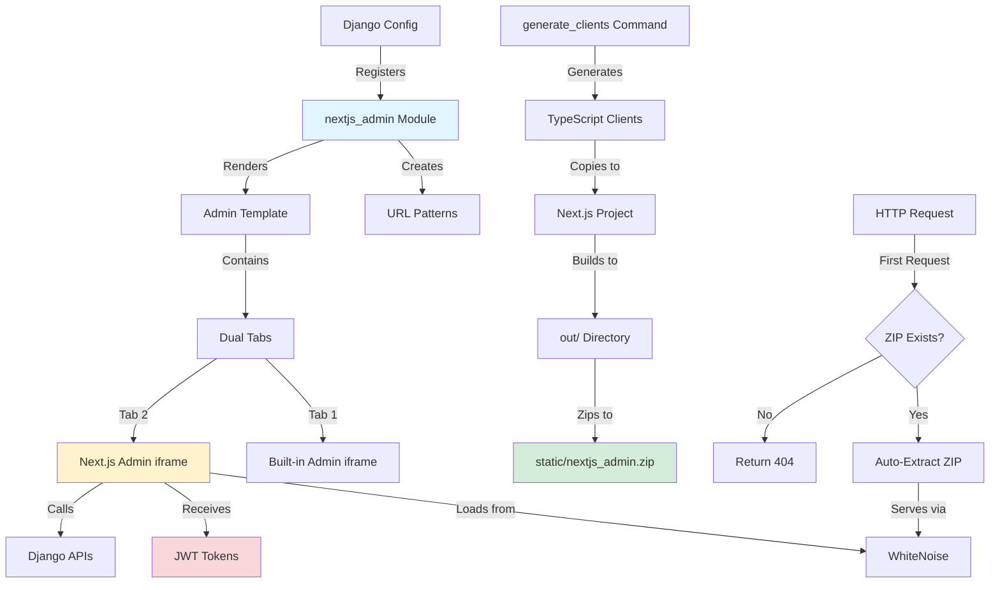
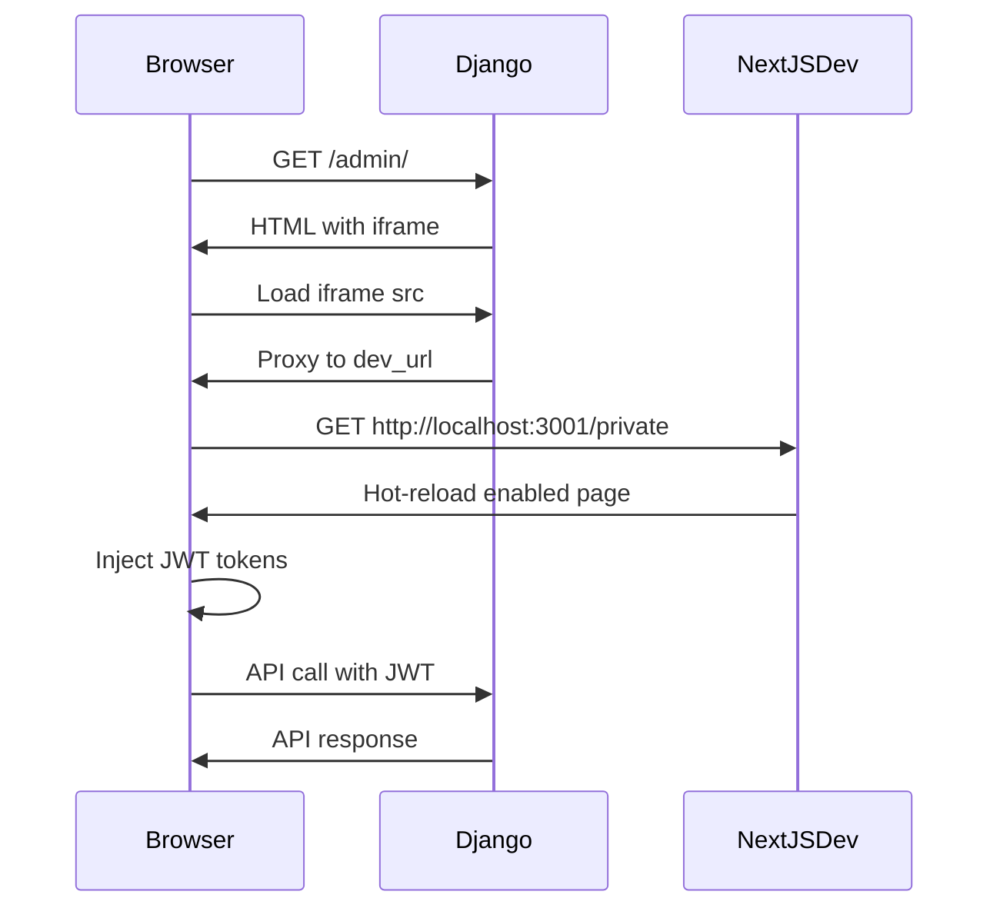
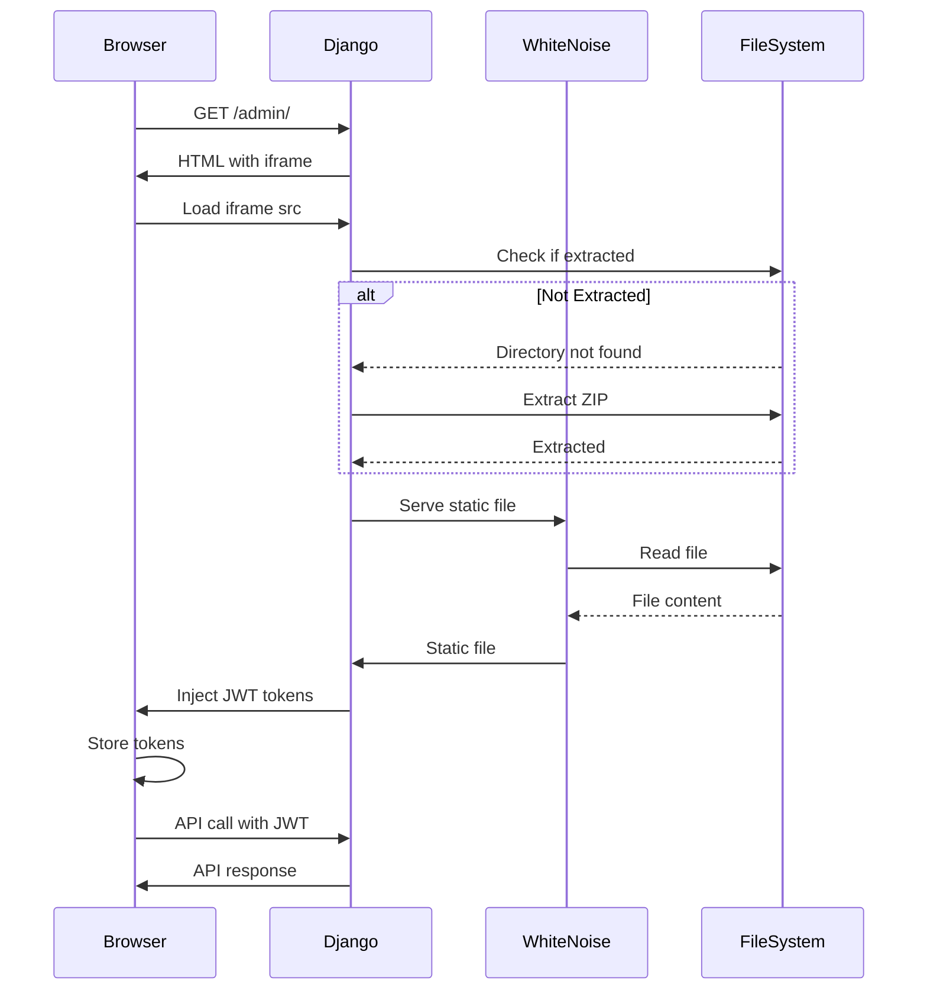

# How It Works

Deep dive into the architecture and technical implementation of Next.js admin integration.

## Architecture Overview

The Next.js admin integration consists of several coordinated components:



## Component Breakdown

### 1. Configuration Layer (`NextJsAdminConfig`)

The configuration model provides type-safe settings:

```python title="django_cfg/modules/nextjs_admin/models/config.py"
class NextJsAdminConfig(BaseModel):
    """Simple Next.js admin integration configuration."""

    project_path: str = Field(...)  # Required
    api_output_path: Optional[str] = None  # Smart defaults
    static_url: Optional[str] = None
    # ... other optional fields

    def get_api_output_path(self) -> str:
        """Get API output path with default."""
        return self.api_output_path or "apps/admin/src/api/generated"
```

**Key Features:**
- Pydantic-based validation
- Smart defaults for all optional fields
- Getter methods for computed values
- Type safety throughout

### 2. Module Registration

The `nextjs_admin` module auto-registers when configured:

```python title="django_cfg/core/builders/apps_builder.py"
def build_installed_apps(config: DjangoConfig) -> list:
    apps = [
        # ... core apps
    ]

    # Auto-register nextjs_admin module if configured
    if config.nextjs_admin:
        apps.append("django_cfg.modules.nextjs_admin")

    return apps
```

**This triggers:**
- URL pattern registration
- Template tag registration
- View initialization

### 3. Admin Template with Tabs

The Django admin template creates a tabbed interface:

```django title="django_cfg/templates/admin/index.html"


<div x-data="{ activeTab: 'builtin' }">
    <!-- Tab Navigation -->
    <div class="tabs">
        <button @click="activeTab = 'builtin'">
            Built-in Dashboard
        </button>

        
        
        <button @click="activeTab = 'nextjs'">
            
        </button>
        
    </div>

    <!-- Tab Content -->
    <div x-show="activeTab === 'builtin'">
        <iframe src="/cfg/admin/"></iframe>
    </div>

    
    <div x-show="activeTab === 'nextjs'" x-cloak>
        <iframe src=""></iframe>
    </div>
    
</div>
```

**Features:**
- Alpine.js for reactive tabs
- Lazy loading of iframe content
- Conditional rendering based on configuration
- Theme synchronization

### 4. Static File Serving

Django-cfg serves Next.js files through a custom view:

```python title="django_cfg/apps/frontend/views.py"
class NextJSStaticView(View):
    """Serve Next.js static build files with auto-extraction."""

    def get(self, request, path=''):
        base_dir = Path(...) / 'static' / 'frontend' / self.app_name

        # Auto-extract ZIP if directory doesn't exist
        if not base_dir.exists():
            zip_path = Path(...) / f'{self.app_name}.zip'
            if zip_path.exists():
                with zipfile.ZipFile(zip_path, 'r') as zip_ref:
                    zip_ref.extractall(base_dir)

        # Serve static file
        response = serve(request, path, document_root=str(base_dir))

        # Inject JWT tokens for HTML files
        if self._should_inject_jwt(request, response):
            self._inject_jwt_tokens(request, response)

        return response
```

**Key Features:**
- Automatic ZIP extraction on first request
- SPA routing support (fallback to index.html)
- JWT token injection for authenticated users
- X-Frame-Options exempt for iframe embedding

### 5. JWT Token Injection

Authenticated users automatically receive JWT tokens:

```python
def _inject_jwt_tokens(self, request, response):
    """Inject JWT tokens into HTML response."""
    refresh = RefreshToken.for_user(request.user)
    access_token = str(refresh.access_token)
    refresh_token = str(refresh)

    injection_script = f"""
<script>
(function() {{
    try {{
        localStorage.setItem('auth_token', '{access_token}');
        localStorage.setItem('refresh_token', '{refresh_token}');
        console.log('[Django-CFG] JWT tokens injected');
    }} catch (e) {{
        console.error('[Django-CFG] Failed to inject JWT tokens:', e);
    }}
}})();
</script>
"""

    content = response.content.decode('utf-8')
    content = content.replace('</head>', f'{injection_script}</head>', 1)
    response.content = content.encode('utf-8')
```

**Flow:**
1. User logs into Django admin
2. Django generates JWT tokens
3. Tokens injected into Next.js HTML
4. Next.js reads tokens from localStorage
5. Next.js uses tokens for API calls

### 6. API Client Generation

The `generate_clients` command orchestrates the entire workflow:

```python title="django_cfg/modules/django_client/management/commands/generate_client.py"
class Command(BaseCommand):
    def handle(self, *args, **options):
        # 1. Generate OpenAPI schema
        schema = self.generate_openapi_schema()

        # 2. Generate TypeScript clients
        clients = self.generate_typescript_clients(schema)

        # 3. Copy to Next.js project (if configured)
        if config.nextjs_admin and config.nextjs_admin.auto_copy_api:
            self.copy_to_nextjs(clients)

        # 4. Build Next.js (if auto_build=True)
        if should_build:
            self.build_nextjs()

        # 5. Create ZIP archive
        self.create_zip_archive()
```

**Steps:**

import Tabs from '@theme/Tabs';
import TabItem from '@theme/TabItem';

<Tabs>
  <TabItem value="step1" label="1. Generate Schema" default>

```python
# Generate OpenAPI 3.0 schema from Django APIs
schema = {
    "openapi": "3.0.0",
    "paths": {
        "/api/profiles/": {
            "get": {...},
            "post": {...},
        }
    }
}
```

  </TabItem>
  <TabItem value="step2" label="2. Generate Clients">

```typescript
// Generated TypeScript client
export class ProfilesClient {
    async getProfiles(): Promise<Profile[]> {
        const response = await fetch('/api/profiles/', {
            headers: {
                'Authorization': `Bearer ${token}`
            }
        });
        return response.json();
    }
}
```

  </TabItem>
  <TabItem value="step3" label="3. Copy Files">

```bash
# Copy to Next.js project
cp -r openapi/clients/typescript/* \
    ../django_admin/apps/admin/src/api/generated/
```

  </TabItem>
  <TabItem value="step4" label="4. Build Next.js">

```bash
# Build static export
cd ../django_admin/apps/admin
NEXT_PUBLIC_STATIC_BUILD=true pnpm build
# Output: out/ directory
```

  </TabItem>
  <TabItem value="step5" label="5. Create ZIP">

```bash
# Create ZIP archive
cd out/
zip -r ../../static/nextjs_admin.zip .
# Output: static/nextjs_admin.zip (~7MB)
```

  </TabItem>
</Tabs>

## Request Flow

### Development Mode



**Key Points:**
- Django proxies to Next.js dev server
- Hot reload works seamlessly
- JWT tokens still injected
- Full development experience

### Production Mode



**Key Points:**
- ZIP extracted once on first request (~100ms)
- Subsequent requests instant (WhiteNoise caching)
- JWT tokens injected into HTML
- Static files served efficiently

## File Structure

### Django Side

```
django_cfg/
├── modules/
│   └── nextjs_admin/              # Next.js admin module
│       ├── __init__.py
│       ├── apps.py               # Django app config
│       ├── models/
│       │   └── config.py         # NextJsAdminConfig
│       ├── views.py              # Serve Next.js static files
│       ├── urls.py               # URL patterns
│       └── templatetags/
│           └── nextjs_admin.py   # Template tags
│
├── apps/frontend/
│   └── views.py                  # Auto-extract ZIP logic
│
├── templates/admin/
│   └── index.html                # Dual-tab admin interface
│
├── core/builders/
│   └── apps_builder.py           # Register nextjs_admin module
│
└── static/
    ├── frontend/
    │   ├── admin.zip             # Built-in admin (5MB)
    │   └── admin/                # Extracted
    └── nextjs_admin.zip          # External admin (7MB)
        └── (extracted on first request)
```

### Next.js Side

```
django_admin/
└── apps/
    └── admin/
        ├── src/
        │   ├── api/
        │   │   └── generated/     # Generated TypeScript clients
        │   │       ├── profiles/
        │   │       │   ├── client.ts
        │   │       │   ├── types.ts
        │   │       │   └── http.ts
        │   │       └── trading/
        │   │           └── ...
        │   │
        │   ├── pages/
        │   │   └── private/
        │   │       └── index.tsx  # Main admin page
        │   │
        │   └── utils/
        │       └── auth.ts        # Read JWT tokens
        │
        ├── out/                   # Build output
        │   ├── index.html
        │   ├── _next/
        │   └── ...
        │
        └── package.json
```

## Theme Synchronization

Theme state syncs between Django and Next.js:

```javascript title="Next.js Theme Hook"
// Read Django Unfold theme from localStorage
const useDjangoTheme = () => {
  const [theme, setTheme] = useState<'light' | 'dark'>('light');

  useEffect(() => {
    // Listen for Django theme changes
    const handleStorageChange = (e: StorageEvent) => {
      if (e.key === 'unfold_theme') {
        setTheme(e.newValue as 'light' | 'dark');
      }
    };

    window.addEventListener('storage', handleStorageChange);
    return () => window.removeEventListener('storage', handleStorageChange);
  }, []);

  return theme;
};
```

## Security Considerations

### iframe Sandbox

The iframe uses restrictive sandbox attributes:

```html
<iframe
  sandbox="allow-same-origin allow-scripts allow-forms allow-popups allow-modals"
  src="/cfg/admin/"
></iframe>
```

**Allowed:**
- ✅ Same-origin requests (for API calls)
- ✅ JavaScript execution
- ✅ Form submission
- ✅ Popups and modals

**Blocked:**
- ❌ Top-level navigation
- ❌ Downloads without user interaction
- ❌ Pointer lock
- ❌ Presentation mode

### JWT Token Security

Tokens are scoped to authenticated users:

```python
# Only inject tokens for authenticated users
if request.user.is_authenticated:
    refresh = RefreshToken.for_user(request.user)
    # Token includes user permissions and expiry
```

### CORS Configuration

CORS is automatically configured for development:

```python
# Auto-configured by django-cfg
CORS_ALLOWED_ORIGINS = [
    config.nextjs_admin.get_dev_url(),  # http://localhost:3001
]
```

## Performance Optimizations

### 1. ZIP Compression

- **Uncompressed**: ~20MB (thousands of files)
- **Compressed**: ~7MB (single file)
- **Extraction**: ~100ms (one-time cost)

### 2. WhiteNoise Caching

WhiteNoise adds efficient caching headers:

```python
# Auto-configured by WhiteNoise
Cache-Control: public, max-age=31536000, immutable
```

### 3. Lazy Tab Loading

Tabs load content only when activated:

```html
<div x-show="activeTab === 'nextjs'" x-cloak>
    <!-- Only loads when tab activated -->
    <iframe src="..."></iframe>
</div>
```

### 4. Conditional GET Headers

For HTML files, conditional GET headers are removed to enable JWT injection:

```python
if is_html_file and request.user.is_authenticated:
    # Remove conditional GET headers
    request.META.pop('HTTP_IF_MODIFIED_SINCE', None)
    request.META.pop('HTTP_IF_NONE_MATCH', None)
```

## Limitations and Future Plans

### Current Limitations

1. **Single Next.js Admin**: Only one Next.js admin per project (support for multiple admins planned)
2. **Static Export Only**: SSR/ISR not yet supported (planned)
3. **No WebSocket Proxy**: WebSockets in Next.js not proxied in dev mode (planned)

### Future Plans

- [ ] Multiple Next.js admin support
- [ ] Server-side rendering support
- [ ] WebSocket proxy for dev mode
- [ ] Automatic theme sync (bidirectional)
- [ ] Built-in authentication UI components
- [ ] Admin builder CLI tool

## Next Steps

- [Configuration Reference](./configuration) - All configuration options
- [API Generation](./api-generation) - Generate TypeScript clients
- [Deployment](./deployment) - Deploy to production
- [Examples](./examples) - Real-world examples

:::tip Dive Deeper
Want to contribute or customize? Check out the source code in `django_cfg/modules/nextjs_admin/`.
:::
