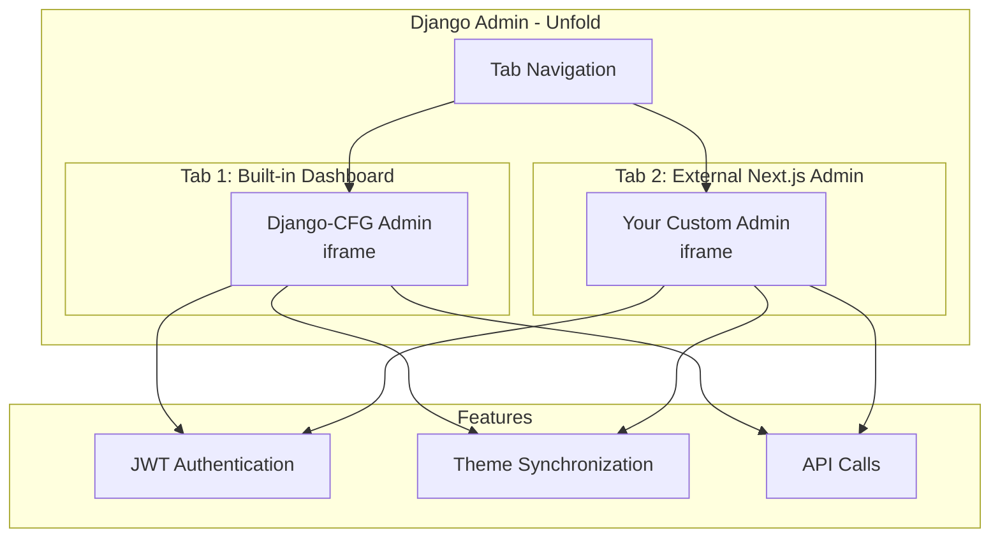

import { NextJsAdminShowcase } from '@site/src/components';

# Next.js Admin Integration

<NextJsAdminShowcase />

---

Django-CFG provides seamless integration for embedding custom Next.js admin dashboards as secondary admin interfaces. This powerful feature allows you to combine Django's robust backend with modern React-based admin panels.

## Overview

**The all-in-one solution for Django + Next.js admin interfaces.**

Django-CFG brings you a revolutionary approach: **three interfaces in ONE Next.js project** with **dual admin strategy** that combines the best of both worlds.

### Three-in-One Architecture

Build everything in a single Next.js codebase:
- 🌐 **Public Website** (`/`) - Landing pages, marketing content
- 👤 **User Dashboard** (`/private`) - User-specific features and data
- ⚙️ **Admin Panel** (`/admin`) - Management interface with full React power

**Shared components, shared layouts, shared API clients** - write once, use everywhere!

### Dual Admin Strategy

- **Tab 1: Built-in Admin** - Quick CRUD with Django Unfold (90% of tasks)
- **Tab 2: Next.js Admin** - Unlimited customization with React (10% complex features)

**No migration needed** - start simple, scale when needed!

### Key Features

- ✅ **Zero Configuration** - One line of config, smart defaults for everything
- ✅ **Auto-Generated APIs** - TypeScript clients from Django models automatically
- ✅ **Auto-Detected Dev Mode** - No env variables, Django detects dev servers (ports 3000/3001)
- ✅ **JWT Authentication** - Seamless token injection, no setup required
- ✅ **ZIP Deployment** - ~7MB single file vs ~20MB uncompressed (60% smaller Docker images)
- ✅ **Hot Reload** - Full dev experience with instant feedback
- ✅ **Theme Sync** - Dark/light mode synchronized across all interfaces

## Architecture



## Key Features

### 1. Simple Configuration

Configure your Next.js admin with just one line:

```python
from django_cfg import DjangoConfig, NextJsAdminConfig

config = DjangoConfig(
    project_name="My Project",

    # Simple configuration
    nextjs_admin=NextJsAdminConfig(
        project_path="../django_admin",
    ),
)
```

All other settings use smart defaults that work out of the box.

### 2. Automatic API Client Generation

```bash
# Generate TypeScript clients and build Next.js
python manage.py generate_clients --typescript

# Output:
# ✅ Generated TypeScript clients
# ✅ Copied to Next.js project
# ✅ Built Next.js static export
# ✅ Created ZIP archive
```

### 3. ZIP-Based Deployment

Instead of copying thousands of files, the integration creates compressed ZIP archives:

- **Smaller Docker images** - ~5-10MB vs ~20MB+ uncompressed
- **Faster builds** - Single file copy vs thousands of files
- **Auto-extraction** - Extracts on first HTTP request automatically
- **Production-ready** - Perfect for containerized deployments

### 4. Development Workflow

Development mode supports full hot-reload:

```bash
# Terminal 1: Django
python manage.py runserver

# Terminal 2: Next.js dev server
cd django_admin/apps/admin && pnpm dev

# Admin loads from http://localhost:3001 with hot reload!
```

## Use Cases

### Single Custom Dashboard

Perfect for projects that need a modern admin interface:

- Real-time analytics dashboards
- Custom data visualization tools
- Specialized admin workflows
- Modern UI/UX requirements

### Multiple Admin Dashboards

Ideal for enterprise applications:

- Separate dashboards for different user roles
- Department-specific admin interfaces
- Microservices with dedicated admin panels
- Multi-tenant applications

### Gradual Migration

Great for legacy projects:

- Keep existing Django admin running
- Build new features in Next.js
- Migrate incrementally
- Zero downtime transitions

## Quick Start

### 1. Configure

```python
# api/config.py
from django_cfg import DjangoConfig, NextJsAdminConfig

config = DjangoConfig(
    project_name="My Project",
    nextjs_admin=NextJsAdminConfig(
        project_path="../django_admin",
    ),
)
```

### 2. Generate API & Build

```bash
python manage.py generate_clients --typescript
```

### 3. Run

```bash
python manage.py runserver
# Visit http://localhost:8000/admin/
```

## What's Next?

<div className="row">
  <div className="col col--4">
    <div className="card">
      <div className="card__header">
        <h3>💡 Core Concepts</h3>
      </div>
      <div className="card__body">
        <p>Understand the philosophy, three-in-one architecture, and dual admin strategy.</p>
      </div>
      <div className="card__footer">
        <a href="./concepts" className="button button--primary button--block">Concepts →</a>
      </div>
    </div>
  </div>
  <div className="col col--4">
    <div className="card">
      <div className="card__header">
        <h3>🚀 Quick Setup</h3>
      </div>
      <div className="card__body">
        <p>Get your Next.js admin running in 5 minutes with our quick setup guide.</p>
      </div>
      <div className="card__footer">
        <a href="./quick-start" className="button button--primary button--block">Quick Start →</a>
      </div>
    </div>
  </div>
  <div className="col col--4">
    <div className="card">
      <div className="card__header">
        <h3>⚙️ Configuration</h3>
      </div>
      <div className="card__body">
        <p>Learn about all configuration options and customization possibilities.</p>
      </div>
      <div className="card__footer">
        <a href="./configuration" className="button button--secondary button--block">Configure →</a>
      </div>
    </div>
  </div>
</div>

<div className="row margin-top--lg">
  <div className="col col--4">
    <div className="card">
      <div className="card__header">
        <h3>🔧 How It Works</h3>
      </div>
      <div className="card__body">
        <p>Deep dive into the technical architecture and implementation details.</p>
      </div>
      <div className="card__footer">
        <a href="./how-it-works" className="button button--secondary button--block">Learn More →</a>
      </div>
    </div>
  </div>
  <div className="col col--4">
    <div className="card">
      <div className="card__header">
        <h3>🚢 Deployment</h3>
      </div>
      <div className="card__body">
        <p>Deploy your Next.js admin to production with Docker and best practices.</p>
      </div>
      <div className="card__footer">
        <a href="./deployment" className="button button--secondary button--block">Deploy →</a>
      </div>
    </div>
  </div>
  <div className="col col--4">
    <div className="card">
      <div className="card__header">
        <h3>💼 Examples</h3>
      </div>
      <div className="card__body">
        <p>Real-world examples and patterns for common use cases and integrations.</p>
      </div>
      <div className="card__footer">
        <a href="./examples" className="button button--secondary button--block">Examples →</a>
      </div>
    </div>
  </div>
</div>

## Why django-cfg Next.js Integration?

### vs Django Unfold
- ✅ **Both included** - Keep Unfold for quick CRUD, add Next.js for complex features
- ✅ **No ceiling** - When Unfold limitations hit, switch to Tab 2 with full React power
- ✅ **Progressive** - Start simple, scale without migration

### vs React Admin
- ✅ **Zero setup** - One line of config vs complex setup
- ✅ **Built-in + Custom** - Best of both worlds, not just custom
- ✅ **Auto-generated** - TypeScript clients from Django automatically

### vs Retool
- ✅ **Free & Open Source** - No $$$$ monthly fees
- ✅ **Your code** - Full control, no lock-in
- ✅ **Self-hosted** - Your infrastructure, your data

### The django-cfg Way

```python
# Literally one line:
nextjs_admin=NextJsAdminConfig(project_path="../admin")
```

**That's it!** Everything else just works 🎉

## Resources

- [Core Concepts](./concepts) - Philosophy and architecture
- [Configuration Reference](./configuration) - All options
- [API Generation](./api-generation) - Auto-generate TypeScript
- [Troubleshooting Guide](./troubleshooting) - Common issues
- [Examples](./examples) - Real-world patterns

:::tip The Magic Formula
**One Next.js project** = Public site + User dashboard + Admin panel

**Dual admin strategy** = Quick CRUD (Unfold) + Unlimited power (Next.js)

**Zero configuration** = Smart defaults + Auto-detection
:::
