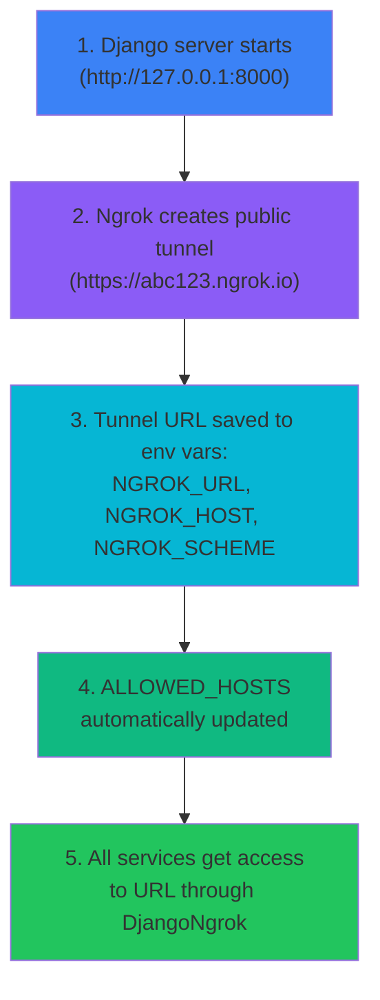

# Ngrok Integration Overview

Built-in ngrok integration in Django-CFG for automatic creation of public tunnels to your local development server. Essential for testing webhooks from external services (payments, notifications, API callbacks).

## Why Ngrok?

### Problem: Webhooks Don't Work Locally

When you develop integration with external services (Stripe, NowPayments, Telegram, etc.), these services send webhooks to your server. But your local `localhost:8000` is not accessible from the internet!

**Traditional Solution:**
```
❌ Deploy to staging for each test
❌ Use VPN or port forwarding
❌ Run ngrok manually, copy URL, update configs
❌ Forget to update URL and lose an hour debugging
```

**With Django-CFG + Ngrok:**
```
✅ python manage.py runserver_ngrok
✅ Tunnel created automatically
✅ URL available everywhere in code via environment variables
✅ ALLOWED_HOSTS updated automatically
✅ Webhook URLs generated automatically
```

### Business Value

**For Developers:**
- ⚡ **10x faster** - test webhooks locally instead of deploy to staging
- 🔄 **Instant feedback** - code changes immediately available to external services
- 🎯 **Zero manual config** - tunnel URL substituted automatically
- 🛡️ **Fewer bugs** - test everything locally before deploy

**For Business:**
- 💰 **Time savings** - 5 minutes instead of 30+ per test
- 🚀 **Faster delivery** - faster development = faster features to production
- 📊 **Better quality** - more tests locally = fewer bugs in production

**Concrete Numbers:**
```
Testing Stripe Webhook:
Without ngrok:  Deploy to staging → wait → test → repeat = 30+ minutes
With ngrok:     Local test → instant feedback = 2 minutes

Savings: 93% time per iteration!
```

---

## How Auto-Tunnels Work

### 1. Starting Server with Tunnel

```bash
# Simply replace runserver with runserver_ngrok
python manage.py runserver_ngrok
```

**What happens automatically:**



### 2. Automatic URL Retrieval in Code

```python
# Anywhere in your code:
from django_cfg.modules.django_ngrok import get_tunnel_url, get_webhook_url

# Get base tunnel URL
tunnel_url = get_tunnel_url()  # "https://abc123.ngrok.io"

# Get webhook URL for specific path
webhook_url = get_webhook_url("/api/payments/webhook/")
# "https://abc123.ngrok.io/api/payments/webhook/"
```

**No manual URL copying!** Django-CFG automatically substitutes tunnel URL everywhere it's needed.

---

## Quick Start

### 1. Install Ngrok (Optional)

```bash
# Django-CFG automatically uses built-in ngrok package (Python 3.12+)
# For older Python versions install:
pip install ngrok
```

### 2. Configure in DjangoConfig

```python
# config.py
from django_cfg import DjangoConfig, NgrokConfig

class MyConfig(DjangoConfig):
    project_name: str = "My Project"

    # Enable ngrok for webhooks
    ngrok: NgrokConfig = NgrokConfig(
        enabled=True,  # Works only when DEBUG=True
        auto_start=True,
        webhook_path="/api/webhooks/"  # Default path
    )

config = MyConfig()
```

### 3. Start Server

```bash
# Start with ngrok tunnel
python manage.py runserver_ngrok

# Output:
# 🚇 Starting ngrok tunnel...
# ⏳ Waiting for tunnel to be established...
# ✅ Ngrok tunnel ready: https://abc123.ngrok.io
#
# Django development server is running at http://127.0.0.1:8000/
# Public URL: https://abc123.ngrok.io
```

### 4. Use URL in Code

```python
# views.py
from django_cfg.modules.django_ngrok import get_webhook_url

def create_payment(request):
    # Automatically get webhook URL
    webhook_url = get_webhook_url("/api/payments/webhook/")

    # Pass to Stripe/NowPayments/etc
    payment = stripe.PaymentIntent.create(
        amount=1000,
        currency="usd",
        metadata={"webhook_url": webhook_url}  # Automatically correct URL!
    )
```

---

## Key Features

✅ **Zero Configuration** - Works out of the box with one command
✅ **Automatic URL Management** - Tunnel URL available everywhere via helper functions
✅ **Environment Variable Injection** - NGROK_URL, NGROK_HOST, NGROK_SCHEME set automatically
✅ **ALLOWED_HOSTS Update** - Django settings updated automatically
✅ **Type-Safe Configuration** - Pydantic v2 validation for all settings
✅ **Development-Only** - Automatically disabled in production (DEBUG=False)
✅ **Fallback Support** - Helper functions return fallback URLs when tunnel not active

---

## See Also

### Ngrok Integration Documentation

**Core Documentation:**
- **[Configuration](./configuration)** - Complete NgrokConfig reference and settings
- **[Implementation](./implementation)** - Getting tunnel URLs and management commands
- **[Webhook Examples](./webhook-examples)** - Integration with Stripe, NowPayments, Telegram
- **[Payments Panel](./payments-panel)** - Built-in webhook administration panel
- **[Troubleshooting](./troubleshooting)** - Best practices and common issues

### Configuration & Setup

**Getting Started:**
- **[Installation](/docs/getting-started/installation)** - Install Django-CFG with ngrok support
- **[Configuration Guide](/docs/getting-started/configuration)** - Configure ngrok integration
- **[First Project](/docs/getting-started/first-project)** - Quick start tutorial
- **[Integrations Overview](../overview)** - All available integrations

**Advanced Configuration:**
- **[Type-Safe Configuration](/docs/fundamentals/core/type-safety)** - Ngrok config with Pydantic
- **[Environment Variables](/docs/fundamentals/configuration/environment)** - Ngrok auth token setup
- **[Production Config](/docs/guides/production-config)** - Development vs production patterns

### Related Features

**Payment Integrations:**
- **[Payments App](/docs/features/built-in-apps/payments/overview)** - Payment webhook processing
- **[Payments Configuration](/docs/features/built-in-apps/payments/overview)** - Payment provider setup
- **[Payment Examples](/docs/features/built-in-apps/payments/overview)** - Real-world payment flows

**Background Processing:**
- **[Django-RQ Integration](../django-rq/overview)** - Process webhooks asynchronously
- **[Background Tasks](/docs/features/built-in-apps/operations/tasks)** - Task queue management

### Tools & Development

**CLI & Testing:**
- **[CLI Commands](/docs/cli/introduction)** - Ngrok management commands
- **[Development Commands](/docs/cli/commands/development)** - Enhanced development server
- **[Troubleshooting](/docs/guides/troubleshooting)** - Common webhook issues

**Example Projects:**
- **[Sample Project Guide](/docs/guides/sample-project/overview)** - Production example with webhooks
- **[Examples](/docs/guides/examples)** - Real-world webhook patterns
