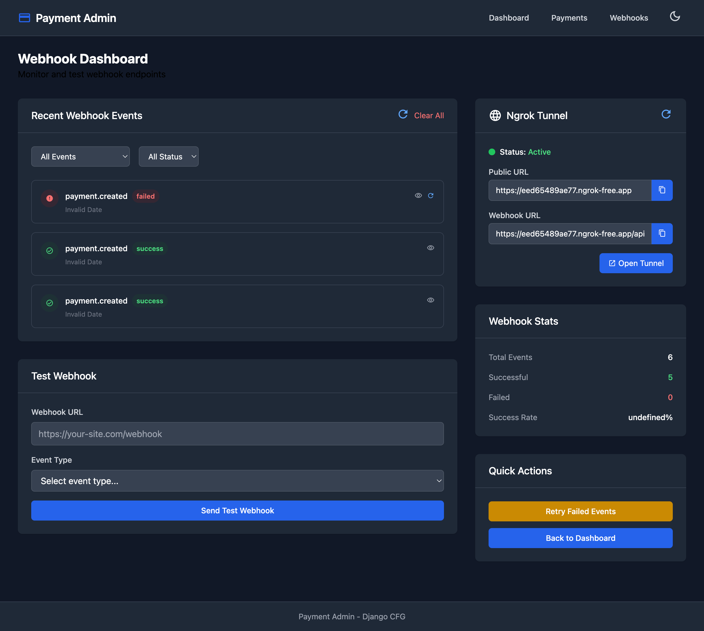

# Webhook Admin Panel

Django-CFG includes a built-in webhook administration panel in the `payments` app that automatically displays active ngrok URLs and webhook status.

## Overview

The Webhook Admin Panel provides:

✅ **Real-time Ngrok Status** - See if tunnel is active
✅ **Automatic URL Display** - Current public ngrok URL
✅ **Per-Provider Webhook URLs** - URLs for Stripe, NowPayments, Telegram, etc.
✅ **Webhook Events Log** - History of all received webhooks
✅ **Testing Tools** - Test webhook endpoints directly

---

## Enabling the Panel

### 1. Enable Payments App

```python
# config.py
from django_cfg import DjangoConfig, NgrokConfig

class MyConfig(DjangoConfig):
    project_name: str = "My Project"

    # Enable payments app (includes webhook panel)
    enable_payments: bool = True

    # Enable ngrok
    ngrok: NgrokConfig = NgrokConfig(enabled=True)

config = MyConfig()
```

### 2. Run Migrations

```bash
# Create payments app tables
python manage.py migrate
```

### 3. Start Server with Ngrok

```bash
# Start Django with ngrok tunnel
python manage.py runserver_ngrok

# Output:
# ✅ Ngrok tunnel ready: https://abc123.ngrok.io
# Django development server is running at http://127.0.0.1:8000/
# Public URL: https://abc123.ngrok.io
```

### 4. Access Admin Panel

Open your browser to:
```
http://localhost:8000/admin/payments/webhook/
```

Login with your admin credentials.

---

## Panel Features

The Webhook Dashboard provides comprehensive webhook monitoring and testing capabilities.

### 1. Recent Webhook Events

Real-time event log with filtering:

**Features:**
- 📋 **Event List** - All received webhook events (e.g., payment.created)
- 🎯 **Smart Filters** - Filter by event type and status
- 🔍 **Event Details** - View/retry individual events
- 🧹 **Clear All** - Clear event history
- ✅ **Status Indicators** - Green (success), Red (failed)

**Event Display:**
```
payment.created [success]
Invalid Date
[View] [Retry]

payment.created [failed]
Invalid Date
[View] [Retry]
```

### 2. Ngrok Tunnel Status

Live ngrok tunnel information:

**Displays:**
- 🟢 **Status Indicator** - Visual "Active" status with green dot
- 🌐 **Public URL** - `https://eed65489ae77.ngrok-free.app` with copy button
- 🔗 **Webhook URL** - `https://eed65489ae77.ngrok-free.app/api` with copy button
- 🔄 **Refresh** - Update tunnel status
- 🚀 **Open Tunnel** - Open ngrok web interface

**Copy URLs:**
Each URL has a copy button (📋) for quick clipboard access.

### 3. Webhook Stats

Real-time webhook statistics:

| Metric | Value | Color |
|--------|-------|-------|
| Total Events | 6 | White |
| Successful | 5 | Green |
| Failed | 0 | Red |
| Success Rate | undefined% | White |

**Live Updates:**
Stats update automatically as new webhooks are received.

### 4. Test Webhook

Built-in webhook testing tool:

**Fields:**
- **Webhook URL** - Enter target webhook endpoint (pre-filled with ngrok URL)
- **Event Type** - Select from dropdown (e.g., payment.created, payment.updated)
- **Send Test Webhook** - Button to trigger test request

**Example Usage:**
```
Webhook URL: https://your-site.com/webhook
Event Type: [Select event type...]
[Send Test Webhook]
```

### 5. Quick Actions

Convenient action buttons:

- 🔁 **Retry Failed Events** (Orange) - Automatically retry all failed webhook events
- 🏠 **Back to Dashboard** (Blue) - Return to main payments dashboard

---

## Using the Panel

### Viewing Webhook URLs

```python
# The panel automatically shows webhook URLs for all providers

# Access panel via Django admin:
# http://localhost:8000/admin/payments/webhook/

# The panel displays:
# - Current ngrok tunnel URL
# - Webhook URLs for each provider
# - Status of each webhook endpoint
```

### Copying Webhook URLs

Click the "Copy" button next to any webhook URL to copy it to clipboard:

```
Stripe Webhook URL:
https://abc123.ngrok.io/api/webhooks/stripe/
[Copy] [Test]
```

### Testing Webhooks

Use the "Test" button to send a test webhook to your endpoint:

```python
# Click "Test" button
# Panel sends test POST request to webhook endpoint
# Displays response status and body

Test Request:
POST https://abc123.ngrok.io/api/webhooks/stripe/
Content-Type: application/json

{"event": "test", "timestamp": "2025-10-01T14:35:00Z"}

Response:
Status: 200 OK
Body: {"status": "success"}
```

---

## API Reference

The webhook panel provides an API for programmatic access.

### Get Webhook URLs

```python
# In your Django code:
from django_cfg.apps.payments.services.integrations import get_webhook_url_for_provider

# Get webhook URL for specific provider
stripe_webhook = get_webhook_url_for_provider("stripe")
# "https://abc123.ngrok.io/api/webhooks/stripe/"

nowpayments_webhook = get_webhook_url_for_provider("nowpayments")
# "https://abc123.ngrok.io/api/webhooks/nowpayments/"

telegram_webhook = get_webhook_url_for_provider("telegram")
# "https://abc123.ngrok.io/api/webhooks/telegram/"
```

### Check Ngrok Status

```python
from django_cfg.modules.django_ngrok import is_tunnel_active, get_tunnel_url

# Check if tunnel is active
if is_tunnel_active():
    print(f"✅ Tunnel active: {get_tunnel_url()}")
else:
    print("⚠️ Tunnel not active")
```

### List All Webhook URLs

```python
from django_cfg.apps.payments.services.integrations.ngrok_service import get_all_webhook_urls

# Get dictionary of all webhook URLs
webhook_urls = get_all_webhook_urls()

# Returns:
# {
#     "stripe": "https://abc123.ngrok.io/api/webhooks/stripe/",
#     "nowpayments": "https://abc123.ngrok.io/api/webhooks/nowpayments/",
#     "telegram": "https://abc123.ngrok.io/api/webhooks/telegram/",
# }

for provider, url in webhook_urls.items():
    print(f"{provider}: {url}")
```

---

## Built-in Integration

The payments app automatically integrates with ngrok:

### Automatic URL Updates

```python
# payments/services/integrations/ngrok_service.py (built-in!)

def get_webhook_url_for_provider(provider: str) -> str:
    """Automatically gets webhook URL for provider."""
    from django_cfg.modules.django_ngrok import get_webhook_url
    return get_webhook_url(f"/api/webhooks/{provider}/")

# Usage in payments code:
from django_cfg.apps.payments.services.integrations import get_webhook_url_for_provider

# Automatically correct URL!
nowpayments_webhook = get_webhook_url_for_provider("nowpayments")
# "https://abc123.ngrok.io/api/webhooks/nowpayments/"
```

### Webhook Event Logging

All webhook events are automatically logged in the admin panel:

```python
# Built-in webhook logging
from django_cfg.apps.payments.models import WebhookEvent

# Automatically created for each webhook
event = WebhookEvent.objects.create(
    provider="stripe",
    event_type="payment_intent.succeeded",
    payload=request.body,
    status="success",
    response_time_ms=45
)

# View all events in admin panel
```

---

## Configuration

### Custom Webhook Paths

```python
# config.py
from django_cfg import NgrokConfig

ngrok: NgrokConfig = NgrokConfig(
    enabled=True,
    webhook_path="/webhooks/"  # Custom base path
)

# Webhook URLs will be:
# https://abc123.ngrok.io/webhooks/stripe/
# https://abc123.ngrok.io/webhooks/nowpayments/
# https://abc123.ngrok.io/webhooks/telegram/
```

### Custom Provider Paths

```python
# urls.py
from django.urls import path
from . import webhook_views

urlpatterns = [
    # Custom webhook paths
    path('webhooks/stripe/', webhook_views.stripe_webhook),
    path('webhooks/crypto/', webhook_views.nowpayments_webhook),  # Custom!
    path('webhooks/bot/', webhook_views.telegram_webhook),  # Custom!
]

# Panel will show:
# - Stripe: https://abc123.ngrok.io/webhooks/stripe/
# - NowPayments: https://abc123.ngrok.io/webhooks/crypto/
# - Telegram: https://abc123.ngrok.io/webhooks/bot/
```

---

## Development Workflow

### Complete Workflow Example

```python
# 1. Configure payments app and ngrok
class MyConfig(DjangoConfig):
    enable_payments: bool = True
    ngrok: NgrokConfig = NgrokConfig(enabled=True)

# 2. Start server
# $ python manage.py runserver_ngrok
# ✅ Ngrok tunnel ready: https://abc123.ngrok.io

# 3. Open webhook admin panel
# http://localhost:8000/admin/payments/webhook/

# 4. Copy webhook URLs from panel
# Stripe: https://abc123.ngrok.io/api/webhooks/stripe/
# NowPayments: https://abc123.ngrok.io/api/webhooks/nowpayments/

# 5. Configure webhooks in external services
# - Stripe Dashboard: Set webhook URL
# - NowPayments API: Set IPN callback URL
# - Telegram: Set bot webhook

# 6. Test webhooks locally
# - Send test payments
# - View webhook events in admin panel
# - Debug issues in real-time

# 7. Monitor webhook events
# - Check webhook events log
# - View response times
# - Debug failed webhooks
```

---

## Panel Screenshots

### Webhook Dashboard Interface

The Webhook Dashboard provides a modern, user-friendly interface for webhook monitoring and testing:



*Real-time webhook monitoring with ngrok tunnel status, event filtering, and testing tools.*

```
┌─────────────────────────────────────────────────────────────────────────┐
│ Payment Admin                            Dashboard  Payments  Webhooks  │
├─────────────────────────────────────────────────────────────────────────┤
│                                                                         │
│ Webhook Dashboard                                                       │
│ Monitor and test webhook endpoints                                     │
│                                                                         │
├───────────────────────────────────────┬─────────────────────────────────┤
│ Recent Webhook Events      [Clear All]│ 🌐 Ngrok Tunnel          [🔄]  │
│                                       │                                 │
│ [All Events ▼] [All Status ▼]        │ 🟢 Status: Active               │
│                                       │                                 │
│ ⭕ payment.created     [failed]       │ Public URL                      │
│    Invalid Date            [👁] [🔄] │ https://eed65489ae77...  [📋]  │
│                                       │                                 │
│ ✅ payment.created     [success]      │ Webhook URL                     │
│    Invalid Date            [👁] [🔄] │ https://eed65489ae77...  [📋]  │
│                                       │                                 │
│ ✅ payment.created     [success]      │ [🚀 Open Tunnel]                │
│    Invalid Date            [👁] [🔄] │                                 │
│                                       │─────────────────────────────────│
├───────────────────────────────────────┤ Webhook Stats                   │
│ Test Webhook                          │                                 │
│                                       │ Total Events              6     │
│ Webhook URL                           │ Successful                5     │
│ [https://your-site.com/webhook     ] │ Failed                    0     │
│                                       │ Success Rate       undefined%   │
│ Event Type                            │                                 │
│ [Select event type...              ▼]│─────────────────────────────────│
│                                       │ Quick Actions                   │
│ [Send Test Webhook                  ] │                                 │
│                                       │ [🔁 Retry Failed Events       ] │
└───────────────────────────────────────┤ [🏠 Back to Dashboard         ] │
                                        └─────────────────────────────────┘
```

**Key Features Visible:**
- 📋 Event filtering by type and status
- 🟢 Real-time tunnel status indicator
- 📋 One-click URL copying
- 🔄 Individual event retry
- 📊 Live webhook statistics
- 🧪 Built-in webhook testing tool
- 🔁 Bulk retry for failed events

---

## Best Practices

### 1. Check Panel Before Testing

Always verify ngrok status in panel before testing webhooks:

```python
# ✅ CORRECT - check panel first
# 1. Open http://localhost:8000/admin/payments/webhook/
# 2. Verify "Tunnel Active: Yes"
# 3. Copy webhook URLs
# 4. Configure external services
```

### 2. Monitor Webhook Events

Use the events log to debug webhook issues:

```python
# View recent webhook events
# - Check response status
# - View payload details
# - Monitor response times
# - Debug failed webhooks
```

### 3. Use Test Feature

Test webhooks before configuring external services:

```python
# ✅ CORRECT - test first
# 1. Click "Test" button in panel
# 2. Verify webhook endpoint responds correctly
# 3. Fix any issues
# 4. Then configure external services
```

---

## Troubleshooting

### Panel Shows "Tunnel Not Active"

```python
# If panel shows tunnel not active:

# 1. Make sure you used runserver_ngrok
python manage.py runserver_ngrok  # NOT runserver!

# 2. Check ngrok configuration
# config.py
ngrok: NgrokConfig = NgrokConfig(
    enabled=True  # Must be True
)

# 3. Verify DEBUG=True
# Ngrok only works in development mode
```

### Webhook URLs Not Displaying

```python
# If webhook URLs not showing:

# 1. Ensure payments app is enabled
enable_payments: bool = True

# 2. Run migrations
python manage.py migrate

# 3. Restart server
python manage.py runserver_ngrok
```

---

## Next Steps

- **[Webhook Examples](./webhook-examples)** - See integration examples
- **[Troubleshooting](./troubleshooting)** - Common issues and solutions
- **[Configuration](./configuration)** - Advanced ngrok configuration

## See Also

- [Payments App](/features/built-in-apps/payments/overview) - Complete payments documentation
- [Built-in Apps](/features/built-in-apps/overview) - All built-in applications
