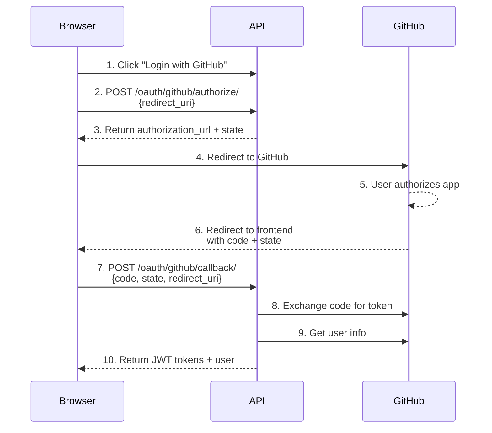

# GitHub OAuth Integration

This guide walks you through implementing GitHub OAuth authentication in your Django-CFG application.

## Prerequisites

- Django-CFG v1.5.90+
- `enable_accounts: bool = True` in your config
- A GitHub account

## Step 1: Create GitHub OAuth App

### Create New OAuth Application

Go directly to **[github.com/settings/applications/new](https://github.com/settings/applications/new)** to create a new OAuth App.

### Configure the OAuth App

Fill in the following fields:

| Field | Value | Example |
|-------|-------|---------|
| **Application name** | Your app name | `MyApp Production` |
| **Homepage URL** | Your main website | `https://myapp.com` |
| **Application description** | Optional description | `MyApp user authentication` |
| **Authorization callback URL** | **Frontend auth page** | `https://myapp.com/auth` |

{/* prettier-ignore */}
<Callout type="warning">
**Important**: The callback URL must be your **frontend** auth page URL, not your API URL. GitHub redirects users to this URL after authorization.

**For local development**: `http://localhost:3000/auth`
</Callout>

### Save Credentials

After creating the app:
1. Copy the **Client ID**
2. Generate a new **Client Secret** and copy it immediately (you won't see it again)

## Step 2: Configure Django-CFG

### Environment Variables

Add to your `.env` file:

```bash
# GitHub OAuth
GITHUB_OAUTH__CLIENT_ID=Iv1.abc123def456
GITHUB_OAUTH__CLIENT_SECRET=your-secret-key-here
```

### DjangoConfig Setup

```python
import os
from django_cfg import DjangoConfig, GitHubOAuthConfig

class MyConfig(DjangoConfig):
    # Enable accounts app
    enable_accounts: bool = True

    # GitHub OAuth Configuration
    github_oauth = GitHubOAuthConfig(
        enabled=True,
        client_id=os.environ.get("GITHUB_CLIENT_ID", ""),
        client_secret=os.environ.get("GITHUB_CLIENT_SECRET", ""),
        # Optional: customize scopes
        scope=["user:email", "read:user"],
        # Optional: customize behavior
        auto_create_user=True,
        allow_account_linking=True,
    )
```

### Using Environment Loader (Recommended)

If you use Django-CFG's environment loader pattern:

```python
# api/environment/loader.py
class GitHubOAuthEnvConfig(BaseSettings):
    client_id: str = Field(default="")
    client_secret: str = Field(default="")

    model_config = SettingsConfigDict(
        env_prefix="GITHUB_OAUTH__",
    )

class EnvironmentConfig(BaseSettings):
    github_oauth: GitHubOAuthEnvConfig = Field(default_factory=GitHubOAuthEnvConfig)
```

```python
# api/config.py
class MyConfig(DjangoConfig):
    github_oauth = (
        GitHubOAuthConfig(
            enabled=True,
            client_id=env.github_oauth.client_id,
            client_secret=env.github_oauth.client_secret,
        )
        if env.github_oauth.client_id and env.github_oauth.client_secret
        else None
    )
```

## Step 3: Run Migrations

```bash
python manage.py migrate django_cfg_accounts
```

This creates the `OAuthConnection` and `OAuthState` tables.

## OAuth Flow Explained

### Complete Flow Diagram



### Quick Start with @djangocfg/layouts

If you're using `@djangocfg/layouts`, just add one prop:

```tsx
// app/auth/page.tsx
import { AuthLayout } from '@djangocfg/layouts';

export default function AuthPage() {
  return (
    <AuthLayout
      enableGithubAuth={true}
      redirectUrl="/dashboard"
    >
      <h1>Sign In</h1>
    </AuthLayout>
  );
}
```

Everything else is handled automatically!

### Step-by-Step Breakdown (Manual)

For custom implementations without `@djangocfg/layouts`:

#### Step 1-3: Start Authorization

Frontend initiates the OAuth flow:

```typescript
// Frontend: Start OAuth
const response = await fetch('/api/oauth/github/authorize/', {
  method: 'POST',
  headers: { 'Content-Type': 'application/json' },
  body: JSON.stringify({
    redirect_uri: 'https://myapp.com/auth'
  })
});

const { authorization_url, state } = await response.json();
// authorization_url: https://github.com/login/oauth/authorize?client_id=...&state=...

// Store state for verification (optional, API handles this)
sessionStorage.setItem('oauth_state', state);

// Redirect user to GitHub
window.location.href = authorization_url;
```

#### Step 4-6: GitHub Authorization

1. User sees GitHub's authorization page
2. User clicks "Authorize"
3. GitHub redirects to your frontend auth page with `code` and `state` parameters:
   ```
   https://myapp.com/auth?provider=github&code=abc123&state=xyz789
   ```

#### Step 7-10: Token Exchange

Frontend callback page exchanges the code for JWT tokens:

```typescript
// Frontend: Auth page handles callback (/auth?provider=github&code=XXX&state=YYY)
const params = new URLSearchParams(window.location.search);
const code = params.get('code');
const state = params.get('state');

const response = await fetch('/api/oauth/github/callback/', {
  method: 'POST',
  headers: { 'Content-Type': 'application/json' },
  body: JSON.stringify({
    code,
    state,
    // redirect_uri is optional - API auto-generates from config
  })
});

const data = await response.json();
// {
//   access: "eyJ0eXAiOiJKV1QiLCJhbGciOiJIUzI1NiJ9...",
//   refresh: "eyJ0eXAiOiJKV1QiLCJhbGciOiJIUzI1NiJ9...",
//   user: { id: 1, email: "user@example.com", ... },
//   is_new_user: true
// }

// Store tokens and redirect
localStorage.setItem('access_token', data.access);
localStorage.setItem('refresh_token', data.refresh);
router.push('/dashboard');
```

## User Creation Logic

The OAuth callback handles three scenarios:

### 1. Existing OAuth Connection

If user previously logged in with GitHub:
- Find existing `OAuthConnection`
- Update access token
- Return JWT tokens for linked user

### 2. Existing User (Account Linking)

If `allow_account_linking=True` and user with same email exists:
- Create `OAuthConnection` linked to existing user
- Return JWT tokens for existing user

### 3. New User

If `auto_create_user=True` and no matching user:
- Create new `CustomUser`
- Populate profile from GitHub data (name, username, avatar)
- Create `OAuthConnection`
- Return JWT tokens for new user

## API Reference

### POST /cfg/accounts/oauth/github/authorize/

Start the OAuth flow.

**Request:**
```json
{
  "redirect_uri": "https://myapp.com/auth?provider=github",  // optional, auto-generated from config
  "source_url": "https://myapp.com/pricing"  // optional, for tracking
}
```

{/* prettier-ignore */}
<Callout type="info">
**Auto-generated redirect_uri**: If not provided, the API automatically generates redirect_uri from `site_url + callback_path + ?provider=github` (e.g., `https://myapp.com/auth?provider=github`).
</Callout>

**Response:**
```json
{
  "authorization_url": "https://github.com/login/oauth/authorize?client_id=...&state=...",
  "state": "abc123xyz789..."
}
```

### POST /cfg/accounts/oauth/github/callback/

Exchange authorization code for JWT tokens.

**Request:**
```json
{
  "code": "abc123",
  "state": "xyz789",
  "redirect_uri": "https://myapp.com/auth?provider=github"  // optional, auto-generated from config
}
```

**Response:**
```json
{
  "access": "eyJ0eXAiOiJKV1QiLCJhbGciOiJIUzI1NiJ9...",
  "refresh": "eyJ0eXAiOiJKV1QiLCJhbGciOiJIUzI1NiJ9...",
  "user": {
    "id": 1,
    "email": "user@github.com",
    "username": "githubuser",
    "first_name": "John",
    "last_name": "Doe"
  },
  "is_new_user": false,
  "connection_created": false
}
```

**Error Response:**
```json
{
  "error": "invalid_state",
  "message": "OAuth state is invalid or expired"
}
```

## Telegram Notifications

When configured, OAuth events trigger Telegram notifications:

- **New user registration via GitHub** - Success notification with user details
- **Existing user login via GitHub** - Info notification

```python
# Automatic notifications if telegram is configured
telegram = TelegramConfig(
    bot_token="your-bot-token",
    chat_id=123456789,
)
```

## Troubleshooting

### "OAuth state is invalid or expired"

**Causes:**
- State token expired (default: 5 minutes)
- User took too long to authorize
- State was already used

**Solutions:**
- Restart the OAuth flow
- Increase `state_timeout_seconds` in config

### "redirect_uri mismatch"

**Causes:**
- Frontend sending different redirect_uri in callback
- GitHub app configured with wrong callback URL

**Solutions:**
- Ensure same redirect_uri in both authorize and callback requests
- Check GitHub OAuth App settings

### User not created

**Causes:**
- `auto_create_user=False` in config
- Email not provided by GitHub (private email)

**Solutions:**
- Set `auto_create_user=True`
- Request `user:email` scope to get private emails

## Next Steps

- [Configuration Reference](/docs/features/integrations/oauth/configuration) - All config options
- [Frontend Integration](/docs/features/integrations/oauth/frontend) - Complete React examples
- [Security Best Practices](/docs/features/integrations/oauth/security) - Production security
