# OAuth Authentication

Django-CFG provides a built-in OAuth authentication system that enables social login with minimal configuration. Currently supported providers:

- **GitHub** - Full implementation with user creation and account linking

## Why OAuth with Django-CFG?

### Type-Safe Configuration

```python
from django_cfg import DjangoConfig, GitHubOAuthConfig

class MyConfig(DjangoConfig):
    github_oauth = GitHubOAuthConfig(
        enabled=True,
        client_id="your-client-id",
        client_secret="your-client-secret",
    )
```

### Built-in Security

- **State tokens** stored in database (not cache) for CSRF protection
- **Automatic token expiration** with configurable timeouts
- **Secure token exchange** with proper error handling
- **Account linking** with existing users by email

### Zero External Dependencies

Unlike django-allauth or python-social-auth, Django-CFG's OAuth implementation:
- Has no additional dependencies
- Uses async `httpx` for API calls
- Integrates seamlessly with existing accounts app
- Returns JWT tokens (works with existing auth flow)

## Architecture

```mermaid
graph LR
    A[Frontend] --> B[API Authorize]
    B --> C[GitHub OAuth]
    C --> D[API Callback]
    D -->|JWT Tokens| A

    style A fill:#3b82f6
    style B fill:#8b5cf6
    style C fill:#171515
    style D fill:#10b981
```



## Quick Start

### 1. Create GitHub OAuth App

1. Go to **[Create New OAuth App](https://github.com/settings/applications/new)**
2. Fill in the details:
   - **Application name**: Your app name
   - **Homepage URL**: `https://yourapp.com`
   - **Authorization callback URL**: `https://yourapp.com/auth/callback` (your frontend URL)
4. Save the **Client ID** and **Client Secret**

### 2. Configure Django-CFG

```python
import os
from django_cfg import DjangoConfig, GitHubOAuthConfig

class MyConfig(DjangoConfig):
    github_oauth = GitHubOAuthConfig(
        enabled=True,
        client_id=os.environ.get("GITHUB_CLIENT_ID", ""),
        client_secret=os.environ.get("GITHUB_CLIENT_SECRET", ""),
    )
```

### 3. Set Environment Variables

```bash
GITHUB_OAUTH__CLIENT_ID=your-github-client-id
GITHUB_OAUTH__CLIENT_SECRET=your-github-client-secret
```

### 4. Run Migrations

```bash
python manage.py migrate django_cfg_accounts
```

## API Endpoints

All OAuth endpoints are available under `/cfg/accounts/oauth/`:

| Method | Endpoint | Description |
|--------|----------|-------------|
| GET | `/providers/` | List enabled OAuth providers |
| POST | `/github/authorize/` | Start GitHub OAuth flow |
| POST | `/github/callback/` | Exchange code for JWT tokens |
| GET | `/connections/` | List user's OAuth connections |
| POST | `/disconnect/` | Disconnect an OAuth provider |

## Database Models

### OAuthConnection

Links a Django user to an OAuth provider account:

```python
class OAuthConnection(models.Model):
    user = models.ForeignKey(CustomUser, on_delete=models.CASCADE)
    provider = models.CharField(max_length=20)  # 'github'
    provider_user_id = models.CharField(max_length=100)
    provider_email = models.EmailField(blank=True)
    provider_username = models.CharField(max_length=100, blank=True)
    access_token = models.TextField()
    connected_at = models.DateTimeField(auto_now_add=True)
```

### OAuthState

Temporary CSRF protection tokens:

```python
class OAuthState(models.Model):
    state = models.CharField(max_length=64, primary_key=True)
    provider = models.CharField(max_length=20)
    redirect_uri = models.URLField()
    expires_at = models.DateTimeField()
```

## Next Steps

- [GitHub OAuth Guide](/docs/features/integrations/oauth/github) - Detailed GitHub setup
- [Configuration Reference](/docs/features/integrations/oauth/configuration) - All configuration options
- [Frontend Integration](/docs/features/integrations/oauth/frontend) - React/Next.js examples
- [Security Best Practices](/docs/features/integrations/oauth/security) - Production security tips
