# 🔄 Integration Patterns

## 🔄 Integration Patterns

### Django REST Framework Integration
```python
from django_cfg import OpenAPIClientConfig
from typing import Dict, Any, List

class DRFIntegration:
    """Django REST Framework integration"""
    
    @staticmethod
    def generate_settings(config: "DjangoConfig") -> Dict[str, Any]:
        """Generate DRF settings based on configuration"""
        settings = {}
        
        # Basic DRF configuration
        settings['REST_FRAMEWORK'] = {
            'DEFAULT_AUTHENTICATION_CLASSES': [
                'rest_framework.authentication.SessionAuthentication',
                'rest_framework.authentication.TokenAuthentication',
            ],
            'DEFAULT_PERMISSION_CLASSES': [
                'rest_framework.permissions.IsAuthenticated',
            ],
            'DEFAULT_PAGINATION_CLASS': 'rest_framework.pagination.PageNumberPagination',
            'PAGE_SIZE': 25,
            'DEFAULT_SCHEMA_CLASS': 'rest_framework.schemas.coreapi.AutoSchema',
        }
        
        # Configure based on API groups
        if config.openapi_client:
            settings.update(
                DRFIntegration._configure_openapi_client_integration(config.openapi_client)
            )
        
        return settings
    
    @staticmethod
    def _configure_openapi_client_integration(openapi_client: OpenAPIClientConfig) -> Dict[str, Any]:
        """Configure DRF for API groups"""
        settings = {}
        
        # Generate API documentation settings
        settings['SPECTACULAR_SETTINGS'] = {
            'TITLE': 'API Documentation',
            'DESCRIPTION': 'Auto-generated API documentation',
            'VERSION': '1.0.0',
            'SERVE_INCLUDE_SCHEMA': False,
        }
        
        # Configure throttling based on zones
        throttle_classes = {}
        for zone_name, zone in openapi_client.zones.items():
            if zone.public:
                throttle_classes[f'{zone_name}_anon'] = '100/hour'
                throttle_classes[f'{zone_name}_user'] = '1000/hour'
            else:
                throttle_classes[f'{zone_name}_user'] = '500/hour'
        
        settings['REST_FRAMEWORK']['DEFAULT_THROTTLE_CLASSES'] = [
            'rest_framework.throttling.AnonRateThrottle',
            'rest_framework.throttling.UserRateThrottle'
        ]
        settings['REST_FRAMEWORK']['DEFAULT_THROTTLE_RATES'] = throttle_classes
        
        return settings

class OpenAPIClientIntegration:
    """Django-CFG API Client Generation integration for API zones"""
    
    @staticmethod
    def generate_urls(openapi_client: OpenAPIClientConfig) -> str:
        """Generate URL patterns for API groups"""
        url_patterns = []
        
        for zone_name, zone in openapi_client.zones.items():
            zone_urls = f"""
    # {zone.title} - {zone.description}
    path('{openapi_client.api_prefix}/{zone_name}/', include([
        path('', include('{zone.apps[0]}.urls')),
        path('docs/', SpectacularSwaggerView.as_view(url_name='schema-{zone_name}'), 
             name='{zone_name}-docs'),
        path('schema/', SpectacularAPIView.as_view(
            patterns=['{openapi_client.api_prefix}/{zone_name}/']
        ), name='schema-{zone_name}'),
    ])),"""
            url_patterns.append(zone_urls)
        
        return '\n'.join(url_patterns)
    
    @staticmethod
    def generate_settings(openapi_client: OpenAPIClientConfig) -> Dict[str, Any]:
        """Generate OpenAPI client-specific settings"""
        return {
            'DJANGO_OPENAPI_CLIENT': {
                'API_PREFIX': openapi_client.api_prefix,
                'ZONES': {
                    zone_name: {
                        'apps': zone.apps,
                        'public': zone.public,
                        'auth_required': zone.auth_required,
                        'version': zone.version,
                    }
                    for zone_name, zone in openapi_client.zones.items()
                },
                'MONOREPO_ENABLED': openapi_client.monorepo_enabled,
                'MONOREPO_PATH': openapi_client.monorepo_path,
            }
        }
```

### Unfold Dashboard Integration
```python
from django_cfg.models.third_party.unfold import UnfoldConfig
from typing import Dict, Any

class UnfoldIntegration:
    """Unfold admin dashboard integration"""
    
    @staticmethod
    def generate_settings(unfold: UnfoldConfig, dashboard: "DashboardConfig") -> Dict[str, Any]:
        """Generate Unfold dashboard settings"""
        settings = {}
        
        # Basic Unfold configuration
        settings['UNFOLD'] = {
            'SITE_TITLE': unfold.site_title,
            'SITE_HEADER': unfold.site_header,
            'SITE_URL': unfold.site_url,
            'THEME': unfold.theme,
        }
        
        # Color configuration
        if unfold.colors:
            settings['UNFOLD']['COLORS'] = {
                'primary': unfold.colors.primary,
                'success': unfold.colors.success,
                'info': unfold.colors.info,
                'warning': unfold.colors.warning,
                'danger': unfold.colors.danger,
            }
        
        # Sidebar configuration
        if unfold.sidebar:
            settings['UNFOLD']['SIDEBAR'] = {
                'show_search': unfold.sidebar.show_search,
                'show_all_applications': unfold.sidebar.show_all_applications,
            }
        
        # Dashboard integration
        if dashboard:
            settings['UNFOLD'].update(
                UnfoldIntegration._configure_dashboard_integration(dashboard)
            )
        
        # Environment badge
        if unfold.environment_callback:
            settings['UNFOLD']['ENVIRONMENT'] = unfold.environment_callback
        
        # Custom styles and scripts
        if unfold.styles:
            settings['UNFOLD']['STYLES'] = unfold.styles
        
        if unfold.scripts:
            settings['UNFOLD']['SCRIPTS'] = unfold.scripts
        
        return settings
    
    @staticmethod
    def _configure_dashboard_integration(dashboard: "DashboardConfig") -> Dict[str, Any]:
        """Configure dashboard integration with Unfold"""
        config = {}

        # Navigation configuration
        if dashboard.navigation:
            config['NAVIGATION'] = [
                {
                    'title': group.title,
                    'items': [
                        {
                            'title': item.title,
                            'url': item.url,
                            'icon': item.icon,
                            'permission': getattr(item, 'permission', None),
                            'external': getattr(item, 'external', False),
                        }
                        for item in group.items
                    ]
                }
                for group in dashboard.navigation
            ]
        
        return config
```

---

## 🔄 Data Flow & Processing

### Configuration Loading Flow

```mermaid
graph TD
    A[1. Project Initialization] --> A1[User creates MyConfig DjangoConfig]
    A1 --> A2[__init__ method called]
    A2 --> A3[Automatic processing begins]

    A3 --> B[2. Environment Detection]
    B --> B1[Check DJANGO_ENV variable]
    B1 --> B2[Check ENVIRONMENT variable]
    B2 --> B3[Check ENV variable]
    B3 --> B4[Check DEBUG flag]
    B4 --> B5[Set self._environment]

    B5 --> C[3. Path Resolution]
    C --> C1[Find project root manage.py]
    C1 --> C2[Detect root_urlconf]
    C2 --> C3[Detect wsgi_application]
    C3 --> C4[Set self._base_dir]

    C4 --> D[4. Smart Defaults Application]
    D --> D1[Configure cache backends]
    D1 --> D2[Set database options]
    D2 --> D3[Apply security defaults]
    D3 --> D4[Configure logging]

    D4 --> E[5. Environment Config Loading]
    E --> E1[Check if environments configured]
    E1 --> E2[Load appropriate YAML file]
    E2 --> E3[Merge with Pydantic config]
    E3 --> E4[Override defaults]

    E4 --> F[6. Django Settings Generation]
    F --> F1[get_all_settings called]
    F1 --> F2[Generate complete Django config]
    F2 --> F3[Cache result]
    F3 --> F4[Return to Django]
```



### Settings Generation Process
```python
class SettingsGenerator:
    """Generates Django settings from DjangoConfig"""
    
    @staticmethod
    def generate(config: "DjangoConfig") -> Dict[str, Any]:
        """Generate complete Django settings dictionary"""
        settings = {}
        
        # Core Django settings
        settings.update(SettingsGenerator._generate_core_settings(config))
        
        # Database settings
        settings.update(SettingsGenerator._generate_database_settings(config))
        
        # Cache settings
        settings.update(SettingsGenerator._generate_cache_settings(config))
        
        # Security settings
        settings.update(SettingsGenerator._generate_security_settings(config))
        
        # Third-party integrations
        settings.update(SettingsGenerator._generate_integration_settings(config))
        
        # Logging configuration
        settings.update(SettingsGenerator._generate_logging_settings(config))
        
        return settings
    
    @staticmethod
    def _generate_core_settings(config: "DjangoConfig") -> Dict[str, Any]:
        """Generate core Django settings"""
        return {
            'SECRET_KEY': config.secret_key,
            'DEBUG': config.debug,
            'ALLOWED_HOSTS': config.get_allowed_hosts(),  # Auto-generated from security_domains
            'ROOT_URLCONF': config.root_urlconf,
            'WSGI_APPLICATION': config.wsgi_application,
            'INSTALLED_APPS': config.get_installed_apps(),
            'MIDDLEWARE': config.get_middleware(),
        }
    
    @staticmethod
    def _generate_database_settings(config: "DjangoConfig") -> Dict[str, Any]:
        """Generate database settings"""
        settings = {}
        
        if config.databases:
            settings['DATABASES'] = {
                alias: db_config.to_django_config()
                for alias, db_config in config.databases.items()
            }
        
        # Database routing
        if config.database_routing:
            settings['DATABASE_ROUTERS'] = ['django_cfg.routers.DatabaseRouter']
            settings['DATABASE_ROUTING_RULES'] = [
                rule.dict() for rule in config.database_routing
            ]
        
        # Custom user model
        if config.auth_user_model:
            settings['AUTH_USER_MODEL'] = config.auth_user_model
        
        return settings
    
    @staticmethod
    def _generate_cache_settings(config: "DjangoConfig") -> Dict[str, Any]:
        """Generate cache settings"""
        caches = {}
        
        if config.cache_default:
            caches['default'] = config.cache_default.to_django_config(
                config._environment, config.debug
            )
        
        if config.cache_sessions:
            caches['sessions'] = config.cache_sessions.to_django_config(
                config._environment, config.debug
            )
        
        settings = {}
        if caches:
            settings['CACHES'] = caches
            
            # Configure session engine to use cache if available
            if 'sessions' in caches:
                settings['SESSION_ENGINE'] = 'django.contrib.sessions.backends.cache'
                settings['SESSION_CACHE_ALIAS'] = 'sessions'
        
        return settings
```

---

