# System Architecture

**Understanding how django-ipc works without diving into implementation details**

---

## High-Level Architecture

django-ipc connects your Django backend with real-time clients through a WebSocket server and Redis IPC bridge.

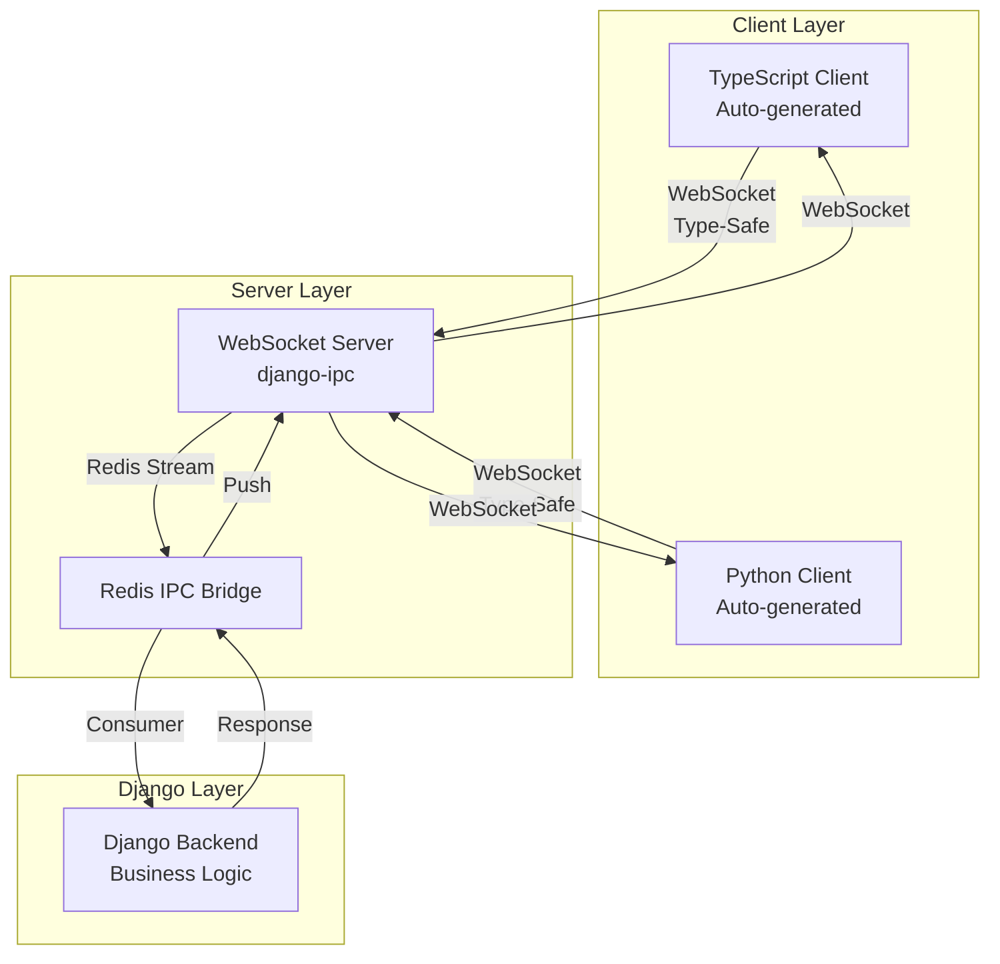

### Key Components

1. **Client Layer**: Auto-generated TypeScript/Python clients with full type safety
2. **Server Layer**: WebSocket server + Redis IPC bridge for Django communication
3. **Django Layer**: Your existing Django application (no modifications needed)

---

## How Messages Flow

### Request Flow (Frontend → Django)

When a frontend calls an RPC method, here's what happens:

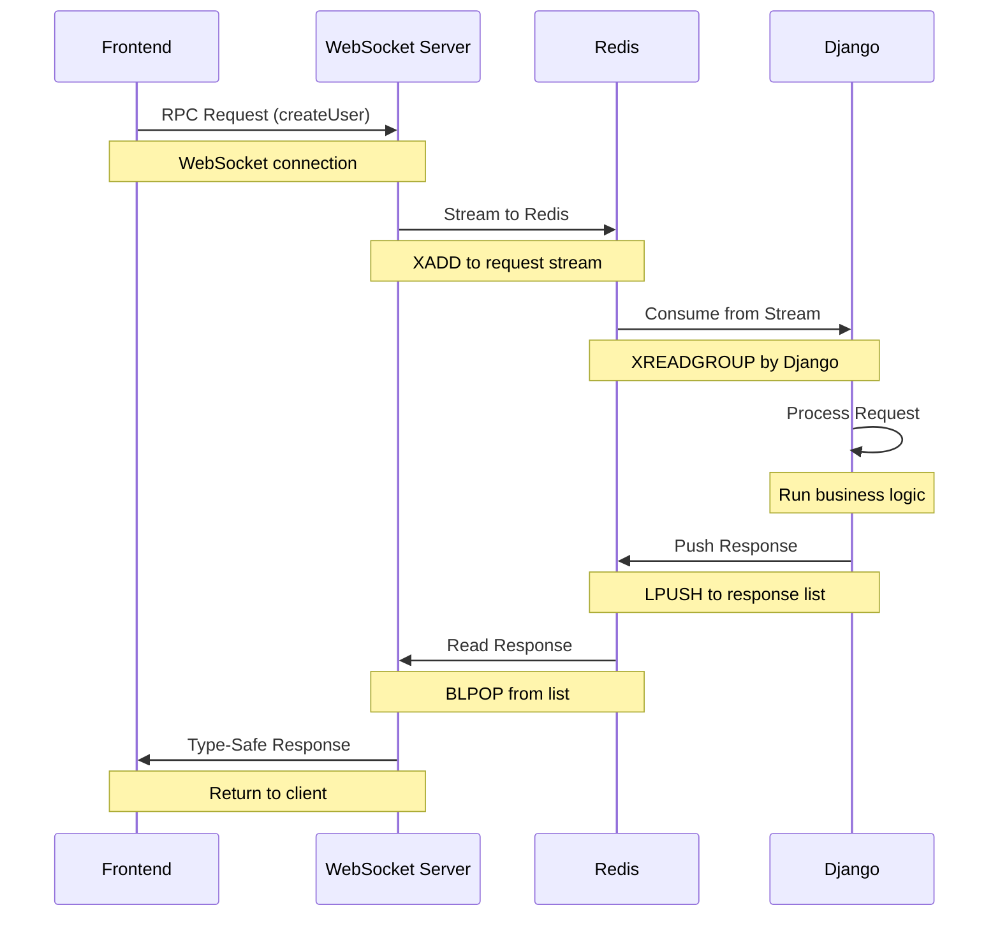

**Steps Explained**:
1. **Frontend calls method**: `client.createUser({...})`
2. **WebSocket sends to server**: Type-safe message over WebSocket
3. **Server sends to Redis**: Request added to Redis Stream
4. **Django consumes request**: Picks up from Stream via consumer group
5. **Django processes**: Runs your business logic
6. **Django sends response**: Pushes to Redis List
7. **Server reads response**: Waits on Redis List
8. **Client receives result**: Type-safe response returned

**Time**: ~5-15ms end-to-end

---

### Notification Flow (Django → Frontend)

When Django wants to notify connected clients:

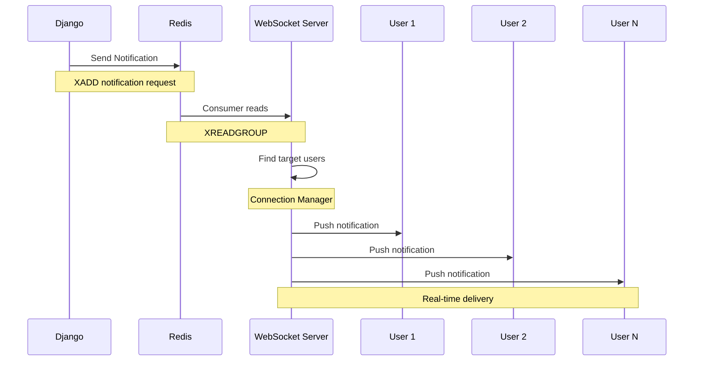

**Steps Explained**:
1. **Django triggers notification**: `rpc.send_notification(...)`
2. **Message sent to Redis**: Added to notification stream
3. **Server consumes**: Picks up via consumer group
4. **Server finds users**: Looks up WebSocket connections
5. **Server broadcasts**: Sends to all matching clients
6. **Clients receive instantly**: Real-time notification

**Time**: ~1-5ms from Django to all clients

---

## Core Concepts

### 1. Type-Safe Communication

All messages are validated with Pydantic models:

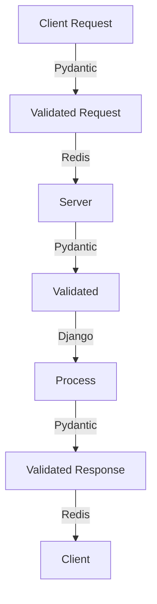

**Benefits**:
- ✅ Catches errors at message creation (not runtime)
- ✅ Full IDE autocomplete
- ✅ TypeScript + Pydantic validation
- ✅ Zero runtime type errors

---

### 2. Redis IPC Bridge

Redis acts as a message broker between Django (sync) and WebSocket server (async):

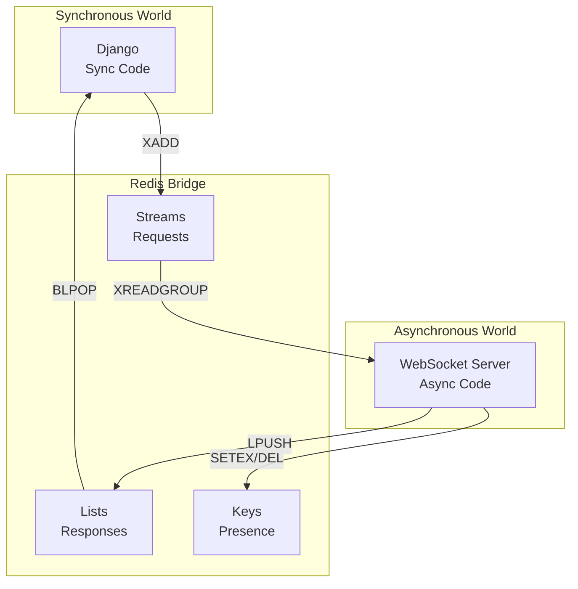

**Why Redis?**:
- **Streams**: Reliable message delivery with consumer groups
- **Lists**: Fast response delivery with blocking reads
- **Keys with TTL**: Presence tracking (who's online)

---

### 3. Connection Management

WebSocket server tracks all active connections:

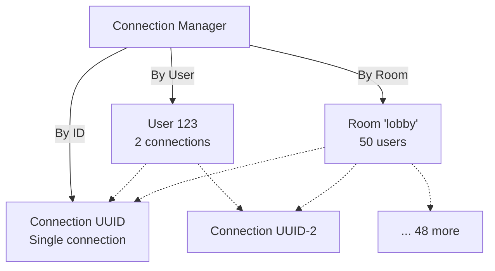

**Capabilities**:
- Send to specific user (all their devices)
- Send to room (all members)
- Send to everyone (broadcast)
- Check who's online (presence)

---

### 4. Auto-Generated Clients

Zero manual client code - everything is generated:

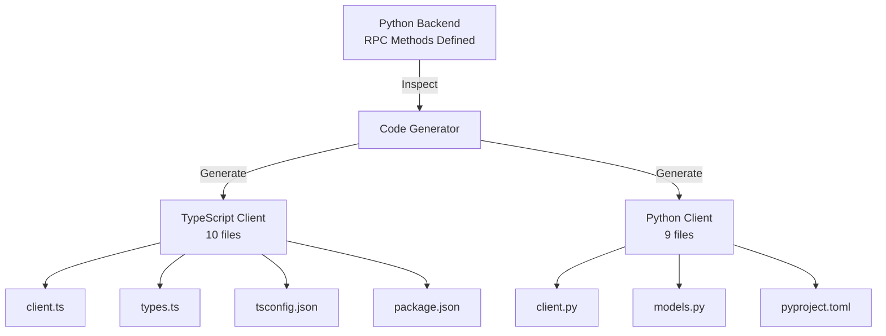

**What Gets Generated**:
- RPC client classes
- Type-safe interfaces/models
- All configuration files
- Linting & formatting configs
- Documentation

**Time**: 2 minutes to production-ready clients

---

## Deployment Architecture

### Single Server (Development)

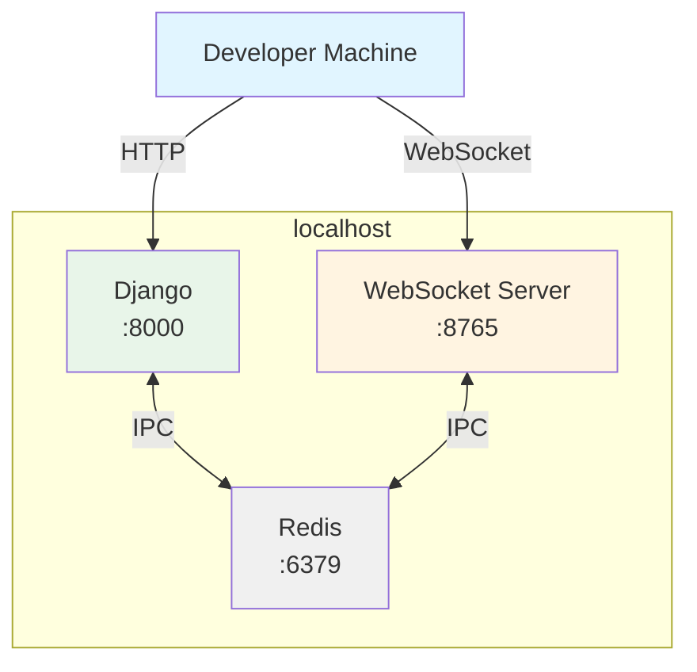

**Use Case**: Development, testing, small projects

---

### Multi-Server (Production)

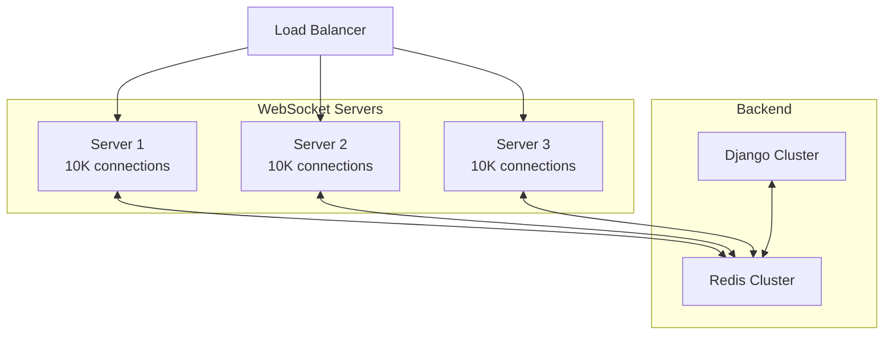

**Capabilities**:
- 30,000+ concurrent connections
- Horizontal scaling (add more servers)
- Load balancing via nginx/HAProxy
- Redis consumer groups for coordination

---

## Security Architecture

### Authentication Flow

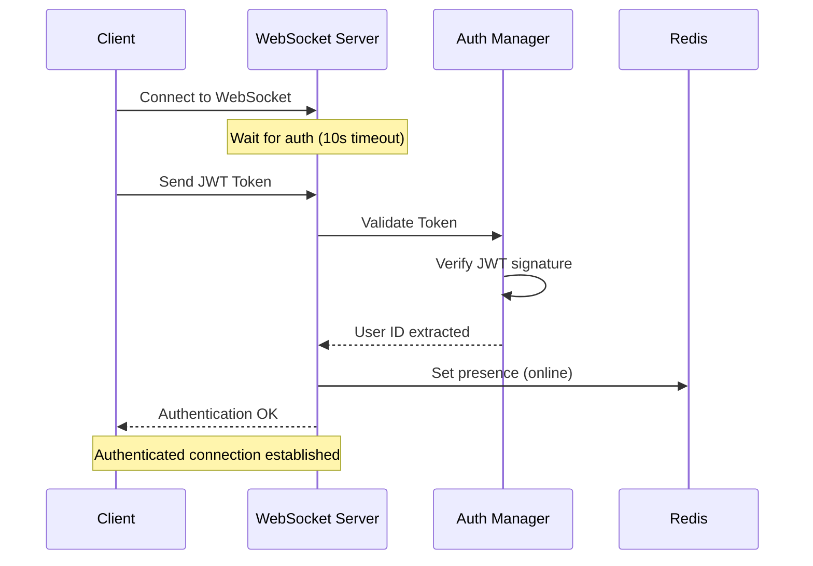

**Security Features**:
- **JWT Authentication**: Stateless, signed tokens
- **Token Authentication**: For internal services
- **Connection Timeout**: Auto-disconnect if not authenticated
- **Presence Tracking**: Know who's online
- **Automatic Cleanup**: Remove offline users

---

## Scaling Patterns

### Horizontal Scaling

Add more WebSocket servers as load increases:

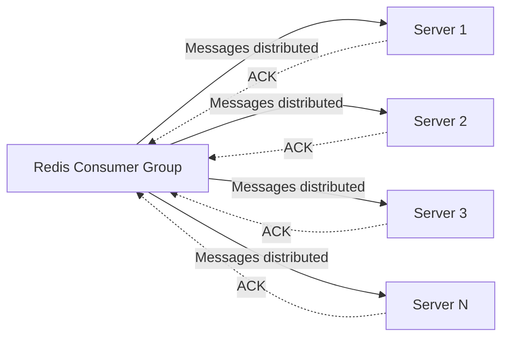

**How It Works**:
- All servers share same Redis consumer group
- Each message processed by exactly ONE server
- Failed messages automatically reassigned
- Linear scaling up to Redis limits

**Performance**: 10,000 requests/sec per server

---

### Load Distribution

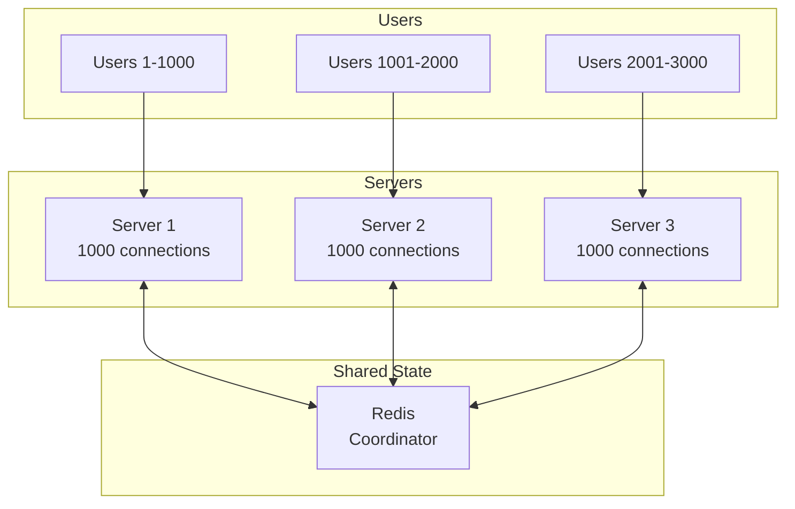

**Load Balancing Strategy**:
- WebSocket connections distributed via nginx/HAProxy
- Each server handles subset of users
- RPC requests auto-distributed via Redis
- Broadcasts work across all servers

---

## Failure Handling

### Server Crash Recovery

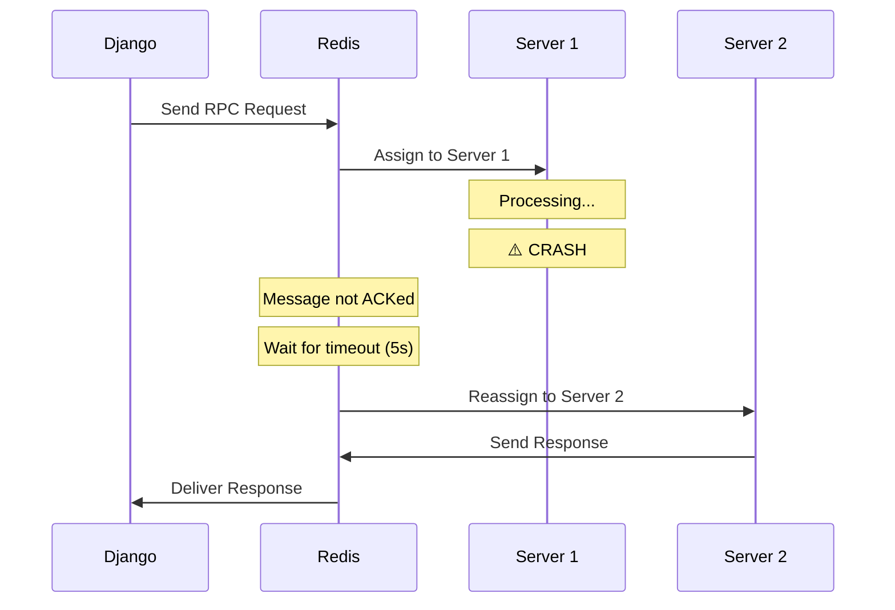

**Recovery Features**:
- Automatic message reassignment
- Configurable timeout (default: 5s)
- Zero message loss
- Transparent to Django

---

### Redis Failure Handling

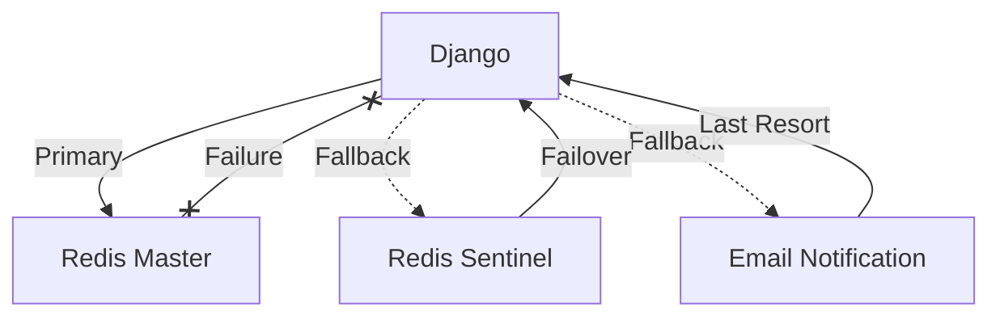

**Strategies**:
- **Redis Sentinel**: Automatic master failover
- **Circuit Breaker**: Stop sending if Redis down
- **Fallback**: Email/push notifications as backup
- **Health Checks**: Monitor Redis availability

---

## Performance Characteristics

### Latency Profile

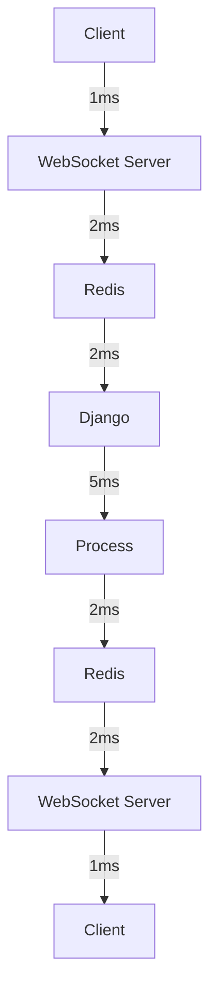

**Total Latency**: ~15ms end-to-end (P95)

**Breakdown**:
- Client ↔ Server: 1-2ms
- Server ↔ Redis: 2-3ms
- Redis ↔ Django: 2-3ms
- Django processing: 5-10ms

---

### Throughput Metrics

| Metric | Single Server | 3 Servers | 10 Servers |
|--------|--------------|-----------|------------|
| **Concurrent Connections** | 10,000 | 30,000 | 100,000 |
| **RPC Requests/sec** | 10,000 | 30,000 | 100,000 |
| **Broadcast Messages/sec** | 50,000 | 150,000 | 500,000 |
| **Memory Usage** | ~500MB | ~1.5GB | ~5GB |

**Scalability**: Linear up to Redis limits (~100K connections)

---

## Related Topics

**Visual Understanding:**
- **[How It Works](./how-it-works)** - 7-step message flow with sequence diagrams
- **[Real-Time Notifications](./real-time-notifications)** - Notification patterns

**Implementation:**
- **[Quick Start](./quick-start)** - 5-minute tutorial
- **[Django Integration](./integration)** - Add to your project
- **[Production Deployment](./deployment)** - Scale to production

**Examples & Value:**
- **[Use Cases](./use-cases)** - 5 production examples
- **[Business Value & ROI](./business-value)** - $68K savings calculator
- **[Why WebSocket RPC?](./why-websocket-rpc)** - Traditional vs modern

---

## Architecture Summary

**Key Components:**
- **Client Layer**: Auto-generated TypeScript & Python clients
- **WebSocket Server**: Handles real-time connections
- **Redis IPC Bridge**: Coordinates between sync/async
- **Django Layer**: Your business logic

**Scaling Capabilities:**
| Configuration | Connections | Requests/sec | Memory |
|--------------|-------------|--------------|---------|
| **Single Server** | 10,000 | 10,000 | ~500MB |
| **3 Servers** | 30,000 | 30,000 | ~1.5GB |
| **10 Servers** | 100,000 | 100,000 | ~5GB |

---

## Need Help?

- **[Quick Start Guide](./quick-start)** - Get started in 5 minutes
- **[How It Works](./how-it-works)** - Visual flow diagrams
- **[GitHub Issues](https://github.com/markolofsen/django-ipc/issues)** - Ask questions

---

**Understand the architecture? Ready to build!** → [Quick Start](./quick-start)

---

