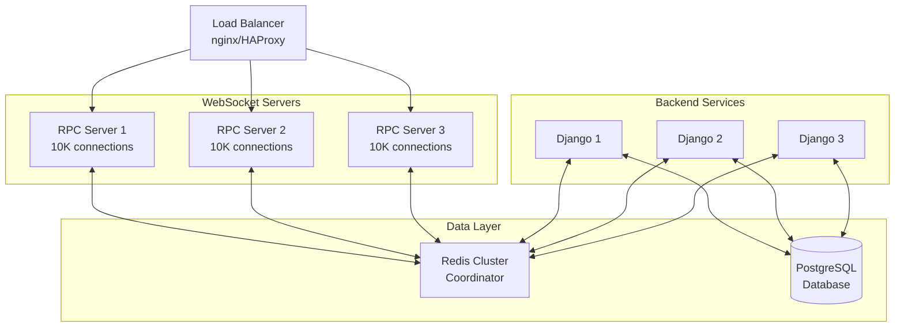

import { HowToSchema } from '@site/src/components/Schema';

<HowToSchema
  name="Deploy django-ipc to Production"
  description="Complete production deployment guide with Docker, load balancing, SSL/TLS, and monitoring"
  totalTime="PT45M"
  steps={[
    { text: 'Set up Docker Compose with multiple RPC servers', url: '#docker-compose-production' },
    { text: 'Configure nginx load balancer for WebSocket', url: '#nginx-configuration' },
    { text: 'Enable SSL/TLS with Let\'s Encrypt', url: '#ssltls-https--wss' },
    { text: 'Set up JWT authentication', url: '#jwt-authentication' },
    { text: 'Configure monitoring and health checks', url: '#monitoring' },
    { text: 'Deploy and test production setup', url: '#production-checklist' }
  ]}
/>

# Production Deployment Guide


**Deploy django-ipc to production with Docker, scaling, monitoring, and security**


---

## Production Architecture



**Capacity**: 30,000 concurrent WebSocket connections

---

## Docker Deployment

### Dockerfile for RPC Server

**Create `Dockerfile.rpc`**:
```dockerfile
FROM python:3.11-slim

WORKDIR /app

# Install system dependencies
RUN apt-get update && apt-get install -y \
    gcc \
    && rm -rf /var/lib/apt/lists/*

# Install Python dependencies
COPY requirements.txt .
RUN pip install --no-cache-dir -r requirements.txt

# Copy application
COPY . .

# Health check
HEALTHCHECK --interval=30s --timeout=10s --start-period=5s --retries=3 \
    CMD curl -f http://localhost:8766/health || exit 1

# Expose ports
EXPOSE 8765 8766

# Run RPC server
CMD ["python", "rpc_server.py"]
```

---

### Docker Compose (Production)

**Create `docker-compose.prod.yml`**:
```yaml
version: '3.8'

services:
  # Django Application
  django:
    build:
      context: .
      dockerfile: Dockerfile
    command: gunicorn myproject.wsgi:application --bind 0.0.0.0:8000 --workers 4
    volumes:
      - static_volume:/app/staticfiles
      - media_volume:/app/media
    expose:
      - 8000
    environment:
      - DEBUG=False
      - DJANGO_SETTINGS_MODULE=myproject.settings.production
      - DATABASE_URL=postgresql://postgres:${DB_PASSWORD}@db:5432/myproject
      - REDIS_URL=redis://redis:6379/2
      - SECRET_KEY=${SECRET_KEY}
      - ALLOWED_HOSTS=${ALLOWED_HOSTS}
    depends_on:
      - db
      - redis
    restart: unless-stopped

  # WebSocket RPC Server (3 replicas for scaling)
  rpc_server:
    build:
      context: .
      dockerfile: Dockerfile.rpc
    ports:
      - "8765:8765"
      - "8766:8766"
    environment:
      - REDIS_URL=redis://redis:6379/2
      - JWT_SECRET=${JWT_SECRET}
      - DJANGO_SETTINGS_MODULE=myproject.settings.production
    depends_on:
      - redis
    restart: unless-stopped
    deploy:
      replicas: 3  # 3 servers for high availability
      resources:
        limits:
          cpus: '2.0'
          memory: 2G
        reservations:
          cpus: '1.0'
          memory: 1G

  # Redis (message broker)
  redis:
    image: redis:7-alpine
    command: redis-server --appendonly yes --maxmemory 2gb --maxmemory-policy allkeys-lru
    volumes:
      - redis_data:/data
    expose:
      - 6379
    restart: unless-stopped
    deploy:
      resources:
        limits:
          memory: 3G

  # PostgreSQL Database
  db:
    image: postgres:15-alpine
    volumes:
      - postgres_data:/var/lib/postgresql/data
    environment:
      - POSTGRES_DB=myproject
      - POSTGRES_USER=postgres
      - POSTGRES_PASSWORD=${DB_PASSWORD}
    expose:
      - 5432
    restart: unless-stopped
    deploy:
      resources:
        limits:
          memory: 4G

  # Nginx (Load Balancer & Reverse Proxy)
  nginx:
    image: nginx:alpine
    ports:
      - "80:80"
      - "443:443"
    volumes:
      - ./nginx/nginx.conf:/etc/nginx/nginx.conf:ro
      - ./nginx/conf.d:/etc/nginx/conf.d:ro
      - static_volume:/app/staticfiles:ro
      - media_volume:/app/media:ro
      - ./certbot/conf:/etc/letsencrypt:ro
      - ./certbot/www:/var/www/certbot:ro
    depends_on:
      - django
      - rpc_server
    restart: unless-stopped

volumes:
  postgres_data:
  redis_data:
  static_volume:
  media_volume:
```

---

### Nginx Configuration

**Create `nginx/conf.d/myproject.conf`**:
```nginx
# Upstream for Django
upstream django {
    least_conn;
    server django:8000;
}

# Upstream for WebSocket RPC (multiple servers)
upstream websocket {
    least_conn;
    server rpc_server:8765;
    # Add more servers if deployed separately
    # server rpc_server_2:8765;
    # server rpc_server_3:8765;
}

# HTTP server
server {
    listen 80;
    server_name yourdomain.com;

    # Redirect to HTTPS
    return 301 https://$server_name$request_uri;
}

# HTTPS server
server {
    listen 443 ssl http2;
    server_name yourdomain.com;

    # SSL certificates
    ssl_certificate /etc/letsencrypt/live/yourdomain.com/fullchain.pem;
    ssl_certificate_key /etc/letsencrypt/live/yourdomain.com/privkey.pem;

    # SSL configuration
    ssl_protocols TLSv1.2 TLSv1.3;
    ssl_ciphers HIGH:!aNULL:!MD5;
    ssl_prefer_server_ciphers on;

    # Security headers
    add_header X-Frame-Options "SAMEORIGIN" always;
    add_header X-Content-Type-Options "nosniff" always;
    add_header X-XSS-Protection "1; mode=block" always;

    # WebSocket endpoint (ws:// and wss://)
    location /ws/ {
        proxy_pass http://websocket/;
        proxy_http_version 1.1;

        # WebSocket headers
        proxy_set_header Upgrade $http_upgrade;
        proxy_set_header Connection "Upgrade";
        proxy_set_header Host $host;
        proxy_set_header X-Real-IP $remote_addr;
        proxy_set_header X-Forwarded-For $proxy_add_x_forwarded_for;
        proxy_set_header X-Forwarded-Proto $scheme;

        # Timeouts (important for long-lived connections)
        proxy_connect_timeout 7d;
        proxy_send_timeout 7d;
        proxy_read_timeout 7d;

        # Disable buffering
        proxy_buffering off;
    }

    # Health check endpoint
    location /health/ {
        proxy_pass http://websocket/health;
        proxy_http_version 1.1;
        proxy_set_header Host $host;
    }

    # Django API
    location /api/ {
        proxy_pass http://django;
        proxy_set_header Host $host;
        proxy_set_header X-Real-IP $remote_addr;
        proxy_set_header X-Forwarded-For $proxy_add_x_forwarded_for;
        proxy_set_header X-Forwarded-Proto $scheme;
    }

    # Django admin
    location /admin/ {
        proxy_pass http://django;
        proxy_set_header Host $host;
        proxy_set_header X-Real-IP $remote_addr;
        proxy_set_header X-Forwarded-For $proxy_add_x_forwarded_for;
        proxy_set_header X-Forwarded-Proto $scheme;
    }

    # Static files
    location /static/ {
        alias /app/staticfiles/;
        expires 30d;
        add_header Cache-Control "public, immutable";
    }

    # Media files
    location /media/ {
        alias /app/media/;
        expires 7d;
    }

    # Frontend (SPA)
    location / {
        root /app/frontend/build;
        try_files $uri $uri/ /index.html;
    }
}
```

---

## Environment Variables

**Create `.env.production`**:
```bash
# Django
DEBUG=False
SECRET_KEY=your-super-secret-key-change-me
ALLOWED_HOSTS=yourdomain.com,www.yourdomain.com
DJANGO_SETTINGS_MODULE=myproject.settings.production

# Database
DATABASE_URL=postgresql://postgres:strongpassword@db:5432/myproject
DB_PASSWORD=strongpassword

# Redis
REDIS_URL=redis://redis:6379/2

# WebSocket RPC
RPC_SERVER_URL=wss://yourdomain.com/ws/
JWT_SECRET=your-super-secret-jwt-key-change-me

# Email (for notifications)
EMAIL_HOST=smtp.sendgrid.net
EMAIL_PORT=587
EMAIL_USE_TLS=True
EMAIL_HOST_USER=apikey
EMAIL_HOST_PASSWORD=your-sendgrid-api-key

# Sentry (error tracking)
SENTRY_DSN=https://your-sentry-dsn

# AWS (if using S3 for media)
AWS_ACCESS_KEY_ID=your-access-key
AWS_SECRET_ACCESS_KEY=your-secret-key
AWS_STORAGE_BUCKET_NAME=your-bucket-name
```

**Load environment variables**:
```bash
docker-compose --env-file .env.production up -d
```

---

## Deployment Commands

### Initial Deployment

```bash
# 1. Build images
docker-compose -f docker-compose.prod.yml build

# 2. Run migrations
docker-compose -f docker-compose.prod.yml run --rm django python manage.py migrate

# 3. Collect static files
docker-compose -f docker-compose.prod.yml run --rm django python manage.py collectstatic --noinput

# 4. Create superuser
docker-compose -f docker-compose.prod.yml run --rm django python manage.py createsuperuser

# 5. Start services
docker-compose -f docker-compose.prod.yml up -d

# 6. Check health
curl https://yourdomain.com/health/
```

---

### Updates & Redeployment

```bash
# 1. Pull latest code
git pull origin main

# 2. Rebuild images
docker-compose -f docker-compose.prod.yml build

# 3. Run migrations
docker-compose -f docker-compose.prod.yml run --rm django python manage.py migrate

# 4. Restart services (zero downtime)
docker-compose -f docker-compose.prod.yml up -d --no-deps --build django rpc_server

# 5. Verify deployment
curl https://yourdomain.com/health/
```

---

## Scaling

### Horizontal Scaling (Add More Servers)

**Scale RPC servers**:
```bash
# Scale to 5 RPC servers
docker-compose -f docker-compose.prod.yml up -d --scale rpc_server=5

# Scale Django workers
docker-compose -f docker-compose.prod.yml up -d --scale django=4
```

**Manual scaling** (separate servers):
```bash
# Server 1
WS_SERVER_ID=1 python rpc_server.py

# Server 2
WS_SERVER_ID=2 python rpc_server.py

# Server 3
WS_SERVER_ID=3 python rpc_server.py
```

All servers share same Redis consumer group - automatic load balancing!

---

### Vertical Scaling (More Resources)

**Update `docker-compose.prod.yml`**:
```yaml
rpc_server:
  deploy:
    resources:
      limits:
        cpus: '4.0'      # Increase CPU
        memory: 4G       # Increase memory
      reservations:
        cpus: '2.0'
        memory: 2G
```

---

## Monitoring

### Health Checks

**Endpoint**: `http://your-server:8766/health`

**Response**:
```json
{
    "status": "healthy",
    "websocket": "ws://your-server:8765",
    "connections": 1234,
    "uptime_seconds": 86400
}
```

**Monitor script**:
```bash
#!/bin/bash
# monitor.sh

while true; do
    response=$(curl -s http://localhost:8766/health)
    status=$(echo $response | jq -r '.status')

    if [ "$status" != "healthy" ]; then
        echo "❌ RPC Server unhealthy!"
        # Send alert (Slack, email, etc.)
        curl -X POST -H 'Content-type: application/json' \
            --data '{"text":"RPC Server health check failed!"}' \
            $SLACK_WEBHOOK_URL
    else
        echo "✅ RPC Server healthy - $(echo $response | jq -r '.connections') connections"
    fi

    sleep 60
done
```

---

### Prometheus Metrics (Coming Soon)

**Planned metrics**:
- `rpc_connections_total` - Total active connections
- `rpc_messages_sent_total` - Total messages sent
- `rpc_messages_received_total` - Total messages received
- `rpc_latency_seconds` - Message latency histogram
- `rpc_errors_total` - Total errors

---

### Logging

**Configure logging in `settings.py`**:
```python
LOGGING = {
    'version': 1,
    'disable_existing_loggers': False,
    'formatters': {
        'verbose': {
            'format': '{levelname} {asctime} {module} {message}',
            'style': '{',
        },
    },
    'handlers': {
        'console': {
            'class': 'logging.StreamHandler',
            'formatter': 'verbose',
        },
        'file': {
            'class': 'logging.handlers.RotatingFileHandler',
            'filename': '/var/log/myproject/django.log',
            'maxBytes': 1024 * 1024 * 10,  # 10 MB
            'backupCount': 5,
            'formatter': 'verbose',
        },
    },
    'root': {
        'handlers': ['console', 'file'],
        'level': 'INFO',
    },
    'loggers': {
        'django_ipc': {
            'handlers': ['console', 'file'],
            'level': 'INFO',
            'propagate': False,
        },
    },
}
```

**View logs**:
```bash
# Docker logs
docker-compose logs -f rpc_server

# Specific container
docker logs -f myproject_rpc_server_1

# Last 100 lines
docker logs --tail 100 myproject_rpc_server_1
```

---

## Security

### SSL/TLS (HTTPS + WSS)

**Get Let's Encrypt certificate**:
```bash
# Install certbot
sudo apt install certbot

# Get certificate
sudo certbot certonly --standalone -d yourdomain.com -d www.yourdomain.com

# Auto-renewal cron
echo "0 12 * * * /usr/bin/certbot renew --quiet" | sudo crontab -
```

**Update nginx config** to use certificates (see above).

---

### JWT Authentication

**Enable JWT auth in `rpc_server.py`**:
```python
config = ServerConfig(
    server=WSServerConfig(
        host="0.0.0.0",
        port=8765,
        redis_url=os.getenv("REDIS_URL"),
        auth_mode=AuthMode.JWT,  # ✅ Enable JWT
        jwt_secret=os.getenv("JWT_SECRET"),
        jwt_algorithm="HS256",
    )
)
```

**Frontend** (set JWT token):
```typescript
import { RPCClient } from './clients/typescript';

const client = new RPCClient('wss://yourdomain.com/ws/');

// Get JWT from your auth system
const token = localStorage.getItem('auth_token');

// Set token before connecting
client.setAuthToken(token);

// Connect
await client.connect();
```

**Django** (generate JWT):
```python
import jwt
from datetime import datetime, timedelta
from django.conf import settings

def generate_websocket_token(user):
    """Generate JWT token for WebSocket authentication"""

    payload = {
        'user_id': str(user.id),
        'username': user.username,
        'exp': datetime.utcnow() + timedelta(hours=24),
        'iat': datetime.utcnow()
    }

    token = jwt.encode(
        payload,
        settings.JWT_SECRET,
        algorithm='HS256'
    )

    return token
```

---

### Rate Limiting

**Nginx rate limiting**:
```nginx
# Add to nginx.conf
limit_req_zone $binary_remote_addr zone=websocket:10m rate=10r/s;

# Add to location block
location /ws/ {
    limit_req zone=websocket burst=20 nodelay;
    # ... rest of config
}
```

---

### CORS Configuration

**Django settings**:
```python
CORS_ALLOWED_ORIGINS = [
    "https://yourdomain.com",
    "https://www.yourdomain.com",
]

CORS_ALLOW_CREDENTIALS = True
```

---

## Backup & Recovery

### Redis Backup

**Configure Redis persistence**:
```yaml
redis:
  command: >
    redis-server
    --appendonly yes
    --appendfsync everysec
    --save 900 1
    --save 300 10
    --save 60 10000
```

**Backup script**:
```bash
#!/bin/bash
# backup-redis.sh

docker exec myproject_redis_1 redis-cli BGSAVE
docker cp myproject_redis_1:/data/dump.rdb ./backups/redis-$(date +%Y%m%d-%H%M%S).rdb
```

---

### Database Backup

```bash
#!/bin/bash
# backup-db.sh

docker exec myproject_db_1 pg_dump -U postgres myproject | gzip > ./backups/db-$(date +%Y%m%d-%H%M%S).sql.gz
```

---

## Production Checklist

### Before Going Live

- [ ] SSL certificates installed
- [ ] JWT authentication enabled
- [ ] `DEBUG = False` in Django settings
- [ ] Strong `SECRET_KEY` and `JWT_SECRET`
- [ ] Database backups configured
- [ ] Redis persistence enabled
- [ ] Health checks working
- [ ] Monitoring setup
- [ ] Error tracking (Sentry) configured
- [ ] Rate limiting enabled
- [ ] CORS configured correctly
- [ ] Firewall rules in place
- [ ] Load testing completed
- [ ] Rollback plan ready

---

### Performance Testing

**Load test with 10,000 concurrent connections**:
```bash
# Install websocket-bench
npm install -g websocket-bench

# Run load test
websocket-bench wss://yourdomain.com/ws/ \
    --amount 10000 \
    --concurrent 1000 \
    --auth "Bearer your-jwt-token"
```

**Expected results**:
- Connection time: `<100ms`
- Message latency: `<50ms` (P95)
- No dropped connections

---

## Related Topics

**Production Setup:**
- **[Django Integration Guide](./integration)** - Integrate before deploying
- **[Architecture Overview](./architecture)** - Understand system design for scaling
- **[Monitoring Best Practices](./deployment#monitoring)** - Set up Prometheus + Grafana

**Security & Auth:**
- **[JWT Authentication Setup](./deployment#jwt-authentication)** - Secure your WebSocket server
- **[SSL/TLS Configuration](./deployment#ssltls-https--wss)** - Enable HTTPS

**Learn from Examples:**
- **[Use Cases](./use-cases)** - 5 production deployments
- **[Quick Start](./quick-start)** - Test locally first

---

## Production Checklist

Before going live, verify:

**Infrastructure:**
- [ ] Multiple WebSocket servers (3+ for HA)
- [ ] nginx load balancer configured
- [ ] Redis cluster with persistence
- [ ] SSL/TLS certificates installed

**Security:**
- [ ] JWT authentication enabled
- [ ] CORS configured correctly
- [ ] Rate limiting active
- [ ] Firewall rules in place

**Monitoring:**
- [ ] Health check endpoints working
- [ ] Prometheus metrics collecting
- [ ] Grafana dashboards created
- [ ] Alerts configured (PagerDuty/OpsGenie)

**Testing:**
- [ ] Load tested (10K+ connections)
- [ ] Failover tested
- [ ] Backup/restore tested
- [ ] Monitoring alerts tested

---

## Need Help?

- **[Quick Start Guide](./quick-start)** - Get started locally
- **[Integration Guide](./integration)** - Django setup
- **[GitHub Issues](https://github.com/markolofsen/django-ipc/issues)** - Report deployment issues

---

