# How It Works

**Step-by-step visual explanation of django-ipc message flows**

---

## The 7-Step RPC Flow

When your frontend calls an RPC method, here's exactly what happens:

### Step 1: Frontend Calls Method

```typescript
// TypeScript client - auto-generated
const client = new RPCClient('ws://localhost:8765');
await client.connect();

// ✅ Type-safe, autocomplete works
const order = await client.createOrder({
    userId: 123,
    items: [{id: 1, quantity: 2}],
    total: 99.99
});
```

**What Happens**:
- Client serializes params to JSON
- Pydantic validates request structure
- WebSocket sends message to server

---

### Step 2: WebSocket Server Receives


**Server Actions**:
- Receive WebSocket message
- Deserialize JSON payload
- Validate request with Pydantic
- Generate unique correlation ID (UUID)

---

### Step 3: Send to Redis Stream


**Redis Command**:
```python
# Server pushes to stream
redis.xadd("stream:rpc_requests", {
    "payload": json.dumps(request)
})
```

**Why Stream?**:
- Multiple Django workers can consume
- Consumer groups for load balancing
- Message persistence
- Automatic retry on failure

---

### Step 4: Django Consumes from Stream


**Django Code**:
```python
# Django continuously polls stream
messages = redis.xreadgroup(
    groupname="rpc_group",
    consumername="worker_1",
    streams={"stream:rpc_requests": ">"},
    count=10,
    block=1000  # Wait 1 second
)
```

**What Happens**:
- Django worker waits on stream
- Redis assigns message to ONE worker
- Worker gets request payload
- Correlation ID preserved

---

### Step 5: Django Processes Request

```python
# Django backend - your code
from django_ipc import rpc_method

@rpc_method
def create_order(user_id: int, items: list, total: float):
    # ✅ Your business logic here
    order = Order.objects.create(
        user_id=user_id,
        total=total
    )

    for item in items:
        OrderItem.objects.create(
            order=order,
            product_id=item['id'],
            quantity=item['quantity']
        )

    # Return response
    return {
        "order_id": order.id,
        "status": "created"
    }
```

**Processing Steps**:
1. Deserialize params
2. Run business logic (Django ORM, etc.)
3. Serialize response
4. Prepare for sending back

---

### Step 6: Django Pushes Response to Redis List


**Redis Command**:
```python
# Django pushes response
redis.lpush(
    f"list:response:{correlation_id}",
    json.dumps(response)
)
redis.expire(f"list:response:{correlation_id}", 60)  # Auto-cleanup
```

**Why List?**:
- Direct delivery to waiting server
- O(1) push/pop operations
- Automatic expiration (TTL)
- No polling needed (blocking read)

---

### Step 7: Server Returns to Client


**Server Actions**:
1. Wait on Redis List (blocking)
2. Receive response when ready
3. Validate response with Pydantic
4. Send via WebSocket to client
5. Client Promise resolves

**Client Receives**:
```typescript
// Client code - Promise resolves
const order = await client.createOrder({...});

console.log(order.order_id);   // 42
console.log(order.status);      // "created"
// ✅ Fully type-safe!
```

---

## Complete Flow Diagram

```mermaid
sequenceDiagram
    autonumber
    participant F as Frontend
    participant W as WebSocket Server
    participant R as Redis
    participant D as Django

    F->>W: createOrder({...})
    Note over F,W: Step 1: Method call

    W->>W: Validate & generate UUID
    Note over W: Step 2: Server receives

    W->>R: XADD to stream
    Note over W,R: Step 3: Send to stream

    R->>D: XREADGROUP (async)
    Note over R,D: Step 4: Django consumes

    D->>D: Run business logic
    Note over D: Step 5: Process request

    D->>R: LPUSH to list
    Note over D,R: Step 6: Push response

    R->>W: BLPOP returns
    Note over R,W: Step 7a: Server gets response

    W->>F: WebSocket send
    Note over W,F: Step 7b: Return to client

    Note over F: Promise resolves ✅
```



**Total Time**: ~5-15ms end-to-end

---

## Real-Time Notification Flow

When Django wants to send a notification to connected users:

### Step 1: Django Sends Notification

```python
# Django backend
from django_ipc.client import RPCClient

rpc = RPCClient()

# Send notification to specific user
rpc.send_notification(
    user_id="123",
    message="Your order has been shipped!",
    data={"order_id": 42, "tracking": "ABC123"}
)
```

---

### Step 2: Message Flows Through Redis


**Same pattern as RPC**, but no response needed.

---

### Step 3: Server Finds User Connections


**Server Actions**:
- Look up user ID in connection manager
- Find all active connections for that user
- Prepare to send to multiple devices

---

### Step 4: Push to All User Devices


**Client Receives**:
```typescript
// Both devices receive notification
client.on('notification', (data) => {
    console.log(data.message);  // "Your order has been shipped!"
    showNotification(data);
});
```

---

## Broadcast Flow (Send to All)

When you need to send a message to everyone:


**Django Code**:
```python
# Broadcast to everyone
rpc.broadcast(
    message="System maintenance in 5 minutes",
    data={"scheduled_at": "2024-01-01T10:00:00Z"}
)
```

**All connected clients receive instantly**.

---

## Room-Based Messaging

Send messages to specific rooms/groups:


**Django Code**:
```python
# Send to room members
rpc.send_to_room(
    room="game_123",
    message="Player joined",
    data={"player_id": 456}
)
```

**Use Cases**:
- 🎮 Multiplayer games
- 💬 Chat rooms
- 📊 Dashboard viewers
- 🏢 Team workspaces

---

## Error Handling Flow

What happens when things go wrong:

### Scenario 1: Invalid Request


**Client Receives**:
```typescript
try {
    await client.createOrder({ invalid: "data" });
} catch (error) {
    // ✅ Caught at call site
    console.error(error.message);  // "Validation error: field 'userId' required"
}
```

---

### Scenario 2: Django Error


**Django Error**:
```python
@rpc_method
def create_order(user_id, items, total):
    user = User.objects.get(id=user_id)  # May raise DoesNotExist
    ...
```

**Client Handles**:
```typescript
try {
    await client.createOrder({...});
} catch (error) {
    // ✅ Django error propagated
    console.error(error.message);  // "User not found"
}
```

---

### Scenario 3: Timeout


**Client Handles**:
```typescript
try {
    await client.slowOperation({...});
} catch (error) {
    if (error instanceof TimeoutError) {
        // ✅ Timeout after 30s
        console.error("Request timed out");
    }
}
```

---

## Connection Lifecycle

How WebSocket connections are managed:

### 1. Connection Established


**Client Code**:
```typescript
const client = new RPCClient('ws://localhost:8765');
client.setAuthToken('your-jwt-token');
await client.connect();
// ✅ Connected and authenticated
```

---

### 2. Active Connection


**Server maintains**:
- Connection state
- User ID mapping
- Room memberships
- Presence in Redis

---

### 3. Disconnection & Cleanup


**Auto-cleanup**:
- Remove from active connections
- Delete Redis presence key
- Remove from all rooms
- Free resources

---

### 4. Auto-Reconnection


**Built-in Features**:
- Automatic reconnection
- Exponential backoff
- Infinite retries
- Re-authentication on reconnect

---

## Visual Summary

### All Flows Together


**Key Takeaways**:
1. **RPC Flow**: Client → Server → Redis → Django → Redis → Server → Client
2. **Notification Flow**: Django → Redis → Server → All Clients
3. **Type Safety**: Pydantic validates every step
4. **Auto-Reconnect**: Built into clients
5. **Error Handling**: Propagated to call site

---

## Related Topics

**System Understanding:**
- **[Architecture Overview](./architecture)** - High-level system design
- **[Real-Time Notifications](./real-time-notifications)** - 4 notification patterns explained

**Implementation:**
- **[Quick Start](./quick-start)** - 5-minute tutorial
- **[Django Integration](./integration)** - Add to your project
- **[Production Deployment](./deployment)** - Scale to production

**Examples & Value:**
- **[Use Cases](./use-cases)** - 5 production examples with metrics
- **[Business Value & ROI](./business-value)** - ROI calculator
- **[Why WebSocket RPC?](./why-websocket-rpc)** - Problem → Solution

---

## Flow Patterns Summary

**7 Core Flows:**
1. **RPC Request/Response** - Client calls Django methods
2. **User Notifications** - Send to specific user (all devices)
3. **Broadcast** - Send to all connected users
4. **Room Messaging** - Send to group/room members
5. **Error Handling** - Validation, timeouts, Django errors
6. **Connection Lifecycle** - Connect, auth, heartbeat, disconnect
7. **Auto-Reconnection** - Exponential backoff, infinite retries

**Latency**: ~15ms end-to-end (P95)

---

## Need Help?

- **[Quick Start Guide](./quick-start)** - Get running in 5 minutes
- **[Architecture Overview](./architecture)** - System design
- **[GitHub Issues](https://github.com/markolofsen/django-ipc/issues)** - Ask questions

---

**Understand how it works? Start building!** → [Quick Start](./quick-start)

---

