import { HowToSchema } from '@site/src/components/Schema';

<HowToSchema
  name="Get django-ipc Running in 5 Minutes"
  description="Complete tutorial to start django-ipc server, generate clients, and send real-time notifications from Django"
  totalTime="PT5M"
  steps={[
    { text: 'Install django-ipc', url: '#step-1-install-django-ipc' },
    { text: 'Start WebSocket Server', url: '#step-2-start-websocket-server' },
    { text: 'Generate TypeScript & Python Clients', url: '#step-3-generate-clients' },
    { text: 'Use TypeScript Client in Frontend', url: '#step-4-use-typescript-client' },
    { text: 'Send Notifications from Django', url: '#step-5-send-notifications-from-django' },
    { text: 'Test Everything Together', url: '#step-6-test-everything-together' }
  ]}
/>

# Quick Start Guide


**Get django-ipc running in 5 minutes - from zero to production-ready real-time communication**


---

## What You'll Build

In this 5-minute tutorial, you'll:
- ✅ Start a WebSocket RPC server
- ✅ Auto-generate TypeScript & Python clients
- ✅ Send real-time notifications from Django
- ✅ Receive instant updates on frontend

**Time**: 5 minutes
**Difficulty**: Beginner

---

## Prerequisites

- Python 3.10+
- Django project (existing or new)
- Redis running locally (or Docker)
- Node.js 16+ (for TypeScript client)

**Install Redis** (if needed):
```bash
# macOS
brew install redis
brew services start redis

# Ubuntu/Debian
sudo apt install redis-server
sudo systemctl start redis

# Docker
docker run -d -p 6379:6379 redis:7-alpine
```

**Verify Redis**:
```bash
redis-cli ping
# Should return: PONG
```

---

## Step 1: Install django-ipc

**Installation** (30 seconds):
```bash
pip install django-ipc
```

**Verify Installation**:
```bash
python -c "from django_ipc.server import WebSocketServer; print('✅ OK')"
```

---

## Step 2: Start WebSocket Server

**Create server script** `rpc_server.py`:
```python
"""
WebSocket RPC Server
Run with: python rpc_server.py
"""
import asyncio
from django_ipc.server import WebSocketServer
from django_ipc.server.config import ServerConfig, WSServerConfig, AuthMode

# Server configuration
config = ServerConfig(
    server=WSServerConfig(
        host="0.0.0.0",
        port=8765,
        redis_url="redis://localhost:6379/2",
        auth_mode=AuthMode.NONE,  # Development only!
    )
)

async def main():
    server = WebSocketServer(config)
    await server.start()

if __name__ == "__main__":
    print("🚀 Starting WebSocket RPC Server...")
    print("📡 WebSocket: ws://localhost:8765")
    print("🏥 Health: http://localhost:8766/health")
    asyncio.run(main())
```

**Start the server** (1 minute):
```bash
python rpc_server.py
```

**Expected output**:
```
🚀 Starting WebSocket RPC Server...
📡 WebSocket: ws://localhost:8765
🏥 Health: http://localhost:8766/health
INFO:     Started server process
INFO:     Waiting for application startup.
INFO:     Application startup complete.
```

**Test health check**:
```bash
curl http://localhost:8766/health
# {"status": "healthy", "websocket": "ws://localhost:8765"}
```

✅ **Server is running!**

---

## Step 3: Generate Clients

**One command** to generate production-ready clients (2 minutes):

```bash
# Generate TypeScript + Python clients
python -m django_ipc.codegen.cli generate-clients \
    --output ./clients \
    --redis-url redis://localhost:6379/2
```

**What gets generated**:
```
clients/
├── typescript/              # TypeScript Client (10 files)
│   ├── client.ts           # RPC client class
│   ├── types.ts            # Type-safe interfaces
│   ├── index.ts            # Exports
│   ├── tsconfig.json       # TypeScript config
│   ├── package.json        # npm config (8 scripts!)
│   ├── .eslintrc.json      # ESLint rules
│   ├── .prettierrc         # Prettier config
│   ├── .gitignore          # Git exclusions
│   ├── .editorconfig       # Editor config
│   └── README.md           # Documentation
│
└── python/                 # Python Client (9 files)
    ├── client.py           # RPC client class
    ├── models.py           # Pydantic models
    ├── __init__.py         # Package exports
    ├── setup.py            # setuptools
    ├── pyproject.toml      # Modern packaging
    ├── requirements.txt    # Dependencies
    ├── .gitignore          # Git exclusions
    ├── .editorconfig       # Editor config
    └── README.md           # Documentation
```

✅ **Clients generated!** (19 files, 0 lines of manual code)

---

## Step 4: Use TypeScript Client

**Install dependencies**:
```bash
cd clients/typescript
npm install
npm run build
```

**Use in your React/Vue/Angular app**:
```typescript
import { RPCClient } from './clients/typescript';

// Create client
const client = new RPCClient('ws://localhost:8765');

// Connect
await client.connect();
console.log('✅ Connected to WebSocket server');

// Listen for notifications
client.on('notification', (notification) => {
    console.log('📬 Notification:', notification.message);
    console.log('📦 Data:', notification.data);

    // Show toast/alert
    showNotification(notification);
});

// Listen for broadcasts
client.on('broadcast', (message) => {
    console.log('📢 Broadcast:', message);
    showBanner(message);
});

// Join a room (e.g., chat room)
await client.joinRoom('room_123');

// Listen for room messages
client.on('room_message', (data) => {
    console.log('💬 Room message:', data);
    updateChatUI(data);
});
```

✅ **Frontend ready!**

---

## Step 5: Send Notifications from Django

**Django view** (send notification):
```python
from django.http import JsonResponse
from django_ipc.client import RPCClient

def notify_user(request):
    """Send real-time notification to user"""

    user_id = request.POST.get('user_id')
    message = request.POST.get('message')

    # Create RPC client
    rpc = RPCClient(redis_url="redis://localhost:6379/2")

    # Send notification (arrives instantly on frontend!)
    rpc.send_notification(
        user_id=user_id,
        message=message,
        data={
            "timestamp": "2024-01-01T10:00:00Z",
            "type": "info",
            "action_url": "/dashboard"
        }
    )

    return JsonResponse({"status": "sent"})
```

**Django signal** (automatic notifications):
```python
from django.db.models.signals import post_save
from django.dispatch import receiver
from django_ipc.client import RPCClient

@receiver(post_save, sender=Order)
def notify_order_created(sender, instance, created, **kwargs):
    """Automatically notify user when order is created"""

    if created:
        rpc = RPCClient(redis_url="redis://localhost:6379/2")

        rpc.send_notification(
            user_id=str(instance.user.id),
            message="Your order has been received!",
            data={
                "order_id": instance.id,
                "amount": float(instance.total),
                "items_count": instance.items.count()
            }
        )
```

**Test it**:
```bash
# Create an order in Django admin or shell
Order.objects.create(user_id=123, total=99.99)

# Frontend receives notification INSTANTLY! ⚡
```

✅ **Real-time notifications working!**

---

## Step 6: Test Everything Together

### Terminal 1: Run WebSocket Server
```bash
python rpc_server.py
```

### Terminal 2: Run Django
```bash
python manage.py runserver
```

### Terminal 3: Test with curl
```bash
# Send notification via Django
curl -X POST http://localhost:8000/api/notify/ \
  -d "user_id=123" \
  -d "message=Hello from Django!"

# Frontend receives it INSTANTLY! 🎉
```

### Browser Console:
```
✅ Connected to WebSocket server
📬 Notification: Hello from Django!
📦 Data: {timestamp: "...", type: "info", ...}
```

---

## Complete Working Example

### Full Stack Flow

```mermaid
sequenceDiagram
    participant F as Frontend (Browser)
    participant W as WebSocket Server
    participant R as Redis
    participant D as Django

    F->>W: Connect to ws://localhost:8765
    W-->>F: Connected ✅

    Note over D: User creates order
    D->>R: Send notification
    R->>W: Deliver notification
    W->>F: Push to browser
    Note over F: Toast appears! 🎉
```



### File Structure After Quick Start

```
your-project/
├── rpc_server.py              # WebSocket server
├── manage.py                  # Django
├── myapp/
│   ├── views.py              # Django views with RPC
│   └── signals.py            # Auto-notifications
├── clients/
│   ├── typescript/           # Generated TS client
│   └── python/               # Generated Python client
└── frontend/
    └── src/
        └── app.tsx           # Uses TypeScript client
```

---

## What You Just Built

In 5 minutes, you now have:

✅ **django-ipc server** running on port 8765
✅ **Auto-generated clients** (TypeScript + Python)
✅ **Type-safe communication** (100% validated)
✅ **Real-time notifications** from Django to frontend
✅ **Production-ready setup** with all configs

**Total lines of manual code**: ~50 lines
**Total files generated**: 19 files
**Time to production**: 5 minutes

---

## Next Steps

### Go Deeper

**Learn Patterns**:
- **[Real-Time Notifications](./real-time-notifications.md)** - Notification patterns
- **[Use Cases](./use-cases.md)** - Real-world examples
- **[How It Works](./how-it-works.md)** - Visual flow diagrams

**Production Setup**:
- **[Integration Guide](./integration.md)** - Integrate with Django project
- **[Deployment](./deployment.md)** - Production deployment

**Understand Architecture**:
- **[Architecture](./architecture.md)** - System design
- **[Business Value](./business-value.md)** - ROI calculator

---

### Try Advanced Features

**1. Room-based messaging** (chat rooms, multiplayer):
```python
# Django
rpc.send_to_room(
    room="game_123",
    message="Player joined",
    data={"player_id": 456}
)
```

```typescript
// Frontend
await client.joinRoom('game_123');
client.on('room_message', (data) => {
    console.log('Room event:', data);
});
```

**2. Broadcast to all users**:
```python
# Django
rpc.broadcast(
    message="System maintenance in 5 minutes",
    data={"scheduled_at": "2024-01-01T10:00:00Z"}
)
```

**3. Send to multiple users**:
```python
# Django
rpc.send_to_users(
    user_ids=["123", "456", "789"],
    message="Team notification",
    data={"task_id": 99}
)
```

---

## Troubleshooting

### WebSocket server won't start

**Problem**: `Address already in use`
```bash
# Find process using port 8765
lsof -i :8765
kill -9 <PID>
```

---

### Redis connection error

**Problem**: `Connection refused to Redis`
```bash
# Check if Redis is running
redis-cli ping

# Start Redis
brew services start redis  # macOS
sudo systemctl start redis  # Linux
docker run -d -p 6379:6379 redis:7-alpine  # Docker
```

---

### Frontend not receiving notifications

**Check**:
1. WebSocket server running? `curl http://localhost:8766/health`
2. Client connected? Check browser console
3. User ID matches? `console.log(client.userId)`
4. Redis URL correct in both server and Django

**Debug**:
```typescript
// Enable debug logging
const client = new RPCClient('ws://localhost:8765', {
    debug: true
});

client.on('error', (error) => {
    console.error('WebSocket error:', error);
});
```

---

### Client generation fails

**Problem**: `ModuleNotFoundError: No module named 'django_ipc.codegen'`

**Solution**:
```bash
pip install --upgrade django-ipc
python -m django_ipc.codegen.cli --help
```

---

## Quick Reference

### Commands

```bash
# Start server
python rpc_server.py

# Generate clients
python -m django_ipc.codegen.cli generate-clients --output ./clients

# Build TypeScript client
cd clients/typescript && npm run build

# Test health
curl http://localhost:8766/health
```

### Python RPC Client

```python
from django_ipc.client import RPCClient

rpc = RPCClient(redis_url="redis://localhost:6379/2")

# Send to user
rpc.send_notification(user_id="123", message="Hello", data={...})

# Send to room
rpc.send_to_room(room="chat_1", message="New message", data={...})

# Broadcast to all
rpc.broadcast(message="Announcement", data={...})

# Send to multiple users
rpc.send_to_users(user_ids=["1", "2"], message="Team alert", data={...})
```

### TypeScript Client

```typescript
import { RPCClient } from './clients/typescript';

const client = new RPCClient('ws://localhost:8765');
await client.connect();

// Listen for events
client.on('notification', (data) => { /* ... */ });
client.on('broadcast', (data) => { /* ... */ });
client.on('room_message', (data) => { /* ... */ });

// Join/leave rooms
await client.joinRoom('room_id');
await client.leaveRoom('room_id');
```

---

## Success! 🎉

You now have a **production-ready django-ipc system** with:
- ✅ Type-safe real-time communication
- ✅ Auto-generated clients
- ✅ Zero configuration
- ✅ 5 minutes setup time

**Total savings vs traditional approach**: 99% time reduction, 95% less code

---

## Related Topics

**Next Steps:**
- **[Django Integration Guide](./integration)** - Integrate WebSocket RPC into your Django project
- **[Production Deployment](./deployment)** - Deploy to production with Docker and scaling
- **[Real-Time Notifications](./real-time-notifications)** - 4 notification patterns explained

**Real-World Examples:**
- **[Use Cases & Examples](./use-cases)** - 5 production examples with metrics
- **[Business Value & ROI](./business-value)** - $68K annual savings calculator

**Understanding the System:**
- **[How It Works](./how-it-works)** - Visual message flow diagrams
- **[Architecture Overview](./architecture)** - System design and scaling

---

## Need Help?

- **[WebSocket RPC Documentation](./)** - Complete documentation index
- **[Troubleshooting Guide](./quick-start#troubleshooting)** - Common issues and solutions
- **[GitHub Issues](https://github.com/markolofsen/django-ipc/issues)** - Report bugs or request features

---

